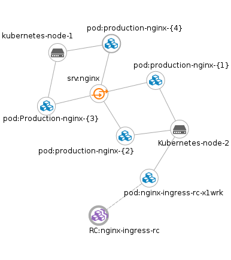

# Kubernetes internal loadbalancer
## In this excersise we will create a loadbalancer on one of our nodes, that points to a service. The service has multiple endpoints (pods) running via a deployment keeping them alive at all times.

### A namespace
First, we create a namespace for our project. Lets call it production.
```
kubectl create namespace production
```

View namespaces in the cluster to see if it was created
```
kubectl get namespaces --show-labels
```

### Running the deployment
Running your first deployment with four pods, in the namespace production. We will use this later to be the landingpage for our loadbalancer. 
```
kubectl run production-nginx --image=nginx --replicas=4 --port=80 --namespace=production 
```

### Test a pod, to see that it response to trafic
Temporarly forward trafic to a pod, through kubectl on your machine to test a pod.

```
kubectl get pods --namespace=production
NAME                                READY     STATUS              RESTARTS   AGE
production-nginx-1614527241-9taez   0/1       ContainerCreating   0          34s
production-nginx-1614527241-mudsa   1/1       Running             0          34s
production-nginx-1614527241-vg831   0/1       ContainerCreating   0          34s
production-nginx-1614527241-wr3uo   0/1       ContainerCreating   0          34s

kubectl port-forward production-nginx-1614527241-9taez 8080:80
curl localhost:8080
```

### Services, create a service for your nginx
Now we need a service to keep an eye on our pods. This will be our main source of endpoints.

```
cat service.yaml
apiVersion: v1
kind: Service
metadata:
  name: nginx
spec:
  ports:
    - port: 80
      targetPort: 80
  selector:
    run: production-nginx
  type: ClusterIP

kubectl create -f service.yaml --namespace=production
```

### Create a secret with tls for SSL in nginx
We need to run our loadbalancer with SSL, and therefor need some TLS certificates. We store these in secrets in the Kubernetes cluster.
```
cat nginx-secret.yaml
apiVersion: v1
kind: Secret
metadata:
  name: nginx-secret
type: Opaque
data:
  tls.crt: LS0tLS1CRUdJTiBDRVJUSUZJQ0FURS0tLS0tCk1JSURqVENDQW5XZ0F3SUJBZ0lKQUlkSFdJaXhLK0Y2TUEwR0NTcUdTSWIzRFFFQkN3VUFNRjB4Q3pBSkJnTlYKQkFZVEFsVlRNUk13RVFZRFZRUUlEQXBUYjIxbExWTjBZWFJsTVNFd0h3WURWUVFLREJoSmJuUmxjbTVsZENCWAphV1JuYVhSeklGQjBlU0JNZEdReEZqQVVCZ05WQkFNTURURTVNaTR4TmpndU16TXVORE13SGhjTk1UWXdNekF4Ck1Ua3hOelU0V2hjTk1UY3dNekF4TVRreE56VTRXakJkTVFzd0NRWURWUVFHRXdKVlV6RVRNQkVHQTFVRUNBd0sKVTI5dFpTMVRkR0YwWlRFaE1COEdBMVVFQ2d3WVNXNTBaWEp1WlhRZ1YybGtaMmwwY3lCUWRIa2dUSFJrTVJZdwpGQVlEVlFRRERBMHhPVEl1TVRZNExqTXpMalF6TUlJQklqQU5CZ2txaGtpRzl3MEJBUUVGQUFPQ0FROEFNSUlCCkNnS0NBUUVBekNINSsrRGUyZ0VEbWE4YmpQS1ZuZ2o5ZEpFdk5wa1Q0WXBMUlV0WHJYTjZHandjZ2lPQWJITnMKMlMyWGw1RXpXYm9Pd3Axejd6M0xpYUlJdDdBT3lkc3R6TmhmckhqMU1FRi9TNGdKOG5jOVJQT01qcTQrV2cwNwpOOWNyMzJEM3l3ak9GSTdieXdXZ3daSG5NTDhHUDNrUDRpcktEcm0vMDczdjhWbVBFUzRwd01nM3drQytZL1J2ClZNd0QrMENsbU41d0dSenZNcEFKalNiaUJXZ0l3NFRCTGZUREZTSTlzUE5abk5hNWVkRFVyeFI3SmJwLzZ0Yy8KSEZOZXVwYjNyQlY3dkxTZVZydFZjSm85WXB6MmRIMlZmQS9uck5uVXd2K2NXS0RDWjVhbm5qcHZsbVYzMlo4TgpXVjJkR2JKVzJneHJ4TjB1QWNrditsQlJrMkZnSHdJREFRQUJvMUF3VGpBZEJnTlZIUTRFRmdRVWtFd3JTNTNsCms3L3NCS2JncWphdWZ6cWZhMTR3SHdZRFZSMGpCQmd3Rm9BVWtFd3JTNTNsazcvc0JLYmdxamF1ZnpxZmExNHcKREFZRFZSMFRCQVV3QXdFQi96QU5CZ2txaGtpRzl3MEJBUXNGQUFPQ0FRRUFrSnRFSW02YktIQm4vK245QWkzegpyUEJ5OHpYdUV6eStYR2pmV050QUlGNUllVHNUUkRJeXEyWkwvTU92MFBvSGl3My9LTENrbENkWDd3OU91Sm10CnRRVWtmZnlYMVdwTkF6MjJvVlFTWHJkeUdLY3ZCbk84WkhpUHhPeFNoWjNqLzhjRWw4b1RpYTd6dTdodVRBOEwKL2V3NmZieFFhZlkxaERXQXF5NGJGUnFmQk1qNVpua3d6Ti9USmtDSXRvbVFJVHdDK2tPcE1KdmJDb2Zkc2JzVwo4dW1PQkVYWi9tbzU4SGtwVUtIQTRyWk9EL0JGNGlUSXl3TjFxOE5xQTJobGdLMHRsWHk1UGVITmJxUFVTejRxCkNreU91dXlWZnpITTk5ZWJ3dTVxd3RpNlRxUUM4b0ltQkdJeVM3NEh0a2l6dHc0dy9uQU9LTzhhSEM2ZXRsQVUKSUE9PQotLS0tLUVORCBDRVJUSUZJQ0FURS0tLS0tCg==
  tls.key: LS0tLS1CRUdJTiBQUklWQVRFIEtFWS0tLS0tCk1JSUV2UUlCQURBTkJna3Foa2lHOXcwQkFRRUZBQVNDQktjd2dnU2pBZ0VBQW9JQkFRRE1JZm43NE43YUFRT1oKcnh1TThwV2VDUDEwa1M4Mm1SUGhpa3RGUzFldGMzb2FQQnlDSTRCc2MyelpMWmVYa1ROWnVnN0NuWFB2UGN1SgpvZ2kzc0E3SjJ5M00yRitzZVBVd1FYOUxpQW55ZHoxRTg0eU9yajVhRFRzMzF5dmZZUGZMQ000VWp0dkxCYURCCmtlY3d2d1kvZVEvaUtzb091Yi9UdmUveFdZOFJMaW5BeURmQ1FMNWo5RzlVekFQN1FLV1kzbkFaSE84eWtBbU4KSnVJRmFBakRoTUV0OU1NVklqMnc4MW1jMXJsNTBOU3ZGSHNsdW4vcTF6OGNVMTY2bHZlc0ZYdTh0SjVXdTFWdwptajFpblBaMGZaVjhEK2VzMmRUQy81eFlvTUpubHFlZU9tK1daWGZabncxWlhaMFpzbGJhREd2RTNTNEJ5Uy82ClVGR1RZV0FmQWdNQkFBRUNnZ0VBT2pmYWR1YWNTQ3FQMzAzY21xYzQycGlQeUtYN2hDUEdVc1hCVCtMNy80RDIKcXZMSDRxbkRYNnJQdVdUU1hpelFLMS93QTdzcUxHcEFXV0Y0QVFOYVJHR1pQMW5hZDNNTDRwWmJlcXd5d2c4Vgp6MHR5bytLMzc3RGtXYm1wVG96MlB0YWxCNkh5dDRWRVl0QjgwaDg0NWZOZC8wL2F6clpWS2t0NldpZ0RzSThxCmUvdEFyT0lwNFhGM3JlOStaUHNmMFdOT084QTluVlByMVljbnUweFJhM1RCNGRjaDZLMmsyYVdlWEtOOHl4UXYKUjA0aUJ1UHNGdGo0Vk14SHRzcVVvQytNQmV0R3dnek1GTmxEanpSSnBUcHRvdXZaNUFVa21PTDM1bjQrdU5wMAp6Y0lPOGs3clRXWG9ydTd3OTlXcUFsa2pJQUhPQ0x2dHZrRHNyQUllMlFLQmdRRG5WR3hsUGhKL0J0K1RLQ01LCjkyK0FrTWhQUEt4UjdVV2h2RGpWeFNESFR5bFpzTkVVVEpkK2VxaEZ6TmJGVUtjSlhmUUU3ZC91NHlKNXUva2gKREUva05TRmNEdnJGZURuaXBDWDI2WUhteFZpR2x6Uit0MFRKN0cyVzcvOHhVR0JXWXVPL2w1R3I0bjd4NE4reAoxQ0dGWnlSNDVkdDNrUGQzeFVzWnd3RW5Vd0tCZ1FEaDV3cU5hbjBFMkJrYXNYSFFDdG1PbUw4WHZRNE13SGdSCk5Sc1FnU1RhcHZhQy95eFFuM3gzendDSEVIK1Z1dGE3OFZzUWRCQmhUUnJxb2tQYW5RNmtHaWh0ZEVyd0dBWG4Kb2xHNk1CUVVBVktFdTdoU2d6cndVa3ZVY0FuMVFGY1I5d3pUb09ZbndTVVhlVFdQNStvZSsvTldjVFFQWjhReAoxRFJ4d0RRR2hRS0JnRTRKTUxmR2hMN05Oc2FSbDZDdmI3SFRKWDkxWER3VzZwSnd5RXQwd0dYNzBsc3JScHl1CmFieUU3QmIvenNPcFBXL3ZmYzNiNE5yWlRGdjhpVUlZd1NxZXNhNDRiMmdGOHFEOTlzQ2diTzNJVE9DNlNUOGwKMjlLeUt4WHJ5QTUrcXNENWd4S3lzclZsSnFXNTBqeE83eS90WjJSUlJnUERwM2VEMnAzS0pxMTVBb0dCQUpKdQo0OFk3aXdMQzJiTVY1d0xHcGJQcmk2TmxwMS9ZdTN2Y0FzazJEWisycndESFRBQ1BBVzNnUHlWT0tvWHljUk92CkppcUtNYndBOFR1N0oyVGtmZ01kK2FySndYSFZBSzdmNXo1YndBZ2Z1MC9USjI1RkpzVjFjelluMGl5cUlrYkEKOEEyV3ROcDhOd0Q2VHlBVFl3M21vQndla1hLUy92aVY1OUQ4bUR6SkFvR0FOQS9KeHVQRU5RQkhZZXkwSnYzQwo4R2hoR1g4WGpNeTAzTXMwNUpWZjJtNndDOFNDUVgwOFRoS2xwcVJBT2FwRzZYeHhMdTEvUDg4OE1EZkNZL0NtCmVJaWJiMm91azNhL2ZJc0ZyL3NvcjBybEhnOHRlVk1sRzUvbVdoV29ZWFhHbWVhVEk4dVlkeDR5c2ttZDY5eW0KNUlEQ2F3RUlsajBsaVVRcDB2L00vR289Ci0tLS0tRU5EIFBSSVZBVEUgS0VZLS0tLS0K

kubectl create -f nginx-secret.yaml --namespace=production
```


### Creating an Ingress rule
The ingress rule is where we define what we want loadbalanced, and where the resource is found. In this example we create an ingress for webserver.example.com and points it to our nginx service. In path we define / as the root of the three. We also define what port we want to hit out pods at, namly port 80.
```
cat ingress-rules.yaml
apiVersion: extensions/v1beta1
kind: Ingress
metadata:
  name: nginx-ingress
spec:
  tls:
  - hosts:
    - webserver.example.com
    secretName: nginx-secret
  rules:
  - host: webserver.example.com
    http:
      paths:
      - path: /
        backend:
          serviceName: nginx
          servicePort: 80

kubectl create -f ingress-rules.yaml --namespace=production
```

### Create a nginx loadbalancer that uses the ingress rule
Now we need to start the loadbalancer. Here we use a special nginx image that uses our ingress object to find resources. If these changes in the cluster, it will reconfigure and reload automaticly. 
```
cat nginx-loadbal.yaml
apiVersion: v1
kind: ReplicationController
metadata:
  name: nginx-ingress-rc
  labels:
    app:nginx-ingress
spec:
  replicas: 1
  selector:
    app: nginx-ingress
  template:
    metadata:
      labels:
        app: nginx-ingress
    spec:
      containers:
      - image: nginxdemos/nginx-ingress:0.3
        imagePullPolicy: Always
        name: nginx-ingress-lb
        ports:
        - containerPort: 80
          hostPort: 80
        - containerPort: 443
          hostPort: 443

kubectl create -f nginx-loadbal.yaml --namespace=production
```

### Hitting it
Now we have the following setup inside out Kubernetes cluster.



We now need to point the dns entry webserver.example.com to the ip of the node running our loadbalancer. To find it, exec:
```
kubectl get pods --namespace=production -o wide |grep "nginx-ingress"

output:
nginx-ingress-rc-x1wrk              1/1       Running   0          27m       10.246.77.6   kubernetes-node-2

```

We can see that the nginx is running on the node "kubernetes-node-2". Now we need to find the ip of "kubernetes-node-2" by:
```
kubectl describe node kubernetes-node-2 --namespace=production|grep Addresses
Addresses:		10.245.1.4,10.245.1.4

```

If you dont have an DNS you can add entries to your hosts file like this:
```
sudo echo "10.245.1.4 webserver.example.com" >> /etc/hosts
```

### Connect to our service
Now we can curl our service through the loadbalancer. 
We use -L to follow the redirect from http to https, and --insecure as our TLS certificates are not trusted.
```
curl -L --insecure webserver.example.com
```

I hope everything work, and that you now have a working loadbalancer in Kubernetes. Its easy to add more services to your ingress and add complexity.

### Cleanup
Run these commands to remove the deployment, rc, ingress, secret, service and namespace from your cluster.
```
kubectl delete deployment production-nginx --namespace=production
kubectl delete rc nginx-ingress-rc --namespace=production
kubectl delete ingress nginx-ingress --namespace=production
kubectl delete secret nginx-secret --namespace=production
kubectl delete services nginx --namespace=production
kubectl delete namespace production
```

