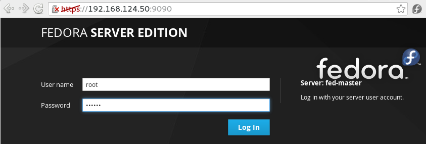
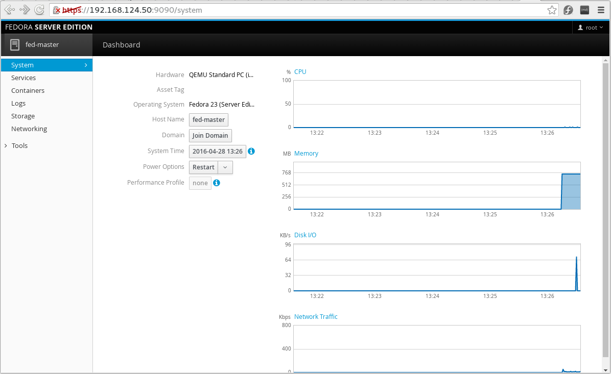

# Kubernetes on Fedora - Multi node

References:
* http://kubernetes.io/docs/getting-started-guides/fedora/fedora_manual_config/
* http://kubernetes.io/docs/getting-started-guides/fedora/flannel_multi_node_cluster/


## Host setup:
Two virtual machines on Local computer (KVM) running Fedora 23. Amazon does not have images for Fedora. (It does have images for REH 7 though)

fed-master: 192.168.124.50
fed-node1: 192.168.124.51


Note: Fedora now has a webUI - called Cockpit - installed by default as part of server installation. It's admin console can be access by visiting: https://IPofFedoraHost:9090 . Use the credentials of user root to login.

### Screnshots:







## Package installation:

The Kubernetes package provides a few services: 
* kube-apiserver, 
* kube-scheduler, 
* kube-controller-manager, 
* kubelet, 
* kube-proxy. 

These services are managed by systemd and the configuration resides in a central location: /etc/kubernetes. 

We will break the services up between the hosts. 

The first host, fed-master, will be the Kubernetes master, and will run the following:
* kube-apiserver, 
* kube-controller-manager
* kube-scheduler. 
* etcd

Note: etcd can run on a different host but this guide assumes that etcd and Kubernetes master run on the same host. 

The remaining host, fed-node will be the node and run the following: 
* kubelet, 
* proxy 
* docker.


At the moment I am using Fedora 23. I see that Fedora standard repository has kubernetes, and the update-testing repo has a little newer version of kubernetes, as shown below. I will try to use the stable version from the "updates" repository:

```bash
[root@fed-master ~]# yum list kubernetes

Last metadata expiration check performed 0:05:01 ago on Thu Apr 28 12:07:32 2016.
Available Packages
kubernetes.x86_64                                           1.2.0-0.15.alpha6.gitf0cd09a.fc23                                            updates
[root@fed-master ~]# yum list  --enablerepo=updates-testing kubernetes

Last metadata expiration check performed 0:00:01 ago on Thu Apr 28 12:12:55 2016.
Available Packages
kubernetes.x86_64                                           1.2.0-0.18.git4a3f9c5.fc23                                           updates-testing
[root@fed-master ~]# 
``` 

Same goes for etcd:

```
[root@fed-master ~]# yum list etcd
Yum command has been deprecated, redirecting to '/usr/bin/dnf list etcd'.
See 'man dnf' and 'man yum2dnf' for more information.
To transfer transaction metadata from yum to DNF, run:
'dnf install python-dnf-plugins-extras-migrate && dnf-2 migrate'

Last metadata expiration check performed 0:08:22 ago on Thu Apr 28 12:07:32 2016.
Available Packages
etcd.x86_64                                                         2.2.5-1.fc23                                                         updates
[root@fed-master ~]# 
```


### Update the OS:
First things first.
```
[root@fed-master ~]# yum -y update && reboot
``` 

### Make sure you have connectivity between nodes:
After the nodes are provisioned, make sure that they can access each other.

``` 
[root@fed-node1 ~]# ping -c 1 fed-master
PING fed-master (192.168.124.50) 56(84) bytes of data.
64 bytes from fed-master (192.168.124.50): icmp_seq=1 ttl=64 time=0.180 ms

--- fed-master ping statistics ---
1 packets transmitted, 1 received, 0% packet loss, time 0ms
rtt min/avg/max/mdev = 0.180/0.180/0.180/0.000 ms
[root@fed-node1 ~]# 
``` 

```
[root@fed-master ~]# ping -c 1 fed-node1
PING fed-node1 (192.168.124.51) 56(84) bytes of data.
64 bytes from fed-node1 (192.168.124.51): icmp_seq=1 ttl=64 time=0.286 ms

--- fed-node1 ping statistics ---
1 packets transmitted, 1 received, 0% packet loss, time 0ms
rtt min/avg/max/mdev = 0.286/0.286/0.286/0.000 ms
[root@fed-master ~]# 
``` 


### Install kubernetes, etcd and iptables on the master node fed-master:
**Note:** The kubernetes package normally installs docker. The Fedora Server distribution installed it during OS installation (without asking me). Though we do not need docker on master node, it does not hurt if we have it installed on the master node. We are not going to run it on master node.

```
[root@fed-master ~]# yum install kubernetes etcd iptables 
Package iptables-1.4.21-15.fc23.x86_64 is already installed, skipping.
Dependencies resolved.
================================================================================================================================================
 Package                            Arch                    Version                                              Repository                Size
================================================================================================================================================
Installing:
 etcd                               x86_64                  2.2.5-1.fc23                                         updates                  5.9 M
 kubernetes                         x86_64                  1.2.0-0.15.alpha6.gitf0cd09a.fc23                    updates                   39 k
 kubernetes-client                  x86_64                  1.2.0-0.15.alpha6.gitf0cd09a.fc23                    updates                  8.8 M
 kubernetes-master                  x86_64                  1.2.0-0.15.alpha6.gitf0cd09a.fc23                    updates                   15 M
 kubernetes-node                    x86_64                  1.2.0-0.15.alpha6.gitf0cd09a.fc23                    updates                  8.7 M
 socat                              x86_64                  1.7.2.4-5.fc23                                       fedora                   276 k

Transaction Summary
================================================================================================================================================
Install  6 Packages

Total download size: 39 M
Installed size: 192 M
. . . 
``` 


### Here is a verification of packages on master node:
```
[root@fed-master ~]# yum list installed    kubernetes etcd iptables docker
Installed Packages
docker.x86_64                                              2:1.9.1-9.gitee06d03.fc23                                                   @updates 
etcd.x86_64                                                2.2.5-1.fc23                                                                @updates 
iptables.x86_64                                            1.4.21-15.fc23                                                              @anaconda
kubernetes.x86_64                                          1.2.0-0.15.alpha6.gitf0cd09a.fc23                                           @updates 
[root@fed-master ~]# 
``` 


### Install Kubernetes, iptables and docker on worker nodes:

``` 
[root@fed-node1 ~]# yum -y install kubernetes docker iptables

Package docker-2:1.9.1-9.gitee06d03.fc23.x86_64 is already installed, skipping.
Package iptables-1.4.21-15.fc23.x86_64 is already installed, skipping.
Dependencies resolved.
================================================================================================================================================
 Package                            Arch                    Version                                              Repository                Size
================================================================================================================================================
Installing:
 kubernetes                         x86_64                  1.2.0-0.15.alpha6.gitf0cd09a.fc23                    updates                   39 k
 kubernetes-client                  x86_64                  1.2.0-0.15.alpha6.gitf0cd09a.fc23                    updates                  8.8 M
 kubernetes-master                  x86_64                  1.2.0-0.15.alpha6.gitf0cd09a.fc23                    updates                   15 M
 kubernetes-node                    x86_64                  1.2.0-0.15.alpha6.gitf0cd09a.fc23                    updates                  8.7 M
 socat                              x86_64                  1.7.2.4-5.fc23                                       fedora                   276 k

Transaction Summary
================================================================================================================================================
Install  5 Packages

Total download size: 33 M
Installed size: 165 M
```

## Add master and node to /etc/hosts on all machines:
This is not needed if hostnames already in DNS - of-course! Make sure that communication works between fed-master and fed-node by using a utility such as ping.

```
$ cat /etc/hosts
127.0.0.1   localhost localhost.localdomain localhost4 localhost4.localdomain4
::1         localhost localhost.localdomain localhost6 localhost6.localdomain6
192.168.124.50	fed-master
192.168.124.51	fed-node1
```

## Edit /etc/kubernetes/config on all hosts (master and nodes) to contain:

Basically you want to make sure that KUBE_MASTER, on all machines, is set to correct Kubernetes master's name (or IP ?). 
```
# Comma separated list of nodes in the etcd cluster
KUBE_MASTER="--master=http://fed-master:8080"

# logging to stderr means we get it in the systemd journal
KUBE_LOGTOSTDERR="--logtostderr=true"

# journal message level, 0 is debug
KUBE_LOG_LEVEL="--v=0"

# Should this cluster be allowed to run privileged docker containers
KUBE_ALLOW_PRIV="--allow-privileged=false"
```

## Disable the firewall on all the hosts (master and nodes):
It is because docker does not play well with other firewall rule managers. Please note that iptables-services does not exist on default fedora server install.

```
systemctl disable iptables-services firewalld
systemctl stop iptables-services firewalld
```

**NOTE:** After OS update, the firewalld service may become active again. Watchout for that! The first symptom of this problem will be Nodes not becoming ready no matter what you do, unless you clear the firewall rules on master and nodes.


## Configure the Kubernetes services on the master:
Edit /etc/kubernetes/apiserver to appear as what is shown below. The service-cluster-ip-range IP addresses must be an unused block of addresses, not used anywhere else. They do not need to be routed or assigned to anything.

```
# The address on the local server to listen to.
KUBE_API_ADDRESS="--address=0.0.0.0"

# Comma separated list of nodes in the etcd cluster
# Note that Fedora 22 and higer uses etcd 2.x. 
# One of the changes in etcd 2.0 is that now uses port 2379 and 2380 (as opposed to etcd 0.46 which used 4001 and 7001).
# So if you are using etcd 2.x (find out by rpm -q etcd) , then use 2379 in the following line.
KUBE_ETCD_SERVERS="--etcd-servers=http://127.0.0.1:2379"

# Address range to use for services
KUBE_SERVICE_ADDRESSES="--service-cluster-ip-range=10.254.0.0/16"

# Add your own!
KUBE_API_ARGS=""
``` 

TODO: In the default file on the master there is also another line saying:
```
# default admission control policies
KUBE_ADMISSION_CONTROL="--admission-control=NamespaceLifecycle,NamespaceExists,LimitRanger,SecurityContextDeny,ServiceAccount,ResourceQuota"
```

I am not sure whethere to disable it or enable it.


### Configure etcd on master (fed-master):
Edit /etc/etcd/etcd.conf on master (fed-master), and allow etcd to listen all the ips (0.0.0.0) instead of 127.0.0.1. If not, you will get the error like “connection refused”. You will only need to change one directive in /etc/etcd/etcd.conf, which is:

```
ETCD_LISTEN_CLIENT_URLS="http://0.0.0.0:2379"

```

**Note:** Fedora 22 and higher uses etcd 2.x, One of the changes in etcd 2.x is that now uses port 2379 and 2380 (as opposed to etcd 0.46 which userd 4001 and 7001). A check for that is shown below:

```
[root@fed-master ~]# rpm -q etcd
etcd-2.2.5-1.fc23.x86_64
[root@fed-master ~]# 
```

Also, when you start etcd service you will see that it is listening on port 2379:

```
[root@fed-master ~]# service etcd status
Redirecting to /bin/systemctl status  etcd.service
● etcd.service - Etcd Server
   Loaded: loaded (/usr/lib/systemd/system/etcd.service; disabled; vendor preset: disabled)
   Active: active (running) since Thu 2016-04-28 14:04:18 CEST; 3s ago
 Main PID: 11019 (etcd)
   CGroup: /system.slice/etcd.service
           └─11019 /usr/bin/etcd --name=default --data-dir=/var/lib/etcd/default.etcd --listen-client-urls=http://0.0.0.0:2379

Apr 28 14:04:18 fed-master systemd[1]: Started Etcd Server.
. . . 
```

The same is also evident from the output of netstat:
```
[root@fed-master ~]# netstat -ntlp 
Active Internet connections (only servers)
Proto Recv-Q Send-Q Local Address           Foreign Address         State       PID/Program name    
tcp        0      0 127.0.0.1:2379          0.0.0.0:*               LISTEN      11109/etcd          
tcp        0      0 127.0.0.1:2380          0.0.0.0:*               LISTEN      11109/etcd          
tcp        0      0 0.0.0.0:22              0.0.0.0:*               LISTEN      4071/sshd           
tcp        0      0 127.0.0.1:45208         0.0.0.0:*               LISTEN      10749/cockpit-bridg 
tcp        0      0 127.0.0.1:7001          0.0.0.0:*               LISTEN      11109/etcd          
tcp6       0      0 :::9090                 :::*                    LISTEN      1/systemd           
tcp6       0      0 :::22                   :::*                    LISTEN      4071/sshd           
[root@fed-master ~]# 
```

## Create /var/run/kubernetes on master (and setup correct permissions):

```
mkdir /var/run/kubernetes
chown kube:kube /var/run/kubernetes
chmod 750 /var/run/kubernetes
```

Note that there is a user called kube created by default on fedora server installation:

```
[root@fed-master ~]# id kube
uid=991(kube) gid=988(kube) groups=988(kube)
[root@fed-master ~]# 
```

## Start services on master (fed-master):
```
for SERVICES in etcd kube-apiserver kube-controller-manager kube-scheduler; do
	systemctl restart $SERVICES
	systemctl enable $SERVICES
	systemctl status $SERVICES
done
``` 

You should be able to see all services running as in "active (running)" (shown in green)!


## Create a node on master:
First create a node definition file:

```
[root@fed-master ~]# cat node1.json 
{
    "apiVersion": "v1",
    "kind": "Node",
    "metadata": {
        "name": "fed-node1",
        "labels":{ "name": "fedora-node"}
    },
    "spec": {
        "externalID": "fed-node1"
    }
}


[root@fed-master ~]# 
```


Then create a node based on this node definition file:
```
[root@fed-master ~]# kubectl create -f ./node1.json 
node "fed-node1" created
[root@fed-master ~]# 
```

Note that the above command only creates a node and does not provision it. It is assumed that fed-node1 (as specified in name) can be resolved and is reachable from Kubernetes master node.

If you get a list of nodes, you will see this known with a status "NotReady" - or sometimes "Unknown". That is because the node has not actually contacted master and has not joined the cluster yet.

```
[root@fed-master ~]# kubectl get nodes
NAME        LABELS             STATUS     AGE
fed-node1   name=fedora-node   NotReady   1m
[root@fed-master ~]# 
```

Time to setup the node (fed-node1).

## Configure the Kubernetes services on the node (fed-node1):

### Configure kubelet on the node (fed-node1):
Edit /etc/kubernetes/kubelet to look like the following:

```
[root@fed-node1 ~]# cat /etc/kubernetes/kubelet 
###
# kubernetes kubelet (minion) config

# The address for the info server to serve on (set to 0.0.0.0 or "" for all interfaces)
## KUBELET_ADDRESS="--address=127.0.0.1"
KUBELET_ADDRESS="--address=0.0.0.0"

# The port for the info server to serve on
# KUBELET_PORT="--port=10250"

# You may leave this blank to use the actual hostname
KUBELET_HOSTNAME="--hostname-override=fed-node1"

# location of the api-server
KUBELET_API_SERVER="--api-servers=http://fed-master:8080"

# Add your own!
KUBELET_ARGS=""
[root@fed-node1 ~]# 
```


### Start the appropriate services on the node (fed-node1).
```
for SERVICES in kube-proxy kubelet docker; do 
    systemctl restart $SERVICES
    systemctl enable $SERVICES
    systemctl status $SERVICES 
done
``` 

TODO: What about docker confiuration? At the moment, (without configuration), it looks like so:

```
[root@fed-node1 ~]# ps aux | grep docker
root      2118  0.0  0.3 121108  3104 ?        Ss   14:34   0:00 /bin/sh -c /usr/bin/docker daemon            $OPTIONS            $DOCKER_STORAGE_OPTIONS            $DOCKER_NETWORK_OPTIONS            $INSECURE_REGISTRY            2>&1 | /usr/bin/forward-journald -tag docker
root      2120  1.2  3.5 563264 35780 ?        Sl   14:34   0:00 /usr/bin/docker daemon --selinux-enabled --log-driver=journald
root      2121  0.0  0.3 102412  3204 ?        Sl   14:34   0:00 /usr/bin/forward-journald -tag docker
[root@fed-node1 ~]# 
```

## Check to make sure now the cluster can see the fed-node1 on fed-master, and its status changes to Ready:

```
[root@fed-master ~]# kubectl get nodes
NAME        LABELS             STATUS    AGE
fed-node1   name=fedora-node   Ready     14m
[root@fed-master ~]# 
```

Yes!!!!!!!!!!! We see our node as Ready! Yeaaay!!!


You should be finished!

The cluster should be running! Launch a test pod.


## Start a pod with nginx:

```
[root@fed-master ~]# kubectl run nginx --image=nginx 
replicationcontroller "nginx" created
[root@fed-master ~]# 


[root@fed-master ~]# kubectl get rc
CONTROLLER   CONTAINER(S)   IMAGE(S)   SELECTOR    REPLICAS   AGE
nginx        nginx          nginx      run=nginx   1          3m


[root@fed-master ~]# kubectl get pods
[root@fed-master ~]# 

```
What! No pods! 


Errors:

```
[root@fed-master ~]# kubectl get events

31s         25s        4         nginx       ReplicationController               Warning   FailedCreate            {replication-controller }   Error creating: pods "nginx-" is forbidden: no API token found for service account default/default, retry after the token is automatically created and added to the service account
```

Journalctl entries:

```
Apr 28 15:07:00 fed-master kube-controller-manager[790]: E0428 15:07:00.844605     790 replication_controller.go:364] unable to create pods: pods "nginx-" is forbidden: no API token found for service account default/default, retry after the token is automatically created and added to the service account
``` 


Try to disable admission controls in /etc/kubernetes/apiserver on master (fed-master):

```
## KUBE_ADMISSION_CONTROL="--admission-control=NamespaceLifecycle,NamespaceExists,LimitRanger,SecurityContextDeny,ServiceAccount,ResourceQuota"
```

```
service kube-apiserver restart
```

Now it is working!!!

```
[root@fed-master ~]# kubectl get pods
NAME          READY     STATUS    RESTARTS   AGE
nginx-nk0lj   1/1       Running   0          1m
[root@fed-master ~]# 
```


