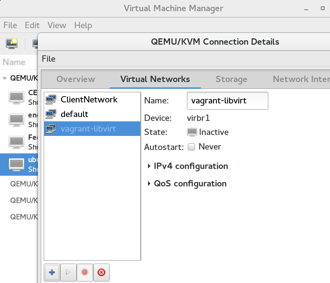
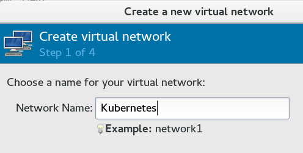
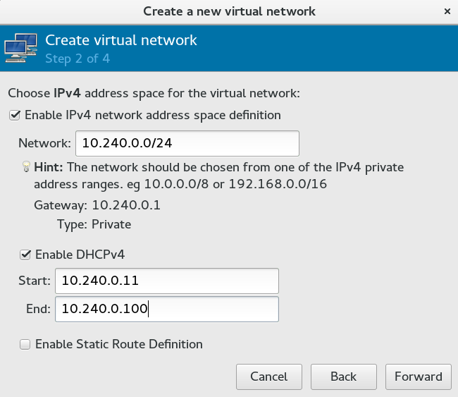
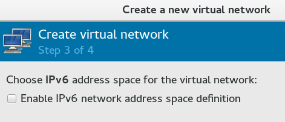
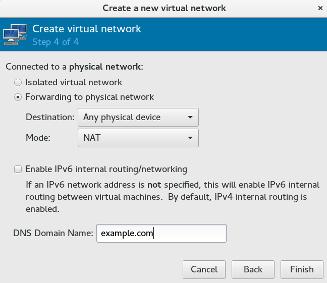
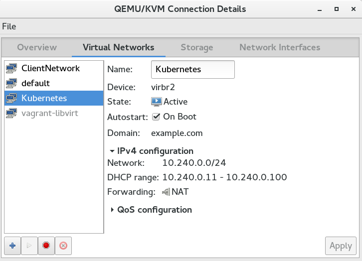

# Kubernetes The Hard Way - Bare Metal

This document is going to be the last document in the series of Kubernetes the Hard Way. It follows Kelsey Hightower's turtorial [https://github.com/kelseyhightower/kubernetes-the-hard-way](https://github.com/kelseyhightower/kubernetes-the-hard-way) , and attempts to make improvements and explanations where needed. So here we go.

# Target Audience
The target audience for this tutorial is someone planning to setup or support a production Kubernetes cluster and wants to understand how everything fits together. 

# Infrastructure:
I do not have actual bare metal. I have vitual machines, running on LibVirt/KVM on my work computer (Fedora 23 - 64 bit). Some may argue that I could have used Amazon AWS, and used VMs over there too. Well, I tried that , documented here: [Kubernetes-The-Hard-Way-on-AWS.md](Kubernetes-The-Hard-Way-on-AWS.md) , and it did not work when I reached Pod Networking on worker nodes. Amazon has it's VPC mechanism, and it did not let the traffic flow between two pod networks on two different worker nodes. May be I did not know how to get that done correctly, but this type of routing on AWS VPC is not documented either. So I had to abandon it. 


So, I am going to use VMs on my work computer to create this setup. But before I start building VMs, I want to mention few important things.

## Networking:
Kubernetes uses three different types of networks. They are:

* Infrastructure Network: The network your physical (or virtual) machines are connected to. Normally your production network, or a part of it.
* Service Network: The (completely) virtual (rather fictional) network, which is used to assign IP addresses to Kubernetes Services, which you will be creating. (A Service is a frontend to a RC or a Deployment). It must be noted that IP from this network are **never** assigned to any of the interfaces of any of the nodes/VMs, etc. These (Service IPs) are used behind the scenes by kube-proxy to create (weird) iptables rules on the worker nodes. 
* Pod Network: This is the network, which is used by the pods. However it is not a simple network either, depending on what kubernetes network solution you are employing. If you are using flannel, then this would be a large software defined overlay network, and each worker node will get a subnet of this network and configured for it's docker0 interface (in very simple words, there is a little more to it). If you are employing CIDR network, using CNI, then it would be a large network called **cluster-cidr** , with small subnets corresponding to your worker nodes. The routing table of the router handling your part of infrastructure network will need to be updated with routes to these small subnets. This proved to be a challenge on AWS VPC router, but this is piece of cake on a simple/generic router in your network. I will be doing it on my work computer, and setting up routes on Linux is a very simple task.

Kelsey used the following three networks in his guide, and I intend to use the same ones, so people following this guide, but checking his guide for reference are not confused in different IP schemes. So here are my three networks , which I will use for this guide.

* Infrastructure network:     10.240.0.0/24 
* Service Network:            10.32.0.0/24 
* Pod Network (Cluster CIDR): 10.200.0.0/16 


By default I have a virtual network 192.168.124.0/24 configured on my work computer, provided by libvirt. However, I want to be as close to Kelsey's guide as possible, so my infrastructure network is going to be 10.240.0.0/24 . I will just create a new virtual network (10.240.0.0/24) on my work computer.


The setup will look like this when finished:

(TODO) A network diagram here.


## DNS names:
It is understood that all nodes in this cluster will have some hostname assigned to them. It is important to have consistent hostnames, and if there is a DNS server in your infrastructure, then it is also important what are the reverse lookup names of these nodes. This information is  critical at the time when you will generate SSL certificates. 


## Operating System:
Fedora 24 64 bit server edition - on all nodes (Download from [here](https://getfedora.org/en/server/download/) ). Even though I wanted to use Fedora Atomic, I am not using that. It is because Fedora Atomic is a collection of binaries bundled together (in a read only  filesystem), and individual packages cannot be updated. There is no yum, etc. I am going to use latest version of Kubernetes 1.3, which is still not part of Fedora Atomic. 

# Expectations

A working kubernetes cluster with:
* 2 x etcd nodes (in H/A configuration) 
* 2 x Kubernetes controller nodes (in H/A configuration) 
* 2 x Kubernetes worker nodes
* SSL based communication between all Kubernetes components
* Internal Cluster DNS (SkyDNS) - as cluster addon
* Default Service accounts and Secrets


# Supporting software needed for this setup:
* Kubernetes - 1.3.0 or later (Download latest from Kubernetes website)
* etcd - 2.2.5 or later (The one that comes with Fedora is good enough)
* Docker - 1.11.2 or later (Download latest from Docker website)
* CNI networking [https://github.com/containernetworking/cni](https://github.com/containernetworking/cni)


# Infrastructure provisioning

Note that I am doing this provisioning on my work computer, which is Fedora 23 64 bit, and I will use the built in (the best) KVM for virtualization. 

First, setting up the new infrastructure network in KVM.

## Setup new virtual network in KVM:

Start Virtual Machine Manager and go to "Edit"->"Connection Details"->"Virtual Networks" . Then follow the steps shown below to create a new virtual network. Note that this is a NAT network, connected to any/all physical devices on my computer. So whether I am connected to wired network, or wireless, it will work.








The wizard will create an internal DNS setup (automatically) for example.com .

Now, we have the network out of the way, I will start creating VMs and attach them to this virtual network.

## Provision VMs in KVM:

Here are the sizes (and related IP addresses) of VMs I am creating:

* etcd1		512 MB RAM	4 GB disk	10.240.0.11/24
* etcd2		512 MB RAM	4 GB disk	10.240.0.12/24
* controller1	1 GB RAM	4 GB disk	10.240.0.21/24
* controller2	1 GB RAM	4 GB disk	10.240.0.22/24
* worker1	1.5 GB RAM	20 GB disk	10.240.0.31/24
* worker2	1.5 GB RAM	20 GB disk	10.240.0.32/24

As I mentioned earlier, there will be two controller nodes in HA mode. There is no internal mechanism for Kubernetes controllers to work as a cluster, so we will use a trick; which is, setup a (kind of) load balancer in front of the controller nodes. We need to decide on an IP address right now, becuase that will be used while we are creating the TLS certificates. I decided to use the IP address `10.240.0.20` to work as VIP (virtual IP / load balancer IP ) for the controller nodes.

**Notes:** 
* Kelsey's guide starts the node numbering from 0. I start them from 1, for ease of understanding.
* The FQDN of each host is *hostname*.example.com 
* The nodes have only one user, **root** ; password: redhat .
* I used GUI interface to create these VMs, but you can automate this by using CLI commands.


I have added a few screenshots, so people new to KVM have no problem doing this.
**Note:** One of the installation screen shows Fedora 22 on Installation Media selection screen, but it is actually Fedora 24. Libvirt is not updated yet to be aware of Fedora 24 images.

(TODO) Screenshots from fedora installation.

(TODO) Screenshot showing admin (web) interface (Cockpit) when logged in on login screen.


After all VMs are created. I do an OS update on them using `yum -y update`, disable firewalld service, and also disable SELINUX in `/etc/selinux/config` file and reboot all nodes for these changes to take effect. 

Though not absolutely necessary, I also installed my RSA (SSH) public key to root account of all nodes, so I can ssh into them without password.

```
[kamran@kworkhorse ~]$ ssh-copy-id root@10.240.0.11
The authenticity of host '10.240.0.11 (10.240.0.11)' can't be established.
ECDSA key fingerprint is SHA256:FUMy5JNZnaLXhkW3Y0/WlXzQQrjU5IZ8LMOcgBTOiLU.
ECDSA key fingerprint is MD5:5e:9b:2d:ae:8e:16:7a:ee:ca:de:de:da:9a:04:19:8b.
Are you sure you want to continue connecting (yes/no)? yes
/usr/bin/ssh-copy-id: INFO: attempting to log in with the new key(s), to filter out any that are already installed
/usr/bin/ssh-copy-id: INFO: 2 key(s) remain to be installed -- if you are prompted now it is to install the new keys
root@10.240.0.11's password: 

Number of key(s) added: 2

Now try logging into the machine, with:   "ssh 'root@10.240.0.11'"
and check to make sure that only the key(s) you wanted were added.

[kamran@kworkhorse ~]$ 
```

You should be able to execute commands on the nodes now:
```
[kamran@kworkhorse ~]$ ssh root@10.240.0.11 uptime
 13:16:27 up  1:29,  1 user,  load average: 0.08, 0.03, 0.04
[kamran@kworkhorse ~]$ 
```

I also updated my /etc/hosts on my work computer:
```
[kamran@kworkhorse ~]$ sudo vi /etc/hosts
127.0.0.1               localhost.localdomain localhost
10.240.0.11     etcd1.example.com       etcd1
10.240.0.12     etcd2.example.com       etcd2
10.240.0.21     controller1.example.com controller1
10.240.0.22     controller2.example.com controller2
10.240.0.31     worker1.example.com     worker1
10.240.0.32     worker2.example.com     worker2
```


And, copied the same to all nodes.
```
[kamran@kworkhorse ~]$ scp /etc/hosts root@etcd1:/etc/hosts 
[kamran@kworkhorse ~]$ scp /etc/hosts root@etcd2:/etc/hosts 
[kamran@kworkhorse ~]$ scp /etc/hosts root@controller1:/etc/hosts 
[kamran@kworkhorse ~]$ scp /etc/hosts root@controller2:/etc/hosts 
[kamran@kworkhorse ~]$ scp /etc/hosts root@worker1:/etc/hosts 
[kamran@kworkhorse ~]$ scp /etc/hosts root@worker2:/etc/hosts 
```

Disable firewall on all nodes:
```
 # service firewalld stop; systemctl disable firewalld
```

Note: For some strange reason, disabling firewalld does not work. I had to actually remove the firewalld package from all of the nodes.
```
 # yum -y remove firewalld
```


Disable SELINUX on all nodes:

```
 # vi /etc/selinux/config

SELINUX=disabled
SELINUXTYPE=targeted 
```

OS update on all nodes, and reboot:
```
 # yum -y update ; reboot
```

Verify:
```
[kamran@kworkhorse ~]$ for i in etcd1 etcd2 controller1 controller2 worker1 worker2; do ssh root@${i} "hostname; getenforce"; done
etcd1.example.com
Disabled
etcd2.example.com
Disabled
controller1.example.com
Disabled
controller2.example.com
Disabled
worker1.example.com
Disabled
worker2.example.com
Disabled
[kamran@kworkhorse ~]$ 
```


# Configure / setup TLS certificates for the cluster:

Reference: [https://github.com/kelseyhightower/kubernetes-the-hard-way/blob/master/docs/02-certificate-authority.md](https://github.com/kelseyhightower/kubernetes-the-hard-way/blob/master/docs/02-certificate-authority.md)


Before we start configuring various services on the nodes, we need to create the SSL/TLS certifcates, which will be used by the kubernetes components . Here I will setup a single certificate, but in production you are advised to create individual certificates for each component/service. We need to secure the following Kubernetes components:

* etcd
* Kubernetes API Server
* Kubernetes Kubelet


We will use CFSSL to create these certificates.

Linux:
```
wget https://pkg.cfssl.org/R1.2/cfssl_linux-amd64
chmod +x cfssl_linux-amd64
sudo mv cfssl_linux-amd64 /usr/local/bin/cfssl

wget https://pkg.cfssl.org/R1.2/cfssljson_linux-amd64
chmod +x cfssljson_linux-amd64
sudo mv cfssljson_linux-amd64 /usr/local/bin/cfssljson
```

## Create a Certificate Authority

### Create CA CSR config file:

```
echo '{
  "signing": {
    "default": {
      "expiry": "8760h"
    },
    "profiles": {
      "kubernetes": {
        "usages": ["signing", "key encipherment", "server auth", "client auth"],
        "expiry": "8760h"
      }
    }
  }
}' > ca-config.json
```

### Generate CA certificate and CA private key:

First, create a CSR  (Certificate Signing Request) for CA:

```
echo '{
  "CN": "Kubernetes",
  "key": {
    "algo": "rsa",
    "size": 2048
  },
  "names": [
    {
      "C": "NO",
      "L": "Oslo",
      "O": "Kubernetes",
      "OU": "CA",
      "ST": "Oslo"
    }
  ]
}' > ca-csr.json
```


Now, generate CA certificate and it's private key:

```
cfssl gencert -initca ca-csr.json | cfssljson -bare ca
```

```
[kamran@kworkhorse certs-baremetal]$ cfssl gencert -initca ca-csr.json | cfssljson -bare ca
2016/09/08 11:32:54 [INFO] generating a new CA key and certificate from CSR
2016/09/08 11:32:54 [INFO] generate received request
2016/09/08 11:32:54 [INFO] received CSR
2016/09/08 11:32:54 [INFO] generating key: rsa-2048
2016/09/08 11:32:54 [INFO] encoded CSR
2016/09/08 11:32:54 [INFO] signed certificate with serial number 161389974620705926236327234344288710670396137404
[kamran@kworkhorse certs-baremetal]$ 
```

This should give you the following files:

```
ca.pem
ca-key.pem
ca.csr
```

In the list of generated files above, **ca.pem** is your CA certificate, **ca-key.pem** is the CA-certificate's private key, and **ca.csr** is the certificate signing request for this certificate.


You can verify that you have a certificate, by using the command below:

```
openssl x509 -in ca.pem -text -noout
```

It should give you the output similar to what is shown below:

```
[kamran@kworkhorse certs-baremetal]$ openssl x509 -in ca.pem -text -noout
Certificate:
    Data:
        Version: 3 (0x2)
        Serial Number:
            1c:44:fa:0c:9d:6f:5b:66:03:cc:ac:f7:fe:b0:be:65:ab:73:9f:bc
    Signature Algorithm: sha256WithRSAEncryption
        Issuer: C=NO, ST=Oslo, L=Oslo, O=Kubernetes, OU=CA, CN=Kubernetes
        Validity
            Not Before: Sep  8 09:28:00 2016 GMT
            Not After : Sep  7 09:28:00 2021 GMT
        Subject: C=NO, ST=Oslo, L=Oslo, O=Kubernetes, OU=CA, CN=Kubernetes
        Subject Public Key Info:
            Public Key Algorithm: rsaEncryption
                Public-Key: (2048 bit)
                Modulus:
                    00:c4:60:18:aa:dd:71:98:00:79:63:ee:31:82:11:
                    db:26:fb:f1:74:47:7b:85:f4:b0:cf:b2:d7:ce:59:
                    26:b6:f0:01:ea:4a:b1:a0:53:ae:45:51:1c:2a:98:
                    55:00:a5:1c:07:6b:96:f9:26:84:6e:0e:23:20:07:
                    85:6a:3c:a7:9c:be:f1:b6:95:d9:6a:68:be:70:7d:
                    6b:31:c6:78:80:78:27:ed:77:f2:ef:71:3b:6b:2d:
                    66:5f:ce:71:46:16:0f:b9:e7:55:a6:e3:03:75:c4:
                    17:59:7d:61:b1:84:19:06:8d:90:0d:d9:cb:ee:72:
                    cd:a2:7f:4e:ed:37:53:fc:cc:e4:12:b8:49:ad:bf:
                    f2:0f:79:60:ea:08:9b:ed:9c:65:f8:9b:8a:81:b5:
                    cc:1e:24:bd:9c:a9:fe:68:fa:49:73:cf:b4:aa:69:
                    1c:b1:e3:6b:a5:67:89:15:e8:e1:69:af:f9:b4:4b:
                    c1:b8:33:fe:82:54:a7:fd:24:3b:18:3d:91:98:7a:
                    e5:40:0d:1a:d2:4e:1c:38:12:c4:b9:8a:7e:54:8e:
                    fe:b2:93:01:be:99:aa:18:5c:50:24:68:03:87:ec:
                    58:35:08:94:5b:b4:00:db:58:0d:e9:0f:5e:80:66:
                    c7:8b:24:bd:4b:6d:31:9c:6f:b3:a2:0c:20:bb:3b:
                    da:b1
                Exponent: 65537 (0x10001)
        X509v3 extensions:
            X509v3 Key Usage: critical
                Certificate Sign, CRL Sign
            X509v3 Basic Constraints: critical
                CA:TRUE, pathlen:2
            X509v3 Subject Key Identifier: 
                9F:0F:21:A2:F0:F1:FF:C9:19:BE:5F:4C:30:73:FD:9C:A6:C1:A0:3C
            X509v3 Authority Key Identifier: 
                keyid:9F:0F:21:A2:F0:F1:FF:C9:19:BE:5F:4C:30:73:FD:9C:A6:C1:A0:3C

    Signature Algorithm: sha256WithRSAEncryption
         0b:e0:60:9d:5c:3e:95:50:aa:6d:56:2b:83:90:83:fe:81:34:
         f2:64:e1:2d:56:13:9a:ec:13:cb:d0:fc:2f:82:3e:24:86:25:
         73:5a:79:d3:07:76:4e:0b:2e:7c:56:7e:82:e1:6e:8f:89:94:
         61:5d:20:76:31:4c:a6:f0:ad:bc:73:49:d9:81:9c:1f:6f:ad:
         ea:fd:8c:4a:c5:9c:f9:77:0a:76:c3:b7:b4:b7:dc:d4:4d:3c:
         5a:47:d6:d7:fa:07:30:34:3b:f4:4c:59:1f:4e:15:e8:11:b6:
         b6:83:61:28:a9:86:70:f9:72:cd:91:2d:c3:d6:87:37:83:04:
         74:e2:ff:67:3d:ef:bf:3b:67:88:a9:64:2b:41:72:d5:34:e5:
         93:52:2e:4a:d5:6b:8d:8c:b3:66:fa:32:18:e0:5f:9e:f1:68:
         dc:51:81:52:dc:bc:8f:01:b5:22:92:d5:5e:1c:1c:f0:a3:ab:
         a8:c5:9d:84:60:80:e4:82:52:09:1a:1c:8d:1b:af:f9:a5:66:
         06:9a:fe:f4:b1:5f:6e:51:de:49:1f:07:eb:05:3f:f1:39:cc:
         29:aa:67:b0:e6:4a:6a:dd:14:6f:41:8d:67:f7:4b:55:99:49:
         3c:4f:56:5e:a5:dd:6c:7b:2c:23:32:ee:a1:d2:0a:d4:dd:b7:
         28:86:b4:42
[kamran@kworkhorse certs-baremetal]$ 
```

## Generate the single Kubernetes TLS certificate:
**Reminder:** We will generate a TLS certificate that will be valid for all Kubernetes components. This is being done for ease of use. In production you should strongly consider generating individual TLS certificates for each component.

We should also setup an environment variable named `KUBERNETES_PUBLIC_IP_ADDRESS` with the value `10.240.0.20` . This will be handy in the next step.

```
export KUBERNETES_PUBLIC_IP_ADDRESS='10.240.0.20'
```

### Create Kubernetes certificate CSR config file:

Be careful in creating this file. Make sure you use all the possible hostnames of the nodes you are generating this certificate for. This includes their FQDNs. When you setup node names like "nodename.example.com" then you need to include that in the CSR config file below. Also add a few extra entries for worker nodes, as you might want to increase the number of worker nodes later in this setup. So even though I have only two worker nodes right now, I have added two extra in the certificate below, worker 3 and 4. The hostnames controller.example.com and kubernetes.example.com are supposed to point to the VIP (10.240.0.20) of the controller nodes. All of these has to go into the infrastructure DNS.

**Note:** Kelsey's guide set "CN" to be "kubernetes", whereas I set it to "*.example.com" . See: [https://cabforum.org/information-for-site-owners-and-administrators/](https://cabforum.org/information-for-site-owners-and-administrators/)

```
cat > kubernetes-csr.json <<EOF
{
  "CN": "*.example.com",
  "hosts": [
    "10.32.0.1",
    "etcd1",
    "etcd2",
    "etcd1.example.com",
    "etcd2.example.com",
    "10.240.0.11",
    "10.240.0.12",
    "controller1",
    "controller2",
    "controller1.example.com",
    "controller2.example.com",
    "10.240.0.21",
    "10.240.0.22",
    "worker1",
    "worker2",
    "worker3",
    "worker4",
    "worker1.example.com",
    "worker2.example.com",
    "worker3.example.com",
    "worker4.example.com",
    "10.240.0.31",
    "10.240.0.32",
    "10.240.0.33",
    "10.240.0.34",
    "controller.example.com",
    "kubernetes.example.com",
    "${KUBERNETES_PUBLIC_IP_ADDRESS}",
    "localhost",
    "127.0.0.1"
  ],
  "key": {
    "algo": "rsa",
    "size": 2048
  },
  "names": [
    {
      "C": "NO",
      "L": "Oslo",
      "O": "Kubernetes",
      "OU": "Cluster",
      "ST": "Oslo"
    }
  ]
}
EOF
```

### Generate the Kubernetes certificate and private key:

```
cfssl gencert \
  -ca=ca.pem \
  -ca-key=ca-key.pem \
  -config=ca-config.json \
  -profile=kubernetes \
  kubernetes-csr.json | cfssljson -bare kubernetes
```

```
[kamran@kworkhorse certs-baremetal]$ cfssl gencert \
>   -ca=ca.pem \
>   -ca-key=ca-key.pem \
>   -config=ca-config.json \
>   -profile=kubernetes \
>   kubernetes-csr.json | cfssljson -bare kubernetes
2016/09/08 14:04:04 [INFO] generate received request
2016/09/08 14:04:04 [INFO] received CSR
2016/09/08 14:04:04 [INFO] generating key: rsa-2048
2016/09/08 14:04:04 [INFO] encoded CSR
2016/09/08 14:04:04 [INFO] signed certificate with serial number 448428141554905058774798041748928773753703785287
2016/09/08 14:04:04 [WARNING] This certificate lacks a "hosts" field. This makes it unsuitable for
websites. For more information see the Baseline Requirements for the Issuance and Management
of Publicly-Trusted Certificates, v.1.1.6, from the CA/Browser Forum (https://cabforum.org);
specifically, section 10.2.3 ("Information Requirements").
[kamran@kworkhorse certs-baremetal]$
```

After you execute the above code, you get the following additional files:

```
kubernetes-csr.json
kubernetes-key.pem
kubernetes.pem
```

Verify the contents of the generated certificate:

```
openssl x509 -in kubernetes.pem -text -noout
```


```
[kamran@kworkhorse certs-baremetal]$ openssl x509 -in kubernetes.pem -text -noout
Certificate:
    Data:
        Version: 3 (0x2)
        Serial Number:
            72:f8:47:b0:9c:ff:4e:f1:4e:3a:0d:5c:e9:f9:77:e9:7d:85:fd:ae
    Signature Algorithm: sha256WithRSAEncryption
        Issuer: C=NO, ST=Oslo, L=Oslo, O=Kubernetes, OU=CA, CN=Kubernetes
        Validity
            Not Before: Sep  9 08:26:00 2016 GMT
            Not After : Sep  9 08:26:00 2017 GMT
        Subject: C=NO, ST=Oslo, L=Oslo, O=Kubernetes, OU=Cluster, CN=*.example.com
        Subject Public Key Info:
            Public Key Algorithm: rsaEncryption
                Public-Key: (2048 bit)
                Modulus:
                    00:e8:c4:01:e6:06:79:6b:b1:00:ec:7a:d4:c9:86:
                    77:f7:b2:e5:c6:e5:c8:6a:65:a1:89:d6:f6:66:09:
                    26:c3:9d:bd:39:2d:ee:eb:a8:88:d7:d9:85:3e:bf:
                    82:e0:34:83:68:70:33:6a:61:ae:c9:93:69:75:06:
                    57:da:a8:47:39:89:e1:a7:e8:72:27:89:46:6d:df:
                    fe:ed:75:99:f5:74:f0:28:22:05:f5:ac:83:af:2e:
                    e9:e0:79:0d:9b:a6:7e:71:78:90:b2:a0:14:54:92:
                    66:c1:16:e9:a2:9a:a8:4d:fb:ba:c3:22:d8:e1:f3:
                    d5:38:97:08:2b:d5:ec:1f:ba:01:9f:02:e5:7e:c9:
                    a2:a8:2d:b3:ba:33:ba:f0:61:da:ff:1a:e8:1f:61:
                    f9:1b:42:eb:f8:be:52:bf:5e:56:7d:7e:85:f7:8b:
                    01:2f:e5:c9:56:53:af:b4:87:e8:44:e2:8f:09:bf:
                    6e:85:42:4d:cb:7a:f9:f4:03:85:3f:af:b7:2e:d5:
                    58:c0:1c:62:2b:fc:b8:b7:b7:b9:d3:d3:6f:82:19:
                    89:dc:df:d9:f3:43:13:e5:e0:04:f4:8d:ce:b0:98:
                    88:81:b5:96:bb:a2:cf:90:86:f4:16:6a:34:3d:c6:
                    f7:a1:e1:2c:d4:3f:c0:b5:32:70:c1:77:2e:17:20:
                    7e:7b
                Exponent: 65537 (0x10001)
        X509v3 extensions:
            X509v3 Key Usage: critical
                Digital Signature, Key Encipherment
            X509v3 Extended Key Usage: 
                TLS Web Server Authentication, TLS Web Client Authentication
            X509v3 Basic Constraints: critical
                CA:FALSE
            X509v3 Subject Key Identifier: 
                A4:9B:A2:1A:F4:AF:71:A6:2F:C7:8B:BE:83:7B:A0:DB:D3:70:91:12
            X509v3 Authority Key Identifier: 
                keyid:9F:0F:21:A2:F0:F1:FF:C9:19:BE:5F:4C:30:73:FD:9C:A6:C1:A0:3C

            X509v3 Subject Alternative Name: 
                DNS:etcd1, DNS:etcd2, DNS:etcd1.example.com, DNS:etcd2.example.com, DNS:controller1, DNS:controller2, DNS:controller1.example.com, DNS:controller2.example.com, DNS:worker1, DNS:worker2, DNS:worker3, DNS:worker4, DNS:worker1.example.com, DNS:worker2.example.com, DNS:worker3.example.com, DNS:worker4.example.com, DNS:controller.example.com, DNS:kubernetes.example.com, DNS:localhost, IP Address:10.32.0.1, IP Address:10.240.0.11, IP Address:10.240.0.12, IP Address:10.240.0.21, IP Address:10.240.0.22, IP Address:10.240.0.31, IP Address:10.240.0.32, IP Address:10.240.0.33, IP Address:10.240.0.34, IP Address:10.240.0.20, IP Address:127.0.0.1
    Signature Algorithm: sha256WithRSAEncryption
         5f:5f:cd:b0:0f:f6:7e:9d:6d:8b:ba:38:09:18:66:24:8b:4b:
         5b:71:0a:a2:b4:36:79:ae:99:5a:9b:38:07:89:05:90:53:ee:
         8c:e5:52:c9:ef:8e:1a:97:62:e7:a7:c5:70:06:6f:39:30:ba:
         32:dd:9f:72:c7:d3:09:82:4a:b6:2c:80:35:ec:e2:8f:97:dd:
         e6:34:e9:27:e6:e0:2a:9d:d9:42:94:a5:45:fe:d0:b2:30:88:
         1f:b1:5e:1c:91:a2:53:f8:6b:ad:2e:ae:b3:8a:4b:fe:aa:97:
         7d:65:2a:39:02:f8:a0:28:e8:d2:d0:bf:fb:1b:4f:57:9c:3f:
         bf:78:07:0b:c9:67:12:48:63:a2:f0:59:ff:8b:a2:10:26:d3:
         3a:0b:c3:73:85:2e:ee:14:ea:2f:1e:30:fb:78:b6:79:c9:6c:
         76:f1:fe:02:26:13:69:7c:27:74:31:21:c6:43:b5:b3:17:94:
         ed:ab:b2:05:fe:07:90:8d:6f:38:67:dc:34:6a:2d:5b:1e:f1:
         2b:b4:17:88:d6:9d:b3:0a:86:d4:0a:ad:c2:a3:bf:19:8c:99:
         74:73:be:b0:65:da:b9:cf:78:e6:14:64:ce:04:0e:48:8d:c9:
         16:c0:c7:8f:9e:9f:66:85:e6:c8:13:2e:73:20:22:35:db:ef:
         0b:cf:b6:03
[kamran@kworkhorse certs-baremetal]$ 
```

## Copy the certificates to the nodes:

```
[kamran@kworkhorse certs-baremetal]$ for i in etcd1 etcd2 controller1 controller2 worker1 worker2; do scp ca.pem kubernetes-key.pem kubernetes.pem  root@${i}:/root/ ; done
ca.pem                                                                                                        100% 1350     1.3KB/s   00:00    
kubernetes-key.pem                                                                                            100% 1679     1.6KB/s   00:00    
kubernetes.pem                                                                                                100% 1927     1.9KB/s   00:00    
ca.pem                                                                                                        100% 1350     1.3KB/s   00:00    
kubernetes-key.pem                                                                                            100% 1679     1.6KB/s   00:00    
kubernetes.pem                                                                                                100% 1927     1.9KB/s   00:00    
ca.pem                                                                                                        100% 1350     1.3KB/s   00:00    
kubernetes-key.pem                                                                                            100% 1679     1.6KB/s   00:00    
kubernetes.pem                                                                                                100% 1927     1.9KB/s   00:00    
ca.pem                                                                                                        100% 1350     1.3KB/s   00:00    
kubernetes-key.pem                                                                                            100% 1679     1.6KB/s   00:00    
kubernetes.pem                                                                                                100% 1927     1.9KB/s   00:00    
ca.pem                                                                                                        100% 1350     1.3KB/s   00:00    
kubernetes-key.pem                                                                                            100% 1679     1.6KB/s   00:00    
kubernetes.pem                                                                                                100% 1927     1.9KB/s   00:00    
ca.pem                                                                                                        100% 1350     1.3KB/s   00:00    
kubernetes-key.pem                                                                                            100% 1679     1.6KB/s   00:00    
kubernetes.pem                                                                                                100% 1927     1.9KB/s   00:00    
[kamran@kworkhorse certs-baremetal]$ 
```


# Configure etcd nodes:

The reason of having dedicated etcd nodes, as explained by Kelsey:

All Kubernetes components are stateless which greatly simplifies managing a Kubernetes cluster. All state is stored in etcd, which is a database and must be treated special. etcd is being run on a dedicated set of machines for the following reasons:

* The etcd lifecycle is not tied to Kubernetes. We should be able to upgrade etcd independently of Kubernetes.
* Scaling out etcd is different than scaling out the Kubernetes Control Plane.
* Prevent other applications from taking up resources (CPU, Memory, I/O) required by etcd.

First, move the certificates in place.

```
[root@etcd1 ~]# sudo mkdir -p /etc/etcd/
[root@etcd1 ~]# ls /etc/etcd/
[root@etcd1 ~]# sudo mv ca.pem kubernetes-key.pem kubernetes.pem /etc/etcd/
```


Then, install necessary software on etcd nodes. Remember that the etcd version which comes with Fedora 24 is 2.2, whereas the latest version of etcd available on it's github page is 3.0.7 . So we download and install that one.

Do the following steps on both nodes:
```
curl -L https://github.com/coreos/etcd/releases/download/v3.0.7/etcd-v3.0.7-linux-amd64.tar.gz -o etcd-v3.0.7-linux-amd64.tar.gz
tar xzvf etcd-v3.0.7-linux-amd64.tar.gz 
sudo cp etcd-v3.0.7-linux-amd64/etcd* /usr/bin/
sudo mkdir -p /var/lib/etcd
```

Create the etcd systemd unit file:

```
cat > etcd.service <<"EOF"
[Unit]
Description=etcd
Documentation=https://github.com/coreos

[Service]
ExecStart=/usr/bin/etcd --name ETCD_NAME \
  --cert-file=/etc/etcd/kubernetes.pem \
  --key-file=/etc/etcd/kubernetes-key.pem \
  --peer-cert-file=/etc/etcd/kubernetes.pem \
  --peer-key-file=/etc/etcd/kubernetes-key.pem \
  --trusted-ca-file=/etc/etcd/ca.pem \
  --peer-trusted-ca-file=/etc/etcd/ca.pem \
  --initial-advertise-peer-urls https://INTERNAL_IP:2380 \
  --listen-peer-urls https://INTERNAL_IP:2380 \
  --listen-client-urls https://INTERNAL_IP:2379,http://127.0.0.1:2379 \
  --advertise-client-urls https://INTERNAL_IP:2379 \
  --initial-cluster-token etcd-cluster-0 \
  --initial-cluster etcd1=https://10.240.0.11:2380,etcd2=https://10.240.0.12:2380 \
  --initial-cluster-state new \
  --data-dir=/var/lib/etcd
Restart=on-failure
RestartSec=5

[Install]
WantedBy=multi-user.target
EOF
```


**Note:** Make sure to change the IP below to the one belonging to the etcd node you are configuring.
```
export INTERNAL_IP='10.240.0.11'
export ETCD_NAME=$(hostname -s)
sed -i s/INTERNAL_IP/$INTERNAL_IP/g etcd.service
sed -i s/ETCD_NAME/$ETCD_NAME/g etcd.service
sudo mv etcd.service /etc/systemd/system/
```

Start etcd:
```
sudo systemctl daemon-reload
sudo systemctl enable etcd
sudo systemctl start etcd
```


## Verify that etcd is running:
```
[root@etcd1 ~]# sudo systemctl status etcd --no-pager
● etcd.service - etcd
   Loaded: loaded (/etc/systemd/system/etcd.service; enabled; vendor preset: disabled)
   Active: active (running) since Fri 2016-09-09 11:12:05 CEST; 29s ago
     Docs: https://github.com/coreos
 Main PID: 1563 (etcd)
    Tasks: 6 (limit: 512)
   CGroup: /system.slice/etcd.service
           └─1563 /usr/bin/etcd --name etcd1 --cert-file=/etc/etcd/kubernetes.pem --key-file=/etc/etcd/kubernetes-key.pem --peer-cert-file=/e...

Sep 09 11:12:32 etcd1.example.com etcd[1563]: ffed16798470cab5 [logterm: 1, index: 2] sent vote request to 3a57933972cb5131 at term 20
Sep 09 11:12:33 etcd1.example.com etcd[1563]: ffed16798470cab5 is starting a new election at term 20
Sep 09 11:12:33 etcd1.example.com etcd[1563]: ffed16798470cab5 became candidate at term 21
Sep 09 11:12:33 etcd1.example.com etcd[1563]: ffed16798470cab5 received vote from ffed16798470cab5 at term 21
Sep 09 11:12:33 etcd1.example.com etcd[1563]: ffed16798470cab5 [logterm: 1, index: 2] sent vote request to 3a57933972cb5131 at term 21
Sep 09 11:12:34 etcd1.example.com etcd[1563]: publish error: etcdserver: request timed out
Sep 09 11:12:35 etcd1.example.com etcd[1563]: ffed16798470cab5 is starting a new election at term 21
Sep 09 11:12:35 etcd1.example.com etcd[1563]: ffed16798470cab5 became candidate at term 22
Sep 09 11:12:35 etcd1.example.com etcd[1563]: ffed16798470cab5 received vote from ffed16798470cab5 at term 22
Sep 09 11:12:35 etcd1.example.com etcd[1563]: ffed16798470cab5 [logterm: 1, index: 2] sent vote request to 3a57933972cb5131 at term 22
[root@etcd1 ~]# 


[root@etcd1 ~]# netstat -ntlp
Active Internet connections (only servers)
Proto Recv-Q Send-Q Local Address           Foreign Address         State       PID/Program name    
tcp        0      0 10.240.0.11:2379        0.0.0.0:*               LISTEN      1563/etcd           
tcp        0      0 127.0.0.1:2379          0.0.0.0:*               LISTEN      1563/etcd           
tcp        0      0 10.240.0.11:2380        0.0.0.0:*               LISTEN      1563/etcd           
tcp        0      0 0.0.0.0:22              0.0.0.0:*               LISTEN      591/sshd            
tcp6       0      0 :::9090                 :::*                    LISTEN      1/systemd           
tcp6       0      0 :::22                   :::*                    LISTEN      591/sshd            
[root@etcd1 ~]# 

[root@etcd1 ~]# etcdctl --ca-file=/etc/etcd/ca.pem cluster-health
cluster may be unhealthy: failed to list members
Error:  client: etcd cluster is unavailable or misconfigured
error #0: client: endpoint http://127.0.0.1:2379 exceeded header timeout
error #1: dial tcp 127.0.0.1:4001: getsockopt: connection refused

[root@etcd1 ~]# 
```

**Note:** When there is only one node, the etcd cluster will show up as unavailable or misconfigured.


## Verify:

After executing all the steps on etcd2 too, I have the following status of services on etcd2:
```
[root@etcd2 ~]# systemctl status etcd
● etcd.service - etcd
   Loaded: loaded (/etc/systemd/system/etcd.service; enabled; vendor preset: disabled)
   Active: active (running) since Fri 2016-09-09 11:26:15 CEST; 5s ago
     Docs: https://github.com/coreos
 Main PID: 2210 (etcd)
    Tasks: 7 (limit: 512)
   CGroup: /system.slice/etcd.service
           └─2210 /usr/bin/etcd --name etcd2 --cert-file=/etc/etcd/kubernetes.pem --key-file=/etc/etcd/kubernetes-key.pem --peer-cert-file=/etc/

Sep 09 11:26:16 etcd2.example.com etcd[2210]: 3a57933972cb5131 [logterm: 1, index: 2, vote: 0] voted for ffed16798470cab5 [logterm: 1, index: 2]
Sep 09 11:26:16 etcd2.example.com etcd[2210]: raft.node: 3a57933972cb5131 elected leader ffed16798470cab5 at term 587
Sep 09 11:26:16 etcd2.example.com etcd[2210]: published {Name:etcd2 ClientURLs:[https://10.240.0.12:2379]} to cluster cdeaba18114f0e16
Sep 09 11:26:16 etcd2.example.com etcd[2210]: ready to serve client requests
Sep 09 11:26:16 etcd2.example.com etcd[2210]: serving insecure client requests on 127.0.0.1:2379, this is strongly discouraged!
Sep 09 11:26:16 etcd2.example.com etcd[2210]: forgot to set Type=notify in systemd service file?
Sep 09 11:26:16 etcd2.example.com etcd[2210]: ready to serve client requests
Sep 09 11:26:16 etcd2.example.com etcd[2210]: serving client requests on 10.240.0.12:2379
Sep 09 11:26:16 etcd2.example.com etcd[2210]: set the initial cluster version to 3.0
Sep 09 11:26:16 etcd2.example.com etcd[2210]: enabled capabilities for version 3.0
lines 1-19/19 (END)
```

```
[root@etcd2 ~]# netstat -antlp 
Active Internet connections (servers and established)
Proto Recv-Q Send-Q Local Address           Foreign Address         State       PID/Program name    
tcp        0      0 10.240.0.12:2379        0.0.0.0:*               LISTEN      2210/etcd           
tcp        0      0 127.0.0.1:2379          0.0.0.0:*               LISTEN      2210/etcd           
tcp        0      0 10.240.0.12:2380        0.0.0.0:*               LISTEN      2210/etcd           
tcp        0      0 0.0.0.0:22              0.0.0.0:*               LISTEN      592/sshd            
tcp        0      0 127.0.0.1:40780         127.0.0.1:2379          ESTABLISHED 2210/etcd           
tcp        0      0 10.240.0.12:2379        10.240.0.12:35998       ESTABLISHED 2210/etcd           
tcp        0      0 127.0.0.1:2379          127.0.0.1:40780         ESTABLISHED 2210/etcd           
tcp        0      0 10.240.0.12:34986       10.240.0.11:2380        ESTABLISHED 2210/etcd           
tcp        0      0 10.240.0.12:35998       10.240.0.12:2379        ESTABLISHED 2210/etcd           
tcp        0      0 10.240.0.12:2379        10.240.0.12:36002       ESTABLISHED 2210/etcd           
tcp        0      0 127.0.0.1:40784         127.0.0.1:2379          ESTABLISHED 2210/etcd           
tcp        0      0 10.240.0.12:2379        10.240.0.12:35996       ESTABLISHED 2210/etcd           
tcp        0      0 10.240.0.12:2379        10.240.0.12:35994       ESTABLISHED 2210/etcd           
tcp        0      0 10.240.0.12:36002       10.240.0.12:2379        ESTABLISHED 2210/etcd           
tcp        0      0 127.0.0.1:2379          127.0.0.1:40788         ESTABLISHED 2210/etcd           
tcp        0      0 10.240.0.12:36004       10.240.0.12:2379        ESTABLISHED 2210/etcd           
tcp        0      0 10.240.0.12:35994       10.240.0.12:2379        ESTABLISHED 2210/etcd           
tcp        0      0 127.0.0.1:2379          127.0.0.1:40782         ESTABLISHED 2210/etcd           
tcp        0      0 10.240.0.12:2380        10.240.0.11:37048       ESTABLISHED 2210/etcd           
tcp        0      0 10.240.0.12:2380        10.240.0.11:37050       ESTABLISHED 2210/etcd           
tcp        0      0 10.240.0.12:2380        10.240.0.11:37046       ESTABLISHED 2210/etcd           
tcp        0      0 127.0.0.1:40782         127.0.0.1:2379          ESTABLISHED 2210/etcd           
tcp        0      0 10.240.0.12:35996       10.240.0.12:2379        ESTABLISHED 2210/etcd           
tcp        0      0 10.240.0.12:2380        10.240.0.11:37076       ESTABLISHED 2210/etcd           
tcp        0      0 127.0.0.1:40786         127.0.0.1:2379          ESTABLISHED 2210/etcd           
tcp        0      0 127.0.0.1:2379          127.0.0.1:40790         ESTABLISHED 2210/etcd           
tcp        0      0 10.240.0.12:34988       10.240.0.11:2380        ESTABLISHED 2210/etcd           
tcp        0      0 10.240.0.12:2379        10.240.0.12:36000       ESTABLISHED 2210/etcd           
tcp        0      0 127.0.0.1:40788         127.0.0.1:2379          ESTABLISHED 2210/etcd           
tcp        0      0 127.0.0.1:2379          127.0.0.1:40784         ESTABLISHED 2210/etcd           
tcp        0      0 10.240.0.12:22          10.240.0.1:51040        ESTABLISHED 1796/sshd: root [pr 
tcp        0      0 10.240.0.12:35014       10.240.0.11:2380        ESTABLISHED 2210/etcd           
tcp        0      0 127.0.0.1:2379          127.0.0.1:40786         ESTABLISHED 2210/etcd           
tcp        0      0 10.240.0.12:36000       10.240.0.12:2379        ESTABLISHED 2210/etcd           
tcp        0      0 127.0.0.1:40790         127.0.0.1:2379          ESTABLISHED 2210/etcd           
tcp        0      0 10.240.0.12:2379        10.240.0.12:36004       ESTABLISHED 2210/etcd           
tcp6       0      0 :::9090                 :::*                    LISTEN      1/systemd           
tcp6       0      0 :::22                   :::*                    LISTEN      592/sshd            
[root@etcd2 ~]#
```


```
[root@etcd2 ~]# etcdctl --ca-file=/etc/etcd/ca.pem cluster-health
member 3a57933972cb5131 is healthy: got healthy result from https://10.240.0.12:2379
member ffed16798470cab5 is healthy: got healthy result from https://10.240.0.11:2379
cluster is healthy
[root@etcd2 ~]# 
```

```
[root@etcd1 ~]# etcdctl --ca-file=/etc/etcd/ca.pem cluster-health
member 3a57933972cb5131 is healthy: got healthy result from https://10.240.0.12:2379
member ffed16798470cab5 is healthy: got healthy result from https://10.240.0.11:2379
cluster is healthy
[root@etcd1 ~]# 
```


# Bootstrapping an H/A Kubernetes Control Plane

## The Kubernetes components that make up the control plane include the following components:

* Kubernetes API Server
* Kubernetes Scheduler
* Kubernetes Controller Manager

## Each component is being run on the same machines for the following reasons:

* The Scheduler and Controller Manager are tightly coupled with the API Server
* Only one Scheduler and Controller Manager can be active at a given time, but it's ok to run multiple at the same time. Each component will elect a leader via the API Server.
* Running multiple copies of each component is required for H/A
* Running each component next to the API Server eases configuration.


Setup TLS certificates in each controller node:

```
sudo mkdir -p /var/lib/kubernetes

sudo mv ca.pem kubernetes-key.pem kubernetes.pem /var/lib/kubernetes/
```

Download and install the Kubernetes controller binaries:

```
wget https://storage.googleapis.com/kubernetes-release/release/v1.3.6/bin/linux/amd64/kube-apiserver
wget https://storage.googleapis.com/kubernetes-release/release/v1.3.6/bin/linux/amd64/kube-controller-manager
wget https://storage.googleapis.com/kubernetes-release/release/v1.3.6/bin/linux/amd64/kube-scheduler
wget https://storage.googleapis.com/kubernetes-release/release/v1.3.6/bin/linux/amd64/kubectl
```

```
chmod +x kube-apiserver kube-controller-manager kube-scheduler kubectl

sudo mv kube-apiserver kube-controller-manager kube-scheduler kubectl /usr/bin/
```


## Kubernetes API Server
### Setup Authentication and Authorization
#### Authentication

Token based authentication will be used to limit access to the Kubernetes API. The authentication token is used by the following components:

* kubelet (client)
* kubectl (client)
* Kubernetes API Server (server)

The other components, mainly the scheduler and controller manager, access the Kubernetes API server locally over the insecure API port which does not require authentication. The insecure port is only enabled for local access.

Download the example token file:
```
wget https://raw.githubusercontent.com/kelseyhightower/kubernetes-the-hard-way/master/token.csv
``` 

Review the example token file and replace the default token.
``` 
[root@controller1 ~]# cat token.csv 
chAng3m3,admin,admin
chAng3m3,scheduler,scheduler
chAng3m3,kubelet,kubelet
[root@controller1 ~]# 
```

Move the token file into the Kubernetes configuration directory so it can be read by the Kubernetes API server.
``` 
sudo mv token.csv /var/lib/kubernetes/
```


#### Authorization

Attribute-Based Access Control (ABAC) will be used to authorize access to the Kubernetes API. In this lab ABAC will be setup using the Kubernetes policy file backend as documented in the Kubernetes authorization guide.

Download the example authorization policy file:

```
wget https://raw.githubusercontent.com/kelseyhightower/kubernetes-the-hard-way/master/authorization-policy.jsonl
```

Review the example authorization policy file. No changes are required.
```
[root@controller1 ~]# cat authorization-policy.jsonl
{"apiVersion": "abac.authorization.kubernetes.io/v1beta1", "kind": "Policy", "spec": {"user":"*", "nonResourcePath": "*", "readonly": true}}
{"apiVersion": "abac.authorization.kubernetes.io/v1beta1", "kind": "Policy", "spec": {"user":"admin", "namespace": "*", "resource": "*", "apiGroup": "*"}}
{"apiVersion": "abac.authorization.kubernetes.io/v1beta1", "kind": "Policy", "spec": {"user":"scheduler", "namespace": "*", "resource": "*", "apiGroup": "*"}}
{"apiVersion": "abac.authorization.kubernetes.io/v1beta1", "kind": "Policy", "spec": {"user":"kubelet", "namespace": "*", "resource": "*", "apiGroup": "*"}}
{"apiVersion": "abac.authorization.kubernetes.io/v1beta1", "kind": "Policy", "spec": {"group":"system:serviceaccounts", "namespace": "*", "resource": "*", "apiGroup": "*", "nonResourcePath": "*"}}
[root@controller1 ~]# 
```

Move the authorization policy file into the Kubernetes configuration directory so it can be read by the Kubernetes API server.
```
sudo mv authorization-policy.jsonl /var/lib/kubernetes/
``` 

## Create the systemd unit file

We need the IP address of each controller node, when we create the systemd file. We will setup a variable INTERNAL_IP with the IP address of each VM.

```
[root@controller1 ~]# export INTERNAL_IP='10.240.0.21'
```

```
[root@controller2 ~]# export INTERNAL_IP='10.240.0.22'
```


Create the systemd unit file:
```
cat > kube-apiserver.service <<"EOF"
[Unit]
Description=Kubernetes API Server
Documentation=https://github.com/GoogleCloudPlatform/kubernetes

[Service]
ExecStart=/usr/bin/kube-apiserver \
  --admission-control=NamespaceLifecycle,LimitRanger,SecurityContextDeny,ServiceAccount,ResourceQuota \
  --advertise-address=INTERNAL_IP \
  --allow-privileged=true \
  --apiserver-count=3 \
  --authorization-mode=ABAC \
  --authorization-policy-file=/var/lib/kubernetes/authorization-policy.jsonl \
  --bind-address=0.0.0.0 \
  --enable-swagger-ui=true \
  --etcd-cafile=/var/lib/kubernetes/ca.pem \
  --insecure-bind-address=0.0.0.0 \
  --kubelet-certificate-authority=/var/lib/kubernetes/ca.pem \
  --etcd-servers=https://10.240.0.11:2379,https://10.240.0.12:2379 \
  --service-account-key-file=/var/lib/kubernetes/kubernetes-key.pem \
  --service-cluster-ip-range=10.32.0.0/24 \
  --service-node-port-range=30000-32767 \
  --tls-cert-file=/var/lib/kubernetes/kubernetes.pem \
  --tls-private-key-file=/var/lib/kubernetes/kubernetes-key.pem \
  --token-auth-file=/var/lib/kubernetes/token.csv \
  --v=2
Restart=on-failure
RestartSec=5

[Install]
WantedBy=multi-user.target
EOF
``` 

```
sed -i s/INTERNAL_IP/$INTERNAL_IP/g kube-apiserver.service
sudo mv kube-apiserver.service /etc/systemd/system/
``` 

``` 
sudo systemctl daemon-reload
sudo systemctl enable kube-apiserver
sudo systemctl start kube-apiserver

sudo systemctl status kube-apiserver --no-pager
``` 

Verify that kube-api server is listening on both controller nodes:

```
[root@controller1 ~]# sudo systemctl status kube-apiserver --no-pager
● kube-apiserver.service - Kubernetes API Server
   Loaded: loaded (/etc/systemd/system/kube-apiserver.service; enabled; vendor preset: disabled)
   Active: active (running) since Tue 2016-09-13 11:08:12 CEST; 17s ago
     Docs: https://github.com/GoogleCloudPlatform/kubernetes
 Main PID: 1464 (kube-apiserver)
    Tasks: 6 (limit: 512)
   CGroup: /system.slice/kube-apiserver.service
           └─1464 /usr/bin/kube-apiserver --admission-control=NamespaceLifecycle,LimitRanger,SecurityContextDeny,ServiceAccount,ResourceQuota...

Sep 13 11:08:13 controller1.example.com kube-apiserver[1464]: W0913 11:08:13.299066    1464 controller.go:307] Resetting endpoints for ...ion:""
Sep 13 11:08:13 controller1.example.com kube-apiserver[1464]: [restful] 2016/09/13 11:08:13 log.go:30: [restful/swagger] listing is ava...erapi/
Sep 13 11:08:13 controller1.example.com kube-apiserver[1464]: [restful] 2016/09/13 11:08:13 log.go:30: [restful/swagger] https://10.240...er-ui/
Sep 13 11:08:13 controller1.example.com kube-apiserver[1464]: I0913 11:08:13.439571    1464 genericapiserver.go:690] Serving securely o...0:6443
Sep 13 11:08:13 controller1.example.com kube-apiserver[1464]: I0913 11:08:13.439745    1464 genericapiserver.go:734] Serving insecurely...0:8080
Sep 13 11:08:13 controller1.example.com kube-apiserver[1464]: I0913 11:08:13.940647    1464 handlers.go:165] GET /api/v1/serviceaccount...56140]
Sep 13 11:08:13 controller1.example.com kube-apiserver[1464]: I0913 11:08:13.944980    1464 handlers.go:165] GET /api/v1/secrets?fieldS...56136]
Sep 13 11:08:13 controller1.example.com kube-apiserver[1464]: I0913 11:08:13.947133    1464 handlers.go:165] GET /api/v1/resourcequotas...56138]
Sep 13 11:08:13 controller1.example.com kube-apiserver[1464]: I0913 11:08:13.950795    1464 handlers.go:165] GET /api/v1/namespaces?res...56142]
Sep 13 11:08:13 controller1.example.com kube-apiserver[1464]: I0913 11:08:13.966576    1464 handlers.go:165] GET /api/v1/limitranges?re...56142]
Hint: Some lines were ellipsized, use -l to show in full.
[root@controller1 ~]#

[root@controller2 ~]# sudo systemctl status kube-apiserver --no-pager
● kube-apiserver.service - Kubernetes API Server
   Loaded: loaded (/etc/systemd/system/kube-apiserver.service; enabled; vendor preset: disabled)
   Active: active (running) since Tue 2016-09-13 11:08:16 CEST; 1min 16s ago
     Docs: https://github.com/GoogleCloudPlatform/kubernetes
 Main PID: 1488 (kube-apiserver)
    Tasks: 5 (limit: 512)
   CGroup: /system.slice/kube-apiserver.service
           └─1488 /usr/bin/kube-apiserver --admission-control=NamespaceLifecycle,LimitRanger,SecurityContextDeny,ServiceAccount,ResourceQuota...

Sep 13 11:08:17 controller2.example.com kube-apiserver[1488]: W0913 11:08:17.165892    1488 controller.go:342] Resetting endpoints for ...ion:""
Sep 13 11:08:17 controller2.example.com kube-apiserver[1488]: [restful] 2016/09/13 11:08:17 log.go:30: [restful/swagger] listing is ava...erapi/
Sep 13 11:08:17 controller2.example.com kube-apiserver[1488]: [restful] 2016/09/13 11:08:17 log.go:30: [restful/swagger] https://10.240...er-ui/
Sep 13 11:08:17 controller2.example.com kube-apiserver[1488]: I0913 11:08:17.244260    1488 genericapiserver.go:690] Serving securely o...0:6443
Sep 13 11:08:17 controller2.example.com kube-apiserver[1488]: I0913 11:08:17.244275    1488 genericapiserver.go:734] Serving insecurely...0:8080
Sep 13 11:08:17 controller2.example.com kube-apiserver[1488]: I0913 11:08:17.757433    1488 handlers.go:165] GET /api/v1/resourcequotas...35132]
Sep 13 11:08:17 controller2.example.com kube-apiserver[1488]: I0913 11:08:17.759790    1488 handlers.go:165] GET /api/v1/secrets?fieldS...35126]
Sep 13 11:08:17 controller2.example.com kube-apiserver[1488]: I0913 11:08:17.761101    1488 handlers.go:165] GET /api/v1/serviceaccount...35128]
Sep 13 11:08:17 controller2.example.com kube-apiserver[1488]: I0913 11:08:17.763786    1488 handlers.go:165] GET /api/v1/limitranges?re...35130]
Sep 13 11:08:17 controller2.example.com kube-apiserver[1488]: I0913 11:08:17.768911    1488 handlers.go:165] GET /api/v1/namespaces?res...35124]
Hint: Some lines were ellipsized, use -l to show in full.
[root@controller2 ~]#
```

## Kubernetes Controller Manager

```
cat > kube-controller-manager.service <<"EOF"
[Unit]
Description=Kubernetes Controller Manager
Documentation=https://github.com/GoogleCloudPlatform/kubernetes

[Service]
ExecStart=/usr/bin/kube-controller-manager \
  --allocate-node-cidrs=true \
  --cluster-cidr=10.200.0.0/16 \
  --cluster-name=kubernetes \
  --leader-elect=true \
  --master=http://INTERNAL_IP:8080 \
  --root-ca-file=/var/lib/kubernetes/ca.pem \
  --service-account-private-key-file=/var/lib/kubernetes/kubernetes-key.pem \
  --service-cluster-ip-range=10.32.0.0/24 \
  --v=2
Restart=on-failure
RestartSec=5

[Install]
WantedBy=multi-user.target
EOF
``` 

```
sed -i s/INTERNAL_IP/$INTERNAL_IP/g kube-controller-manager.service
sudo mv kube-controller-manager.service /etc/systemd/system/
``` 

```
sudo systemctl daemon-reload
sudo systemctl enable kube-controller-manager
sudo systemctl start kube-controller-manager

sudo systemctl status kube-controller-manager --no-pager
``` 

Verify that kube-api-server is running on both nodes:

```
[root@controller1 ~]# sudo systemctl status kube-controller-manager --no-pager
● kube-controller-manager.service - Kubernetes Controller Manager
   Loaded: loaded (/etc/systemd/system/kube-controller-manager.service; enabled; vendor preset: disabled)
   Active: active (running) since Tue 2016-09-13 11:12:13 CEST; 13s ago
     Docs: https://github.com/GoogleCloudPlatform/kubernetes
 Main PID: 1531 (kube-controller)
    Tasks: 5 (limit: 512)
   CGroup: /system.slice/kube-controller-manager.service
           └─1531 /usr/bin/kube-controller-manager --allocate-node-cidrs=true --cluster-cidr=10.200.0.0/16 --cluster-name=kubernetes --leader...

Sep 13 11:12:23 controller1.example.com kube-controller-manager[1531]: I0913 11:12:23.485918    1531 pet_set.go:144] Starting petset controller
Sep 13 11:12:23 controller1.example.com kube-controller-manager[1531]: I0913 11:12:23.561887    1531 plugins.go:340] Loaded volume plugi...-ebs"
Sep 13 11:12:23 controller1.example.com kube-controller-manager[1531]: I0913 11:12:23.562103    1531 plugins.go:340] Loaded volume plugi...e-pd"
Sep 13 11:12:23 controller1.example.com kube-controller-manager[1531]: I0913 11:12:23.562227    1531 plugins.go:340] Loaded volume plugi...nder"
Sep 13 11:12:23 controller1.example.com kube-controller-manager[1531]: I0913 11:12:23.570878    1531 attach_detach_controller.go:191] St...oller
Sep 13 11:12:23 controller1.example.com kube-controller-manager[1531]: E0913 11:12:23.583095    1531 util.go:45] Metric for serviceaccou...tered
Sep 13 11:12:23 controller1.example.com kube-controller-manager[1531]: W0913 11:12:23.595468    1531 request.go:347] Field selector: v1 ...ctly.
Sep 13 11:12:23 controller1.example.com kube-controller-manager[1531]: I0913 11:12:23.619022    1531 endpoints_controller.go:322] Waitin...netes
Sep 13 11:12:23 controller1.example.com kube-controller-manager[1531]: W0913 11:12:23.649898    1531 request.go:347] Field selector: v1 ...ctly.
Sep 13 11:12:23 controller1.example.com kube-controller-manager[1531]: I0913 11:12:23.737340    1531 endpoints_controller.go:322] Waitin...netes
Hint: Some lines were ellipsized, use -l to show in full.
[root@controller1 ~]# 


[root@controller2 ~]# sudo systemctl enable kube-controller-manager
Created symlink from /etc/systemd/system/multi-user.target.wants/kube-controller-manager.service to /etc/systemd/system/kube-controller-manager.service.

[root@controller2 ~]# sudo systemctl start kube-controller-manager
[root@controller2 ~]# sudo systemctl status kube-controller-manager --no-pager
● kube-controller-manager.service - Kubernetes Controller Manager
   Loaded: loaded (/etc/systemd/system/kube-controller-manager.service; enabled; vendor preset: disabled)
   Active: active (running) since Tue 2016-09-13 11:12:18 CEST; 11s ago
     Docs: https://github.com/GoogleCloudPlatform/kubernetes
 Main PID: 1553 (kube-controller)
    Tasks: 4 (limit: 512)
   CGroup: /system.slice/kube-controller-manager.service
           └─1553 /usr/bin/kube-controller-manager --allocate-node-cidrs=true --cluster-cidr=10.200.0.0/16 --cluster-name=kubernetes --leader...

Sep 13 11:12:18 controller2.example.com systemd[1]: Started Kubernetes Controller Manager.
Sep 13 11:12:18 controller2.example.com kube-controller-manager[1553]: I0913 11:12:18.246979    1553 leaderelection.go:296] lock is held...pired
Sep 13 11:12:21 controller2.example.com kube-controller-manager[1553]: I0913 11:12:21.701152    1553 leaderelection.go:296] lock is held...pired
Sep 13 11:12:25 controller2.example.com kube-controller-manager[1553]: I0913 11:12:25.960509    1553 leaderelection.go:296] lock is held...pired
Sep 13 11:12:29 controller2.example.com kube-controller-manager[1553]: I0913 11:12:29.558337    1553 leaderelection.go:296] lock is held...pired
Hint: Some lines were ellipsized, use -l to show in full.
[root@controller2 ~]# 
```

## Kubernetes Scheduler

```
cat > kube-scheduler.service <<"EOF"
[Unit]
Description=Kubernetes Scheduler
Documentation=https://github.com/GoogleCloudPlatform/kubernetes

[Service]
ExecStart=/usr/bin/kube-scheduler \
  --leader-elect=true \
  --master=http://INTERNAL_IP:8080 \
  --v=2
Restart=on-failure
RestartSec=5

[Install]
WantedBy=multi-user.target
EOF
```

```
sed -i s/INTERNAL_IP/$INTERNAL_IP/g kube-scheduler.service
sudo mv kube-scheduler.service /etc/systemd/system/
```

```
sudo systemctl daemon-reload
sudo systemctl enable kube-scheduler
sudo systemctl start kube-scheduler

sudo systemctl status kube-scheduler --no-pager
```

Verify that kube-scheduler is running on both nodes:

```
[root@controller1 ~]# sudo systemctl status kube-scheduler --no-pager
● kube-scheduler.service - Kubernetes Scheduler
   Loaded: loaded (/etc/systemd/system/kube-scheduler.service; enabled; vendor preset: disabled)
   Active: active (running) since Tue 2016-09-13 11:16:19 CEST; 1s ago
     Docs: https://github.com/GoogleCloudPlatform/kubernetes
 Main PID: 1591 (kube-scheduler)
    Tasks: 4 (limit: 512)
   CGroup: /system.slice/kube-scheduler.service
           └─1591 /usr/bin/kube-scheduler --leader-elect=true --master=http://10.240.0.21:8080 --v=2

Sep 13 11:16:19 controller1.example.com systemd[1]: Started Kubernetes Scheduler.
Sep 13 11:16:19 controller1.example.com kube-scheduler[1591]: I0913 11:16:19.701363    1591 factory.go:255] Creating scheduler from alg...vider'
Sep 13 11:16:19 controller1.example.com kube-scheduler[1591]: I0913 11:16:19.701740    1591 factory.go:301] creating scheduler with fit predi...
Sep 13 11:16:19 controller1.example.com kube-scheduler[1591]: E0913 11:16:19.743682    1591 event.go:257] Could not construct reference to: '...
Sep 13 11:16:19 controller1.example.com kube-scheduler[1591]: I0913 11:16:19.744595    1591 leaderelection.go:215] sucessfully acquired...eduler
Hint: Some lines were ellipsized, use -l to show in full.
[root@controller1 ~]#


[root@controller2 ~]# sudo systemctl status kube-scheduler --no-pager
● kube-scheduler.service - Kubernetes Scheduler
   Loaded: loaded (/etc/systemd/system/kube-scheduler.service; enabled; vendor preset: disabled)
   Active: active (running) since Tue 2016-09-13 11:16:24 CEST; 1s ago
     Docs: https://github.com/GoogleCloudPlatform/kubernetes
 Main PID: 1613 (kube-scheduler)
    Tasks: 4 (limit: 512)
   CGroup: /system.slice/kube-scheduler.service
           └─1613 /usr/bin/kube-scheduler --leader-elect=true --master=http://10.240.0.22:8080 --v=2

Sep 13 11:16:24 controller2.example.com systemd[1]: Started Kubernetes Scheduler.
Sep 13 11:16:25 controller2.example.com kube-scheduler[1613]: I0913 11:16:25.111478    1613 factory.go:255] Creating scheduler from alg...vider'
Sep 13 11:16:25 controller2.example.com kube-scheduler[1613]: I0913 11:16:25.112652    1613 factory.go:301] creating scheduler with fit predi...
Sep 13 11:16:25 controller2.example.com kube-scheduler[1613]: I0913 11:16:25.163057    1613 leaderelection.go:296] lock is held by cont...xpired
Hint: Some lines were ellipsized, use -l to show in full.
[root@controller2 ~]# 
```


Verify using `kubectl get componentstatuses`:
```
[root@controller1 ~]# kubectl get componentstatuses
NAME                 STATUS    MESSAGE              ERROR
scheduler            Healthy   ok                   
controller-manager   Healthy   ok                   
etcd-1               Healthy   {"health": "true"}   
etcd-0               Healthy   {"health": "true"}   
[root@controller1 ~]# 


[root@controller2 ~]# kubectl get componentstatuses
NAME                 STATUS    MESSAGE              ERROR
controller-manager   Healthy   ok                   
scheduler            Healthy   ok                   
etcd-0               Healthy   {"health": "true"}   
etcd-1               Healthy   {"health": "true"}   
[root@controller2 ~]# 
```


# Setup Kubernetes frontend load balancer

This is not critical, and can be done later.

(TODO)(To do)


# Bootstrapping Kubernetes Workers
Kubernetes worker nodes are responsible for running your containers. All Kubernetes clusters need one or more worker nodes. We are running the worker nodes on dedicated machines for the following reasons:

* Ease of deployment and configuration
* Avoid mixing arbitrary workloads with critical cluster components. We are building machine with just enough resources so we don't have to worry about wasting resources.

## Provision the Kubernetes Worker Nodes

Run the following commands on all worker nodes.

Move the TLS certificates in place
```
sudo mkdir -p /var/lib/kubernetes
sudo mv ca.pem kubernetes-key.pem kubernetes.pem /var/lib/kubernetes/
``` 

## Install Docker

Kubernetes should be compatible with the Docker 1.9.x - 1.11.x:

```
wget https://get.docker.com/builds/Linux/x86_64/docker-1.11.2.tgz

tar -xf docker-1.11.2.tgz

sudo cp docker/docker* /usr/bin/
```

Create the Docker systemd unit file:
```
sudo sh -c 'echo "[Unit]
Description=Docker Application Container Engine
Documentation=http://docs.docker.io

[Service]
ExecStart=/usr/bin/docker daemon \
  --iptables=false \
  --ip-masq=false \
  --host=unix:///var/run/docker.sock \
  --log-level=error \
  --storage-driver=overlay
Restart=on-failure
RestartSec=5

[Install]
WantedBy=multi-user.target" > /etc/systemd/system/docker.service'
```

```
sudo systemctl daemon-reload
sudo systemctl enable docker
sudo systemctl start docker

sudo docker version
```


```
[root@worker1 ~]# sudo docker version
Client:
 Version:      1.11.2
 API version:  1.23
 Go version:   go1.5.4
 Git commit:   b9f10c9
 Built:        Wed Jun  1 21:20:08 2016
 OS/Arch:      linux/amd64

Server:
 Version:      1.11.2
 API version:  1.23
 Go version:   go1.5.4
 Git commit:   b9f10c9
 Built:        Wed Jun  1 21:20:08 2016
 OS/Arch:      linux/amd64
[root@worker1 ~]# 
```

## Setup kubelet on worker nodes:

The Kubernetes kubelet no longer relies on docker networking for pods! The Kubelet can now use CNI - the Container Network Interface to manage machine level networking requirements.

Download and install CNI plugins

```
sudo mkdir -p /opt/cni

wget https://storage.googleapis.com/kubernetes-release/network-plugins/cni-c864f0e1ea73719b8f4582402b0847064f9883b0.tar.gz

sudo tar -xvf cni-c864f0e1ea73719b8f4582402b0847064f9883b0.tar.gz -C /opt/cni
```
**Note:** Kelsey's guide does not mention this, but the kubernetes binaries look for plugin binaries in /opt/plugin-name/bin/, and then in other paths if nothing is found over there.


Download and install the Kubernetes worker binaries:
```
wget https://storage.googleapis.com/kubernetes-release/release/v1.3.6/bin/linux/amd64/kubectl
wget https://storage.googleapis.com/kubernetes-release/release/v1.3.6/bin/linux/amd64/kube-proxy
wget https://storage.googleapis.com/kubernetes-release/release/v1.3.6/bin/linux/amd64/kubelet
```

```
chmod +x kubectl kube-proxy kubelet

sudo mv kubectl kube-proxy kubelet /usr/bin/

sudo mkdir -p /var/lib/kubelet/
```


Create kubeconfig file:
```
sudo sh -c 'echo "apiVersion: v1
kind: Config
clusters:
- cluster:
    certificate-authority: /var/lib/kubernetes/ca.pem
    server: https://10.240.0.21:6443
  name: kubernetes
contexts:
- context:
    cluster: kubernetes
    user: kubelet
  name: kubelet
current-context: kubelet
users:
- name: kubelet
  user:
    token: chAng3m3" > /var/lib/kubelet/kubeconfig'
```
**Note:** Notice that `server` is specified as 10.240.0.21, which is the IP address of the first controller. We can use the virtual IP of the controllers (which is 10.240.0.20) , but we have not actually configured a load balancer with this IP address yet. So we are just using the IP address of one of the controller nodes. Remember, Kelsey's guide uses the IP address of 10.240.0.20 , but that is the IP address of controller0 in his guide, not the  VIP of controller nodes.


Create the kubelet systemd unit file:
```
sudo sh -c 'echo "[Unit]
Description=Kubernetes Kubelet
Documentation=https://github.com/GoogleCloudPlatform/kubernetes
After=docker.service
Requires=docker.service

[Service]
ExecStart=/usr/bin/kubelet \
  --allow-privileged=true \
  --api-servers=https://10.240.0.21:6443,https://10.240.0.22:6443 \
  --cloud-provider= \
  --cluster-dns=10.32.0.10 \
  --cluster-domain=cluster.local \
  --configure-cbr0=true \
  --container-runtime=docker \
  --docker=unix:///var/run/docker.sock \
  --network-plugin=kubenet \
  --kubeconfig=/var/lib/kubelet/kubeconfig \
  --reconcile-cidr=true \
  --serialize-image-pulls=false \
  --tls-cert-file=/var/lib/kubernetes/kubernetes.pem \
  --tls-private-key-file=/var/lib/kubernetes/kubernetes-key.pem \
  --v=2

Restart=on-failure
RestartSec=5

[Install]
WantedBy=multi-user.target" > /etc/systemd/system/kubelet.service'
```
**Note:** Notice `--configure-cbr0=true` , this enables the container bridge, which from the pool 10.200.0.0/16, and can be any of 10.200.x.0/24 network. Also notice that this service requires the docker service to be up before it starts.


Start the kubelet service and check that it is running:
```
sudo systemctl daemon-reload
sudo systemctl enable kubelet
sudo systemctl start kubelet

sudo systemctl status kubelet --no-pager
```


```
[root@worker1 ~]# sudo systemctl status kubelet --no-pager
● kubelet.service - Kubernetes Kubelet
   Loaded: loaded (/etc/systemd/system/kubelet.service; enabled; vendor preset: disabled)
   Active: active (running) since Wed 2016-09-14 11:38:03 CEST; 1s ago
     Docs: https://github.com/GoogleCloudPlatform/kubernetes
 Main PID: 1954 (kubelet)
    Tasks: 11 (limit: 512)
   CGroup: /system.slice/kubelet.service
           ├─1954 /usr/bin/kubelet --allow-privileged=true --api-servers=https://10.240.0.21:6443,https://10.240.0.22:6443 --cloud-provider= ...
           └─2002 journalctl -k -f

Sep 14 11:38:04 worker1.example.com kubelet[1954]: I0914 11:38:04.018143    1954 kubelet.go:1197] Attempting to register node worker1....ple.com
Sep 14 11:38:04 worker1.example.com kubelet[1954]: I0914 11:38:04.019360    1954 kubelet.go:1200] Unable to register worker1.example.c...refused
Sep 14 11:38:04 worker1.example.com kubelet[1954]: I0914 11:38:04.220851    1954 kubelet.go:2924] Recording NodeHasSufficientDisk even...ple.com
Sep 14 11:38:04 worker1.example.com kubelet[1954]: I0914 11:38:04.221101    1954 kubelet.go:2924] Recording NodeHasSufficientMemory ev...ple.com
Sep 14 11:38:04 worker1.example.com kubelet[1954]: I0914 11:38:04.221281    1954 kubelet.go:1197] Attempting to register node worker1....ple.com
Sep 14 11:38:04 worker1.example.com kubelet[1954]: I0914 11:38:04.222266    1954 kubelet.go:1200] Unable to register worker1.example.c...refused
Sep 14 11:38:04 worker1.example.com kubelet[1954]: I0914 11:38:04.623784    1954 kubelet.go:2924] Recording NodeHasSufficientDisk even...ple.com
Sep 14 11:38:04 worker1.example.com kubelet[1954]: I0914 11:38:04.624059    1954 kubelet.go:2924] Recording NodeHasSufficientMemory ev...ple.com
Sep 14 11:38:04 worker1.example.com kubelet[1954]: I0914 11:38:04.624328    1954 kubelet.go:1197] Attempting to register node worker1....ple.com
Sep 14 11:38:04 worker1.example.com kubelet[1954]: I0914 11:38:04.625329    1954 kubelet.go:1200] Unable to register worker1.example.c...refused
Hint: Some lines were ellipsized, use -l to show in full.
[root@worker1 ~]#


[root@worker2 ~]# sudo systemctl status kubelet --no-pager
● kubelet.service - Kubernetes Kubelet
   Loaded: loaded (/etc/systemd/system/kubelet.service; enabled; vendor preset: disabled)
   Active: active (running) since Wed 2016-09-14 11:38:08 CEST; 920ms ago
     Docs: https://github.com/GoogleCloudPlatform/kubernetes
 Main PID: 1999 (kubelet)
    Tasks: 10 (limit: 512)
   CGroup: /system.slice/kubelet.service
           ├─1999 /usr/bin/kubelet --allow-privileged=true --api-servers=https://10.240.0.21:6443,https://10.240.0.22:6443 --cloud-provider= ...
           └─2029 journalctl -k -f

Sep 14 11:38:09 worker2.example.com kubelet[1999]: I0914 11:38:09.218332    1999 manager.go:281] Starting recovery of all containers
Sep 14 11:38:09 worker2.example.com kubelet[1999]: I0914 11:38:09.254250    1999 manager.go:286] Recovery completed
Sep 14 11:38:09 worker2.example.com kubelet[1999]: I0914 11:38:09.359776    1999 kubelet.go:2924] Recording NodeHasSufficientDisk even...ple.com
Sep 14 11:38:09 worker2.example.com kubelet[1999]: I0914 11:38:09.359800    1999 kubelet.go:2924] Recording NodeHasSufficientMemory ev...ple.com
Sep 14 11:38:09 worker2.example.com kubelet[1999]: I0914 11:38:09.360031    1999 kubelet.go:1197] Attempting to register node worker2....ple.com
Sep 14 11:38:09 worker2.example.com kubelet[1999]: I0914 11:38:09.363621    1999 kubelet.go:1200] Unable to register worker2.example.c...refused
Sep 14 11:38:09 worker2.example.com kubelet[1999]: I0914 11:38:09.565044    1999 kubelet.go:2924] Recording NodeHasSufficientDisk even...ple.com
Sep 14 11:38:09 worker2.example.com kubelet[1999]: I0914 11:38:09.566188    1999 kubelet.go:2924] Recording NodeHasSufficientMemory ev...ple.com
Sep 14 11:38:09 worker2.example.com kubelet[1999]: I0914 11:38:09.566323    1999 kubelet.go:1197] Attempting to register node worker2....ple.com
Sep 14 11:38:09 worker2.example.com kubelet[1999]: I0914 11:38:09.568444    1999 kubelet.go:1200] Unable to register worker2.example.c...refused
Hint: Some lines were ellipsized, use -l to show in full.
[root@worker2 ~]# 
```

## kube-proxy
Kube-proxy sets up IPTables rules on the nodes so containers can find services.

Create systemd unit file for kube-proxy:
```
sudo sh -c 'echo "[Unit]
Description=Kubernetes Kube Proxy
Documentation=https://github.com/GoogleCloudPlatform/kubernetes

[Service]
ExecStart=/usr/bin/kube-proxy \
  --master=https://10.240.0.21:6443 \
  --kubeconfig=/var/lib/kubelet/kubeconfig \
  --proxy-mode=iptables \
  --v=2

Restart=on-failure
RestartSec=5

[Install]
WantedBy=multi-user.target" > /etc/systemd/system/kube-proxy.service'
```
**Note:** We have used the IP address of the first controller in the systemd file above. Later, we can change it to use the VIP of the controller nodes.


```
sudo systemctl daemon-reload
sudo systemctl enable kube-proxy
sudo systemctl start kube-proxy

sudo systemctl status kube-proxy --no-pager
```


```
[root@worker1 ~]# sudo systemctl status kube-proxy --no-pager
● kube-proxy.service - Kubernetes Kube Proxy
   Loaded: loaded (/etc/systemd/system/kube-proxy.service; enabled; vendor preset: disabled)
   Active: active (running) since Wed 2016-09-14 12:02:35 CEST; 635ms ago
     Docs: https://github.com/GoogleCloudPlatform/kubernetes
 Main PID: 2373 (kube-proxy)
    Tasks: 4 (limit: 512)
   CGroup: /system.slice/kube-proxy.service
           └─2373 /usr/bin/kube-proxy --master=https://10.240.0.21:6443 --kubeconfig=/var/lib/kubelet/kubeconfig --proxy-mode=iptables --v=2

Sep 14 12:02:35 worker1.example.com kube-proxy[2373]: I0914 12:02:35.508769    2373 server.go:202] Using iptables Proxier.
Sep 14 12:02:35 worker1.example.com kube-proxy[2373]: W0914 12:02:35.509552    2373 server.go:416] Failed to retrieve node info: Get ht...efused
Sep 14 12:02:35 worker1.example.com kube-proxy[2373]: W0914 12:02:35.509608    2373 proxier.go:227] invalid nodeIP, initialize kube-pro...nodeIP
Sep 14 12:02:35 worker1.example.com kube-proxy[2373]: I0914 12:02:35.509618    2373 server.go:214] Tearing down userspace rules.
Sep 14 12:02:35 worker1.example.com kube-proxy[2373]: I0914 12:02:35.521907    2373 conntrack.go:40] Setting nf_conntrack_max to 32768
Sep 14 12:02:35 worker1.example.com kube-proxy[2373]: I0914 12:02:35.522205    2373 conntrack.go:57] Setting conntrack hashsize to 8192
Sep 14 12:02:35 worker1.example.com kube-proxy[2373]: I0914 12:02:35.522521    2373 conntrack.go:62] Setting nf_conntrack_tcp_timeout_e... 86400
Sep 14 12:02:35 worker1.example.com kube-proxy[2373]: E0914 12:02:35.523511    2373 event.go:207] Unable to write event: 'Post https://...eping)
Sep 14 12:02:35 worker1.example.com kube-proxy[2373]: E0914 12:02:35.523709    2373 reflector.go:205] pkg/proxy/config/api.go:33: Faile...efused
Sep 14 12:02:35 worker1.example.com kube-proxy[2373]: E0914 12:02:35.523947    2373 reflector.go:205] pkg/proxy/config/api.go:30: Faile...efused
Hint: Some lines were ellipsized, use -l to show in full.
[root@worker1 ~]# 


[root@worker2 ~]# sudo systemctl status kube-proxy --no-pager
● kube-proxy.service - Kubernetes Kube Proxy
   Loaded: loaded (/etc/systemd/system/kube-proxy.service; enabled; vendor preset: disabled)
   Active: active (running) since Wed 2016-09-14 12:02:46 CEST; 1s ago
     Docs: https://github.com/GoogleCloudPlatform/kubernetes
 Main PID: 2385 (kube-proxy)
    Tasks: 4 (limit: 512)
   CGroup: /system.slice/kube-proxy.service
           └─2385 /usr/bin/kube-proxy --master=https://10.240.0.21:6443 --kubeconfig=/var/lib/kubelet/kubeconfig --proxy-mode=iptables --v=2

Sep 14 12:02:46 worker2.example.com kube-proxy[2385]: W0914 12:02:46.660676    2385 proxier.go:227] invalid nodeIP, initialize kube-pro...nodeIP
Sep 14 12:02:46 worker2.example.com kube-proxy[2385]: I0914 12:02:46.660690    2385 server.go:214] Tearing down userspace rules.
Sep 14 12:02:46 worker2.example.com kube-proxy[2385]: I0914 12:02:46.670904    2385 conntrack.go:40] Setting nf_conntrack_max to 32768
Sep 14 12:02:46 worker2.example.com kube-proxy[2385]: I0914 12:02:46.671630    2385 conntrack.go:57] Setting conntrack hashsize to 8192
Sep 14 12:02:46 worker2.example.com kube-proxy[2385]: I0914 12:02:46.671687    2385 conntrack.go:62] Setting nf_conntrack_tcp_timeout_e... 86400
Sep 14 12:02:46 worker2.example.com kube-proxy[2385]: E0914 12:02:46.673067    2385 event.go:207] Unable to write event: 'Post https://...eping)
Sep 14 12:02:46 worker2.example.com kube-proxy[2385]: E0914 12:02:46.673266    2385 reflector.go:205] pkg/proxy/config/api.go:33: Faile...efused
Sep 14 12:02:46 worker2.example.com kube-proxy[2385]: E0914 12:02:46.673514    2385 reflector.go:205] pkg/proxy/config/api.go:30: Faile...efused
Sep 14 12:02:47 worker2.example.com kube-proxy[2385]: E0914 12:02:47.674206    2385 reflector.go:205] pkg/proxy/config/api.go:33: Faile...efused
Sep 14 12:02:47 worker2.example.com kube-proxy[2385]: E0914 12:02:47.674254    2385 reflector.go:205] pkg/proxy/config/api.go:30: Faile...efused
Hint: Some lines were ellipsized, use -l to show in full.
[root@worker2 ~]# 
```


At this point, you should be able to see the nodes as **Ready**.

```
[root@controller1 ~]# kubectl get componentstatuses
NAME                 STATUS    MESSAGE              ERROR
scheduler            Healthy   ok                   
controller-manager   Healthy   ok                   
etcd-0               Healthy   {"health": "true"}   
etcd-1               Healthy   {"health": "true"}   


[root@controller1 ~]# kubectl get nodes
NAME                  STATUS    AGE
worker1.example.com   Ready     47s
worker2.example.com   Ready     41s
[root@controller1 ~]# 
```

**Note:** Sometimes the nodes do not show up as Ready in the output of `kubectl get nodes` command. It is ok to reboot the worker nodes. 


(to do) Add a step to make sure that the worker nodes have got the CIDR IP address. Right now, in my setup, I do not see CIDR addresses assigned to my worker nodes, even though they show up as Ready . 

```
[root@worker1 ~]# ifconfig
docker0: flags=4099<UP,BROADCAST,MULTICAST>  mtu 1500
        inet 172.17.0.1  netmask 255.255.0.0  broadcast 0.0.0.0
        ether 02:42:4a:68:e4:2f  txqueuelen 0  (Ethernet)
        RX packets 0  bytes 0 (0.0 B)
        RX errors 0  dropped 0  overruns 0  frame 0
        TX packets 0  bytes 0 (0.0 B)
        TX errors 0  dropped 0 overruns 0  carrier 0  collisions 0

ens3: flags=4163<UP,BROADCAST,RUNNING,MULTICAST>  mtu 1500
        inet 10.240.0.31  netmask 255.255.255.0  broadcast 10.240.0.255
        inet6 fe80::5054:ff:fe03:a650  prefixlen 64  scopeid 0x20<link>
        ether 52:54:00:03:a6:50  txqueuelen 1000  (Ethernet)
        RX packets 2028  bytes 649017 (633.8 KiB)
        RX errors 0  dropped 6  overruns 0  frame 0
        TX packets 1689  bytes 262384 (256.2 KiB)
        TX errors 0  dropped 0 overruns 0  carrier 0  collisions 0

lo: flags=73<UP,LOOPBACK,RUNNING>  mtu 65536
        inet 127.0.0.1  netmask 255.0.0.0
        inet6 ::1  prefixlen 128  scopeid 0x10<host>
        loop  txqueuelen 1  (Local Loopback)
        RX packets 20  bytes 1592 (1.5 KiB)
        RX errors 0  dropped 0  overruns 0  frame 0
        TX packets 20  bytes 1592 (1.5 KiB)
        TX errors 0  dropped 0 overruns 0  carrier 0  collisions 0

[root@worker1 ~]#
```
**Note:** Where is the IP address from CIDR?

Here is a hint of the underlying problem (which, actually is not a problem):
```
[root@worker1 ~]# systemctl status kubelet -l
● kubelet.service - Kubernetes Kubelet
   Loaded: loaded (/etc/systemd/system/kubelet.service; enabled; vendor preset: disabled)
   Active: active (running) since Wed 2016-09-14 13:16:13 CEST; 9min ago
     Docs: https://github.com/GoogleCloudPlatform/kubernetes
 Main PID: 4744 (kubelet)
    Tasks: 11 (limit: 512)
   CGroup: /system.slice/kubelet.service
           ├─4744 /usr/bin/kubelet --allow-privileged=true --api-servers=https://10.240.0.21:6443,https://10.240.0.22:6443 --cloud-provider= --c
           └─4781 journalctl -k -f

4744 kubelet.go:2510] skipping pod synchronization - [Kubenet does not have netConfig. This is most likely due to lack of PodCIDR]
4744 kubelet.go:2510] skipping pod synchronization - [Kubenet does not have netConfig. This is most likely due to lack of PodCIDR]
4744 kubelet.go:2510] skipping pod synchronization - [Kubenet does not have netConfig. This is most likely due to lack of PodCIDR]
4744 kubelet.go:2924] Recording NodeReady event message for node worker1.example.com
```

On the controller I see that the kube-controller-manager has some details:

```
[root@controller2 ~]# systemctl status kube-controller-manager.service -l
● kube-controller-manager.service - Kubernetes Controller Manager
   Loaded: loaded (/etc/systemd/system/kube-controller-manager.service; enabled; vendor preset: disabled)
   Active: active (running) since Wed 2016-09-14 13:07:10 CEST; 25min ago
     Docs: https://github.com/GoogleCloudPlatform/kubernetes
 Main PID: 550 (kube-controller)
    Tasks: 5 (limit: 512)
   CGroup: /system.slice/kube-controller-manager.service
           └─550 /usr/bin/kube-controller-manager --allocate-node-cidrs=true --cluster-cidr=10.200.0.0/16 --cluster-name=kubernetes --leader-ele

. . .
13:10:52.772513     550 nodecontroller.go:534] NodeController is entering network segmentation mode.
13:10:52.772630     550 event.go:216] Event(api.ObjectReference{Kind:"Node", Namespace:"", Name:"worker2.example.com", UID:"worker2.example.
13:10:57.775051     550 nodecontroller.go:534] NodeController is entering network segmentation mode.
13:11:02.777334     550 nodecontroller.go:534] NodeController is entering network segmentation mode.
13:11:07.781592     550 nodecontroller.go:534] NodeController is entering network segmentation mode.
13:11:12.784489     550 nodecontroller.go:534] NodeController is entering network segmentation mode.
13:11:17.787018     550 nodecontroller.go:539] NodeController exited network segmentation mode.
13:17:36.729147     550 request.go:347] Field selector: v1 - serviceaccounts - metadata.name - default: need to check if this is versioned correctly.
13:25:32.730591     550 request.go:347] Field selector: v1 - serviceaccounts - metadata.name - default: need to check if this is versioned correctly.
```


Also look at this issue: [https://github.com/kelseyhightower/kubernetes-the-hard-way/issues/58](https://github.com/kelseyhightower/kubernetes-the-hard-way/issues/58)


**Note:** The above issue explains/shows that the cbr0 network only gets created on pods when firt pod is created and is placed on the worker node. This also means that we cannot update routing table on our router until we know which network exists on which node?!


This means, at this point, we shall create a test pod, and see if worker node gets a cbr0 IP address . We will also use this information at a later step, when we add routes to the routing table on our router.

------


# Create a test pod:

Login to controller1 and run a test pod. Many people like to run nginx, which runs the ngin webserver, but does not have any tools for network troubleshooting. There is a centos based multitool I created, which runs apache and has many network troubleshooting tools built into it. It is available at dockerhub kamranazeem/centos-multitool . 

```
[root@controller1 ~]# kubectl run centos-multitool --image=kamranazeem/centos-multitool
deployment "centos-multitool" created
[root@controller1 ~]# 


[root@controller1 ~]# kubectl get pods -o wide
NAME                                READY     STATUS    RESTARTS   AGE       IP           NODE
centos-multitool-3822887632-6qbrh   1/1       Running   0          6m        10.200.1.2   worker2.example.com
[root@controller1 ~]# 
```

Check if the node got a cbr0 IP belonging to 10.200.x.0/24 , which in-turn will be a subnet of 10.200.0.0/16 .

```
[root@worker2 ~]# ifconfig
cbr0: flags=4419<UP,BROADCAST,RUNNING,PROMISC,MULTICAST>  mtu 1500
        inet 10.200.1.1  netmask 255.255.255.0  broadcast 0.0.0.0
        inet6 fe80::2c94:fff:fe9d:9cf6  prefixlen 64  scopeid 0x20<link>
        ether 16:89:74:67:7b:33  txqueuelen 1000  (Ethernet)
        RX packets 8  bytes 536 (536.0 B)
        RX errors 0  dropped 0  overruns 0  frame 0
        TX packets 10  bytes 732 (732.0 B)
        TX errors 0  dropped 0 overruns 0  carrier 0  collisions 0

docker0: flags=4099<UP,BROADCAST,MULTICAST>  mtu 1500
        inet 172.17.0.1  netmask 255.255.0.0  broadcast 0.0.0.0
        ether 02:42:bb:60:8d:d0  txqueuelen 0  (Ethernet)
        RX packets 0  bytes 0 (0.0 B)
        RX errors 0  dropped 0  overruns 0  frame 0
        TX packets 0  bytes 0 (0.0 B)
        TX errors 0  dropped 0 overruns 0  carrier 0  collisions 0

ens3: flags=4163<UP,BROADCAST,RUNNING,MULTICAST>  mtu 1500
        inet 10.240.0.32  netmask 255.255.255.0  broadcast 10.240.0.255
        inet6 fe80::5054:ff:fe4c:f48a  prefixlen 64  scopeid 0x20<link>
        ether 52:54:00:4c:f4:8a  txqueuelen 1000  (Ethernet)
        RX packets 44371  bytes 132559205 (126.4 MiB)
        RX errors 0  dropped 6  overruns 0  frame 0
        TX packets 37129  bytes 3515567 (3.3 MiB)
        TX errors 0  dropped 0 overruns 0  carrier 0  collisions 0

lo: flags=73<UP,LOOPBACK,RUNNING>  mtu 65536
        inet 127.0.0.1  netmask 255.0.0.0
        inet6 ::1  prefixlen 128  scopeid 0x10<host>
        loop  txqueuelen 1  (Local Loopback)
        RX packets 20  bytes 1592 (1.5 KiB)
        RX errors 0  dropped 0  overruns 0  frame 0
        TX packets 20  bytes 1592 (1.5 KiB)
        TX errors 0  dropped 0 overruns 0  carrier 0  collisions 0

veth5a59821e: flags=4163<UP,BROADCAST,RUNNING,MULTICAST>  mtu 1500
        inet6 fe80::1489:74ff:fe67:7b33  prefixlen 64  scopeid 0x20<link>
        ether 16:89:74:67:7b:33  txqueuelen 0  (Ethernet)
        RX packets 8  bytes 648 (648.0 B)
        RX errors 0  dropped 0  overruns 0  frame 0
        TX packets 17  bytes 1290 (1.2 KiB)
        TX errors 0  dropped 0 overruns 0  carrier 0  collisions 0

[root@worker2 ~]# 
```

Good!

Lets increase the number of replicas of this pod to two, which is the same as number of worker nodes. This will hopefully distribute the pods evenly on all workers.

```
[root@controller1 ~]# kubectl scale deployment centos-multitool --replicas=2
deployment "centos-multitool" scaled
[root@controller1 ~]#
```

Check the pods and the nodes they are put on:

```
[root@controller1 ~]# kubectl get pods -o wide
NAME                                READY     STATUS    RESTARTS   AGE       IP           NODE
centos-multitool-3822887632-6qbrh   1/1       Running   0          16m       10.200.1.2   worker2.example.com
centos-multitool-3822887632-jeyhb   1/1       Running   0          9m        10.200.0.2   worker1.example.com
[root@controller1 ~]# 
```

Check the cbr0 interface on worker1 too:
```
[root@worker1 ~]# ifconfig
cbr0: flags=4419<UP,BROADCAST,RUNNING,PROMISC,MULTICAST>  mtu 1500
        inet 10.200.0.1  netmask 255.255.255.0  broadcast 0.0.0.0
        inet6 fe80::6cb1:ddff:fe78:4d2f  prefixlen 64  scopeid 0x20<link>
        ether 0a:79:9f:11:20:22  txqueuelen 1000  (Ethernet)
        RX packets 8  bytes 536 (536.0 B)
        RX errors 0  dropped 0  overruns 0  frame 0
        TX packets 10  bytes 732 (732.0 B)
        TX errors 0  dropped 0 overruns 0  carrier 0  collisions 0

docker0: flags=4099<UP,BROADCAST,MULTICAST>  mtu 1500
        inet 172.17.0.1  netmask 255.255.0.0  broadcast 0.0.0.0
        ether 02:42:fc:7a:23:24  txqueuelen 0  (Ethernet)
        RX packets 0  bytes 0 (0.0 B)
        RX errors 0  dropped 0  overruns 0  frame 0
        TX packets 0  bytes 0 (0.0 B)
        TX errors 0  dropped 0 overruns 0  carrier 0  collisions 0

ens3: flags=4163<UP,BROADCAST,RUNNING,MULTICAST>  mtu 1500
        inet 10.240.0.31  netmask 255.255.255.0  broadcast 10.240.0.255
        inet6 fe80::5054:ff:fe03:a650  prefixlen 64  scopeid 0x20<link>
        ether 52:54:00:03:a6:50  txqueuelen 1000  (Ethernet)
        RX packets 32880  bytes 114219841 (108.9 MiB)
        RX errors 0  dropped 5  overruns 0  frame 0
        TX packets 28126  bytes 2708515 (2.5 MiB)
        TX errors 0  dropped 0 overruns 0  carrier 0  collisions 0

lo: flags=73<UP,LOOPBACK,RUNNING>  mtu 65536
        inet 127.0.0.1  netmask 255.0.0.0
        inet6 ::1  prefixlen 128  scopeid 0x10<host>
        loop  txqueuelen 1  (Local Loopback)
        RX packets 18  bytes 1492 (1.4 KiB)
        RX errors 0  dropped 0  overruns 0  frame 0
        TX packets 18  bytes 1492 (1.4 KiB)
        TX errors 0  dropped 0 overruns 0  carrier 0  collisions 0

veth06329870: flags=4163<UP,BROADCAST,RUNNING,MULTICAST>  mtu 1500
        inet6 fe80::879:9fff:fe11:2022  prefixlen 64  scopeid 0x20<link>
        ether 0a:79:9f:11:20:22  txqueuelen 0  (Ethernet)
        RX packets 8  bytes 648 (648.0 B)
        RX errors 0  dropped 0  overruns 0  frame 0
        TX packets 17  bytes 1290 (1.2 KiB)
        TX errors 0  dropped 0 overruns 0  carrier 0  collisions 0

[root@worker1 ~]#
```

Good! Lets find the IP addresses of the pods:

```
[root@controller1 ~]# kubectl exec centos-multitool-3822887632-6qbrh ifconfig
eth0: flags=4163<UP,BROADCAST,RUNNING,MULTICAST>  mtu 1500
        inet 10.200.1.2  netmask 255.255.255.0  broadcast 0.0.0.0
        inet6 fe80::acbc:28ff:feae:3397  prefixlen 64  scopeid 0x20<link>
        ether 0a:58:0a:c8:01:02  txqueuelen 0  (Ethernet)
        RX packets 17  bytes 1290 (1.2 KiB)
        RX errors 0  dropped 0  overruns 0  frame 0
        TX packets 8  bytes 648 (648.0 B)
        TX errors 0  dropped 0 overruns 0  carrier 0  collisions 0

lo: flags=73<UP,LOOPBACK,RUNNING>  mtu 65536
        inet 127.0.0.1  netmask 255.0.0.0
        inet6 ::1  prefixlen 128  scopeid 0x10<host>
        loop  txqueuelen 1  (Local Loopback)
        RX packets 0  bytes 0 (0.0 B)
        RX errors 0  dropped 0  overruns 0  frame 0
        TX packets 0  bytes 0 (0.0 B)
        TX errors 0  dropped 0 overruns 0  carrier 0  collisions 0

[root@controller1 ~]#
```

```
[root@controller1 ~]# kubectl exec centos-multitool-3822887632-jeyhb ifconfig
eth0: flags=4163<UP,BROADCAST,RUNNING,MULTICAST>  mtu 1500
        inet 10.200.0.2  netmask 255.255.255.0  broadcast 0.0.0.0
        inet6 fe80::442d:6eff:fe18:f7e0  prefixlen 64  scopeid 0x20<link>
        ether 0a:58:0a:c8:00:02  txqueuelen 0  (Ethernet)
        RX packets 17  bytes 1290 (1.2 KiB)
        RX errors 0  dropped 0  overruns 0  frame 0
        TX packets 8  bytes 648 (648.0 B)
        TX errors 0  dropped 0 overruns 0  carrier 0  collisions 0

lo: flags=73<UP,LOOPBACK,RUNNING>  mtu 65536
        inet 127.0.0.1  netmask 255.0.0.0
        inet6 ::1  prefixlen 128  scopeid 0x10<host>
        loop  txqueuelen 1  (Local Loopback)
        RX packets 0  bytes 0 (0.0 B)
        RX errors 0  dropped 0  overruns 0  frame 0
        TX packets 0  bytes 0 (0.0 B)
        TX errors 0  dropped 0 overruns 0  carrier 0  collisions 0

[root@controller1 ~]#
```


At this point, the pods will not be able to ping the pods on other nodes. It is because the routing is not setup on the router this cluster is connected to.

``` 
[root@controller1 ~]# kubectl exec centos-multitool-3822887632-6qbrh -it -- bash 
[root@centos-multitool-3822887632-6qbrh /]#

[root@centos-multitool-3822887632-6qbrh /]# ping -c 1 10.200.1.1 
PING 10.200.1.1 (10.200.1.1) 56(84) bytes of data.
64 bytes from 10.200.1.1: icmp_seq=1 ttl=64 time=0.062 ms

--- 10.200.1.1 ping statistics ---
1 packets transmitted, 1 received, 0% packet loss, time 0ms
rtt min/avg/max/mdev = 0.062/0.062/0.062/0.000 ms


[root@centos-multitool-3822887632-6qbrh /]# ping -c 1 10.200.0.1 
PING 10.200.0.1 (10.200.0.1) 56(84) bytes of data.
^C
--- 10.200.0.1 ping statistics ---
1 packets transmitted, 0 received, 100% packet loss, time 0ms


[root@centos-multitool-3822887632-6qbrh /]# ping -c 1 10.200.0.2 
PING 10.200.0.2 (10.200.0.2) 56(84) bytes of data.
^C
--- 10.200.0.2 ping statistics ---
1 packets transmitted, 0 received, 100% packet loss, time 0ms

[root@centos-multitool-3822887632-6qbrh /]# 
```

We will setup routing in the coming steps.

------
# Configuring the Kubernetes Client - Remote Access
This is step 6 in Kelseys guide.

This step is not entirely necessary, as we can just login directly on one of the controller nodes, and can still manage the cluster. 

This is a (To do)

## Download and Install kubectl on your local work computer
Linux
```
wget https://storage.googleapis.com/kubernetes-release/release/v1.3.6/bin/linux/amd64/kubectl
chmod +x kubectl
sudo mv kubectl /usr/local/bin
``` 

------

# Managing the Container Network Routes

Now that each worker node is online we need to add routes to make sure that Pods running on different machines can talk to each other. In this lab we are not going to provision any overlay networks and instead rely on Layer 3 networking. That means we need to add routes to our router. In GCP and AWS each network has a router that can be configured. Ours is a bare metal installation, which means we have to add routes to our local router. Since my setup is a VM based setup on KVM/Libvirt, the router in question here is actually my local work computer. 

So, we know from experience above (during worker node setup), that the cbr0 on a worker node does not get an IP address until first pod is scheduled on it. This means we are not sure which node will get which network segment (10.200.x.0/24) from the main CIDR network (10.200.0.0/16) . That means, either we do it manually, or we can create a script which does this investigation for us; and (ideally) updates router accordingly. 

Basically this information is available from the output of `kubectl describe node <nodename>` command. (If it was not, I would have to ssh into each worker node and try to see what IP address is assigned to cbr0 interface!) .

```
[root@controller1 ~]# kubectl get nodes
NAME                  STATUS    AGE
worker1.example.com   Ready     23h
worker2.example.com   Ready     23h
```

```
[root@controller1 ~]# kubectl describe node worker1
Name:			worker1.example.com
Labels:			beta.kubernetes.io/arch=amd64
			beta.kubernetes.io/os=linux
			kubernetes.io/hostname=worker1.example.com
Taints:			<none>
CreationTimestamp:	Wed, 14 Sep 2016 13:10:44 +0200
Phase:			
Conditions:
  Type			Status	LastHeartbeatTime			LastTransitionTime			Reason				Message
  ----			------	-----------------			------------------			------				-------
  OutOfDisk 		False 	Thu, 15 Sep 2016 12:55:18 +0200 	Thu, 15 Sep 2016 08:53:55 +0200 	KubeletHasSufficientDisk 	kubelet has sufficient disk space available
  MemoryPressure 	False 	Thu, 15 Sep 2016 12:55:18 +0200 	Wed, 14 Sep 2016 13:10:43 +0200 	KubeletHasSufficientMemory 	kubelet has sufficient memory available
  Ready 		True 	Thu, 15 Sep 2016 12:55:18 +0200 	Thu, 15 Sep 2016 08:59:17 +0200 	KubeletReady 			kubelet is posting ready status
Addresses:		10.240.0.31,10.240.0.31
Capacity:
 alpha.kubernetes.io/nvidia-gpu:	0
 cpu:					1
 memory:				1532864Ki
 pods:					110
Allocatable:
 alpha.kubernetes.io/nvidia-gpu:	0
 cpu:					1
 memory:				1532864Ki
 pods:					110
System Info:
 Machine ID:			87ac0ddf52aa40dcb138117283c65a10
 System UUID:			0947489A-D2E7-416F-AA1A-517900E2DCB5
 Boot ID:			dbc1ab43-183d-475a-886c-d445fa7b41b4
 Kernel Version:		4.6.7-300.fc24.x86_64
 OS Image:			Fedora 24 (Twenty Four)
 Operating System:		linux
 Architecture:			amd64
 Container Runtime Version:	docker://1.11.2
 Kubelet Version:		v1.3.6
 Kube-Proxy Version:		v1.3.6
PodCIDR:			10.200.0.0/24
ExternalID:			worker1.example.com
Non-terminated Pods:		(1 in total)
  Namespace			Name						CPU Requests	CPU Limits	Memory Requests	Memory Limits
  ---------			----						------------	----------	---------------	-------------
  default			centos-multitool-3822887632-jeyhb		0 (0%)		0 (0%)		0 (0%)		0 (0%)
Allocated resources:
  (Total limits may be over 100 percent, i.e., overcommitted. More info: http://releases.k8s.io/HEAD/docs/user-guide/compute-resources.md)
  CPU Requests	CPU Limits	Memory Requests	Memory Limits
  ------------	----------	---------------	-------------
  0 (0%)	0 (0%)		0 (0%)		0 (0%)
No events.
[root@controller1 ~]#
``` 

Extract the PodCIDR information from the output above:
```
[root@controller1 ~]# kubectl describe node worker1 | grep PodCIDR
PodCIDR:			10.200.0.0/24
[root@controller1 ~]# 
```


We also know this:
```
[root@controller1 ~]# kubectl get nodes -o name
node/worker1.example.com
node/worker2.example.com
[root@controller1 ~]# 
```


```
[root@controller1 ~]# kubectl get nodes -o name | sed 's/^.*\///'
worker1.example.com
worker2.example.com
[root@controller1 ~]#
```

Ok, so we know what to do!

```
[root@controller1 ~]# NODE_LIST=$(kubectl get nodes -o name | sed 's/^.*\///')

[root@controller1 ~]# for node in $NODE_LIST; do echo ${node}; kubectl describe node ${node} | grep PodCIDR; echo "------------------"; done

[root@controller1 ~]# kubectl describe node worker1.example.com | grep PodCIDR| tr -d '[[:space:]]' | cut -d ':' -f2
10.200.0.0/24
[root@controller1 ~]# 
```

We also need the network address of the worker node:
```
[root@controller1 ~]# kubectl describe node worker1.example.com | grep Addresses| tr -d '[[:space:]]' | cut -d ':' -f 2 | cut -d ',' -f 1
10.240.0.31
[root@controller1 ~]# 
```


```
[root@controller1 ~]# for node in $NODE_LIST; do echo ${node}; echo -n "Network: " ; kubectl describe node ${node} | grep PodCIDR| tr -d '[[:space:]]' | cut -d ':' -f2; echo -n "Reachable through: "; kubectl describe node ${node} | grep Addresses| tr -d '[[:space:]]' | cut -d ':' -f 2 | cut -d ',' -f 1; echo "--------------------------------"; done
worker1.example.com
Network: 10.200.0.0/24
Reachable through: 10.240.0.31
--------------------------------
worker2.example.com
Network: 10.200.1.0/24
Reachable through: 10.240.0.32
--------------------------------
[root@controller1 ~]# 
```


We can use this information to add routes to our network router, which is my work computer in our case.

```
[root@kworkhorse ~]# route add -net 10.200.0.0 netmask 255.255.255.0 gw 10.240.0.31 
[root@kworkhorse ~]# route add -net 10.200.1.0 netmask 255.255.255.0 gw 10.240.0.32 
```

( I will automate this by making a script out of the above manual steps).


Here is how my routing table looks like on my work computer:
```
[root@kworkhorse ~]# route -n
Kernel IP routing table
Destination     Gateway         Genmask         Flags Metric Ref    Use Iface
0.0.0.0         192.168.100.1   0.0.0.0         UG    600    0        0 wlp2s0
10.200.0.0      10.240.0.31     255.255.255.0   UG    0      0        0 virbr2
10.200.1.0      10.240.0.32     255.255.255.0   UG    0      0        0 virbr2
10.240.0.0      0.0.0.0         255.255.255.0   U     0      0        0 virbr2
172.16.0.0      0.0.0.0         255.255.0.0     U     0      0        0 virbr3
172.17.0.0      0.0.0.0         255.255.0.0     U     0      0        0 docker0
172.18.0.0      0.0.0.0         255.255.0.0     U     0      0        0 br-8b79f8723f87
192.168.100.0   0.0.0.0         255.255.255.0   U     600    0        0 wlp2s0
192.168.124.0   0.0.0.0         255.255.255.0   U     0      0        0 virbr0
[root@kworkhorse ~]# 
```

## Moment of truth!
Now one pod should be able to ping the other pod running on the other worker node:
```
[root@controller1 ~]# kubectl exec centos-multitool-3822887632-6qbrh -it -- bash 

[root@centos-multitool-3822887632-6qbrh /]# ping -c 1 10.200.1.1 
PING 10.200.1.1 (10.200.1.1) 56(84) bytes of data.
64 bytes from 10.200.1.1: icmp_seq=1 ttl=64 time=0.268 ms

--- 10.200.1.1 ping statistics ---
1 packets transmitted, 1 received, 0% packet loss, time 0ms
rtt min/avg/max/mdev = 0.268/0.268/0.268/0.000 ms


[root@centos-multitool-3822887632-6qbrh /]# ping -c 1 10.200.0.1 
PING 10.200.0.1 (10.200.0.1) 56(84) bytes of data.
64 bytes from 10.200.0.1: icmp_seq=1 ttl=62 time=4.57 ms

--- 10.200.0.1 ping statistics ---
1 packets transmitted, 1 received, 0% packet loss, time 0ms
rtt min/avg/max/mdev = 4.570/4.570/4.570/0.000 ms


[root@centos-multitool-3822887632-6qbrh /]# ping -c 1 10.200.0.2 
PING 10.200.0.2 (10.200.0.2) 56(84) bytes of data.
64 bytes from 10.200.0.2: icmp_seq=1 ttl=61 time=0.586 ms

--- 10.200.0.2 ping statistics ---
1 packets transmitted, 1 received, 0% packet loss, time 0ms
rtt min/avg/max/mdev = 0.586/0.586/0.586/0.000 ms
[root@centos-multitool-3822887632-6qbrh /]# 
```

Great! It works!

# Deploying the cluster add-on - DNS

DNS add-on is required for every Kubernetes cluster. ( I wonder why it is not part of core kubernetes!) . Without the DNS add-on the following things will not work:

* DNS based service discovery
* DNS lookups from containers running in pods

## Create kubedns service

```
kubectl create -f https://raw.githubusercontent.com/kelseyhightower/kubernetes-the-hard-way/master/services/kubedns.yaml
```

Verification
```
[root@controller1 ~]# kubectl get svc --namespace=kube-system
NAME       CLUSTER-IP   EXTERNAL-IP   PORT(S)         AGE
kube-dns   10.32.0.10   <none>        53/UDP,53/TCP   2s
[root@controller1 ~]# 
```

## Create the kubedns deployment:
```
kubectl create -f https://raw.githubusercontent.com/kelseyhightower/kubernetes-the-hard-way/master/deployments/kubedns.yaml
```


## Verification & Validation

### Verification
```
kubectl --namespace=kube-system get pods
```

```
[root@controller1 ~]# kubectl --namespace=kube-system get pods -o wide
NAME                           READY     STATUS    RESTARTS   AGE       IP           NODE
kube-dns-v19-965658604-1jq36   3/3       Running   2          33m       10.200.1.5   worker2.example.com
kube-dns-v19-965658604-oyws2   3/3       Running   0          33m       10.200.0.3   worker1.example.com
[root@controller1 ~]# 
```

(todo) I wonder why one pod had two restarts!


## Validation that DNS is actually working - using a pod:

```
[root@controller1 ~]# kubectl exec centos-multitool-3822887632-6qbrh -it -- bash 
```

First confirm that the pod has correct DNS setup in it's /etc/resolv.conf file:

```
[root@centos-multitool-3822887632-6qbrh /]# cat /etc/resolv.conf 
search default.svc.cluster.local svc.cluster.local cluster.local example.com
nameserver 10.32.0.10
options ndots:5
[root@centos-multitool-3822887632-6qbrh /]# 
```

Now check if it resolves the service name registered with kubernetes internal DNS:
```
[root@centos-multitool-3822887632-6qbrh /]# dig kubernetes.default.svc.cluster.local                   

; <<>> DiG 9.9.4-RedHat-9.9.4-29.el7_2.3 <<>> kubernetes.default.svc.cluster.local
;; global options: +cmd
;; Got answer:
;; ->>HEADER<<- opcode: QUERY, status: NOERROR, id: 1090
;; flags: qr rd ra; QUERY: 1, ANSWER: 1, AUTHORITY: 0, ADDITIONAL: 1

;; OPT PSEUDOSECTION:
; EDNS: version: 0, flags:; udp: 4096
;; QUESTION SECTION:
;kubernetes.default.svc.cluster.local. IN A

;; ANSWER SECTION:
kubernetes.default.svc.cluster.local. 22 IN A	10.32.0.1

;; Query time: 9 msec
;; SERVER: 10.32.0.10#53(10.32.0.10)
;; WHEN: Fri Sep 16 10:42:07 UTC 2016
;; MSG SIZE  rcvd: 81

[root@centos-multitool-3822887632-6qbrh /]# 
```
Great! So it is able to resolve the internal service names! Lets see if it can also resolve host names outside this cluster.

```
[root@centos-multitool-3822887632-6qbrh /]# dig yahoo.com

; <<>> DiG 9.9.4-RedHat-9.9.4-29.el7_2.3 <<>> yahoo.com
;; global options: +cmd
;; Got answer:
;; ->>HEADER<<- opcode: QUERY, status: NOERROR, id: 55948
;; flags: qr rd ra; QUERY: 1, ANSWER: 3, AUTHORITY: 6, ADDITIONAL: 11

;; OPT PSEUDOSECTION:
; EDNS: version: 0, flags:; udp: 4096
;; QUESTION SECTION:
;yahoo.com.			IN	A

;; ANSWER SECTION:
yahoo.com.		23	IN	A	206.190.36.45
yahoo.com.		23	IN	A	98.139.183.24
yahoo.com.		23	IN	A	98.138.253.109

;; AUTHORITY SECTION:
yahoo.com.		10714	IN	NS	ns4.yahoo.com.
yahoo.com.		10714	IN	NS	ns3.yahoo.com.
yahoo.com.		10714	IN	NS	ns5.yahoo.com.
yahoo.com.		10714	IN	NS	ns2.yahoo.com.
yahoo.com.		10714	IN	NS	ns6.yahoo.com.
yahoo.com.		10714	IN	NS	ns1.yahoo.com.

;; ADDITIONAL SECTION:
ns5.yahoo.com.		258970	IN	A	119.160.247.124
ns4.yahoo.com.		327698	IN	A	98.138.11.157
ns2.yahoo.com.		333473	IN	A	68.142.255.16
ns1.yahoo.com.		290475	IN	A	68.180.131.16
ns6.yahoo.com.		10714	IN	A	121.101.144.139
ns3.yahoo.com.		325559	IN	A	203.84.221.53
ns2.yahoo.com.		32923	IN	AAAA	2001:4998:140::1002
ns1.yahoo.com.		8839	IN	AAAA	2001:4998:130::1001
ns6.yahoo.com.		158315	IN	AAAA	2406:2000:108:4::1006
ns3.yahoo.com.		6892	IN	AAAA	2406:8600:b8:fe03::1003

;; Query time: 23 msec
;; SERVER: 10.32.0.10#53(10.32.0.10)
;; WHEN: Fri Sep 16 11:12:12 UTC 2016
;; MSG SIZE  rcvd: 402

[root@centos-multitool-3822887632-6qbrh /]# 
``` 
It clearly does so!


-------

# Smoke test 

Kelsey likes to do this smoke test at this point, using the **NodePort** method. We can do this now, but what we are really interested in, is to be able to access the services using IP addresses and not using fancy ports. 

First, we do it the node port way. 

To begin with, we needs some pods running a web server. We already have two pods running centos-multitool which also contains (and runs) apache web server.

```
[root@controller1 ~]# kubectl get pods -o wide
NAME                                READY     STATUS    RESTARTS   AGE       IP           NODE
centos-multitool-3822887632-6qbrh   1/1       Running   1          1d        10.200.1.4   worker2.example.com
centos-multitool-3822887632-jeyhb   1/1       Running   0          1d        10.200.0.2   worker1.example.com
[root@controller1 ~]# 
```
The deployment behind these pods is centos-multitool.

```
[root@controller1 ~]# kubectl get deployments -o wide
NAME               DESIRED   CURRENT   UP-TO-DATE   AVAILABLE   AGE
centos-multitool   2         2         2            2           1d
[root@controller1 ~]# 
```


If you don't have it running, or if you would like to run something else, such as a simple nginx web server, you can do that. Lets follow Kelsey's example:


```
[root@controller1 ~]# kubectl run nginx --image=nginx --port=80 --replicas=3
deployment "nginx" created
[root@controller1 ~]# 
```

```
[root@controller1 ~]# kubectl get pods -o wide
NAME                                READY     STATUS    RESTARTS   AGE       IP           NODE
centos-multitool-3822887632-6qbrh   1/1       Running   1          1d        10.200.1.4   worker2.example.com
centos-multitool-3822887632-jeyhb   1/1       Running   0          1d        10.200.0.2   worker1.example.com
nginx-2032906785-a6pt5              1/1       Running   0          2m        10.200.0.4   worker1.example.com
nginx-2032906785-foq6g              1/1       Running   0          2m        10.200.1.6   worker2.example.com
nginx-2032906785-zbbkv              1/1       Running   0          2m        10.200.1.7   worker2.example.com
[root@controller1 ~]# 
```


Lets create a service out of this deployment:

```
[root@controller1 ~]# kubectl expose deployment nginx --type NodePort
service "nginx" exposed
[root@controller1 ~]# 
```
**Note:** At this point `--type=LoadBalancer` will not work because we did not configure a cloud provider when bootstrapping this cluster.


Extract the NodePort setup for this nginx service:
```
[root@controller1 ~]# NODE_PORT=$(kubectl get svc nginx --output=jsonpath='{range .spec.ports[0]}{.nodePort}')

[root@controller1 ~]# echo $NODE_PORT 
32133
[root@controller1 ~]# 
```

Lets try accessing this service using the port we have. We can use the IP address of any of the worker nodes to access this service using the NODE_PORT .

```
[root@controller1 ~]# curl http://10.240.0.31:32133
<!DOCTYPE html>
<html>
<head>
<title>Welcome to nginx!</title>
<style>
    body {
        width: 35em;
        margin: 0 auto;
        font-family: Tahoma, Verdana, Arial, sans-serif;
    }
</style>
</head>
<body>
<h1>Welcome to nginx!</h1>
<p>If you see this page, the nginx web server is successfully installed and
working. Further configuration is required.</p>

<p>For online documentation and support please refer to
<a href="http://nginx.org/">nginx.org</a>.<br/>
Commercial support is available at
<a href="http://nginx.com/">nginx.com</a>.</p>

<p><em>Thank you for using nginx.</em></p>
</body>
</html>
[root@controller1 ~]# 
```

From the other worker node, this time using the worker node's DNS name:

```
[root@controller1 ~]# curl http://worker2.example.com:32133
<!DOCTYPE html>
<html>
<head>
<title>Welcome to nginx!</title>
<style>
    body {
        width: 35em;
        margin: 0 auto;
        font-family: Tahoma, Verdana, Arial, sans-serif;
    }
</style>
</head>
<body>
<h1>Welcome to nginx!</h1>
<p>If you see this page, the nginx web server is successfully installed and
working. Further configuration is required.</p>

<p>For online documentation and support please refer to
<a href="http://nginx.org/">nginx.org</a>.<br/>
Commercial support is available at
<a href="http://nginx.com/">nginx.com</a>.</p>

<p><em>Thank you for using nginx.</em></p>
</body>
</html>
[root@controller1 ~]# 
```

So the node port method works!

Thanks to correct routing setup, I can also access the nginx web server directly by using the IP address of the pod directly from my controller node:

```
[root@controller1 ~]# curl 10.200.0.4
<!DOCTYPE html>
<html>
<head>
<title>Welcome to nginx!</title>
<style>
    body {
        width: 35em;
        margin: 0 auto;
        font-family: Tahoma, Verdana, Arial, sans-serif;
    }
</style>
</head>
<body>
<h1>Welcome to nginx!</h1>
<p>If you see this page, the nginx web server is successfully installed and
working. Further configuration is required.</p>

<p>For online documentation and support please refer to
<a href="http://nginx.org/">nginx.org</a>.<br/>
Commercial support is available at
<a href="http://nginx.com/">nginx.com</a>.</p>

<p><em>Thank you for using nginx.</em></p>
</body>
</html>
[root@controller1 ~]# 
```
----------

# Smoke test - Praqma Load Balancer:

aka. The real deal!


 


------
# Appendix A - DNS  

I used KVM/Libvirt to create my VMs for this lab. Libvirt uses DNSMASQ, which uses /etc/hosts for DNS records, and forwards them to upstream DNS server if the host/ IP address is not found in /etc/hosts on the virtualization server. It is important that the hostnames are resolved to correct IP addresses. I noticed that even though I had the correct IP address / hosts mapping in /etc/hosts in my physical server (KVM host),the names of the hosts were not resolving correctly from the VMs.

First, here is the `/etc/hosts` file from my physical server:

```
[root@kworkhorse ~]# cat /etc/hosts
127.0.0.1		localhost.localdomain localhost
10.240.0.11	etcd1.example.com	etcd1
10.240.0.12	etcd2.example.com	etcd2
10.240.0.21	controller1.example.com	controller1
10.240.0.22	controller2.example.com	controller2
10.240.0.31	worker1.example.com	worker1
10.240.0.32	worker2.example.com	worker2
```


When I tried to resolve the names from a VM, it did not work:

```
 [root@worker1 ~]# dig worker1.example.com

 ;; QUESTION SECTION:
 ;worker1.example.com.		IN	A

 ;; ANSWER SECTION:
 worker1.example.com.	0	IN	A	52.59.239.224

 ;; Query time: 0 msec
 ;; SERVER: 10.240.0.1#53(10.240.0.1)
 ;; WHEN: Wed Sep 14 11:40:14 CEST 2016
 ;; MSG SIZE  rcvd: 64

 [root@worker1 ~]#
```


This means I should restart the dnsmasq service on the physical server:

```
[root@kworkhorse ~]# service dnsmasq stop
Redirecting to /bin/systemctl stop  dnsmasq.service
[root@kworkhorse ~]#
```

Then I start it again:
```
[root@kworkhorse ~]# service dnsmasq start
Redirecting to /bin/systemctl start  dnsmasq.service
[root@kworkhorse ~]# 
```

But it failed to start:
```
[root@kworkhorse ~]# service dnsmasq status
Redirecting to /bin/systemctl status  dnsmasq.service
● dnsmasq.service - DNS caching server.
   Loaded: loaded (/usr/lib/systemd/system/dnsmasq.service; disabled; vendor preset: disabled)
   Active: failed (Result: exit-code) since Wed 2016-09-14 11:43:12 CEST; 5s ago
  Process: 10029 ExecStart=/usr/sbin/dnsmasq -k (code=exited, status=2)
 Main PID: 10029 (code=exited, status=2)

Sep 14 11:43:12 kworkhorse systemd[1]: Started DNS caching server..
Sep 14 11:43:12 kworkhorse systemd[1]: Starting DNS caching server....
Sep 14 11:43:12 kworkhorse dnsmasq[10029]: dnsmasq: failed to create listening socket for port 53: Address already in use
Sep 14 11:43:12 kworkhorse dnsmasq[10029]: failed to create listening socket for port 53: Address already in use
Sep 14 11:43:12 kworkhorse dnsmasq[10029]: FAILED to start up
Sep 14 11:43:12 kworkhorse systemd[1]: dnsmasq.service: Main process exited, code=exited, status=2/INVALIDARGUMENT
Sep 14 11:43:12 kworkhorse systemd[1]: dnsmasq.service: Unit entered failed state.
Sep 14 11:43:12 kworkhorse systemd[1]: dnsmasq.service: Failed with result 'exit-code'.
[root@kworkhorse ~]# 
```

This is because all the DNSMASQ processes did not exit.
```
[root@kworkhorse ~]# netstat -ntlp 
Active Internet connections (only servers)
Proto Recv-Q Send-Q Local Address           Foreign Address         State       PID/Program name    
tcp        0      0 127.0.0.1:43873         0.0.0.0:*               LISTEN      3573/chrome         
tcp        0      0 127.0.0.1:56133         0.0.0.0:*               LISTEN      24333/GoogleTalkPlu 
tcp        0      0 127.0.0.1:5900          0.0.0.0:*               LISTEN      8379/qemu-system-x8 
tcp        0      0 127.0.0.1:5901          0.0.0.0:*               LISTEN      9990/qemu-system-x8 
tcp        0      0 127.0.0.1:5902          0.0.0.0:*               LISTEN      11664/qemu-system-x 
tcp        0      0 127.0.0.1:5903          0.0.0.0:*               LISTEN      13021/qemu-system-x 
tcp        0      0 127.0.0.1:5904          0.0.0.0:*               LISTEN      14446/qemu-system-x 
tcp        0      0 127.0.0.1:5905          0.0.0.0:*               LISTEN      15613/qemu-system-x 
tcp        0      0 127.0.0.1:5939          0.0.0.0:*               LISTEN      1265/teamviewerd    
tcp        0      0 127.0.0.1:60117         0.0.0.0:*               LISTEN      24333/GoogleTalkPlu 
tcp        0      0 10.240.0.1:53           0.0.0.0:*               LISTEN      6410/dnsmasq        
tcp        0      0 172.16.0.1:53           0.0.0.0:*               LISTEN      1543/dnsmasq        
tcp        0      0 192.168.124.1:53        0.0.0.0:*               LISTEN      1442/dnsmasq        
tcp        0      0 0.0.0.0:22              0.0.0.0:*               LISTEN      1240/sshd           
tcp        0      0 127.0.0.1:631           0.0.0.0:*               LISTEN      2479/cupsd          
tcp6       0      0 :::22                   :::*                    LISTEN      1240/sshd           
tcp6       0      0 ::1:631                 :::*                    LISTEN      2479/cupsd          
[root@kworkhorse ~]#
```


So I just `killall` all the dnsmasq processes on the physical server, and started the service again. Which resulted in correct name resolution on the nodes:

```
[root@kworkhorse ~]# killall dnsmasq
[root@kworkhorse ~]#
```


```
[root@kworkhorse ~]# service dnsmasq start
Redirecting to /bin/systemctl start  dnsmasq.service
```

```
[root@kworkhorse ~]# service dnsmasq status
Redirecting to /bin/systemctl status  dnsmasq.service
● dnsmasq.service - DNS caching server.
   Loaded: loaded (/usr/lib/systemd/system/dnsmasq.service; disabled; vendor preset: disabled)
   Active: active (running) since Wed 2016-09-14 11:43:50 CEST; 2s ago
 Main PID: 10765 (dnsmasq)
   Memory: 600.0K
      CPU: 3ms
   CGroup: /system.slice/dnsmasq.service
           └─10765 /usr/sbin/dnsmasq -k

Sep 14 11:43:50 kworkhorse systemd[1]: Started DNS caching server..
Sep 14 11:43:50 kworkhorse systemd[1]: Starting DNS caching server....
Sep 14 11:43:50 kworkhorse dnsmasq[10765]: started, version 2.76 cachesize 150
Sep 14 11:43:50 kworkhorse dnsmasq[10765]: compile time options: IPv6 GNU-getopt DBus no-i18n IDN DHCP DHCPv6 no-Lua TFTP no-conntrac... inotify
Sep 14 11:43:50 kworkhorse dnsmasq[10765]: reading /etc/resolv.conf
Sep 14 11:43:50 kworkhorse dnsmasq[10765]: using nameserver 192.168.100.1#53
Sep 14 11:43:50 kworkhorse dnsmasq[10765]: using nameserver fe80::1%wlp2s0#53
Sep 14 11:43:50 kworkhorse dnsmasq[10765]: read /etc/hosts - 10 addresses
Hint: Some lines were ellipsized, use -l to show in full.
[root@kworkhorse ~]# 
```


Correct name resolution from the VM:
```
[root@worker1 ~]# dig worker1.example.com

 ;; QUESTION SECTION:
 ;worker1.example.com.		IN	A

 ;; ANSWER SECTION:
 worker1.example.com.	0	IN	A	10.240.0.31

 ;; Query time: 3 msec
 ;; SERVER: 10.240.0.1#53(10.240.0.1)
 ;; WHEN: Wed Sep 14 11:56:12 CEST 2016
 ;; MSG SIZE  rcvd: 64

 [root@worker1 ~]#
``` 


