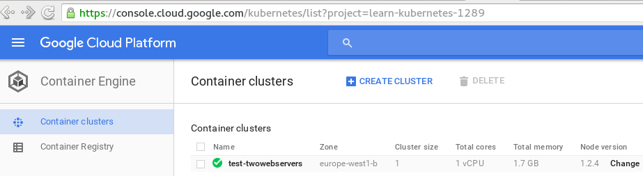
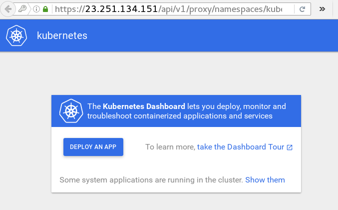

# Kubernetes on Google Container Engine 

This document discusses and explores the setup of two web servers running in a GCE. One web server is Nginx and the other is Apache. We want to see how this is setup and how traffic reaches the containers from outside.


# Install necessary software on your dev computer:

Note: In this document, the dev computer is the one named **kworkhorse** .

## Prerequisits: 
Install gcloud and kubectl on local computer, using instructions from this link: [https://cloud.google.com/container-engine/docs/before-you-begin](https://cloud.google.com/container-engine/docs/before-you-begin) .

Also:
* Enable Billing for your account,
* Enable Container Engine API
* Create authentication keys:
----

----

----

In case you already have the software installed, it is good idea to update the gcloud components. 
```
[kamran@kworkhorse ~]$  sudo /opt/google-cloud-sdk/bin/gcloud components update 
```

## Create new project in google cloud: 
Create a new project on GCE, using: [https://console.cloud.google.com/project](https://console.cloud.google.com/project)

Note: Project cannot be created through gcloud command. Though you can list projects using the gcloud command:

```
[kamran@kworkhorse ~]$ gcloud  projects  list
PROJECT_ID             NAME              PROJECT_NUMBER
learn-kubernetes-1289  Learn-Kubernetes  185358700664
[kamran@kworkhorse ~]$ 


[kamran@kworkhorse ~]$ gcloud  projects  describe  learn-kubernetes-1289 
createTime: '2016-04-22T08:44:46.593Z'
lifecycleState: ACTIVE
name: Learn-Kubernetes
projectId: learn-kubernetes-1289
projectNumber: '185358700664'
[kamran@kworkhorse ~]$ 
``` 


We see that the project ID of the new project is learn-kubernetes-1289 .

Setup the config for gcloud on your dev computer:
```
gcloud config set project learn-kubernetes-1289
gcloud config set compute/zone europe-west1-b
``` 

Notes: 
* Compute Zones are found here: [https://cloud.google.com/compute/docs/zones#available](https://cloud.google.com/compute/docs/zones#available)
* Machine types are here: [https://cloud.google.com/compute/docs/machine-types](https://cloud.google.com/compute/docs/machine-types) 
* Container Engine (Kubernetes) (shows cluster and cluster size, container registry): [https://console.cloud.google.com/kubernetes](https://console.cloud.google.com/kubernetes)
* Compute Engine (shows VM Instances,CPU usage, Disks, Images, Zones, etc): [https://console.cloud.google.com/compute](https://console.cloud.google.com/compute) 


## View/verify gcloud defaults:
```
[kamran@kworkhorse LearnKubernetes]$ gcloud config list
Your active configuration is: [default]

[compute]
zone = europe-west1-b
[core]
account = kamranazeem@gmail.com
disable_usage_reporting = False
project = learn-kubernetes-1289
[kamran@kworkhorse LearnKubernetes]$
```

## Create a new cluster:


``` 
[kamran@kworkhorse LearnKubernetes]$ gcloud container clusters create test-twowebservers  --num-nodes 1  --machine-type g1-small
Creating cluster test-twowebservers...done.
Created [https://container.googleapis.com/v1/projects/learn-kubernetes-1289/zones/europe-west1-b/clusters/test-twowebservers].
kubeconfig entry generated for test-twowebservers.
NAME                ZONE            MASTER_VERSION  MASTER_IP       MACHINE_TYPE  NODE_VERSION  NUM_NODES  STATUS
test-twowebservers  europe-west1-b  1.2.4           23.251.134.151  g1-small      1.2.4         1          RUNNING
[kamran@kworkhorse LearnKubernetes]$ 
``` 

You will see the same information when you login to the GCE web UI.



You now have one instance in this project - the worker node that you specified. The kubernetes master, which takes care of pod scheduling and runs the Kubernetes API server, is hosted by Container Engine.

It is a good time to list the instances in your cluster too!:
```
[kamran@kworkhorse LearnKubernetes]$ gcloud compute instances list 
NAME                                               ZONE            MACHINE_TYPE  PREEMPTIBLE  INTERNAL_IP  EXTERNAL_IP     STATUS
gke-test-twowebservers-default-pool-89515855-ey9l  europe-west1-b  g1-small                   10.132.0.2   23.251.132.124  RUNNING
[kamran@kworkhorse LearnKubernetes]$ 
```

The output of the instances list clearly shows that our Node has an external IP of 23.251.132.124, which is completely different from the IP address of the (GCE hosted) Master node 23.251.134.151 . 


You can now visit the Kubernetes web UI [https://MASTER_IP/ui](https://MASTER_IP/ui) by visiting the master IP from the information from  `clusters list` command.


```
[kamran@kworkhorse LearnKubernetes]$ gcloud container clusters list
NAME                ZONE            MASTER_VERSION  MASTER_IP       MACHINE_TYPE  NODE_VERSION  NUM_NODES  STATUS
test-twowebservers  europe-west1-b  1.2.4           23.251.134.151  g1-small      1.2.4         1          RUNNING
[kamran@kworkhorse LearnKubernetes]$ 
```


The Kubernetes web UI needs username and password! See below:

```
[kamran@kworkhorse LearnKubernetes]$ gcloud container clusters get-credentials test-twowebservers
Fetching cluster endpoint and auth data.
kubeconfig entry generated for test-twowebservers.
[kamran@kworkhorse LearnKubernetes]$ 
```


Then you do a "kubectl config view" to display the credentials stored in the config:

```
[kamran@kworkhorse LearnKubernetes]$ kubectl config view --cluster="test-twowebservers"
apiVersion: v1
clusters:
- cluster:
    server: http://192.168.1.81:8080
  name: cluster81
- cluster:
    server: http://192.168.124.50:8080
  name: fedora-multinode
- cluster:
    certificate-authority-data: REDACTED
    server: https://23.251.134.151
  name: gke_learn-kubernetes-1289_europe-west1-b_test-twowebservers
contexts:
- context:
    cluster: cluster81
    user: ""
  name: cluster81
- context:
    cluster: fedora-multinode
    user: ""
  name: fedora-multinode
- context:
    cluster: gke_learn-kubernetes-1289_europe-west1-b_test-twowebservers
    user: gke_learn-kubernetes-1289_europe-west1-b_test-twowebservers
  name: gke_learn-kubernetes-1289_europe-west1-b_test-twowebservers
current-context: gke_learn-kubernetes-1289_europe-west1-b_test-twowebservers
kind: Config
preferences: {}
users:
- name: gke_learn-kubernetes-1289_europe-west1-b_test-twowebservers
  user:
    client-certificate-data: REDACTED
    client-key-data: REDACTED
    password: gGHfh5TGhkjh5kdf
    username: admin
[kamran@kworkhorse LearnKubernetes]$ 
```
There are several clusters in the output above, you can safely ignore the ones you are not concerned with. 

Now use the username and password displayed at the bottom of the output from above and login to **https://MASTER_IP/ui** . After logging in a freshly created cluster, you will see something like this:

----

----

Note: There is also a describe command which gives you a rather detailed information about the cluster, including the username and password:

```
[kamran@kworkhorse LearnKubernetes]$ gcloud container clusters describe test-twowebservers
clusterIpv4Cidr: 10.80.0.0/14
createTime: '2016-05-12T08:48:19+00:00'
currentMasterVersion: 1.2.4
currentNodeCount: 1
currentNodeVersion: 1.2.4
endpoint: 23.251.134.151
initialClusterVersion: 1.2.4
initialNodeCount: 1
instanceGroupUrls:
- https://www.googleapis.com/compute/v1/projects/learn-kubernetes-1289/zones/europe-west1-b/instanceGroupManagers/gke-test-twowebservers-default-pool-89515855-grp
locations:
- europe-west1-b
loggingService: logging.googleapis.com
masterAuth:
  clientCertificate: LS0tLS1CRUdJTiBDRVJUSUZJQ0FURS0tLS0tCk1JSURGVENDQWYyZ0F3SUJBZ0lSQUpjbGxCRCtkWmgrSEd6Y3lvZVZvSzB3RFFZSktvW
  clientKey: LS0tLS1CRUdJTiBSU0EgUFJJVkFURSBLRVktLS0tLQpNSUlFb2dJQkFBS0NBUUVBclI3QWFhOFkzN1hxcThJY0hBbVdIZTUwREl2UzNPSmVPOGMzQ1lPZ0gzc0k3WU
  clusterCaCertificate: LS0tLS1CRUdJTiBDRVJUSUZJQ0FURS0tLS0tCk1JSUROakNDQWg2Z0F3SUJBZ0lSQUwwU05MMnVLb0Q1TXhRT3UrQnhkdU13RFFZSktvWklodmNOQVFFTEJRQXcKUkRGQ01FQUdBMVV
  password: gGHfh5TGhkjh5kdf
  username: admin
monitoringService: monitoring.googleapis.com
name: test-twowebservers
network: default
nodeConfig:
  diskSizeGb: 100
  machineType: g1-small
  oauthScopes:
  - https://www.googleapis.com/auth/compute
  - https://www.googleapis.com/auth/devstorage.read_only
  - https://www.googleapis.com/auth/service.management
  - https://www.googleapis.com/auth/servicecontrol
  - https://www.googleapis.com/auth/logging.write
  - https://www.googleapis.com/auth/monitoring
nodeIpv4CidrSize: 24
nodePools:
- config:
    diskSizeGb: 100
    machineType: g1-small
    oauthScopes:
    - https://www.googleapis.com/auth/compute
    - https://www.googleapis.com/auth/devstorage.read_only
    - https://www.googleapis.com/auth/service.management
    - https://www.googleapis.com/auth/servicecontrol
    - https://www.googleapis.com/auth/logging.write
    - https://www.googleapis.com/auth/monitoring
  initialNodeCount: 1
  instanceGroupUrls:
  - https://www.googleapis.com/compute/v1/projects/learn-kubernetes-1289/zones/europe-west1-b/instanceGroupManagers/gke-test-twowebservers-default-pool-89515855-grp
  name: default-pool
  selfLink: https://container.googleapis.com/v1/projects/learn-kubernetes-1289/zones/europe-west1-b/clusters/test-twowebservers/nodePools/default-pool
  status: RUNNING
  version: 1.2.4
selfLink: https://container.googleapis.com/v1/projects/learn-kubernetes-1289/zones/europe-west1-b/clusters/test-twowebservers
servicesIpv4Cidr: 10.83.240.0/20
status: RUNNING
zone: europe-west1-b
[kamran@kworkhorse LearnKubernetes]$ 
```


Before moving on with actually using this cluster for pod creation, etc, it may be an idea to try connecting to the node you have created in this cluster.

```
[kamran@kworkhorse LearnKubernetes]$ ssh 23.251.132.124
The authenticity of host '23.251.132.124 (23.251.132.124)' can't be established.
ECDSA key fingerprint is SHA256:pnDgE/oCCatdtMmqze0XTFi7NZ4TLP3NnxCezjgBpIs.
ECDSA key fingerprint is MD5:af:13:ca:97:9f:ed:5c:15:4a:47:89:47:53:59:c7:24.
Are you sure you want to continue connecting (yes/no)? yes
Warning: Permanently added '23.251.132.124' (ECDSA) to the list of known hosts.
Linux gke-test-twowebservers-default-pool-89515855-ey9l 3.16.0-4-amd64 #1 SMP Debian 3.16.7-ckt20-1+deb8u4 (2016-02-29) x86_64

Welcome to Kubernetes v1.2.4!

You can find documentation for Kubernetes at:
  http://docs.kubernetes.io/

You can download the build image for this release at:
  https://storage.googleapis.com/kubernetes-release/release/v1.2.4/kubernetes-src.tar.gz

It is based on the Kubernetes source at:
  https://github.com/kubernetes/kubernetes/tree/v1.2.4

For Kubernetes copyright and licensing information, see:
  /usr/local/share/doc/kubernetes/LICENSES

kamran@gke-test-twowebservers-default-pool-89515855-ey9l:~$ uptime
 10:57:15 up  2:08,  1 user,  load average: 0.03, 0.07, 0.11
kamran@gke-test-twowebservers-default-pool-89515855-ey9l:~$ 
``` 

TODO: Somehow I was able to login to the machine. I am not sure which key file it used. This needs to be investigated.

This VM / GCE node instance is actually Debian based. 

```
root@gke-test-twowebservers-default-pool-89515855-ey9l:~# uname -a
Linux gke-test-twowebservers-default-pool-89515855-ey9l 3.16.0-4-amd64 #1 SMP Debian 3.16.7-ckt20-1+deb8u4 (2016-02-29) x86_64 GNU/Linux
root@gke-test-twowebservers-default-pool-89515855-ey9l:~# cat /etc/debian_version 
7.9
root@gke-test-twowebservers-default-pool-89515855-ey9l:~#
```

Some other interesting information about the processes running on this node are:

```
root@gke-test-twowebservers-default-pool-89515855-ey9l:~# ps aux | grep docker
root      3399  1.1  2.8 204156 50560 ?        Sl   08:50   1:31 /usr/local/bin/kubelet --api-servers=https://23.251.134.151 --enable-debugging-handlers=true --cloud-provider=gce --config=/etc/kubernetes/manifests --allow-privileged=True --v=2 --cluster-dns=10.83.240.10 --cluster-domain=cluster.local --configure-cbr0=true --cgroup-root=/ --system-cgroups=/system --runtime-cgroups=/docker-daemon --kubelet-cgroups=/kubelet --node-labels=cloud.google.com/gke-nodepool=default-pool --babysit-daemons=true
root      3672  0.0  0.1  17724  2864 ?        S    08:50   0:00 /bin/bash /usr/sbin/docker-checker.sh
root      3718  1.1  2.6 1191996 46396 ?       Sl   08:50   1:37 /usr/bin/docker daemon -p /var/run/docker.pid --insecure-registry 10.0.0.0/8 --bridge=cbr0 --iptables=false --ip-masq=false --log-level=warn
root      6400  0.0  0.1   7856  1984 pts/1    S+   11:06   0:00 grep docker
root@gke-test-twowebservers-default-pool-89515855-ey9l:~# 
```

```
root@gke-test-twowebservers-default-pool-89515855-ey9l:~# ps aux | grep kube
root      3340  0.0  0.1  17724  2804 ?        S    08:50   0:00 /bin/bash /usr/sbin/kubelet-checker.sh
root      3399  1.1  2.8 204156 50564 ?        Sl   08:50   1:32 /usr/local/bin/kubelet --api-servers=https://23.251.134.151 --enable-debugging-handlers=true --cloud-provider=gce --config=/etc/kubernetes/manifests --allow-privileged=True --v=2 --cluster-dns=10.83.240.10 --cluster-domain=cluster.local --configure-cbr0=true --cgroup-root=/ --system-cgroups=/system --runtime-cgroups=/docker-daemon --kubelet-cgroups=/kubelet --node-labels=cloud.google.com/gke-nodepool=default-pool --babysit-daemons=true
root      3876  0.0  0.0   4336   756 ?        Ss   08:51   0:00 /bin/sh -c kube-proxy --master=https://23.251.134.151 --kubeconfig=/var/lib/kube-proxy/kubeconfig  --cluster-cidr=10.80.0.0/14 --resource-container="" --v=2  1>>/var/log/kube-proxy.log 2>&1
root      3886  0.0  1.1  30340 20888 ?        Sl   08:51   0:01 kube-proxy --master=https://23.251.134.151 --kubeconfig=/var/lib/kube-proxy/kubeconfig --cluster-cidr=10.80.0.0/14 --resource-container= --v=2
root      4485  0.0  1.5  40868 27328 ?        Ssl  08:51   0:02 /heapster --source=kubernetes.summary_api:'' --metric_resolution=60s
root      4648  0.0  1.1  32628 20204 ?        Ssl  08:51   0:00 /kube2sky --domain=cluster.local
root      4836  0.0  0.3  12996  6276 ?        Ssl  08:52   0:03 /exechealthz -cmd=nslookup kubernetes.default.svc.cluster.local 127.0.0.1 >/dev/null -port=8080
root      5247  0.0  1.3  35956 23064 ?        Ssl  08:53   0:01 /glbc --default-backend-service=kube-system/default-http-backend --sync-period=300s
root      6637  0.0  0.1   7856  1944 pts/1    S+   11:07   0:00 grep kube
root@gke-test-twowebservers-default-pool-89515855-ey9l:~# 
```


```
root@gke-test-twowebservers-default-pool-89515855-ey9l:~# docker ps
CONTAINER ID        IMAGE                                                                  COMMAND                  CREATED             STATUS              PORTS               NAMES
2c18ede8c67c        eu.gcr.io/google_containers/glbc:0.6.0                                 "/glbc --default-back"   2 hours ago         Up 2 hours                              k8s_l7-lb-controller.923c85a0_l7-lb-controller-v0.6.0-e2dfm_kube-system_9f1aefb1-181e-11e6-9b02-42010af00171_21f29442
e810ca2debf3        eu.gcr.io/google_containers/exechealthz:1.0                            "/exechealthz '-cmd=n"   2 hours ago         Up 2 hours                              k8s_healthz.8b5f150c_kube-dns-v11-a4eic_kube-system_9f1c6cfc-181e-11e6-9b02-42010af00171_2148ee45
3b962eead2b4        eu.gcr.io/google_containers/skydns:2015-10-13-8c72f8c                  "/skydns -machines=ht"   2 hours ago         Up 2 hours                              k8s_skydns.44eb3b5f_kube-dns-v11-a4eic_kube-system_9f1c6cfc-181e-11e6-9b02-42010af00171_b60408f1
4cfc7bd68f01        eu.gcr.io/google_containers/addon-resizer:1.0                          "/pod_nanny --cpu=100"   2 hours ago         Up 2 hours                              k8s_heapster-nanny.2e58c959_heapster-v1.0.2-2627135191-rd36a_kube-system_9f2572a9-181e-11e6-9b02-42010af00171_edfa5093
e78cc9e63ce9        eu.gcr.io/google_containers/kube2sky:1.14                              "/kube2sky --domain=c"   2 hours ago         Up 2 hours                              k8s_kube2sky.88c01fa_kube-dns-v11-a4eic_kube-system_9f1c6cfc-181e-11e6-9b02-42010af00171_75021e90
c55125f7d5e8        eu.gcr.io/google_containers/heapster:v1.0.2                            "/heapster --source=k"   2 hours ago         Up 2 hours                              k8s_heapster.ccd7f1d4_heapster-v1.0.2-2627135191-rd36a_kube-system_9f2572a9-181e-11e6-9b02-42010af00171_77f4dc0c
835efc5e9f61        eu.gcr.io/google_containers/etcd-amd64:2.2.1                           "/usr/local/bin/etcd "   2 hours ago         Up 2 hours                              k8s_etcd.43a035be_kube-dns-v11-a4eic_kube-system_9f1c6cfc-181e-11e6-9b02-42010af00171_e7b99671
5d947e64122c        eu.gcr.io/google_containers/defaultbackend:1.0                         "/server"                2 hours ago         Up 2 hours                              k8s_default-http-backend.4f0d90c1_l7-lb-controller-v0.6.0-e2dfm_kube-system_9f1aefb1-181e-11e6-9b02-42010af00171_5aaa3045
e7cf042cebfb        eu.gcr.io/google_containers/kubernetes-dashboard-amd64:v1.0.1          "/dashboard --port=90"   2 hours ago         Up 2 hours                              k8s_kubernetes-dashboard.fda9359_kubernetes-dashboard-v1.0.1-kjdpz_kube-system_9f1ceb4a-181e-11e6-9b02-42010af00171_d1983abd
b29ff1756a54        eu.gcr.io/google_containers/fluentd-gcp:1.18                           "/bin/sh -c '/usr/sbi"   2 hours ago         Up 2 hours                              k8s_fluentd-cloud-logging.5165de6b_fluentd-cloud-logging-gke-test-twowebservers-default-pool-89515855-ey9l_kube-system_a31ba0629311d10bb74b3e4126d8e7f2_08d8fddb
bf286ef01180        gcr.io/google_containers/pause:2.0                                     "/pause"                 2 hours ago         Up 2 hours                              k8s_POD.6059dfa2_heapster-v1.0.2-2627135191-rd36a_kube-system_9f2572a9-181e-11e6-9b02-42010af00171_48dc9884
df3e0d7785d3        gcr.io/google_containers/pause:2.0                                     "/pause"                 2 hours ago         Up 2 hours                              k8s_POD.e2764897_kube-dns-v11-a4eic_kube-system_9f1c6cfc-181e-11e6-9b02-42010af00171_e7472010
723b247c642a        gcr.io/google_containers/pause:2.0                                     "/pause"                 2 hours ago         Up 2 hours                              k8s_POD.364e00d5_l7-lb-controller-v0.6.0-e2dfm_kube-system_9f1aefb1-181e-11e6-9b02-42010af00171_8dbcb3fa
7a8dd3f9b6f4        gcr.io/google_containers/pause:2.0                                     "/pause"                 2 hours ago         Up 2 hours                              k8s_POD.3a1c00d7_kubernetes-dashboard-v1.0.1-kjdpz_kube-system_9f1ceb4a-181e-11e6-9b02-42010af00171_14376a66
cca42ccbe4ba        gcr.io/google_containers/kube-proxy:c126c6dbe73c9e7db8b835f2dd6b8f8e   "/bin/sh -c 'kube-pro"   2 hours ago         Up 2 hours                              k8s_kube-proxy.471fcb7_kube-proxy-gke-test-twowebservers-default-pool-89515855-ey9l_kube-system_612819515c45ddd16f5b4f6eaa4bf70d_0da726a0
c4ecf1156915        gcr.io/google_containers/pause:2.0                                     "/pause"                 2 hours ago         Up 2 hours                              k8s_POD.6059dfa2_kube-proxy-gke-test-twowebservers-default-pool-89515855-ey9l_kube-system_612819515c45ddd16f5b4f6eaa4bf70d_205bf883
c10f97d4d22f        gcr.io/google_containers/pause:2.0                                     "/pause"                 2 hours ago         Up 2 hours                              k8s_POD.6059dfa2_fluentd-cloud-logging-gke-test-twowebservers-default-pool-89515855-ey9l_kube-system_a31ba0629311d10bb74b3e4126d8e7f2_2131afe6
root@gke-test-twowebservers-default-pool-89515855-ey9l:~#
``` 


IP and routing:

```
root@gke-test-twowebservers-default-pool-89515855-ey9l:~# ip addr sh
1: lo: <LOOPBACK,UP,LOWER_UP> mtu 65536 qdisc noqueue state UNKNOWN 
    link/loopback 00:00:00:00:00:00 brd 00:00:00:00:00:00
    inet 127.0.0.1/8 scope host lo
       valid_lft forever preferred_lft forever
2: eth0: <BROADCAST,MULTICAST,UP,LOWER_UP> mtu 1460 qdisc pfifo_fast state UP qlen 1000
    link/ether 42:01:0a:84:00:02 brd ff:ff:ff:ff:ff:ff
    inet 10.132.0.2/32 brd 10.132.0.2 scope global eth0
       valid_lft forever preferred_lft forever
4: cbr0: <BROADCAST,MULTICAST,PROMISC,UP,LOWER_UP> mtu 1460 qdisc htb state UP 
    link/ether 22:a3:e6:98:59:5e brd ff:ff:ff:ff:ff:ff
    inet 10.80.0.1/24 scope global cbr0
       valid_lft forever preferred_lft forever
6: veth49e9114: <BROADCAST,MULTICAST,UP,LOWER_UP> mtu 1460 qdisc noqueue master cbr0 state UP 
    link/ether b2:ef:f1:7c:bb:1e brd ff:ff:ff:ff:ff:ff
8: veth4aace90: <BROADCAST,MULTICAST,UP,LOWER_UP> mtu 1460 qdisc noqueue master cbr0 state UP 
    link/ether 5a:c8:af:b1:24:b6 brd ff:ff:ff:ff:ff:ff
10: vethc6746c9: <BROADCAST,MULTICAST,UP,LOWER_UP> mtu 1460 qdisc noqueue master cbr0 state UP 
    link/ether 62:dd:a6:f8:3b:ef brd ff:ff:ff:ff:ff:ff
12: vethc9920da: <BROADCAST,MULTICAST,UP,LOWER_UP> mtu 1460 qdisc noqueue master cbr0 state UP 
    link/ether 22:a3:e6:98:59:5e brd ff:ff:ff:ff:ff:ff
14: veth60f38a9: <BROADCAST,MULTICAST,UP,LOWER_UP> mtu 1460 qdisc noqueue master cbr0 state UP 
    link/ether 8a:15:ec:ff:45:59 brd ff:ff:ff:ff:ff:ff
root@gke-test-twowebservers-default-pool-89515855-ey9l:~# 
```

```
root@gke-test-twowebservers-default-pool-89515855-ey9l:~# route -n
Kernel IP routing table
Destination     Gateway         Genmask         Flags Metric Ref    Use Iface
0.0.0.0         10.132.0.1      0.0.0.0         UG    0      0        0 eth0
10.80.0.0       0.0.0.0         255.255.255.0   U     0      0        0 cbr0
10.132.0.1      0.0.0.0         255.255.255.255 UH    0      0        0 eth0
root@gke-test-twowebservers-default-pool-89515855-ey9l:~#
```

```
root@gke-test-twowebservers-default-pool-89515855-ey9l:~# cat /etc/resolv.conf 
domain c.learn-kubernetes-1289.internal.
search c.learn-kubernetes-1289.internal. google.internal.
nameserver 169.254.169.254
root@gke-test-twowebservers-default-pool-89515855-ey9l:~# 
```

```
root@gke-test-twowebservers-default-pool-89515855-ey9l:~# iptables-save 
# Generated by iptables-save v1.4.14 on Thu May 12 11:16:56 2016
*filter
:INPUT ACCEPT [199:64694]
:FORWARD ACCEPT [390:103153]
:OUTPUT ACCEPT [182:22820]
:DOCKER - [0:0]
:KUBE-SERVICES - [0:0]
-A FORWARD -o docker0 -j DOCKER
-A FORWARD -o docker0 -m conntrack --ctstate RELATED,ESTABLISHED -j ACCEPT
-A FORWARD -i docker0 ! -o docker0 -j ACCEPT
-A FORWARD -i docker0 -o docker0 -j ACCEPT
-A OUTPUT -m comment --comment "kubernetes service portals" -j KUBE-SERVICES
COMMIT
# Completed on Thu May 12 11:16:56 2016
# Generated by iptables-save v1.4.14 on Thu May 12 11:16:56 2016
*nat
:PREROUTING ACCEPT [68:5375]
:INPUT ACCEPT [1:60]
:OUTPUT ACCEPT [13:901]
:POSTROUTING ACCEPT [5:300]
:KUBE-MARK-MASQ - [0:0]
:KUBE-NODEPORTS - [0:0]
:KUBE-POSTROUTING - [0:0]
:KUBE-SEP-54GVWSVFIGJ7TMTH - [0:0]
:KUBE-SEP-CASODNYIRQUV4T75 - [0:0]
:KUBE-SEP-CZ3HZ7CAA4OJDRGD - [0:0]
:KUBE-SEP-HHJSMBGGGRTBKTRI - [0:0]
:KUBE-SEP-HZPXAQ52KIT6NB22 - [0:0]
:KUBE-SEP-SAHG6L2BLG55EJ24 - [0:0]
:KUBE-SERVICES - [0:0]
:KUBE-SVC-BJM46V3U5RZHCFRZ - [0:0]
:KUBE-SVC-ERIFXISQEP7F7OF4 - [0:0]
:KUBE-SVC-NPX46M4PTMTKRN6Y - [0:0]
:KUBE-SVC-TCOU7JCQXEZGVUNU - [0:0]
:KUBE-SVC-XGLOHA7QRQ3V22RZ - [0:0]
:KUBE-SVC-XP4WJ6VSLGWALMW5 - [0:0]
-A PREROUTING -m comment --comment "kubernetes service portals" -j KUBE-SERVICES
-A OUTPUT -m comment --comment "kubernetes service portals" -j KUBE-SERVICES
-A POSTROUTING -m comment --comment "kubernetes postrouting rules" -j KUBE-POSTROUTING
-A POSTROUTING ! -d 10.0.0.0/8 -m addrtype ! --dst-type LOCAL -j MASQUERADE
-A KUBE-MARK-MASQ -j MARK --set-xmark 0x4000/0x4000
-A KUBE-NODEPORTS -p tcp -m comment --comment "kube-system/default-http-backend:http" -m tcp --dport 31291 -j KUBE-MARK-MASQ
-A KUBE-NODEPORTS -p tcp -m comment --comment "kube-system/default-http-backend:http" -m tcp --dport 31291 -j KUBE-SVC-XP4WJ6VSLGWALMW5
-A KUBE-POSTROUTING -m comment --comment "kubernetes service traffic requiring SNAT" -m mark --mark 0x4000/0x4000 -j MASQUERADE
-A KUBE-SEP-54GVWSVFIGJ7TMTH -s 10.80.0.4/32 -m comment --comment "kube-system/default-http-backend:http" -j KUBE-MARK-MASQ
-A KUBE-SEP-54GVWSVFIGJ7TMTH -p tcp -m comment --comment "kube-system/default-http-backend:http" -m tcp -j DNAT --to-destination 10.80.0.4:8080
-A KUBE-SEP-CASODNYIRQUV4T75 -s 10.80.0.5/32 -m comment --comment "kube-system/kube-dns:dns-tcp" -j KUBE-MARK-MASQ
-A KUBE-SEP-CASODNYIRQUV4T75 -p tcp -m comment --comment "kube-system/kube-dns:dns-tcp" -m tcp -j DNAT --to-destination 10.80.0.5:53
-A KUBE-SEP-CZ3HZ7CAA4OJDRGD -s 10.80.0.5/32 -m comment --comment "kube-system/kube-dns:dns" -j KUBE-MARK-MASQ
-A KUBE-SEP-CZ3HZ7CAA4OJDRGD -p udp -m comment --comment "kube-system/kube-dns:dns" -m udp -j DNAT --to-destination 10.80.0.5:53
-A KUBE-SEP-HHJSMBGGGRTBKTRI -s 10.80.0.3/32 -m comment --comment "kube-system/kubernetes-dashboard:" -j KUBE-MARK-MASQ
-A KUBE-SEP-HHJSMBGGGRTBKTRI -p tcp -m comment --comment "kube-system/kubernetes-dashboard:" -m tcp -j DNAT --to-destination 10.80.0.3:9090
-A KUBE-SEP-HZPXAQ52KIT6NB22 -s 23.251.134.151/32 -m comment --comment "default/kubernetes:https" -j KUBE-MARK-MASQ
-A KUBE-SEP-HZPXAQ52KIT6NB22 -p tcp -m comment --comment "default/kubernetes:https" -m tcp -j DNAT --to-destination 23.251.134.151:443
-A KUBE-SEP-SAHG6L2BLG55EJ24 -s 10.80.0.6/32 -m comment --comment "kube-system/heapster:" -j KUBE-MARK-MASQ
-A KUBE-SEP-SAHG6L2BLG55EJ24 -p tcp -m comment --comment "kube-system/heapster:" -m tcp -j DNAT --to-destination 10.80.0.6:8082
-A KUBE-SERVICES ! -s 10.80.0.0/14 -d 10.83.242.211/32 -p tcp -m comment --comment "kube-system/default-http-backend:http cluster IP" -m tcp --dport 80 -j KUBE-MARK-MASQ
-A KUBE-SERVICES -d 10.83.242.211/32 -p tcp -m comment --comment "kube-system/default-http-backend:http cluster IP" -m tcp --dport 80 -j KUBE-SVC-XP4WJ6VSLGWALMW5
-A KUBE-SERVICES ! -s 10.80.0.0/14 -d 10.83.247.155/32 -p tcp -m comment --comment "kube-system/heapster: cluster IP" -m tcp --dport 80 -j KUBE-MARK-MASQ
-A KUBE-SERVICES -d 10.83.247.155/32 -p tcp -m comment --comment "kube-system/heapster: cluster IP" -m tcp --dport 80 -j KUBE-SVC-BJM46V3U5RZHCFRZ
-A KUBE-SERVICES ! -s 10.80.0.0/14 -d 10.83.240.10/32 -p udp -m comment --comment "kube-system/kube-dns:dns cluster IP" -m udp --dport 53 -j KUBE-MARK-MASQ
-A KUBE-SERVICES -d 10.83.240.10/32 -p udp -m comment --comment "kube-system/kube-dns:dns cluster IP" -m udp --dport 53 -j KUBE-SVC-TCOU7JCQXEZGVUNU
-A KUBE-SERVICES ! -s 10.80.0.0/14 -d 10.83.240.10/32 -p tcp -m comment --comment "kube-system/kube-dns:dns-tcp cluster IP" -m tcp --dport 53 -j KUBE-MARK-MASQ
-A KUBE-SERVICES -d 10.83.240.10/32 -p tcp -m comment --comment "kube-system/kube-dns:dns-tcp cluster IP" -m tcp --dport 53 -j KUBE-SVC-ERIFXISQEP7F7OF4
-A KUBE-SERVICES ! -s 10.80.0.0/14 -d 10.83.254.147/32 -p tcp -m comment --comment "kube-system/kubernetes-dashboard: cluster IP" -m tcp --dport 80 -j KUBE-MARK-MASQ
-A KUBE-SERVICES -d 10.83.254.147/32 -p tcp -m comment --comment "kube-system/kubernetes-dashboard: cluster IP" -m tcp --dport 80 -j KUBE-SVC-XGLOHA7QRQ3V22RZ
-A KUBE-SERVICES ! -s 10.80.0.0/14 -d 10.83.240.1/32 -p tcp -m comment --comment "default/kubernetes:https cluster IP" -m tcp --dport 443 -j KUBE-MARK-MASQ
-A KUBE-SERVICES -d 10.83.240.1/32 -p tcp -m comment --comment "default/kubernetes:https cluster IP" -m tcp --dport 443 -j KUBE-SVC-NPX46M4PTMTKRN6Y
-A KUBE-SERVICES -m comment --comment "kubernetes service nodeports; NOTE: this must be the last rule in this chain" -m addrtype --dst-type LOCAL -j KUBE-NODEPORTS
-A KUBE-SVC-BJM46V3U5RZHCFRZ -m comment --comment "kube-system/heapster:" -j KUBE-SEP-SAHG6L2BLG55EJ24
-A KUBE-SVC-ERIFXISQEP7F7OF4 -m comment --comment "kube-system/kube-dns:dns-tcp" -j KUBE-SEP-CASODNYIRQUV4T75
-A KUBE-SVC-NPX46M4PTMTKRN6Y -m comment --comment "default/kubernetes:https" -j KUBE-SEP-HZPXAQ52KIT6NB22
-A KUBE-SVC-TCOU7JCQXEZGVUNU -m comment --comment "kube-system/kube-dns:dns" -j KUBE-SEP-CZ3HZ7CAA4OJDRGD
-A KUBE-SVC-XGLOHA7QRQ3V22RZ -m comment --comment "kube-system/kubernetes-dashboard:" -j KUBE-SEP-HHJSMBGGGRTBKTRI
-A KUBE-SVC-XP4WJ6VSLGWALMW5 -m comment --comment "kube-system/default-http-backend:http" -j KUBE-SEP-54GVWSVFIGJ7TMTH
COMMIT
# Completed on Thu May 12 11:16:56 2016
root@gke-test-twowebservers-default-pool-89515855-ey9l:~# 
```

```
root@gke-test-twowebservers-default-pool-89515855-ey9l:~# iptables-save > /root/iptables-before-pods.txt
```


# Using the cluster using kubectl:

## Create pod/deployment/service for Nginx web server:

```
[kamran@kworkhorse LearnKubernetes]$ kubectl run nginx --image=nginx --port=80 
deployment "nginx" created
[kamran@kworkhorse LearnKubernetes]$ 
```


Note:
```
  --port=-1: The port that this container exposes.  If --expose is true, this is also the port used by the service that is created.
```


```
[kamran@kworkhorse LearnKubernetes]$ kubectl get deployments
NAME      DESIRED   CURRENT   UP-TO-DATE   AVAILABLE   AGE
nginx     1         1         1            1           19s
[kamran@kworkhorse LearnKubernetes]$ 
```

```
[kamran@kworkhorse LearnKubernetes]$ kubectl get pods
NAME                    READY     STATUS    RESTARTS   AGE
nginx-198147104-pu6pl   1/1       Running   0          5m
[kamran@kworkhorse LearnKubernetes]$ 
```


```
[kamran@kworkhorse LearnKubernetes]$ kubectl get pods
NAME                    READY     STATUS    RESTARTS   AGE
nginx-198147104-pu6pl   1/1       Running   0          5m
[kamran@kworkhorse LearnKubernetes]$ kubectl describe deployments
Name:			nginx
Namespace:		default
CreationTimestamp:	Thu, 12 May 2016 13:20:36 +0200
Labels:			run=nginx
Selector:		run=nginx
Replicas:		1 updated | 1 total | 1 available | 0 unavailable
StrategyType:		RollingUpdate
MinReadySeconds:	0
RollingUpdateStrategy:	1 max unavailable, 1 max surge
OldReplicaSets:		<none>
NewReplicaSet:		nginx-198147104 (1/1 replicas created)
Events:
  FirstSeen	LastSeen	Count	From				SubobjectPath	Type		Reason			Message
  ---------	--------	-----	----				-------------	--------	------			-------
  5m		5m		1	{deployment-controller }			Normal		ScalingReplicaSet	Scaled up replica set nginx-198147104 to 1


[kamran@kworkhorse LearnKubernetes]$ 
```


```
[kamran@kworkhorse LearnKubernetes]$ kubectl describe pods
Name:		nginx-198147104-pu6pl
Namespace:	default
Node:		gke-test-twowebservers-default-pool-89515855-ey9l/10.132.0.2
Start Time:	Thu, 12 May 2016 13:20:36 +0200
Labels:		pod-template-hash=198147104,run=nginx
Status:		Running
IP:		10.80.0.7
Controllers:	ReplicaSet/nginx-198147104
Containers:
  nginx:
    Container ID:	docker://aa7253f01424861b8e0c4fb622dce53b6a1605fd2667036a47f779f7a3e5a34d
    Image:		nginx
    Image ID:		docker://72cd8a7c892b645a16ecf87aeee0f4268b07c071cea1df1bffc444f84647ecca
    Port:		80/TCP
    QoS Tier:
      cpu:	Burstable
      memory:	BestEffort
    Requests:
      cpu:		100m
    State:		Running
      Started:		Thu, 12 May 2016 13:20:50 +0200
    Ready:		True
    Restart Count:	0
    Environment Variables:
Conditions:
  Type		Status
  Ready 	True 
Volumes:
  default-token-p5a88:
    Type:	Secret (a volume populated by a Secret)
    SecretName:	default-token-p5a88
Events:
  FirstSeen	LastSeen	Count	From								SubobjectPath		Type		Reason		Message
  ---------	--------	-----	----								-------------		--------	------		-------
  53s		53s		1	{default-scheduler }									Normal		Scheduled	Successfully assigned nginx-198147104-pu6pl to gke-test-twowebservers-default-pool-89515855-ey9l
  52s		52s		1	{kubelet gke-test-twowebservers-default-pool-89515855-ey9l}	spec.containers{nginx}	Normal		Pulling		pulling image "nginx"
  39s		39s		1	{kubelet gke-test-twowebservers-default-pool-89515855-ey9l}	spec.containers{nginx}	Normal		Pulled		Successfully pulled image "nginx"
  39s		39s		1	{kubelet gke-test-twowebservers-default-pool-89515855-ey9l}	spec.containers{nginx}	Normal		Created		Created container with docker id aa7253f01424
  39s		39s		1	{kubelet gke-test-twowebservers-default-pool-89515855-ey9l}	spec.containers{nginx}	Normal		Started		Started container with docker id aa7253f01424


[kamran@kworkhorse LearnKubernetes]$ 
``` 

Notice that the pod has an internal IP address of 10.80.0.7 . The node on which this pod is running has the IP address of 23.251.132.124 . Although we said --port=80 when we created this pod, it does not automatically makes the service (inside this pod) available on the public IP of the (worker) node.

```
[kamran@kworkhorse LearnKubernetes]$ curl --connect-timeout 2  http://23.251.132.124
curl: (28) Connection timed out after 2001 milliseconds
[kamran@kworkhorse LearnKubernetes]$ 
```


To be able to do that, we need to create a service. 


At the moment, there is only one service running, and that is kubernetes master.

```
[kamran@kworkhorse LearnKubernetes]$ kubectl get services
NAME         CLUSTER-IP    EXTERNAL-IP   PORT(S)   AGE
kubernetes   10.83.240.1   <none>        443/TCP   2h
[kamran@kworkhorse LearnKubernetes]$ 
```

We need to expose our nginx deployment as a service to allow external traffic to it:

```
[kamran@kworkhorse LearnKubernetes]$ kubectl expose deployment  nginx --type=LoadBalancer
service "nginx" exposed
[kamran@kworkhorse LearnKubernetes]$ 
```
Note: When a service is exposed, it takes the port defined by --port during pod/deployment creation and makes it available through a public IP.


Lets check the details of the service we just created. Expose creates a service; you can create a service manually as well using a service definition file.

```
[kamran@kworkhorse LearnKubernetes]$ kubectl get services
NAME         CLUSTER-IP      EXTERNAL-IP      PORT(S)   AGE
kubernetes   10.83.240.1     <none>           443/TCP   2h
nginx        10.83.252.224   146.148.10.228   80/TCP    2m
[kamran@kworkhorse LearnKubernetes]$ 
```

Note: It may take a minute for the external IP to appear against a service in the EXTERNAL-IP column.


```
[kamran@kworkhorse LearnKubernetes]$ kubectl describe service nginx
Name:			nginx
Namespace:		default
Labels:			run=nginx
Selector:		run=nginx
Type:			LoadBalancer
IP:			10.83.252.224
LoadBalancer Ingress:	146.148.10.228
Port:			<unset>	80/TCP
NodePort:		<unset>	30007/TCP
Endpoints:		10.80.0.7:80
Session Affinity:	None
Events:
  FirstSeen	LastSeen	Count	From			SubobjectPath	Type		Reason			Message
  ---------	--------	-----	----			-------------	--------	------			-------
  3m		3m		1	{service-controller }			Normal		CreatingLoadBalancer	Creating load balancer
  2m		2m		1	{service-controller }			Normal		CreatedLoadBalancer	Created load balancer


[kamran@kworkhorse LearnKubernetes]$ 
```

Now, we use curl again to reach this nginx , this time using the EXTERNAL-IP as shown in the output of "kubectl get services" command, above:
```
[kamran@kworkhorse LearnKubernetes]$ curl --connect-timeout 2  http://146.148.10.228
<!DOCTYPE html>
<html>
<head>
<title>Welcome to nginx!</title>
<style>
    body {
        width: 35em;
        margin: 0 auto;
        font-family: Tahoma, Verdana, Arial, sans-serif;
    }
</style>
</head>
<body>
<h1>Welcome to nginx!</h1>
<p>If you see this page, the nginx web server is successfully installed and
working. Further configuration is required.</p>

<p>For online documentation and support please refer to
<a href="http://nginx.org/">nginx.org</a>.<br/>
Commercial support is available at
<a href="http://nginx.com/">nginx.com</a>.</p>

<p><em>Thank you for using nginx.</em></p>
</body>
</html>
[kamran@kworkhorse LearnKubernetes]$ 
```

As you can see, this time we got a response!


## Create pod/deployment/service for Apache web server:
It is time to create another pod, using apache, and expose that as well on port 80 and see how can we reach it without us diong any jugglerey with ports.


```
[kamran@kworkhorse LearnKubernetes]$ kubectl run apache --image=httpd --port=80
deployment "apache" created
[kamran@kworkhorse LearnKubernetes]$ 
```

Notice no port conflicts!

```
[kamran@kworkhorse LearnKubernetes]$ kubectl get deployments
NAME      DESIRED   CURRENT   UP-TO-DATE   AVAILABLE   AGE
apache    1         1         1            1           50s
nginx     1         1         1            1           20m
```

```
[kamran@kworkhorse LearnKubernetes]$ kubectl get pods
NAME                      READY     STATUS    RESTARTS   AGE
apache-3550117020-aob5w   1/1       Running   0          54s
nginx-198147104-pu6pl     1/1       Running   0          20m
[kamran@kworkhorse LearnKubernetes]$ 
```

```
[kamran@kworkhorse LearnKubernetes]$ kubectl describe deployment apache
Name:			apache
Namespace:		default
CreationTimestamp:	Thu, 12 May 2016 13:40:06 +0200
Labels:			run=apache
Selector:		run=apache
Replicas:		1 updated | 1 total | 1 available | 0 unavailable
StrategyType:		RollingUpdate
MinReadySeconds:	0
RollingUpdateStrategy:	1 max unavailable, 1 max surge
OldReplicaSets:		<none>
NewReplicaSet:		apache-3550117020 (1/1 replicas created)
Events:
  FirstSeen	LastSeen	Count	From				SubobjectPath	Type		Reason			Message
  ---------	--------	-----	----				-------------	--------	------			-------
  1m		1m		1	{deployment-controller }			Normal		ScalingReplicaSet	Scaled up replica set apache-3550117020 to 1


[kamran@kworkhorse LearnKubernetes]$ 
```


```
[kamran@kworkhorse LearnKubernetes]$ kubectl describe pods apache-3550117020-aob5w
Name:		apache-3550117020-aob5w
Namespace:	default
Node:		gke-test-twowebservers-default-pool-89515855-ey9l/10.132.0.2
Start Time:	Thu, 12 May 2016 13:40:06 +0200
Labels:		pod-template-hash=3550117020,run=apache
Status:		Running
IP:		10.80.0.8
Controllers:	ReplicaSet/apache-3550117020
Containers:
  apache:
    Container ID:	docker://b35aeb0924f3631980e4732edf5a2c12b7238a9925011611790540b929bdc45f
    Image:		httpd
    Image ID:		docker://cb604ab7d359a1ac87dd46abc6d98d871d6241b69a2ea26d2f352f4741abfb64
    Port:		80/TCP
    QoS Tier:
      cpu:	Burstable
      memory:	BestEffort
    Requests:
      cpu:		100m
    State:		Running
      Started:		Thu, 12 May 2016 13:40:14 +0200
    Ready:		True
    Restart Count:	0
    Environment Variables:
Conditions:
  Type		Status
  Ready 	True 
Volumes:
  default-token-p5a88:
    Type:	Secret (a volume populated by a Secret)
    SecretName:	default-token-p5a88
Events:
  FirstSeen	LastSeen	Count	From								SubobjectPath		Type		Reason		Message
  ---------	--------	-----	----								-------------		--------	------		-------
  2m		2m		1	{default-scheduler }									Normal		Scheduled	Successfully assigned apache-3550117020-aob5w to gke-test-twowebservers-default-pool-89515855-ey9l
  2m		2m		1	{kubelet gke-test-twowebservers-default-pool-89515855-ey9l}	spec.containers{apache}	Normal		Pulling		pulling image "httpd"
  2m		2m		1	{kubelet gke-test-twowebservers-default-pool-89515855-ey9l}	spec.containers{apache}	Normal		Pulled		Successfully pulled image "httpd"
  2m		2m		1	{kubelet gke-test-twowebservers-default-pool-89515855-ey9l}	spec.containers{apache}	Normal		Created		Created container with docker id b35aeb0924f3
  2m		2m		1	{kubelet gke-test-twowebservers-default-pool-89515855-ey9l}	spec.containers{apache}	Normal		Started		Started container with docker id b35aeb0924f3


[kamran@kworkhorse LearnKubernetes]$ 
```


Notice that the pod has an internal IP address of 10.80.0.8 . The node on which this pod is running has the IP address of 23.251.132.124 . Although we said --port=80 when we created this pod, it does not automatically makes the service (inside this pod) available on the public IP of the (worker) node.

```
[kamran@kworkhorse LearnKubernetes]$ curl --connect-timeout 2  http://23.251.132.124
curl: (28) Connection timed out after 2001 milliseconds
[kamran@kworkhorse LearnKubernetes]$ 
```


To be able to do that, we need to create a service. 


At the moment, there are two services running:
* kubernetes master
* nginx

.. as evident from:

```
[kamran@kworkhorse LearnKubernetes]$ kubectl get services
NAME         CLUSTER-IP      EXTERNAL-IP      PORT(S)   AGE
kubernetes   10.83.240.1     <none>           443/TCP   2h
nginx        10.83.252.224   146.148.10.228   80/TCP    13m
[kamran@kworkhorse LearnKubernetes]$ 
```

We need an adidtional service for Apache. Exposing a deployment creates a corresponding service.

```
[kamran@kworkhorse LearnKubernetes]$ kubectl expose deployment apache --type=LoadBalancer
service "apache" exposed
[kamran@kworkhorse LearnKubernetes]$
``` 

Check the services now:
```
[kamran@kworkhorse LearnKubernetes]$ kubectl get services
NAME         CLUSTER-IP      EXTERNAL-IP      PORT(S)   AGE
apache       10.83.252.143   130.211.80.214   80/TCP    1m
kubernetes   10.83.240.1     <none>           443/TCP   2h
nginx        10.83.252.224   146.148.10.228   80/TCP    16m
[kamran@kworkhorse LearnKubernetes]$ 
```

Note: It may take a minute for the external IP to appear against a service in the EXTERNAL-IP column.


```
[kamran@kworkhorse LearnKubernetes]$ curl --connect-timeout 2  http://130.211.80.214
<html><body><h1>It works!</h1></body></html>
[kamran@kworkhorse LearnKubernetes]$ kubectl describe service apache
Name:			apache
Namespace:		default
Labels:			run=apache
Selector:		run=apache
Type:			LoadBalancer
IP:			10.83.252.143
LoadBalancer Ingress:	130.211.80.214
Port:			<unset>	80/TCP
NodePort:		<unset>	32230/TCP
Endpoints:		10.80.0.8:80
Session Affinity:	None
Events:
  FirstSeen	LastSeen	Count	From			SubobjectPath	Type		Reason			Message
  ---------	--------	-----	----			-------------	--------	------			-------
  4m		4m		1	{service-controller }			Normal		CreatingLoadBalancer	Creating load balancer
  3m		3m		1	{service-controller }			Normal		CreatedLoadBalancer	Created load balancer


[kamran@kworkhorse LearnKubernetes]$ 
``` 


Notice that we have a completely new/different IP for the apache service. We can use cur to check if it works:

```
[kamran@kworkhorse LearnKubernetes]$ curl --connect-timeout 2  http://130.211.80.214
<html><body><h1>It works!</h1></body></html>
[kamran@kworkhorse LearnKubernetes]$ 
```

So it works! Hurray!!!!


Lets check the node, on the OS level and see what are the differences. 

IP addresses:
```
root@gke-test-twowebservers-default-pool-89515855-ey9l:~# ip addr show
1: lo: <LOOPBACK,UP,LOWER_UP> mtu 65536 qdisc noqueue state UNKNOWN 
    link/loopback 00:00:00:00:00:00 brd 00:00:00:00:00:00
    inet 127.0.0.1/8 scope host lo
       valid_lft forever preferred_lft forever
2: eth0: <BROADCAST,MULTICAST,UP,LOWER_UP> mtu 1460 qdisc pfifo_fast state UP qlen 1000
    link/ether 42:01:0a:84:00:02 brd ff:ff:ff:ff:ff:ff
    inet 10.132.0.2/32 brd 10.132.0.2 scope global eth0
       valid_lft forever preferred_lft forever
4: cbr0: <BROADCAST,MULTICAST,PROMISC,UP,LOWER_UP> mtu 1460 qdisc htb state UP 
    link/ether 02:cd:00:85:9e:fb brd ff:ff:ff:ff:ff:ff
    inet 10.80.0.1/24 scope global cbr0
       valid_lft forever preferred_lft forever
6: veth49e9114: <BROADCAST,MULTICAST,UP,LOWER_UP> mtu 1460 qdisc noqueue master cbr0 state UP 
    link/ether b2:ef:f1:7c:bb:1e brd ff:ff:ff:ff:ff:ff
8: veth4aace90: <BROADCAST,MULTICAST,UP,LOWER_UP> mtu 1460 qdisc noqueue master cbr0 state UP 
    link/ether 5a:c8:af:b1:24:b6 brd ff:ff:ff:ff:ff:ff
10: vethc6746c9: <BROADCAST,MULTICAST,UP,LOWER_UP> mtu 1460 qdisc noqueue master cbr0 state UP 
    link/ether 62:dd:a6:f8:3b:ef brd ff:ff:ff:ff:ff:ff
12: vethc9920da: <BROADCAST,MULTICAST,UP,LOWER_UP> mtu 1460 qdisc noqueue master cbr0 state UP 
    link/ether 22:a3:e6:98:59:5e brd ff:ff:ff:ff:ff:ff
14: veth60f38a9: <BROADCAST,MULTICAST,UP,LOWER_UP> mtu 1460 qdisc noqueue master cbr0 state UP 
    link/ether 8a:15:ec:ff:45:59 brd ff:ff:ff:ff:ff:ff
16: veth100e966: <BROADCAST,MULTICAST,UP,LOWER_UP> mtu 1460 qdisc noqueue master cbr0 state UP 
    link/ether 02:cd:00:85:9e:fb brd ff:ff:ff:ff:ff:ff
18: vethac3104f: <BROADCAST,MULTICAST,UP,LOWER_UP> mtu 1460 qdisc noqueue master cbr0 state UP 
    link/ether a2:80:7a:6f:24:19 brd ff:ff:ff:ff:ff:ff
root@gke-test-twowebservers-default-pool-89515855-ey9l:~# 
```

```
root@gke-test-twowebservers-default-pool-89515855-ey9l:~# ping -c 2 10.80.0.7
PING 10.80.0.7 (10.80.0.7) 56(84) bytes of data.
64 bytes from 10.80.0.7: icmp_req=1 ttl=64 time=0.062 ms
64 bytes from 10.80.0.7: icmp_req=2 ttl=64 time=0.060 ms

--- 10.80.0.7 ping statistics ---
2 packets transmitted, 2 received, 0% packet loss, time 999ms
rtt min/avg/max/mdev = 0.060/0.061/0.062/0.001 ms
root@gke-test-twowebservers-default-pool-89515855-ey9l:~# ping -c 2 10.80.0.8
PING 10.80.0.8 (10.80.0.8) 56(84) bytes of data.
64 bytes from 10.80.0.8: icmp_req=1 ttl=64 time=0.063 ms
64 bytes from 10.80.0.8: icmp_req=2 ttl=64 time=0.066 ms

--- 10.80.0.8 ping statistics ---
2 packets transmitted, 2 received, 0% packet loss, time 999ms
rtt min/avg/max/mdev = 0.063/0.064/0.066/0.008 ms
root@gke-test-twowebservers-default-pool-89515855-ey9l:~# 
```


Routing table:
```
root@gke-test-twowebservers-default-pool-89515855-ey9l:~# route -n
Kernel IP routing table
Destination     Gateway         Genmask         Flags Metric Ref    Use Iface
0.0.0.0         10.132.0.1      0.0.0.0         UG    0      0        0 eth0
10.80.0.0       0.0.0.0         255.255.255.0   U     0      0        0 cbr0
10.132.0.1      0.0.0.0         255.255.255.255 UH    0      0        0 eth0
root@gke-test-twowebservers-default-pool-89515855-ey9l:~# 
```

Docker containers running:
```
root@gke-test-twowebservers-default-pool-89515855-ey9l:~# docker ps
CONTAINER ID        IMAGE                                                                  COMMAND                  CREATED             STATUS              PORTS               NAMES
b35aeb0924f3        httpd                                                                  "httpd-foreground"       16 minutes ago      Up 16 minutes                           k8s_apache.fb545706_apache-3550117020-aob5w_default_4610caea-1836-11e6-9746-42010af00171_7eaec0a4
689905cebff2        gcr.io/google_containers/pause:2.0                                     "/pause"                 16 minutes ago      Up 16 minutes                           k8s_POD.cf58006d_apache-3550117020-aob5w_default_4610caea-1836-11e6-9746-42010af00171_b93a41d7
aa7253f01424        nginx                                                                  "nginx -g 'daemon off"   35 minutes ago      Up 35 minutes                           k8s_nginx.11cb56c8_nginx-198147104-pu6pl_default_8cf4a687-1833-11e6-9746-42010af00171_550f13b0
febb6dbdf051        gcr.io/google_containers/pause:2.0                                     "/pause"                 35 minutes ago      Up 35 minutes                           k8s_POD.cf58006d_nginx-198147104-pu6pl_default_8cf4a687-1833-11e6-9746-42010af00171_220e800e
2c18ede8c67c        eu.gcr.io/google_containers/glbc:0.6.0                                 "/glbc --default-back"   3 hours ago         Up 3 hours                              k8s_l7-lb-controller.923c85a0_l7-lb-controller-v0.6.0-e2dfm_kube-system_9f1aefb1-181e-11e6-9b02-42010af00171_21f29442
e810ca2debf3        eu.gcr.io/google_containers/exechealthz:1.0                            "/exechealthz '-cmd=n"   3 hours ago         Up 3 hours                              k8s_healthz.8b5f150c_kube-dns-v11-a4eic_kube-system_9f1c6cfc-181e-11e6-9b02-42010af00171_2148ee45
3b962eead2b4        eu.gcr.io/google_containers/skydns:2015-10-13-8c72f8c                  "/skydns -machines=ht"   3 hours ago         Up 3 hours                              k8s_skydns.44eb3b5f_kube-dns-v11-a4eic_kube-system_9f1c6cfc-181e-11e6-9b02-42010af00171_b60408f1
4cfc7bd68f01        eu.gcr.io/google_containers/addon-resizer:1.0                          "/pod_nanny --cpu=100"   3 hours ago         Up 3 hours                              k8s_heapster-nanny.2e58c959_heapster-v1.0.2-2627135191-rd36a_kube-system_9f2572a9-181e-11e6-9b02-42010af00171_edfa5093
e78cc9e63ce9        eu.gcr.io/google_containers/kube2sky:1.14                              "/kube2sky --domain=c"   3 hours ago         Up 3 hours                              k8s_kube2sky.88c01fa_kube-dns-v11-a4eic_kube-system_9f1c6cfc-181e-11e6-9b02-42010af00171_75021e90
c55125f7d5e8        eu.gcr.io/google_containers/heapster:v1.0.2                            "/heapster --source=k"   3 hours ago         Up 3 hours                              k8s_heapster.ccd7f1d4_heapster-v1.0.2-2627135191-rd36a_kube-system_9f2572a9-181e-11e6-9b02-42010af00171_77f4dc0c
835efc5e9f61        eu.gcr.io/google_containers/etcd-amd64:2.2.1                           "/usr/local/bin/etcd "   3 hours ago         Up 3 hours                              k8s_etcd.43a035be_kube-dns-v11-a4eic_kube-system_9f1c6cfc-181e-11e6-9b02-42010af00171_e7b99671
5d947e64122c        eu.gcr.io/google_containers/defaultbackend:1.0                         "/server"                3 hours ago         Up 3 hours                              k8s_default-http-backend.4f0d90c1_l7-lb-controller-v0.6.0-e2dfm_kube-system_9f1aefb1-181e-11e6-9b02-42010af00171_5aaa3045
e7cf042cebfb        eu.gcr.io/google_containers/kubernetes-dashboard-amd64:v1.0.1          "/dashboard --port=90"   3 hours ago         Up 3 hours                              k8s_kubernetes-dashboard.fda9359_kubernetes-dashboard-v1.0.1-kjdpz_kube-system_9f1ceb4a-181e-11e6-9b02-42010af00171_d1983abd
b29ff1756a54        eu.gcr.io/google_containers/fluentd-gcp:1.18                           "/bin/sh -c '/usr/sbi"   3 hours ago         Up 3 hours                              k8s_fluentd-cloud-logging.5165de6b_fluentd-cloud-logging-gke-test-twowebservers-default-pool-89515855-ey9l_kube-system_a31ba0629311d10bb74b3e4126d8e7f2_08d8fddb
bf286ef01180        gcr.io/google_containers/pause:2.0                                     "/pause"                 3 hours ago         Up 3 hours                              k8s_POD.6059dfa2_heapster-v1.0.2-2627135191-rd36a_kube-system_9f2572a9-181e-11e6-9b02-42010af00171_48dc9884
df3e0d7785d3        gcr.io/google_containers/pause:2.0                                     "/pause"                 3 hours ago         Up 3 hours                              k8s_POD.e2764897_kube-dns-v11-a4eic_kube-system_9f1c6cfc-181e-11e6-9b02-42010af00171_e7472010
723b247c642a        gcr.io/google_containers/pause:2.0                                     "/pause"                 3 hours ago         Up 3 hours                              k8s_POD.364e00d5_l7-lb-controller-v0.6.0-e2dfm_kube-system_9f1aefb1-181e-11e6-9b02-42010af00171_8dbcb3fa
7a8dd3f9b6f4        gcr.io/google_containers/pause:2.0                                     "/pause"                 3 hours ago         Up 3 hours                              k8s_POD.3a1c00d7_kubernetes-dashboard-v1.0.1-kjdpz_kube-system_9f1ceb4a-181e-11e6-9b02-42010af00171_14376a66
cca42ccbe4ba        gcr.io/google_containers/kube-proxy:c126c6dbe73c9e7db8b835f2dd6b8f8e   "/bin/sh -c 'kube-pro"   3 hours ago         Up 3 hours                              k8s_kube-proxy.471fcb7_kube-proxy-gke-test-twowebservers-default-pool-89515855-ey9l_kube-system_612819515c45ddd16f5b4f6eaa4bf70d_0da726a0
c4ecf1156915        gcr.io/google_containers/pause:2.0                                     "/pause"                 3 hours ago         Up 3 hours                              k8s_POD.6059dfa2_kube-proxy-gke-test-twowebservers-default-pool-89515855-ey9l_kube-system_612819515c45ddd16f5b4f6eaa4bf70d_205bf883
c10f97d4d22f        gcr.io/google_containers/pause:2.0                                     "/pause"                 3 hours ago         Up 3 hours                              k8s_POD.6059dfa2_fluentd-cloud-logging-gke-test-twowebservers-default-pool-89515855-ey9l_kube-system_a31ba0629311d10bb74b3e4126d8e7f2_2131afe6
root@gke-test-twowebservers-default-pool-89515855-ey9l:~# 
```

IPTables:
```
root@gke-test-twowebservers-default-pool-89515855-ey9l:~# iptables-save 
# Generated by iptables-save v1.4.14 on Thu May 12 11:58:10 2016
*filter
:INPUT ACCEPT [9:648]
:FORWARD ACCEPT [6:518]
:OUTPUT ACCEPT [4:360]
:DOCKER - [0:0]
:KUBE-SERVICES - [0:0]
-A FORWARD -o docker0 -j DOCKER
-A FORWARD -o docker0 -m conntrack --ctstate RELATED,ESTABLISHED -j ACCEPT
-A FORWARD -i docker0 ! -o docker0 -j ACCEPT
-A FORWARD -i docker0 -o docker0 -j ACCEPT
-A OUTPUT -m comment --comment "kubernetes service portals" -j KUBE-SERVICES
COMMIT
# Completed on Thu May 12 11:58:10 2016
# Generated by iptables-save v1.4.14 on Thu May 12 11:58:10 2016
*nat
:PREROUTING ACCEPT [3:259]
:INPUT ACCEPT [0:0]
:OUTPUT ACCEPT [0:0]
:POSTROUTING ACCEPT [0:0]
:KUBE-MARK-MASQ - [0:0]
:KUBE-NODEPORTS - [0:0]
:KUBE-POSTROUTING - [0:0]
:KUBE-SEP-54GVWSVFIGJ7TMTH - [0:0]
:KUBE-SEP-CASODNYIRQUV4T75 - [0:0]
:KUBE-SEP-CZ3HZ7CAA4OJDRGD - [0:0]
:KUBE-SEP-HHJSMBGGGRTBKTRI - [0:0]
:KUBE-SEP-HZPXAQ52KIT6NB22 - [0:0]
:KUBE-SEP-M2ZJEPH4S7IJHIJP - [0:0]
:KUBE-SEP-SAHG6L2BLG55EJ24 - [0:0]
:KUBE-SEP-V2UJGDQORSRVNQDT - [0:0]
:KUBE-SERVICES - [0:0]
:KUBE-SVC-4N57TFCL4MD7ZTDA - [0:0]
:KUBE-SVC-5SZWMTHQB46VUA33 - [0:0]
:KUBE-SVC-BJM46V3U5RZHCFRZ - [0:0]
:KUBE-SVC-ERIFXISQEP7F7OF4 - [0:0]
:KUBE-SVC-NPX46M4PTMTKRN6Y - [0:0]
:KUBE-SVC-TCOU7JCQXEZGVUNU - [0:0]
:KUBE-SVC-XGLOHA7QRQ3V22RZ - [0:0]
:KUBE-SVC-XP4WJ6VSLGWALMW5 - [0:0]
-A PREROUTING -m comment --comment "kubernetes service portals" -j KUBE-SERVICES
-A OUTPUT -m comment --comment "kubernetes service portals" -j KUBE-SERVICES
-A POSTROUTING -m comment --comment "kubernetes postrouting rules" -j KUBE-POSTROUTING
-A POSTROUTING ! -d 10.0.0.0/8 -m addrtype ! --dst-type LOCAL -j MASQUERADE
-A KUBE-MARK-MASQ -j MARK --set-xmark 0x4000/0x4000
-A KUBE-NODEPORTS -p tcp -m comment --comment "kube-system/default-http-backend:http" -m tcp --dport 31291 -j KUBE-MARK-MASQ
-A KUBE-NODEPORTS -p tcp -m comment --comment "kube-system/default-http-backend:http" -m tcp --dport 31291 -j KUBE-SVC-XP4WJ6VSLGWALMW5
-A KUBE-NODEPORTS -p tcp -m comment --comment "default/nginx:" -m tcp --dport 30007 -j KUBE-MARK-MASQ
-A KUBE-NODEPORTS -p tcp -m comment --comment "default/nginx:" -m tcp --dport 30007 -j KUBE-SVC-4N57TFCL4MD7ZTDA
-A KUBE-NODEPORTS -p tcp -m comment --comment "default/apache:" -m tcp --dport 32230 -j KUBE-MARK-MASQ
-A KUBE-NODEPORTS -p tcp -m comment --comment "default/apache:" -m tcp --dport 32230 -j KUBE-SVC-5SZWMTHQB46VUA33
-A KUBE-POSTROUTING -m comment --comment "kubernetes service traffic requiring SNAT" -m mark --mark 0x4000/0x4000 -j MASQUERADE
-A KUBE-SEP-54GVWSVFIGJ7TMTH -s 10.80.0.4/32 -m comment --comment "kube-system/default-http-backend:http" -j KUBE-MARK-MASQ
-A KUBE-SEP-54GVWSVFIGJ7TMTH -p tcp -m comment --comment "kube-system/default-http-backend:http" -m tcp -j DNAT --to-destination 10.80.0.4:8080
-A KUBE-SEP-CASODNYIRQUV4T75 -s 10.80.0.5/32 -m comment --comment "kube-system/kube-dns:dns-tcp" -j KUBE-MARK-MASQ
-A KUBE-SEP-CASODNYIRQUV4T75 -p tcp -m comment --comment "kube-system/kube-dns:dns-tcp" -m tcp -j DNAT --to-destination 10.80.0.5:53
-A KUBE-SEP-CZ3HZ7CAA4OJDRGD -s 10.80.0.5/32 -m comment --comment "kube-system/kube-dns:dns" -j KUBE-MARK-MASQ
-A KUBE-SEP-CZ3HZ7CAA4OJDRGD -p udp -m comment --comment "kube-system/kube-dns:dns" -m udp -j DNAT --to-destination 10.80.0.5:53
-A KUBE-SEP-HHJSMBGGGRTBKTRI -s 10.80.0.3/32 -m comment --comment "kube-system/kubernetes-dashboard:" -j KUBE-MARK-MASQ
-A KUBE-SEP-HHJSMBGGGRTBKTRI -p tcp -m comment --comment "kube-system/kubernetes-dashboard:" -m tcp -j DNAT --to-destination 10.80.0.3:9090
-A KUBE-SEP-HZPXAQ52KIT6NB22 -s 23.251.134.151/32 -m comment --comment "default/kubernetes:https" -j KUBE-MARK-MASQ
-A KUBE-SEP-HZPXAQ52KIT6NB22 -p tcp -m comment --comment "default/kubernetes:https" -m tcp -j DNAT --to-destination 23.251.134.151:443
-A KUBE-SEP-M2ZJEPH4S7IJHIJP -s 10.80.0.8/32 -m comment --comment "default/apache:" -j KUBE-MARK-MASQ
-A KUBE-SEP-M2ZJEPH4S7IJHIJP -p tcp -m comment --comment "default/apache:" -m tcp -j DNAT --to-destination 10.80.0.8:80
-A KUBE-SEP-SAHG6L2BLG55EJ24 -s 10.80.0.6/32 -m comment --comment "kube-system/heapster:" -j KUBE-MARK-MASQ
-A KUBE-SEP-SAHG6L2BLG55EJ24 -p tcp -m comment --comment "kube-system/heapster:" -m tcp -j DNAT --to-destination 10.80.0.6:8082
-A KUBE-SEP-V2UJGDQORSRVNQDT -s 10.80.0.7/32 -m comment --comment "default/nginx:" -j KUBE-MARK-MASQ
-A KUBE-SEP-V2UJGDQORSRVNQDT -p tcp -m comment --comment "default/nginx:" -m tcp -j DNAT --to-destination 10.80.0.7:80
-A KUBE-SERVICES ! -s 10.80.0.0/14 -d 10.83.240.1/32 -p tcp -m comment --comment "default/kubernetes:https cluster IP" -m tcp --dport 443 -j KUBE-MARK-MASQ
-A KUBE-SERVICES -d 10.83.240.1/32 -p tcp -m comment --comment "default/kubernetes:https cluster IP" -m tcp --dport 443 -j KUBE-SVC-NPX46M4PTMTKRN6Y
-A KUBE-SERVICES ! -s 10.80.0.0/14 -d 10.83.242.211/32 -p tcp -m comment --comment "kube-system/default-http-backend:http cluster IP" -m tcp --dport 80 -j KUBE-MARK-MASQ
-A KUBE-SERVICES -d 10.83.242.211/32 -p tcp -m comment --comment "kube-system/default-http-backend:http cluster IP" -m tcp --dport 80 -j KUBE-SVC-XP4WJ6VSLGWALMW5
-A KUBE-SERVICES ! -s 10.80.0.0/14 -d 10.83.247.155/32 -p tcp -m comment --comment "kube-system/heapster: cluster IP" -m tcp --dport 80 -j KUBE-MARK-MASQ
-A KUBE-SERVICES -d 10.83.247.155/32 -p tcp -m comment --comment "kube-system/heapster: cluster IP" -m tcp --dport 80 -j KUBE-SVC-BJM46V3U5RZHCFRZ
-A KUBE-SERVICES ! -s 10.80.0.0/14 -d 10.83.240.10/32 -p udp -m comment --comment "kube-system/kube-dns:dns cluster IP" -m udp --dport 53 -j KUBE-MARK-MASQ
-A KUBE-SERVICES -d 10.83.240.10/32 -p udp -m comment --comment "kube-system/kube-dns:dns cluster IP" -m udp --dport 53 -j KUBE-SVC-TCOU7JCQXEZGVUNU
-A KUBE-SERVICES ! -s 10.80.0.0/14 -d 10.83.240.10/32 -p tcp -m comment --comment "kube-system/kube-dns:dns-tcp cluster IP" -m tcp --dport 53 -j KUBE-MARK-MASQ
-A KUBE-SERVICES -d 10.83.240.10/32 -p tcp -m comment --comment "kube-system/kube-dns:dns-tcp cluster IP" -m tcp --dport 53 -j KUBE-SVC-ERIFXISQEP7F7OF4
-A KUBE-SERVICES ! -s 10.80.0.0/14 -d 10.83.252.224/32 -p tcp -m comment --comment "default/nginx: cluster IP" -m tcp --dport 80 -j KUBE-MARK-MASQ
-A KUBE-SERVICES -d 10.83.252.224/32 -p tcp -m comment --comment "default/nginx: cluster IP" -m tcp --dport 80 -j KUBE-SVC-4N57TFCL4MD7ZTDA
-A KUBE-SERVICES -d 146.148.10.228/32 -p tcp -m comment --comment "default/nginx: loadbalancer IP" -m tcp --dport 80 -j KUBE-MARK-MASQ
-A KUBE-SERVICES -d 146.148.10.228/32 -p tcp -m comment --comment "default/nginx: loadbalancer IP" -m tcp --dport 80 -j KUBE-SVC-4N57TFCL4MD7ZTDA
-A KUBE-SERVICES ! -s 10.80.0.0/14 -d 10.83.252.143/32 -p tcp -m comment --comment "default/apache: cluster IP" -m tcp --dport 80 -j KUBE-MARK-MASQ
-A KUBE-SERVICES -d 10.83.252.143/32 -p tcp -m comment --comment "default/apache: cluster IP" -m tcp --dport 80 -j KUBE-SVC-5SZWMTHQB46VUA33
-A KUBE-SERVICES -d 130.211.80.214/32 -p tcp -m comment --comment "default/apache: loadbalancer IP" -m tcp --dport 80 -j KUBE-MARK-MASQ
-A KUBE-SERVICES -d 130.211.80.214/32 -p tcp -m comment --comment "default/apache: loadbalancer IP" -m tcp --dport 80 -j KUBE-SVC-5SZWMTHQB46VUA33
-A KUBE-SERVICES ! -s 10.80.0.0/14 -d 10.83.254.147/32 -p tcp -m comment --comment "kube-system/kubernetes-dashboard: cluster IP" -m tcp --dport 80 -j KUBE-MARK-MASQ
-A KUBE-SERVICES -d 10.83.254.147/32 -p tcp -m comment --comment "kube-system/kubernetes-dashboard: cluster IP" -m tcp --dport 80 -j KUBE-SVC-XGLOHA7QRQ3V22RZ
-A KUBE-SERVICES -m comment --comment "kubernetes service nodeports; NOTE: this must be the last rule in this chain" -m addrtype --dst-type LOCAL -j KUBE-NODEPORTS
-A KUBE-SVC-4N57TFCL4MD7ZTDA -m comment --comment "default/nginx:" -j KUBE-SEP-V2UJGDQORSRVNQDT
-A KUBE-SVC-5SZWMTHQB46VUA33 -m comment --comment "default/apache:" -j KUBE-SEP-M2ZJEPH4S7IJHIJP
-A KUBE-SVC-BJM46V3U5RZHCFRZ -m comment --comment "kube-system/heapster:" -j KUBE-SEP-SAHG6L2BLG55EJ24
-A KUBE-SVC-ERIFXISQEP7F7OF4 -m comment --comment "kube-system/kube-dns:dns-tcp" -j KUBE-SEP-CASODNYIRQUV4T75
-A KUBE-SVC-NPX46M4PTMTKRN6Y -m comment --comment "default/kubernetes:https" -j KUBE-SEP-HZPXAQ52KIT6NB22
-A KUBE-SVC-TCOU7JCQXEZGVUNU -m comment --comment "kube-system/kube-dns:dns" -j KUBE-SEP-CZ3HZ7CAA4OJDRGD
-A KUBE-SVC-XGLOHA7QRQ3V22RZ -m comment --comment "kube-system/kubernetes-dashboard:" -j KUBE-SEP-HHJSMBGGGRTBKTRI
-A KUBE-SVC-XP4WJ6VSLGWALMW5 -m comment --comment "kube-system/default-http-backend:http" -j KUBE-SEP-54GVWSVFIGJ7TMTH
COMMIT
# Completed on Thu May 12 11:58:10 2016
root@gke-test-twowebservers-default-pool-89515855-ey9l:~# 
``` 


Try to see the difference of iptables rules before and after the two pods were created:
```
root@gke-test-twowebservers-default-pool-89515855-ey9l:~# iptables-save > iptables-after-pods.txt 
```


```
root@gke-test-twowebservers-default-pool-89515855-ey9l:~# diff iptables-before-pods.txt iptables-after-pods.txt 
1c1
< # Generated by iptables-save v1.4.14 on Thu May 12 11:18:09 2016
---
> # Generated by iptables-save v1.4.14 on Thu May 12 11:57:00 2016
3,5c3,5
< :INPUT ACCEPT [379:107117]
< :FORWARD ACCEPT [681:195432]
< :OUTPUT ACCEPT [360:62626]
---
> :INPUT ACCEPT [175:38950]
> :FORWARD ACCEPT [429:124186]
> :OUTPUT ACCEPT [169:23546]
14,15c14,15
< # Completed on Thu May 12 11:18:09 2016
< # Generated by iptables-save v1.4.14 on Thu May 12 11:18:09 2016
---
> # Completed on Thu May 12 11:57:00 2016
> # Generated by iptables-save v1.4.14 on Thu May 12 11:57:00 2016
17c17
< :PREROUTING ACCEPT [39:3076]
---
> :PREROUTING ACCEPT [0:0]
19,20c19,20
< :OUTPUT ACCEPT [7:420]
< :POSTROUTING ACCEPT [7:420]
---
> :OUTPUT ACCEPT [0:0]
> :POSTROUTING ACCEPT [0:0]
28a29
> :KUBE-SEP-M2ZJEPH4S7IJHIJP - [0:0]
29a31
> :KUBE-SEP-V2UJGDQORSRVNQDT - [0:0]
30a33,34
> :KUBE-SVC-4N57TFCL4MD7ZTDA - [0:0]
> :KUBE-SVC-5SZWMTHQB46VUA33 - [0:0]
41a46,49
> -A KUBE-NODEPORTS -p tcp -m comment --comment "default/nginx:" -m tcp --dport 30007 -j KUBE-MARK-MASQ
> -A KUBE-NODEPORTS -p tcp -m comment --comment "default/nginx:" -m tcp --dport 30007 -j KUBE-SVC-4N57TFCL4MD7ZTDA
> -A KUBE-NODEPORTS -p tcp -m comment --comment "default/apache:" -m tcp --dport 32230 -j KUBE-MARK-MASQ
> -A KUBE-NODEPORTS -p tcp -m comment --comment "default/apache:" -m tcp --dport 32230 -j KUBE-SVC-5SZWMTHQB46VUA33
54a63,64
> -A KUBE-SEP-M2ZJEPH4S7IJHIJP -s 10.80.0.8/32 -m comment --comment "default/apache:" -j KUBE-MARK-MASQ
> -A KUBE-SEP-M2ZJEPH4S7IJHIJP -p tcp -m comment --comment "default/apache:" -m tcp -j DNAT --to-destination 10.80.0.8:80
56a67,80
> -A KUBE-SEP-V2UJGDQORSRVNQDT -s 10.80.0.7/32 -m comment --comment "default/nginx:" -j KUBE-MARK-MASQ
> -A KUBE-SEP-V2UJGDQORSRVNQDT -p tcp -m comment --comment "default/nginx:" -m tcp -j DNAT --to-destination 10.80.0.7:80
> -A KUBE-SERVICES ! -s 10.80.0.0/14 -d 10.83.240.10/32 -p udp -m comment --comment "kube-system/kube-dns:dns cluster IP" -m udp --dport 53 -j KUBE-MARK-MASQ
> -A KUBE-SERVICES -d 10.83.240.10/32 -p udp -m comment --comment "kube-system/kube-dns:dns cluster IP" -m udp --dport 53 -j KUBE-SVC-TCOU7JCQXEZGVUNU
> -A KUBE-SERVICES ! -s 10.80.0.0/14 -d 10.83.240.10/32 -p tcp -m comment --comment "kube-system/kube-dns:dns-tcp cluster IP" -m tcp --dport 53 -j KUBE-MARK-MASQ
> -A KUBE-SERVICES -d 10.83.240.10/32 -p tcp -m comment --comment "kube-system/kube-dns:dns-tcp cluster IP" -m tcp --dport 53 -j KUBE-SVC-ERIFXISQEP7F7OF4
> -A KUBE-SERVICES ! -s 10.80.0.0/14 -d 10.83.252.224/32 -p tcp -m comment --comment "default/nginx: cluster IP" -m tcp --dport 80 -j KUBE-MARK-MASQ
> -A KUBE-SERVICES -d 10.83.252.224/32 -p tcp -m comment --comment "default/nginx: cluster IP" -m tcp --dport 80 -j KUBE-SVC-4N57TFCL4MD7ZTDA
> -A KUBE-SERVICES -d 146.148.10.228/32 -p tcp -m comment --comment "default/nginx: loadbalancer IP" -m tcp --dport 80 -j KUBE-MARK-MASQ
> -A KUBE-SERVICES -d 146.148.10.228/32 -p tcp -m comment --comment "default/nginx: loadbalancer IP" -m tcp --dport 80 -j KUBE-SVC-4N57TFCL4MD7ZTDA
> -A KUBE-SERVICES ! -s 10.80.0.0/14 -d 10.83.252.143/32 -p tcp -m comment --comment "default/apache: cluster IP" -m tcp --dport 80 -j KUBE-MARK-MASQ
> -A KUBE-SERVICES -d 10.83.252.143/32 -p tcp -m comment --comment "default/apache: cluster IP" -m tcp --dport 80 -j KUBE-SVC-5SZWMTHQB46VUA33
> -A KUBE-SERVICES -d 130.211.80.214/32 -p tcp -m comment --comment "default/apache: loadbalancer IP" -m tcp --dport 80 -j KUBE-MARK-MASQ
> -A KUBE-SERVICES -d 130.211.80.214/32 -p tcp -m comment --comment "default/apache: loadbalancer IP" -m tcp --dport 80 -j KUBE-SVC-5SZWMTHQB46VUA33
65,68d88
< -A KUBE-SERVICES ! -s 10.80.0.0/14 -d 10.83.240.10/32 -p udp -m comment --comment "kube-system/kube-dns:dns cluster IP" -m udp --dport 53 -j KUBE-MARK-MASQ
< -A KUBE-SERVICES -d 10.83.240.10/32 -p udp -m comment --comment "kube-system/kube-dns:dns cluster IP" -m udp --dport 53 -j KUBE-SVC-TCOU7JCQXEZGVUNU
< -A KUBE-SERVICES ! -s 10.80.0.0/14 -d 10.83.240.10/32 -p tcp -m comment --comment "kube-system/kube-dns:dns-tcp cluster IP" -m tcp --dport 53 -j KUBE-MARK-MASQ
< -A KUBE-SERVICES -d 10.83.240.10/32 -p tcp -m comment --comment "kube-system/kube-dns:dns-tcp cluster IP" -m tcp --dport 53 -j KUBE-SVC-ERIFXISQEP7F7OF4
69a90,91
> -A KUBE-SVC-4N57TFCL4MD7ZTDA -m comment --comment "default/nginx:" -j KUBE-SEP-V2UJGDQORSRVNQDT
> -A KUBE-SVC-5SZWMTHQB46VUA33 -m comment --comment "default/apache:" -j KUBE-SEP-M2ZJEPH4S7IJHIJP
77c99
< # Completed on Thu May 12 11:18:09 2016
---
> # Completed on Thu May 12 11:57:00 2016
root@gke-test-twowebservers-default-pool-89515855-ey9l:~# 
``` 


