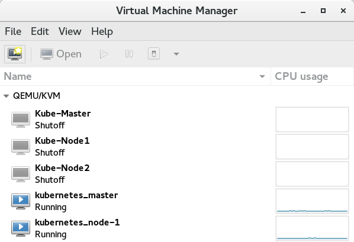
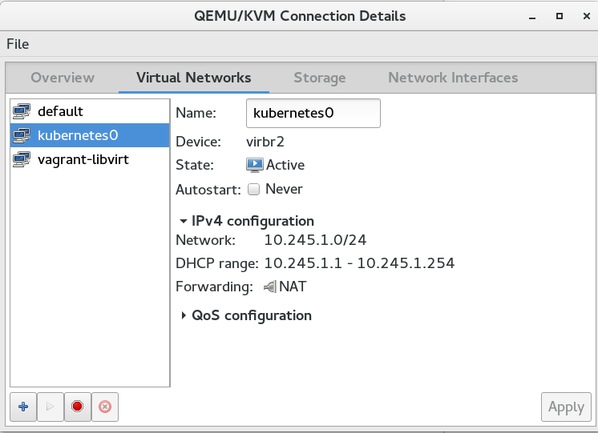
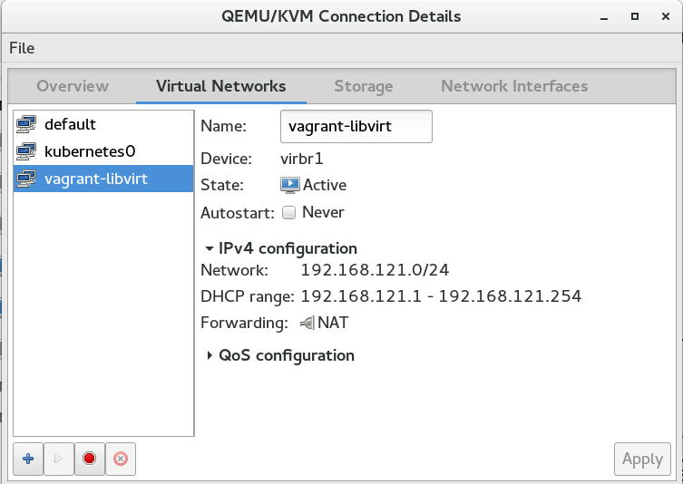

# Using Vagrant + Libvirt to setup a Kubernetes cluster (Part-1)

References:
* [http://kubernetes.io/docs/getting-started-guides/vagrant/#prerequisites](http://kubernetes.io/docs/getting-started-guides/vagrant/#prerequisites)


```
[root@kworkhorse ~]# yum install vagrant  vagrant-libvirt
```

Setup the cluster:

```
export KUBERNETES_PROVIDER=vagrant
curl -sS https://get.k8s.io | bash
```


The following shows even a tiny bit of setup going on on the cluster. This helps learning.
```
[root@kworkhorse ~]# export KUBERNETES_PROVIDER=vagrant
[root@kworkhorse ~]# curl -sS https://get.k8s.io | bash
Downloading kubernetes release v1.2.4 to /root/kubernetes.tar.gz
--2016-06-17 23:25:12--  https://storage.googleapis.com/kubernetes-release/release/v1.2.4/kubernetes.tar.gz
Resolving storage.googleapis.com (storage.googleapis.com)... 64.233.163.128, 2a00:1450:4010:c0b::80
Connecting to storage.googleapis.com (storage.googleapis.com)|64.233.163.128|:443... connected.
HTTP request sent, awaiting response... 200 OK
Length: 496696744 (474M) [application/x-tar]
Saving to: ‘kubernetes.tar.gz’

kubernetes.tar.gz                   100%[===================================================================>] 473.69M  2.85MB/s    in 2m 48s  

2016-06-17 23:28:01 (2.81 MB/s) - ‘kubernetes.tar.gz’ saved [496696744/496696744]

Unpacking kubernetes release v1.2.4
Creating a kubernetes on vagrant...
... Starting cluster using provider: vagrant
... calling verify-prereqs
... calling kube-up
Bringing machine 'master' up with 'libvirt' provider...
Bringing machine 'node-1' up with 'libvirt' provider...
==> master: Box 'kube-fedora23' could not be found. Attempting to find and install...
    master: Box Provider: libvirt
    master: Box Version: >= 0
==> master: Box file was not detected as metadata. Adding it directly...
==> master: Adding box 'kube-fedora23' (v0) for provider: libvirt
    master: Downloading: https://dl.fedoraproject.org/pub/fedora/linux/releases/23/Cloud/x86_64/Images/Fedora-Cloud-Base-Vagrant-23-20151030.x86_64.vagrant-libvirt.box
==> master: Successfully added box 'kube-fedora23' (v0) for 'libvirt'!
==> master: Uploading base box image as volume into libvirt storage...
==> master: Creating image (snapshot of base box volume).
==> master: Creating domain with the following settings...
==> master:  -- Name:              kubernetes_master
==> master:  -- Domain type:       kvm
==> master:  -- Cpus:              2
==> master:  -- Memory:            1280M
==> master:  -- Management MAC:    
==> master:  -- Loader:            
==> master:  -- Base box:          kube-fedora23
==> master:  -- Storage pool:      default
==> master:  -- Image:             /var/lib/libvirt/images/kubernetes_master.img (41G)
==> master:  -- Volume Cache:      none
==> master:  -- Kernel:            
==> master:  -- Initrd:            
==> master:  -- Graphics Type:     vnc
==> master:  -- Graphics Port:     5900
==> master:  -- Graphics IP:       127.0.0.1
==> master:  -- Graphics Password: Not defined
==> master:  -- Video Type:        cirrus
==> master:  -- Video VRAM:        9216
==> master:  -- Keymap:            en-us
==> master:  -- INPUT:             type=mouse, bus=ps2
==> master:  -- Command line : 
==> master: Creating shared folders metadata...
==> master: Starting domain.
==> master: Waiting for domain to get an IP address...
==> master: Waiting for SSH to become available...
    master: 
    master: Vagrant insecure key detected. Vagrant will automatically replace
    master: this with a newly generated keypair for better security.
    master: 
    master: Inserting generated public key within guest...
    master: Removing insecure key from the guest if it's present...
    master: Key inserted! Disconnecting and reconnecting using new SSH key...
==> master: Configuring and enabling network interfaces...
==> master: Rsyncing folder: /root/kubernetes/ => /vagrant
==> master: Running provisioner: shell...
    master: Running: /tmp/vagrant-shell20160617-14771-ivy76r.sh
==> master: Adding kubernetes-node-1 to hosts file
==> master: Prepare package manager
==> master: Last metadata expiration check performed 0:00:12 ago on Fri Jun 17 21:32:06 2016.
==> master: Dependencies resolved.
==> master: ================================================================================
==> master:  Package                      Arch       Version              Repository   Size
==> master: ================================================================================
==> master: Upgrading:
==> master:  dnf                          noarch     1.1.9-2.fc23         updates     276 k
==> master:  dnf-conf                     noarch     1.1.9-2.fc23         updates      96 k
==> master:  dnf-plugins-core             noarch     0.1.21-2.fc23        updates      40 k
==> master:  dnf-yum                      noarch     1.1.9-2.fc23         updates      79 k
==> master:  python3-dnf                  noarch     1.1.9-2.fc23         updates     449 k
==> master:  python3-dnf-plugins-core     noarch     0.1.21-2.fc23        updates      93 k
==> master: 
==> master: Transaction Summary
==> master: ================================================================================
==> master: Upgrade  6 Packages
==> master: Total download size: 1.0 M
==> master: Downloading Packages:
==> master: --------------------------------------------------------------------------------
==> master: Total                                           391 kB/s | 733 kB     00:01     
==> master: Delta RPMs reduced 1.0 MB of updates to 0.7 MB (29.1% saved)
==> master: Running transaction check
==> master: Transaction check succeeded.
==> master: Running transaction test
==> master: Transaction test succeeded.
==> master: Running transaction
==> master:   Upgrading   : dnf-conf-1.1.9-2.fc23.noarch                               1/12
==> master:  
==> master: warning: /etc/dnf/dnf.conf created as /etc/dnf/dnf.conf.rpmnew
==> master:   Upgrading   : python3-dnf-1.1.9-2.fc23.noarch                            2/12
==> master:  
==> master:   Upgrading   : dnf-1.1.9-2.fc23.noarch                                    3/12
==> master:  
==> master:   Upgrading   : python3-dnf-plugins-core-0.1.21-2.fc23.noarch              4/12
==> master:  
==> master:   Upgrading   : dnf-plugins-core-0.1.21-2.fc23.noarch                      5/12
==> master:  
==> master:   Upgrading   : dnf-yum-1.1.9-2.fc23.noarch                                6/12
==> master:  
==> master:   Cleanup     : dnf-plugins-core-0.1.13-1.fc23.noarch                      7/12
==> master:  
==> master:   Cleanup     : python3-dnf-plugins-core-0.1.13-1.fc23.noarch              8/12
==> master:  
==> master: warning: file /usr/share/locale/da/LC_MESSAGES/dnf-plugins-core.mo: remove failed: No such file or directory
==> master: warning: file /usr/share/locale/ca/LC_MESSAGES/dnf-plugins-core.mo: remove failed: No such file or directory
==> master:   Cleanup     : dnf-yum-1.1.3-1.fc23.noarch                                9/12
==> master:  
==> master:   Cleanup     : dnf-1.1.3-1.fc23.noarch                                   10/12
==> master:  
==> master: warning: file /usr/share/locale/zh_TW/LC_MESSAGES/dnf.mo: remove failed: No such file or directory
==> master: warning: file /usr/share/locale/zh_CN/LC_MESSAGES/dnf.mo: remove failed: No such file or directory
==> master: warning: file /usr/share/locale/ur/LC_MESSAGES/dnf.mo: remove failed: No such file or directory
==> master: warning: file /usr/share/locale/uk/LC_MESSAGES/dnf.mo: remove failed: No such file or directory
==> master: warning: file /usr/share/locale/sv/LC_MESSAGES/dnf.mo: remove failed: No such file or directory
==> master: warning: file /usr/share/locale/sr@latin/LC_MESSAGES/dnf.mo: remove failed: No such file or directory
==> master: warning: file /usr/share/locale/sr/LC_MESSAGES/dnf.mo: remove failed: No such file or directory
==> master: warning: file /usr/share/locale/ru/LC_MESSAGES/dnf.mo: remove failed: No such file or directory
==> master: warning: file /usr/share/locale/pt_BR/LC_MESSAGES/dnf.mo: remove failed: No such file or directory
==> master: warning: file /usr/share/locale/pt/LC_MESSAGES/dnf.mo: remove failed: No such file or directory
==> master: warning: file /usr/share/locale/pl/LC_MESSAGES/dnf.mo: remove failed: No such file or directory
==> master: warning: file /usr/share/locale/pa/LC_MESSAGES/dnf.mo: remove failed: No such file or directory
==> master: warning: file /usr/share/locale/nb/LC_MESSAGES/dnf.mo: remove failed: No such file or directory
==> master: warning: file /usr/share/locale/ms/LC_MESSAGES/dnf.mo: remove failed: No such file or directory
==> master: warning: file /usr/share/locale/mr/LC_MESSAGES/dnf.mo: remove failed: No such file or directory
==> master: warning: file /usr/share/locale/lt/LC_MESSAGES/dnf.mo: remove failed: No such file or directory
==> master: warning: file /usr/share/locale/ka/LC_MESSAGES/dnf.mo: remove failed: No such file or directory
==> master: warning: file /usr/share/locale/ja/LC_MESSAGES/dnf.mo: remove failed: No such file or directory
==> master: warning: file /usr/share/locale/it/LC_MESSAGES/dnf.mo: remove failed: No such file or directory
==> master: warning: file /usr/share/locale/id/LC_MESSAGES/dnf.mo: remove failed: No such file or directory
==> master: warning: file /usr/share/locale/hu/LC_MESSAGES/dnf.mo: remove failed: No such file or directory
==> master: warning: file /usr/share/locale/hi/LC_MESSAGES/dnf.mo: remove failed: No such file or directory
==> master: warning: file /usr/share/locale/he/LC_MESSAGES/dnf.mo: remove failed: No such file or directory
==> master: warning: file /usr/share/locale/gu/LC_MESSAGES/dnf.mo: remove failed: No such file or directory
==> master: warning: file /usr/share/locale/fr/LC_MESSAGES/dnf.mo: remove failed: No such file or directory
==> master: warning: file /usr/share/locale/fi/LC_MESSAGES/dnf.mo: remove failed: No such file or directory
==> master: warning: file /usr/share/locale/eu/LC_MESSAGES/dnf.mo: remove failed: No such file or directory
==> master: warning: file /usr/share/locale/es/LC_MESSAGES/dnf.mo: remove failed: No such file or directory
==> master: warning: file /usr/share/locale/el/LC_MESSAGES/dnf.mo: remove failed: No such file or directory
==> master: warning: file /usr/share/locale/de/LC_MESSAGES/dnf.mo: remove failed: No such file or directory
==> master: warning: file /usr/share/locale/da/LC_MESSAGES/dnf.mo: remove failed: No such file or directory
==> master: warning: file /usr/share/locale/cs/LC_MESSAGES/dnf.mo: remove failed: No such file or directory
==> master: warning: file /usr/share/locale/ca/LC_MESSAGES/dnf.mo: remove failed: No such file or directory
==> master: warning: file /usr/share/locale/bn_IN/LC_MESSAGES/dnf.mo: remove failed: No such file or directory
==> master:   Cleanup     : python3-dnf-1.1.3-1.fc23.noarch                           11/12
==> master:  
==> master:   Cleanup     : dnf-conf-1.1.3-1.fc23.noarch                              12/12
==> master:  
==> master:   Verifying   : dnf-1.1.9-2.fc23.noarch                                    1/12
==> master:  
==> master:   Verifying   : python3-dnf-1.1.9-2.fc23.noarch                            2/12
==> master:  
==> master:   Verifying   : dnf-conf-1.1.9-2.fc23.noarch                               3/12
==> master:  
==> master:   Verifying   : dnf-yum-1.1.9-2.fc23.noarch                                4/12
==> master:  
==> master:   Verifying   : dnf-plugins-core-0.1.21-2.fc23.noarch                      5/12
==> master:  
==> master:   Verifying   : python3-dnf-plugins-core-0.1.21-2.fc23.noarch              6/12
==> master:  
==> master:   Verifying   : dnf-1.1.3-1.fc23.noarch                                    7/12
==> master:  
==> master:   Verifying   : dnf-conf-1.1.3-1.fc23.noarch                               8/12
==> master:  
==> master:   Verifying   : dnf-plugins-core-0.1.13-1.fc23.noarch                      9/12
==> master:  
==> master:   Verifying   : dnf-yum-1.1.3-1.fc23.noarch                               10/12
==> master:  
==> master:   Verifying   : python3-dnf-1.1.3-1.fc23.noarch                           11/12
==> master:  
==> master:   Verifying   : python3-dnf-plugins-core-0.1.13-1.fc23.noarch             12/12
==> master:  
==> master: 
==> master: Upgraded:
==> master:   dnf.noarch 1.1.9-2.fc23                                                       
==> master:   dnf-conf.noarch 1.1.9-2.fc23                                                  
==> master:   dnf-plugins-core.noarch 0.1.21-2.fc23                                         
==> master:   dnf-yum.noarch 1.1.9-2.fc23                                                   
==> master:   python3-dnf.noarch 1.1.9-2.fc23                                               
==> master:   python3-dnf-plugins-core.noarch 0.1.21-2.fc23                                 
==> master: Complete!
==> master: Provisioning network on master
==> master: Last metadata expiration check: 0:00:20 ago on Fri Jun 17 21:32:06 2016.
==> master: Dependencies resolved.
==> master: ================================================================================
==> master:  Package        Arch             Version                Repository         Size
==> master: ================================================================================
==> master: Installing:
==> master:  etcd           x86_64           2.2.5-1.fc23           updates           5.9 M
==> master: 
==> master: Transaction Summary
==> master: ================================================================================
==> master: Install  1 Package
==> master: Total download size: 5.9 M
==> master: Installed size: 28 M
==> master: Downloading Packages:
==> master: --------------------------------------------------------------------------------
==> master: Total                                           2.3 MB/s | 5.9 MB     00:02     
==> master: Running transaction check
==> master: Transaction check succeeded.
==> master: Running transaction test
==> master: Transaction test succeeded.
==> master: Running transaction
==> master:   Installing  : etcd-2.2.5-1.fc23.x86_64                                    1/1
==> master:  
==> master:   Verifying   : etcd-2.2.5-1.fc23.x86_64                                    1/1
==> master:  
==> master: 
==> master: Installed:
==> master:   etcd.x86_64 2.2.5-1.fc23                                                      
==> master: Complete!
==> master: Created symlink from /etc/systemd/system/multi-user.target.wants/etcd.service to /usr/lib/systemd/system/etcd.service.
==> master: Last metadata expiration check: 0:00:25 ago on Fri Jun 17 21:32:06 2016.
==> master: Dependencies resolved.
==> master: ================================================================================
==> master:  Package          Arch            Version                Repository        Size
==> master: ================================================================================
==> master: Installing:
==> master:  flannel          x86_64          0.5.5-3.fc23           updates          2.9 M
==> master: 
==> master: Transaction Summary
==> master: ================================================================================
==> master: Install  1 Package
==> master: Total download size: 2.9 M
==> master: Installed size: 15 M
==> master: Downloading Packages:
==> master: --------------------------------------------------------------------------------
==> master: Total                                           1.5 MB/s | 2.9 MB     00:01     
==> master: Running transaction check
==> master: Transaction check succeeded.
==> master: Running transaction test
==> master: Transaction test succeeded.
==> master: Running transaction
==> master:   Installing  : flannel-0.5.5-3.fc23.x86_64                                 1/1
==> master:  
==> master:   Verifying   : flannel-0.5.5-3.fc23.x86_64                                 1/1
==> master:  
==> master: 
==> master: Installed:
==> master:   flannel.x86_64 0.5.5-3.fc23                                                   
==> master: Complete!
==> master: {
==> master:     "Network": "10.246.0.0/16",
==> master:     "SubnetLen": 24,
==> master:     "Backend": {
==> master:         "Type": "udp",
==> master:         "Port": 8285
==> master:      }
==> master: }
==> master: Created symlink from /etc/systemd/system/multi-user.target.wants/flanneld.service to /usr/lib/systemd/system/flanneld.service.
==> master: Created symlink from /etc/systemd/system/docker.service.requires/flanneld.service to /usr/lib/systemd/system/flanneld.service.
==> master: Network configuration verified
==> master: /etc/yum.repos.d /home/vagrant
==> master: Dependencies resolved.
==> master: ================================================================================
==> master:  Package                      Arch   Version                      Repository
==> master:                                                                            Size
==> master: ================================================================================
==> master: Installing:
==> master:  NetworkManager               x86_64 1:1.0.12-2.fc23              updates 1.9 M
==> master:  NetworkManager-libnm         x86_64 1:1.0.12-2.fc23              updates 482 k
==> master:  avahi-autoipd                x86_64 0.6.32-1.fc23                updates  31 k
==> master:  avahi-libs                   x86_64 0.6.32-1.fc23                updates  62 k
==> master:  cockpit                      x86_64 0.108-1.fc23                 group_cockpit-cockpit-preview
==> master:                                                                            43 k
==> master:  cockpit-bridge               x86_64 0.108-1.fc23                 group_cockpit-cockpit-preview
==> master:                                                                           185 k
==> master:  cockpit-docker               x86_64 0.108-1.fc23                 group_cockpit-cockpit-preview
==> master:                                                                            52 k
==> master:  cockpit-kubernetes           x86_64 0.108-1.fc23                 group_cockpit-cockpit-preview
==> master:                                                                           2.9 M
==> master:  cockpit-networkmanager       noarch 0.108-1.fc23                 group_cockpit-cockpit-preview
==> master:                                                                            42 k
==> master:  cockpit-shell                noarch 0.108-1.fc23                 group_cockpit-cockpit-preview
==> master:                                                                           571 k
==> master:  cockpit-storaged             noarch 0.108-1.fc23                 group_cockpit-cockpit-preview
==> master:                                                                            53 k
==> master:  cockpit-ws                   x86_64 0.108-1.fc23                 group_cockpit-cockpit-preview
==> master:                                                                           488 k
==> master:  cryptsetup                   x86_64 1.6.8-2.fc23                 fedora  126 k
==> master:  dbus-glib                    x86_64 0.106-1.fc23                 updates 121 k
==> master:  device-mapper-event          x86_64 1.02.107-1.fc23              fedora  204 k
==> master:  device-mapper-event-libs     x86_64 1.02.107-1.fc23              fedora  207 k
==> master:  device-mapper-multipath      x86_64 0.4.9-80.fc23                fedora  121 k
==> master:  device-mapper-multipath-libs x86_64 0.4.9-80.fc23                fedora  221 k
==> master:  device-mapper-persistent-data
==> master:                               x86_64 0.6.2-0.1.rc6.fc23           updates 427 k
==> master:  dnsmasq                      x86_64 2.75-3.fc23                  updates 294 k
==> master:  docker                       x86_64 1:1.7.0-22.gitdcff4e1.fc23   fedora  5.3 M
==> master:  docker-selinux               x86_64 1:1.7.0-22.gitdcff4e1.fc23   fedora   52 k
==> master:  dosfstools                   x86_64 3.0.28-3.fc23                updates 111 k
==> master:  gdisk                        x86_64 1.0.1-1.fc23                 updates 199 k
==> master:  glib-networking              x86_64 2.46.1-1.fc23                fedora  134 k
==> master:  gsettings-desktop-schemas    x86_64 3.18.1-1.fc23                updates 518 k
==> master:  iscsi-initiator-utils        x86_64 6.2.0.873-29.git4c9d6f9.fc23 updates 424 k
==> master:  iscsi-initiator-utils-iscsiuio
==> master:                               x86_64 6.2.0.873-29.git4c9d6f9.fc23 updates  84 k
==> master:  json-glib                    x86_64 1.0.4-2.fc23                 fedora  131 k
==> master:  kubernetes-client            x86_64 1.2.0-0.18.git4a3f9c5.fc23   updates 9.2 M
==> master:  libaio                       x86_64 0.3.110-5.fc23               fedora   28 k
==> master:  libatasmart                  x86_64 0.19-8.fc23                  fedora   47 k
==> master:  libdaemon                    x86_64 0.14-9.fc23                  fedora   34 k
==> master:  libgudev                     x86_64 230-2.fc23                   fedora   31 k
==> master:  libmodman                    x86_64 2.0.1-11.fc23                fedora   33 k
==> master:  libndp                       x86_64 1.6-1.fc23                   updates  36 k
==> master:  libnl3                       x86_64 3.2.27-1.fc23                updates 265 k
==> master:  libpcap                      x86_64 14:1.7.4-1.fc23              fedora  146 k
==> master:  libproxy                     x86_64 0.4.11-12.fc23               fedora   69 k
==> master:  libsoup                      x86_64 2.52.2-2.fc23                updates 386 k
==> master:  libssh                       x86_64 0.7.3-1.fc23                 updates 199 k
==> master:  libstoraged                  x86_64 2.4.0-3.fc23                 updates 120 k
==> master:  lvm2                         x86_64 2.02.130-1.fc23              fedora  1.0 M
==> master:  lvm2-libs                    x86_64 2.02.130-1.fc23              fedora  922 k
==> master:  make                         x86_64 1:4.0-5.1.fc23               fedora  449 k
==> master:  mdadm                        x86_64 3.3.4-3.fc23                 updates 408 k
==> master:  mozjs17                      x86_64 17.0.0-14.fc23               updates 1.4 M
==> master:  ntfs-3g                      x86_64 2:2016.2.22-1.fc23           updates 291 k
==> master:  ntfsprogs                    x86_64 2:2016.2.22-1.fc23           updates 342 k
==> master:  openssl                      x86_64 1:1.0.2d-2.fc23              fedora  511 k
==> master:  policycoreutils-python-utils x86_64 2.4-14.fc23                  fedora  214 k
==> master:  polkit                       x86_64 0.113-4.fc23                 fedora  127 k
==> master:  polkit-libs                  x86_64 0.113-4.fc23                 fedora   70 k
==> master:  polkit-pkla-compat           x86_64 0.1-6.fc23                   fedora   43 k
==> master:  ppp                          x86_64 2.4.7-8.fc23                 fedora  393 k
==> master:  storaged                     x86_64 2.4.0-3.fc23                 updates 373 k
==> master:  storaged-iscsi               x86_64 2.4.0-3.fc23                 updates  38 k
==> master:  storaged-lvm2                x86_64 2.4.0-3.fc23                 updates  68 k
==> master:  xfsprogs                     x86_64 4.5.0-1.fc23                 updates 922 k
==> master: 
==> master: Transaction Summary
==> master: ================================================================================
==> master: Install  59 Packages
==> master: Total download size: 33 M
==> master: Installed size: 125 M
==> master: Downloading Packages:
==> master: --------------------------------------------------------------------------------
==> master: Total                                           2.1 MB/s |  33 MB     00:15     
==> master: warning: 
==> master: /var/cache/dnf/group_cockpit-cockpit-preview-08d0d99a24621789/packages/cockpit-0.108-1.fc23.x86_64.rpm: Header V3 RSA/SHA1 Signature, key ID fda2d6bf: NOKEY
==> master: Importing GPG key 0xFDA2D6BF:
==> master:  Userid     : "@cockpit_cockpit-preview (None) <@cockpit#cockpit-preview@copr.fedorahosted.org>"
==> master:  Fingerprint: 6788 13DB 9876 529E 16C5 1391 7669 BE85 FDA2 D6BF
==> master:  From       : https://copr-be.cloud.fedoraproject.org/results/@cockpit/cockpit-preview/pubkey.gpg
==> master: Key imported successfully
==> master: Running transaction check
==> master: Transaction check succeeded.
==> master: Running transaction test
==> master: Transaction test succeeded.
==> master: Running transaction
==> master:   Installing  : polkit-libs-0.113-4.fc23.x86_64                            1/59
==> master:  
==> master:   Installing  : libgudev-230-2.fc23.x86_64                                 2/59
==> master:  
==> master:   Installing  : device-mapper-event-libs-1.02.107-1.fc23.x86_64            3/59
==> master:  
==> master:   Installing  : iscsi-initiator-utils-iscsiuio-6.2.0.873-29.git4c9d6f9.    4/59
==> master:  
==> master:   Installing  : iscsi-initiator-utils-6.2.0.873-29.git4c9d6f9.fc23.x86_    5/59
==> master:  
==> master:   Installing  : dbus-glib-0.106-1.fc23.x86_64                              6/59
==> master:  
==> master:   Installing  : xfsprogs-4.5.0-1.fc23.x86_64                               7/59
==> master:  
==> master:   Installing  : libaio-0.3.110-5.fc23.x86_64                               8/59
==> master:  
==> master:   Installing  : json-glib-1.0.4-2.fc23.x86_64                              9/59
==> master:  
==> master:   Installing  : device-mapper-multipath-libs-0.4.9-80.fc23.x86_64         10/59
==> master:  
==> master:   Installing  : device-mapper-multipath-0.4.9-80.fc23.x86_64              11/59
==> master:  
==> master:   Installing  : device-mapper-persistent-data-0.6.2-0.1.rc6.fc23.x86_64   12/59
==> master:  
==> master:   Installing  : NetworkManager-libnm-1:1.0.12-2.fc23.x86_64               13/59
==> master:  
==> master:   Installing  : device-mapper-event-1.02.107-1.fc23.x86_64                14/59
==> master:  
==> master:   Installing  : lvm2-libs-2.02.130-1.fc23.x86_64                          15/59
==> master:  
==> master:   Installing  : lvm2-2.02.130-1.fc23.x86_64                               16/59
==> master:  
==> master:   Installing  : gsettings-desktop-schemas-3.18.1-1.fc23.x86_64            17/59
==> master:  
==> master:   Installing  : libpcap-14:1.7.4-1.fc23.x86_64                            18/59
==> master:  
==> master:   Installing  : ppp-2.4.7-8.fc23.x86_64                                   19/59
==> master:  
==> master:   Installing  : libnl3-3.2.27-1.fc23.x86_64                               20/59
==> master:  
==> master:   Installing  : libndp-1.6-1.fc23.x86_64                                  21/59
==> master:  
==> master:   Installing  : dnsmasq-2.75-3.fc23.x86_64                                22/59
==> master:  
==> master:   Installing  : libdaemon-0.14-9.fc23.x86_64                              23/59
==> master:  
==> master:   Installing  : avahi-libs-0.6.32-1.fc23.x86_64                           24/59
==> master:  
==> master:   Installing  : avahi-autoipd-0.6.32-1.fc23.x86_64                        25/59
==> master:  
==> master:   Installing  : ntfs-3g-2:2016.2.22-1.fc23.x86_64                         26/59
==> master:  
==> master:   Installing  : ntfsprogs-2:2016.2.22-1.fc23.x86_64                       27/59
==> master:  
==> master:   Installing  : mdadm-3.3.4-3.fc23.x86_64                                 28/59
==> master:  
==> master:   Installing  : gdisk-1.0.1-1.fc23.x86_64                                 29/59
==> master:  
==> master:   Installing  : dosfstools-3.0.28-3.fc23.x86_64                           30/59
==> master:  
==> master:   Installing  : kubernetes-client-1.2.0-0.18.git4a3f9c5.fc23.x86_64       31/59
==> master:  
==> master:   Installing  : libatasmart-0.19-8.fc23.x86_64                            32/59
==> master:  
==> master:   Installing  : libstoraged-2.4.0-3.fc23.x86_64                           33/59
==> master:  
==> master:   Installing  : cryptsetup-1.6.8-2.fc23.x86_64                            34/59
==> master:  
==> master:   Installing  : storaged-2.4.0-3.fc23.x86_64                              35/59
==> master:  
==> master:   Installing  : storaged-lvm2-2.4.0-3.fc23.x86_64                         36/59
==> master:  
==> master:   Installing  : storaged-iscsi-2.4.0-3.fc23.x86_64                        37/59
==> master:  
==> master:   Installing  : libmodman-2.0.1-11.fc23.x86_64                            38/59
==> master:  
==> master:   Installing  : libproxy-0.4.11-12.fc23.x86_64                            39/59
==> master:  
==> master:   Installing  : glib-networking-2.46.1-1.fc23.x86_64                      40/59
==> master:  
==> master:   Installing  : libsoup-2.52.2-2.fc23.x86_64                              41/59
==> master:  
==> master:   Installing  : NetworkManager-1:1.0.12-2.fc23.x86_64                     42/59
==> master:  
==> master:   Installing  : libssh-0.7.3-1.fc23.x86_64                                43/59
==> master:  
==> master:   Installing  : mozjs17-17.0.0-14.fc23.x86_64                             44/59
==> master:  
==> master:   Installing  : polkit-0.113-4.fc23.x86_64                                45/59
==> master:  
==> master:   Installing  : polkit-pkla-compat-0.1-6.fc23.x86_64                      46/59
==> master:  
==> master:   Installing  : cockpit-bridge-0.108-1.fc23.x86_64                        47/59
==> master:  
==> master:   Installing  : cockpit-shell-0.108-1.fc23.noarch                         48/59
==> master:  
==> master:   Installing  : cockpit-networkmanager-0.108-1.fc23.noarch                49/59
==> master:  
==> master:   Installing  : cockpit-storaged-0.108-1.fc23.noarch                      50/59
==> master:  
==> master:   Installing  : policycoreutils-python-utils-2.4-14.fc23.x86_64           51/59
==> master:  
==> master:   Installing  : docker-selinux-1:1.7.0-22.gitdcff4e1.fc23.x86_64          52/59
==> master:  
==> master:   Installing  : docker-1:1.7.0-22.gitdcff4e1.fc23.x86_64                  53/59
==> master:  
==> master:   Installing  : cockpit-docker-0.108-1.fc23.x86_64                        54/59
==> master:  
==> master:   Installing  : make-1:4.0-5.1.fc23.x86_64                                55/59
==> master:  
==> master:   Installing  : openssl-1:1.0.2d-2.fc23.x86_64                            56/59
==> master:  
==> master:   Installing  : cockpit-ws-0.108-1.fc23.x86_64                            57/59
==> master:  
==> master:   Installing  : cockpit-0.108-1.fc23.x86_64                               58/59
==> master:  
==> master:   Installing  : cockpit-kubernetes-0.108-1.fc23.x86_64                    59/59
==> master:  
==> master:   Verifying   : cockpit-0.108-1.fc23.x86_64                                1/59
==> master:  
==> master:   Verifying   : cockpit-bridge-0.108-1.fc23.x86_64                         2/59
==> master:  
==> master:   Verifying   : cockpit-docker-0.108-1.fc23.x86_64                         3/59
==> master:  
==> master:   Verifying   : cockpit-networkmanager-0.108-1.fc23.noarch                 4/59
==> master:  
==> master:   Verifying   : cockpit-shell-0.108-1.fc23.noarch                          5/59
==> master:  
==> master:   Verifying   : cockpit-storaged-0.108-1.fc23.noarch                       6/59
==> master:  
==> master:   Verifying   : cockpit-ws-0.108-1.fc23.x86_64                             7/59
==> master:  
==> master:   Verifying   : json-glib-1.0.4-2.fc23.x86_64                              8/59
==> master:  
==> master:   Verifying   : polkit-0.113-4.fc23.x86_64                                 9/59
==> master:  
==> master:   Verifying   : polkit-libs-0.113-4.fc23.x86_64                           10/59
==> master:  
==> master:   Verifying   : device-mapper-multipath-0.4.9-80.fc23.x86_64              11/59
==> master:  
==> master:   Verifying   : polkit-pkla-compat-0.1-6.fc23.x86_64                      12/59
==> master:  
==> master:   Verifying   : device-mapper-multipath-libs-0.4.9-80.fc23.x86_64         13/59
==> master:  
==> master:   Verifying   : libaio-0.3.110-5.fc23.x86_64                              14/59
==> master:  
==> master:   Verifying   : cockpit-kubernetes-0.108-1.fc23.x86_64                    15/59
==> master:  
==> master:   Verifying   : openssl-1:1.0.2d-2.fc23.x86_64                            16/59
==> master:  
==> master:   Verifying   : make-1:4.0-5.1.fc23.x86_64                                17/59
==> master:  
==> master:   Verifying   : docker-1:1.7.0-22.gitdcff4e1.fc23.x86_64                  18/59
==> master:  
==> master:   Verifying   : docker-selinux-1:1.7.0-22.gitdcff4e1.fc23.x86_64          19/59
==> master:  
==> master:   Verifying   : lvm2-2.02.130-1.fc23.x86_64                               20/59
==> master:  
==> master:   Verifying   : policycoreutils-python-utils-2.4-14.fc23.x86_64           21/59
==> master:  
==> master:   Verifying   : lvm2-libs-2.02.130-1.fc23.x86_64                          22/59
==> master:  
==> master:   Verifying   : device-mapper-event-1.02.107-1.fc23.x86_64                23/59
==> master:  
==> master:   Verifying   : device-mapper-event-libs-1.02.107-1.fc23.x86_64           24/59
==> master:  
==> master:   Verifying   : mozjs17-17.0.0-14.fc23.x86_64                             25/59
==> master:  
==> master:   Verifying   : device-mapper-persistent-data-0.6.2-0.1.rc6.fc23.x86_64   26/59
==> master:  
==> master:   Verifying   : xfsprogs-4.5.0-1.fc23.x86_64                              27/59
==> master:  
==> master:   Verifying   : libssh-0.7.3-1.fc23.x86_64                                28/59
==> master:  
==> master:   Verifying   : glib-networking-2.46.1-1.fc23.x86_64                      29/59
==> master:  
==> master:   Verifying   : libproxy-0.4.11-12.fc23.x86_64                            30/59
==> master:  
==> master:   Verifying   : libmodman-2.0.1-11.fc23.x86_64                            31/59
==> master:  
==> master:   Verifying   : storaged-2.4.0-3.fc23.x86_64                              32/59
==> master:  
==> master:   Verifying   : cryptsetup-1.6.8-2.fc23.x86_64                            33/59
==> master:  
==> master:   Verifying   : libstoraged-2.4.0-3.fc23.x86_64                           34/59
==> master:  
==> master:   Verifying   : libatasmart-0.19-8.fc23.x86_64                            35/59
==> master:  
==> master:   Verifying   : libgudev-230-2.fc23.x86_64                                36/59
==> master:  
==> master:   Verifying   : storaged-lvm2-2.4.0-3.fc23.x86_64                         37/59
==> master:  
==> master:   Verifying   : storaged-iscsi-2.4.0-3.fc23.x86_64                        38/59
==> master:  
==> master:   Verifying   : NetworkManager-1:1.0.12-2.fc23.x86_64                     39/59
==> master:  
==> master:   Verifying   : NetworkManager-libnm-1:1.0.12-2.fc23.x86_64               40/59
==> master:  
==> master:   Verifying   : kubernetes-client-1.2.0-0.18.git4a3f9c5.fc23.x86_64       41/59
==> master:  
==> master:   Verifying   : iscsi-initiator-utils-6.2.0.873-29.git4c9d6f9.fc23.x86_   42/59
==> master:  
==> master:   Verifying   : iscsi-initiator-utils-iscsiuio-6.2.0.873-29.git4c9d6f9.   43/59
==> master:  
==> master:   Verifying   : dosfstools-3.0.28-3.fc23.x86_64                           44/59
==> master:  
==> master:   Verifying   : gdisk-1.0.1-1.fc23.x86_64                                 45/59
==> master:  
==> master:   Verifying   : mdadm-3.3.4-3.fc23.x86_64                                 46/59
==> master:  
==> master:   Verifying   : ntfsprogs-2:2016.2.22-1.fc23.x86_64                       47/59
==> master:  
==> master:   Verifying   : ntfs-3g-2:2016.2.22-1.fc23.x86_64                         48/59
==> master:  
==> master:   Verifying   : dbus-glib-0.106-1.fc23.x86_64                             49/59
==> master:  
==> master:   Verifying   : avahi-autoipd-0.6.32-1.fc23.x86_64                        50/59
==> master:  
==> master:   Verifying   : avahi-libs-0.6.32-1.fc23.x86_64                           51/59
==> master:  
==> master:   Verifying   : libdaemon-0.14-9.fc23.x86_64                              52/59
==> master:  
==> master:   Verifying   : dnsmasq-2.75-3.fc23.x86_64                                53/59
==> master:  
==> master:   Verifying   : libndp-1.6-1.fc23.x86_64                                  54/59
==> master:  
==> master:   Verifying   : libnl3-3.2.27-1.fc23.x86_64                               55/59
==> master:  
==> master:   Verifying   : libsoup-2.52.2-2.fc23.x86_64                              56/59
==> master:  
==> master:   Verifying   : ppp-2.4.7-8.fc23.x86_64                                   57/59
==> master:  
==> master:   Verifying   : libpcap-14:1.7.4-1.fc23.x86_64                            58/59
==> master:  
==> master:   Verifying   : gsettings-desktop-schemas-3.18.1-1.fc23.x86_64            59/59
==> master:  
==> master: 
==> master: Installed:
==> master:   NetworkManager.x86_64 1:1.0.12-2.fc23                                         
==> master:   NetworkManager-libnm.x86_64 1:1.0.12-2.fc23                                   
==> master:   avahi-autoipd.x86_64 0.6.32-1.fc23                                            
==> master:   avahi-libs.x86_64 0.6.32-1.fc23                                               
==> master:   cockpit.x86_64 0.108-1.fc23                                                   
==> master:   cockpit-bridge.x86_64 0.108-1.fc23                                            
==> master:   cockpit-docker.x86_64 0.108-1.fc23                                            
==> master:   cockpit-kubernetes.x86_64 0.108-1.fc23                                        
==> master:   cockpit-networkmanager.noarch 0.108-1.fc23                                    
==> master:   cockpit-shell.noarch 0.108-1.fc23                                             
==> master:   cockpit-storaged.noarch 0.108-1.fc23                                          
==> master:   cockpit-ws.x86_64 0.108-1.fc23                                                
==> master:   cryptsetup.x86_64 1.6.8-2.fc23                                                
==> master:   dbus-glib.x86_64 0.106-1.fc23                                                 
==> master:   device-mapper-event.x86_64 1.02.107-1.fc23                                    
==> master:   device-mapper-event-libs.x86_64 1.02.107-1.fc23                               
==> master:   device-mapper-multipath.x86_64 0.4.9-80.fc23                                  
==> master:   device-mapper-multipath-libs.x86_64 0.4.9-80.fc23                             
==> master:   device-mapper-persistent-data.x86_64 0.6.2-0.1.rc6.fc23                       
==> master:   dnsmasq.x86_64 2.75-3.fc23                                                    
==> master:   docker.x86_64 1:1.7.0-22.gitdcff4e1.fc23                                      
==> master:   docker-selinux.x86_64 1:1.7.0-22.gitdcff4e1.fc23                              
==> master:   dosfstools.x86_64 3.0.28-3.fc23                                               
==> master:   gdisk.x86_64 1.0.1-1.fc23                                                     
==> master:   glib-networking.x86_64 2.46.1-1.fc23                                          
==> master:   gsettings-desktop-schemas.x86_64 3.18.1-1.fc23                                
==> master:   iscsi-initiator-utils.x86_64 6.2.0.873-29.git4c9d6f9.fc23                     
==> master:   iscsi-initiator-utils-iscsiuio.x86_64 6.2.0.873-29.git4c9d6f9.fc23            
==> master:   json-glib.x86_64 1.0.4-2.fc23                                                 
==> master:   kubernetes-client.x86_64 1.2.0-0.18.git4a3f9c5.fc23                           
==> master:   libaio.x86_64 0.3.110-5.fc23                                                  
==> master:   libatasmart.x86_64 0.19-8.fc23                                                
==> master:   libdaemon.x86_64 0.14-9.fc23                                                  
==> master:   libgudev.x86_64 230-2.fc23                                                    
==> master:   libmodman.x86_64 2.0.1-11.fc23                                                
==> master:   libndp.x86_64 1.6-1.fc23                                                      
==> master:   libnl3.x86_64 3.2.27-1.fc23                                                   
==> master:   libpcap.x86_64 14:1.7.4-1.fc23                                                
==> master:   libproxy.x86_64 0.4.11-12.fc23                                                
==> master:   libsoup.x86_64 2.52.2-2.fc23                                                  
==> master:   libssh.x86_64 0.7.3-1.fc23                                                    
==> master:   libstoraged.x86_64 2.4.0-3.fc23                                               
==> master:   lvm2.x86_64 2.02.130-1.fc23                                                   
==> master:   lvm2-libs.x86_64 2.02.130-1.fc23                                              
==> master:   make.x86_64 1:4.0-5.1.fc23                                                    
==> master:   mdadm.x86_64 3.3.4-3.fc23                                                     
==> master:   mozjs17.x86_64 17.0.0-14.fc23                                                 
==> master:   ntfs-3g.x86_64 2:2016.2.22-1.fc23                                             
==> master:   ntfsprogs.x86_64 2:2016.2.22-1.fc23                                           
==> master:   openssl.x86_64 1:1.0.2d-2.fc23                                                
==> master:   policycoreutils-python-utils.x86_64 2.4-14.fc23                               
==> master:   polkit.x86_64 0.113-4.fc23                                                    
==> master:   polkit-libs.x86_64 0.113-4.fc23                                               
==> master:   polkit-pkla-compat.x86_64 0.1-6.fc23                                          
==> master:   ppp.x86_64 2.4.7-8.fc23                                                       
==> master:   storaged.x86_64 2.4.0-3.fc23                                                  
==> master:   storaged-iscsi.x86_64 2.4.0-3.fc23                                            
==> master:   storaged-lvm2.x86_64 2.4.0-3.fc23                                             
==> master:   xfsprogs.x86_64 4.5.0-1.fc23                                                  
==> master: Complete!
==> master: /home/vagrant
==> master: Created symlink from /etc/systemd/system/sockets.target.wants/cockpit.socket to /usr/lib/systemd/system/cockpit.socket.
==> master: Running release install script
==> master: /kube-install /home/vagrant
==> master: +++ Installing salt files into new trees
==> master: ‘./kubernetes/saltbase/salt’ -> ‘/srv/salt-new/salt’
==> master: ‘./kubernetes/saltbase/salt/kube-client-tools.sls’ -> ‘/srv/salt-new/salt/kube-client-tools.sls’
==> master: ‘./kubernetes/saltbase/salt/helpers’ -> ‘/srv/salt-new/salt/helpers’
==> master: ‘./kubernetes/saltbase/salt/helpers/safe_format_and_mount’ -> ‘/srv/salt-new/salt/helpers/safe_format_and_mount’
==> master: ‘./kubernetes/saltbase/salt/helpers/init.sls’ -> ‘/srv/salt-new/salt/helpers/init.sls’
==> master: ‘./kubernetes/saltbase/salt/flannel’ -> ‘/srv/salt-new/salt/flannel’
==> master: ‘./kubernetes/saltbase/salt/flannel/initd’ -> ‘/srv/salt-new/salt/flannel/initd’
==> master: ‘./kubernetes/saltbase/salt/flannel/default’ -> ‘/srv/salt-new/salt/flannel/default’
==> master: ‘./kubernetes/saltbase/salt/flannel/init.sls’ -> ‘/srv/salt-new/salt/flannel/init.sls’
==> master: ‘./kubernetes/saltbase/salt/cni’ -> ‘/srv/salt-new/salt/cni’
==> master: ‘./kubernetes/saltbase/salt/cni/init.sls’ -> ‘/srv/salt-new/salt/cni/init.sls’
==> master: ‘./kubernetes/saltbase/salt/README.md’ -> ‘/srv/salt-new/salt/README.md’
==> master: ‘./kubernetes/saltbase/salt/cadvisor’ -> ‘/srv/salt-new/salt/cadvisor’
==> master: ‘./kubernetes/saltbase/salt/cadvisor/init.sls’ -> ‘/srv/salt-new/salt/cadvisor/init.sls’
==> master: ‘./kubernetes/saltbase/salt/kube-proxy’ -> ‘/srv/salt-new/salt/kube-proxy’
==> master: ‘./kubernetes/saltbase/salt/kube-proxy/kubeconfig’ -> ‘/srv/salt-new/salt/kube-proxy/kubeconfig’
==> master: ‘./kubernetes/saltbase/salt/kube-proxy/init.sls’ -> ‘/srv/salt-new/salt/kube-proxy/init.sls’
==> master: ‘./kubernetes/saltbase/salt/kube-proxy/kube-proxy.manifest’ -> ‘/srv/salt-new/salt/kube-proxy/kube-proxy.manifest’
==> master: ‘./kubernetes/saltbase/salt/nginx’ -> ‘/srv/salt-new/salt/nginx’
==> master: ‘./kubernetes/saltbase/salt/nginx/kubernetes-site’ -> ‘/srv/salt-new/salt/nginx/kubernetes-site’
==> master: ‘./kubernetes/saltbase/salt/nginx/nginx.conf’ -> ‘/srv/salt-new/salt/nginx/nginx.conf’
==> master: ‘./kubernetes/saltbase/salt/nginx/init.sls’ -> ‘/srv/salt-new/salt/nginx/init.sls’
==> master: ‘./kubernetes/saltbase/salt/nginx/nginx.json’ -> ‘/srv/salt-new/salt/nginx/nginx.json’
==> master: ‘./kubernetes/saltbase/salt/kube-admission-controls’ -> ‘/srv/salt-new/salt/kube-admission-controls’
==> master: ‘./kubernetes/saltbase/salt/kube-admission-controls/limit-range’ -> ‘/srv/salt-new/salt/kube-admission-controls/limit-range’
==> master: ‘./kubernetes/saltbase/salt/kube-admission-controls/limit-range/limit-range.yaml’ -> ‘/srv/salt-new/salt/kube-admission-controls/limit-range/limit-range.yaml’
==> master: ‘./kubernetes/saltbase/salt/kube-admission-controls/init.sls’ -> ‘/srv/salt-new/salt/kube-admission-controls/init.sls’
==> master: ‘./kubernetes/saltbase/salt/flannel-server’ -> ‘/srv/salt-new/salt/flannel-server’
==> master: ‘./kubernetes/saltbase/salt/flannel-server/flannel-server.manifest’ -> ‘/srv/salt-new/salt/flannel-server/flannel-server.manifest’
==> master: ‘./kubernetes/saltbase/salt/flannel-server/init.sls’ -> ‘/srv/salt-new/salt/flannel-server/init.sls’
==> master: ‘./kubernetes/saltbase/salt/flannel-server/network.json’ -> ‘/srv/salt-new/salt/flannel-server/network.json’
==> master: ‘./kubernetes/saltbase/salt/kube-master-addons’ -> ‘/srv/salt-new/salt/kube-master-addons’
==> master: ‘./kubernetes/saltbase/salt/kube-master-addons/initd’ -> ‘/srv/salt-new/salt/kube-master-addons/initd’
==> master: ‘./kubernetes/saltbase/salt/kube-master-addons/init.sls’ -> ‘/srv/salt-new/salt/kube-master-addons/init.sls’
==> master: ‘./kubernetes/saltbase/salt/kube-master-addons/kube-master-addons.sh’ -> ‘/srv/salt-new/salt/kube-master-addons/kube-master-addons.sh’
==> master: ‘./kubernetes/saltbase/salt/kube-master-addons/kube-master-addons.service’ -> ‘/srv/salt-new/salt/kube-master-addons/kube-master-addons.service’
==> master: ‘./kubernetes/saltbase/salt/kube-node-unpacker’ -> ‘/srv/salt-new/salt/kube-node-unpacker’
==> master: ‘./kubernetes/saltbase/salt/kube-node-unpacker/kube-node-unpacker.service’ -> ‘/srv/salt-new/salt/kube-node-unpacker/kube-node-unpacker.service’
==> master: ‘./kubernetes/saltbase/salt/kube-node-unpacker/kube-node-unpacker.sh’ -> ‘/srv/salt-new/salt/kube-node-unpacker/kube-node-unpa
==> master: cker.sh’
==> master: ‘./kubernetes/saltbase/salt/kube-node-unpacker/initd’ -> ‘/srv/salt-new/salt/kube-node-unpacker/initd’
==> master: ‘./kubernetes/saltbase/salt/kube-node-unpacker/init.sls’ -> ‘/srv/salt-new/salt/kube-node-unpacker/init.sls’
==> master: ‘./kubernetes/saltbase/salt/kubelet’ -> ‘/srv/salt-new/salt/kubelet’
==> master: ‘./kubernetes/saltbase/salt/kubelet/initd’ -> ‘/srv/salt-new/salt/kubelet/initd’
==> master: ‘./kubernetes/saltbase/salt/kubelet/default’ -> ‘/srv/salt-new/salt/kubelet/default’
==> master: ‘./kubernetes/saltbase/salt/kubelet/kubelet.service’ -> ‘/srv/salt-new/salt/kubelet/kubelet.service’
==> master: ‘./kubernetes/saltbase/salt/kubelet/kubeconfig’ -> ‘/srv/salt-new/salt/kubelet/kubeconfig’
==> master: ‘./kubernetes/saltbase/salt/kubelet/init.sls’ -> ‘/srv/salt-new/salt/kubelet/init.sls’
==> master: ‘./kubernetes/saltbase/salt/kube-addons’ -> ‘/srv/salt-new/salt/kube-addons’
==> master: ‘./kubernetes/saltbase/salt/kube-addons/cluster-monitoring’ -> ‘/srv/salt-new/salt/kube-addons/cluster-monitoring’
==> master: ‘./kubernetes/saltbase/salt/kube-addons/cluster-monitoring/standalone’ -> ‘/srv/salt-new/salt/kube-addons/cluster-monitoring/standalone’
==> master: ‘./kubernetes/saltbase/salt/kube-addons/cluster-monitoring/standalone/heapster-controller.yaml’ -> ‘/srv/salt-new/salt/kube-addons/cluster-monitoring/standalone/heapster-controller.yaml’
==> master: ‘./kubernetes/saltbase/salt/kube-addons/cluster-monitoring/standalone/heapster-service.yaml’ -> ‘/srv/salt-new/salt/kube-addons/cluster-monitoring/standalone/heapster-service.yaml’
==> master: ‘./kubernetes/saltbase/salt/kube-addons/cluster-monitoring/google’ -> ‘/srv/salt-new/salt/kube-addons/cluster-monitoring/google’
==> master: ‘./kubernetes/saltbase/salt/kube-addons/cluster-monitoring/google/heapster-controller.yaml’ -> ‘/srv/salt-new/salt/kube-addons/cluster-monitoring/google/heapster-controller.yaml’
==> master: ‘./kubernetes/saltbase/salt/kube-addons/cluster-monitoring/google/heapster-service.yaml’ -> ‘/srv/salt-new/salt/kube-addons/cluster-monitoring/google/heapster-service.yaml’
==> master: ‘./kubernetes/saltbase/salt/kube-addons/cluster-monitoring/influxdb’ -> ‘/srv/salt-new/salt/kube-addons/cluster-monitoring/influxdb’
==> master: ‘./kubernetes/saltbase/salt/kube-addons/cluster-monitoring/influxdb/heapster-controller.yaml’ -> ‘/srv/salt-new/salt/kube-addons/cluster-monitoring/influxdb/heapster-controller.yaml’
==> master: ‘./kubernetes/saltbase/salt/kube-addons/cluster-monitoring/influxdb/influxdb-service.yaml’ -> ‘/srv/salt-new/salt/kube-addons/cluster-monitoring/influxdb/influxdb-service.yaml’
==> master: ‘./kubernetes/saltbase/salt/kube-addons/cluster-monitoring/influxdb/grafana-service.yaml’ -> ‘/srv/salt-new/salt/kube-addons/cluster-monitoring/influxdb/grafana-service.yaml’
==> master: ‘./kubernetes/saltbase/salt/kube-addons/cluster-monitoring/influxdb/influxdb-grafana-controller.yaml’ -> ‘/srv/salt-new/salt/kube-addons/cluster-monitoring/influxdb/influxdb-grafana-controller.yaml’
==> master: ‘./kubernetes/saltbase/salt/kube-addons/cluster-monitoring/influxdb/heapster-service.yaml’ -> ‘/srv/salt-new/salt/kube-addons/cluster-monitoring/influxdb/heapster-service.yaml’
==> master: ‘./kubernetes/saltbase/salt/kube-addons/cluster-monitoring/googleinfluxdb’ -> ‘/srv/salt-new/salt/kube-addons/cluster-monitoring/googleinfluxdb’
==> master: ‘./kubernetes/saltbase/salt/kube-addons/cluster-monitoring/googleinfluxdb/heapster-controller-combined.yaml’ -> ‘/srv/salt-new/salt/kube-addons/cluster-monitoring/googleinfluxdb/heapster-controller-combined.yaml’
==> master: ‘./kubernetes/saltbase/salt/kube-addons/registry’ -> ‘/srv/salt-new/salt/kube-addons/registry’
==> master: ‘./kubernetes/saltbase/salt/kube-addons/registry/auth’ -> ‘/srv/salt-new/salt/kube-addons/registry/auth’
==> master: ‘./kubernetes/saltbase/salt/kube-addons/registry/auth/registry-auth-rc.yaml’ -> ‘/srv/salt-new/salt/kube-addons/registry/auth/registry-auth-rc.yaml’
==> master: ‘./kubernetes/saltbase/salt/kube-addons/registry/tls’ -> ‘/srv/salt-new/salt/kube-addons/registry/tls’
==> master: ‘./kubernetes/saltbase/salt/kube-addons/registry/tls/registry-tls-rc.yaml’ -> ‘/srv/salt-new/salt
==> master: /kube-addons/registry/tls/registry-tls-rc.yaml’
==> master: ‘./kubernetes/saltbase/salt/kube-addons/registry/tls/registry-tls-svc.yaml’ -> ‘/srv/salt-new/salt/kube-addons/registry/tls/registry-tls-svc.yaml’
==> master: ‘./kubernetes/saltbase/salt/kube-addons/registry/registry-svc.yaml’ -> ‘/srv/salt-new/salt/kube-addons/registry/registry-svc.yaml’
==> master: ‘./kubernetes/saltbase/salt/kube-addons/registry/gcs’ -> ‘/srv/salt-new/salt/kube-addons/registry/gcs’
==> master: ‘./kubernetes/saltbase/salt/kube-addons/registry/gcs/registry-gcs-rc.yaml’ -> ‘/srv/salt-new/salt/kube-addons/registry/gcs/registry-gcs-rc.yaml’
==> master: ‘./kubernetes/saltbase/salt/kube-addons/registry/registry-pv.yaml.in’ -> ‘/srv/salt-new/salt/kube-addons/registry/registry-pv.yaml.in’
==> master: ‘./kubernetes/saltbase/salt/kube-addons/registry/registry-rc.yaml’ -> ‘/srv/salt-new/salt/kube-addons/registry/registry-rc.yaml’
==> master: ‘./kubernetes/saltbase/salt/kube-addons/registry/registry-pvc.yaml.in’ -> ‘/srv/salt-new/salt/kube-addons/registry/registry-pvc.yaml.in’
==> master: ‘./kubernetes/saltbase/salt/kube-addons/kube-addons.service’ -> ‘/srv/salt-new/salt/kube-addons/kube-addons.service’
==> master: ‘./kubernetes/saltbase/salt/kube-addons/kube-addon-update.sh’ -> ‘/srv/salt-new/salt/kube-addons/kube-addon-update.sh’
==> master: ‘./kubernetes/saltbase/salt/kube-addons/dashboard’ -> ‘/srv/salt-new/salt/kube-addons/dashboard’
==> master: ‘./kubernetes/saltbase/salt/kube-addons/dashboard/dashboard-service.yaml’ -> ‘/srv/salt-new/salt/kube-addons/dashboard/dashboard-service.yaml’
==> master: ‘./kubernetes/saltbase/salt/kube-addons/dashboard/dashboard-controller.yaml’ -> ‘/srv/salt-new/salt/kube-addons/dashboard/dashboard-controller.yaml’
==> master: ‘./kubernetes/saltbase/salt/kube-addons/cluster-loadbalancing’ -> ‘/srv/salt-new/salt/kube-addons/cluster-loadbalancing’
==> master: ‘./kubernetes/saltbase/salt/kube-addons/cluster-loadbalancing/glbc’ -> ‘/srv/salt-new/salt/kube-addons/cluster-loadbalancing/glbc’
==> master: ‘./kubernetes/saltbase/salt/kube-addons/cluster-loadbalancing/glbc/default-svc.yaml’ -> ‘/srv/salt-new/salt/kube-addons/cluster-loadbalancing/glbc/default-svc.yaml’
==> master: ‘./kubernetes/saltbase/salt/kube-addons/cluster-loadbalancing/glbc/glbc-controller.yaml’ -> ‘/srv/salt-new/salt/kube-addons/cluster-loadbalancing/glbc/glbc-controller.yaml’
==> master: ‘./kubernetes/saltbase/salt/kube-addons/initd’ -> ‘/srv/salt-new/salt/kube-addons/initd’
==> master: ‘./kubernetes/saltbase/salt/kube-addons/kube-addons.sh’ -> ‘/srv/salt-new/salt/kube-addons/kube-addons.sh’
==> master: ‘./kubernetes/saltbase/salt/kube-addons/init.sls’ -> ‘/srv/salt-new/salt/kube-addons/init.sls’
==> master: ‘./kubernetes/saltbase/salt/kube-addons/namespace.yaml’ -> ‘/srv/salt-new/salt/kube-addons/namespace.yaml’
==> master: ‘./kubernetes/saltbase/salt/kube-addons/fluentd-elasticsearch’ -> ‘/srv/salt-new/salt/kube-addons/fluentd-elasticsearch’
==> master: ‘./kubernetes/saltbase/salt/kube-addons/fluentd-elasticsearch/kibana-controller.yaml’ -> ‘/srv/salt-new/salt/kube-addons/fluentd-elasticsearch/kibana-controller.yaml’
==> master: ‘./kubernetes/saltbase/salt/kube-addons/fluentd-elasticsearch/kibana-service.yaml’ -> ‘/srv/salt-new/salt/kube-addons/fluentd-elasticsearch/kibana-service.yaml’
==> master: ‘./kubernetes/saltbase/salt/kube-addons/fluentd-elasticsearch/es-controller.yaml’ -> ‘/srv/salt-new/salt/kube-addons/fluentd-elasticsearch/es-controller.yaml’
==> master: ‘./kubernetes/saltbase/salt/kube-addons/fluentd-elasticsearch/es-service.yaml’ -> ‘/srv/salt-new/salt/kube-addons/fluentd-elasticsearch/es-service.yaml’
==> master: ‘./kubernetes/saltbase/salt/kube-addons/dns’ -> ‘/srv/salt-new/salt/kube-addons/dns’
==> master: ‘./kubernetes/saltbase/salt/kube-addons/dns/skydns-rc.yaml.in’ -> ‘/srv/salt-new/salt/kube-addons/dns/skydns-rc.yaml.in’
==> master: ‘./kubernetes/saltbase/salt/kube-addons/dns/skydns-svc.yaml.in’ -> ‘/srv/salt-new/salt/kube-addons/dns/skydns-svc.yaml.in’
==> master: ‘./kubernetes/saltbase/salt/logrotate’ -> ‘/srv/salt-new/salt/logrotate’
==> master: ‘./kubernetes/saltbase/salt/logrotate/cron’ -> ‘/srv/salt-new/salt/logrotate/cron’
==> master: ‘./kubernetes/salt
==> master: base/salt/logrotate/conf’ -> ‘/srv/salt-new/salt/logrotate/conf’
==> master: ‘./kubernetes/saltbase/salt/logrotate/docker-containers’ -> ‘/srv/salt-new/salt/logrotate/docker-containers’
==> master: ‘./kubernetes/saltbase/salt/logrotate/init.sls’ -> ‘/srv/salt-new/salt/logrotate/init.sls’
==> master: ‘./kubernetes/saltbase/salt/ntp’ -> ‘/srv/salt-new/salt/ntp’
==> master: ‘./kubernetes/saltbase/salt/ntp/init.sls’ -> ‘/srv/salt-new/salt/ntp/init.sls’
==> master: ‘./kubernetes/saltbase/salt/static-routes’ -> ‘/srv/salt-new/salt/static-routes’
==> master: ‘./kubernetes/saltbase/salt/static-routes/if-down’ -> ‘/srv/salt-new/salt/static-routes/if-down’
==> master: ‘./kubernetes/saltbase/salt/static-routes/if-up’ -> ‘/srv/salt-new/salt/static-routes/if-up’
==> master: ‘./kubernetes/saltbase/salt/static-routes/init.sls’ -> ‘/srv/salt-new/salt/static-routes/init.sls’
==> master: ‘./kubernetes/saltbase/salt/static-routes/refresh’ -> ‘/srv/salt-new/salt/static-routes/refresh’
==> master: ‘./kubernetes/saltbase/salt/top.sls’ -> ‘/srv/salt-new/salt/top.sls’
==> master: ‘./kubernetes/saltbase/salt/generate-cert’ -> ‘/srv/salt-new/salt/generate-cert’
==> master: ‘./kubernetes/saltbase/salt/generate-cert/init.sls’ -> ‘/srv/salt-new/salt/generate-cert/init.sls’
==> master: ‘./kubernetes/saltbase/salt/generate-cert/make-cert.sh’ -> ‘/srv/salt-new/salt/generate-cert/make-cert.sh’
==> master: ‘./kubernetes/saltbase/salt/generate-cert/make-ca-cert.sh’ -> ‘/srv/salt-new/salt/generate-cert/make-ca-cert.sh’
==> master: ‘./kubernetes/saltbase/salt/docker’ -> ‘/srv/salt-new/salt/docker’
==> master: ‘./kubernetes/saltbase/salt/docker/docker-prestart’ -> ‘/srv/salt-new/salt/docker/docker-prestart’
==> master: ‘./kubernetes/saltbase/salt/docker/default’ -> ‘/srv/salt-new/salt/docker/default’
==> master: ‘./kubernetes/saltbase/salt/docker/docker-defaults’ -> ‘/srv/salt-new/salt/docker/docker-defaults’
==> master: ‘./kubernetes/saltbase/salt/docker/docker-healthcheck’ -> ‘/srv/salt-new/salt/docker/docker-healthcheck’
==> master: ‘./kubernetes/saltbase/salt/docker/docker-healthcheck.timer’ -> ‘/srv/salt-new/salt/docker/docker-healthcheck.timer’
==> master: ‘./kubernetes/saltbase/salt/docker/docker-healthcheck.service’ -> ‘/srv/salt-new/salt/docker/docker-healthcheck.service’
==> master: ‘./kubernetes/saltbase/salt/docker/init.sls’ -> ‘/srv/salt-new/salt/docker/init.sls’
==> master: ‘./kubernetes/saltbase/salt/docker/docker.list’ -> ‘/srv/salt-new/salt/docker/docker.list’
==> master: ‘./kubernetes/saltbase/salt/docker/docker.service’ -> ‘/srv/salt-new/salt/docker/docker.service’
==> master: ‘./kubernetes/saltbase/salt/kube-registry-proxy’ -> ‘/srv/salt-new/salt/kube-registry-proxy’
==> master: ‘./kubernetes/saltbase/salt/kube-registry-proxy/init.sls’ -> ‘/srv/salt-new/salt/kube-registry-proxy/init.sls’
==> master: ‘./kubernetes/saltbase/salt/kube-registry-proxy/kube-registry-proxy.yaml’ -> ‘/srv/salt-new/salt/kube-registry-proxy/kube-registry-proxy.yaml’
==> master: ‘./kubernetes/saltbase/salt/salt-helpers’ -> ‘/srv/salt-new/salt/salt-helpers’
==> master: ‘./kubernetes/saltbase/salt/salt-helpers/services’ -> ‘/srv/salt-new/salt/salt-helpers/services’
==> master: ‘./kubernetes/saltbase/salt/salt-helpers/pkg-apt’ -> ‘/srv/salt-new/salt/salt-helpers/pkg-apt’
==> master: ‘./kubernetes/saltbase/salt/salt-helpers/init.sls’ -> ‘/srv/salt-new/salt/salt-helpers/init.sls’
==> master: ‘./kubernetes/saltbase/salt/etcd’ -> ‘/srv/salt-new/salt/etcd’
==> master: ‘./kubernetes/saltbase/salt/etcd/etcd.manifest’ -> ‘/srv/salt-new/salt/etcd/etcd.manifest’
==> master: ‘./kubernetes/saltbase/salt/etcd/init.sls’ -> ‘/srv/salt-new/salt/etcd/init.sls’
==> master: ‘./kubernetes/saltbase/salt/supervisor’ -> ‘/srv/salt-new/salt/supervisor’
==> master: ‘./kubernetes/saltbase/salt/supervisor/kube-addons.conf’ -> ‘/srv/salt-new/salt/supervisor/kube-addons.conf’
==> master: ‘./kubernetes/saltbase/salt/supervisor/docker.conf’ -> ‘/srv/salt-new/salt/supervisor/docker.conf’
==> master: ‘./kubernetes/saltbase/salt/supervisor/kubelet-checker.sh’ -> ‘/srv/salt-new/salt/supervisor/kubelet-checker.sh’
==> master: ‘./kubernetes/saltbase/salt/supervisor/kube-addons-checker.sh’ -> ‘/srv/salt-new/salt/supervisor/kube-addons-checker.sh’
==> master: ‘./k
==> master: ubernetes/saltbase/salt/supervisor/kubelet.conf’ -> ‘/srv/salt-new/salt/supervisor/kubelet.conf’
==> master: ‘./kubernetes/saltbase/salt/supervisor/init.sls’ -> ‘/srv/salt-new/salt/supervisor/init.sls’
==> master: ‘./kubernetes/saltbase/salt/supervisor/docker-checker.sh’ -> ‘/srv/salt-new/salt/supervisor/docker-checker.sh’
==> master: ‘./kubernetes/saltbase/salt/supervisor/supervisor_watcher.sh’ -> ‘/srv/salt-new/salt/supervisor/supervisor_watcher.sh’
==> master: ‘./kubernetes/saltbase/salt/opencontrail-networking-minion’ -> ‘/srv/salt-new/salt/opencontrail-networking-minion’
==> master: ‘./kubernetes/saltbase/salt/opencontrail-networking-minion/init.sls’ -> ‘/srv/salt-new/salt/opencontrail-networking-minion/init.sls’
==> master: ‘./kubernetes/saltbase/salt/kube-apiserver’ -> ‘/srv/salt-new/salt/kube-apiserver’
==> master: ‘./kubernetes/saltbase/salt/kube-apiserver/kube-apiserver.manifest’ -> ‘/srv/salt-new/salt/kube-apiserver/kube-apiserver.manifest’
==> master: ‘./kubernetes/saltbase/salt/kube-apiserver/init.sls’ -> ‘/srv/salt-new/salt/kube-apiserver/init.sls’
==> master: ‘./kubernetes/saltbase/salt/e2e’ -> ‘/srv/salt-new/salt/e2e’
==> master: ‘./kubernetes/saltbase/salt/e2e/init.sls’ -> ‘/srv/salt-new/salt/e2e/init.sls’
==> master: ‘./kubernetes/saltbase/salt/opencontrail-networking-master’ -> ‘/srv/salt-new/salt/opencontrail-networking-master’
==> master: ‘./kubernetes/saltbase/salt/opencontrail-networking-master/init.sls’ -> ‘/srv/salt-new/salt/opencontrail-networking-master/init.sls’
==> master: ‘./kubernetes/saltbase/salt/kube-scheduler’ -> ‘/srv/salt-new/salt/kube-scheduler’
==> master: ‘./kubernetes/saltbase/salt/kube-scheduler/kube-scheduler.manifest’ -> ‘/srv/salt-new/salt/kube-scheduler/kube-scheduler.manifest’
==> master: ‘./kubernetes/saltbase/salt/kube-scheduler/init.sls’ -> ‘/srv/salt-new/salt/kube-scheduler/init.sls’
==> master: ‘./kubernetes/saltbase/salt/fluentd-gcp’ -> ‘/srv/salt-new/salt/fluentd-gcp’
==> master: ‘./kubernetes/saltbase/salt/fluentd-gcp/fluentd-gcp.yaml’ -> ‘/srv/salt-new/salt/fluentd-gcp/fluentd-gcp.yaml’
==> master: ‘./kubernetes/saltbase/salt/fluentd-gcp/init.sls’ -> ‘/srv/salt-new/salt/fluentd-gcp/init.sls’
==> master: ‘./kubernetes/saltbase/salt/fluentd-es’ -> ‘/srv/salt-new/salt/fluentd-es’
==> master: ‘./kubernetes/saltbase/salt/fluentd-es/init.sls’ -> ‘/srv/salt-new/salt/fluentd-es/init.sls’
==> master: ‘./kubernetes/saltbase/salt/fluentd-es/fluentd-es.yaml’ -> ‘/srv/salt-new/salt/fluentd-es/fluentd-es.yaml’
==> master: ‘./kubernetes/saltbase/salt/kube-controller-manager’ -> ‘/srv/salt-new/salt/kube-controller-manager’
==> master: ‘./kubernetes/saltbase/salt/kube-controller-manager/init.sls’ -> ‘/srv/salt-new/salt/kube-controller-manager/init.sls’
==> master: ‘./kubernetes/saltbase/salt/kube-controller-manager/kube-controller-manager.manifest’ -> ‘/srv/salt-new/salt/kube-controller-manager/kube-controller-manager.manifest’
==> master: ‘./kubernetes/saltbase/salt/debian-auto-upgrades’ -> ‘/srv/salt-new/salt/debian-auto-upgrades’
==> master: ‘./kubernetes/saltbase/salt/debian-auto-upgrades/20auto-upgrades’ -> ‘/srv/salt-new/salt/debian-auto-upgrades/20auto-upgrades’
==> master: ‘./kubernetes/saltbase/salt/debian-auto-upgrades/init.sls’ -> ‘/srv/salt-new/salt/debian-auto-upgrades/init.sls’
==> master: ‘./kubernetes/saltbase/salt/base.sls’ -> ‘/srv/salt-new/salt/base.sls’
==> master: ‘./kubernetes/saltbase/pillar’ -> ‘/srv/salt-new/pillar’
==> master: ‘./kubernetes/saltbase/pillar/mine.sls’ -> ‘/srv/salt-new/pillar/mine.sls’
==> master: ‘./kubernetes/saltbase/pillar/README.md’ -> ‘/srv/salt-new/pillar/README.md’
==> master: ‘./kubernetes/saltbase/pillar/privilege.sls’ -> ‘/srv/salt-new/pillar/privilege.sls’
==> master: ‘./kubernetes/saltbase/pillar/top.sls’ -> ‘/srv/salt-new/pillar/top.sls’
==> master: ‘./kubernetes/saltbase/pillar/systemd.sls’ -> ‘/srv/salt-new/pillar/systemd.sls’
==> master: ‘./kubernetes/saltbase/pillar/docker-images.sls’ -> ‘/srv/salt-new/pillar/docker-images.sls’
==> master: ‘./kubernetes/saltbase/pillar/cluster-params.sls’ -> ‘/srv/salt-new/pillar/cluster-params.sls’
==> master: ‘./kubernetes/saltbase/pillar/logging.sls’ -> ‘/srv/salt-new/pillar/logging.sls’
==> master: ‘./kubernetes/saltbase/reactor’ -> �
==> master: ��/srv/salt-new/reactor’
==> master: ‘./kubernetes/saltbase/reactor/README.md’ -> ‘/srv/salt-new/reactor/README.md’
==> master: ‘./kubernetes/saltbase/reactor/highstate-new.sls’ -> ‘/srv/salt-new/reactor/highstate-new.sls’
==> master: ‘./kubernetes/saltbase/reactor/highstate-minions.sls’ -> ‘/srv/salt-new/reactor/highstate-minions.sls’
==> master: ‘./kubernetes/saltbase/reactor/highstate-masters.sls’ -> ‘/srv/salt-new/reactor/highstate-masters.sls’
==> master: +++ Installing salt overlay files
==> master: ‘/srv/salt-overlay/salt/kube-apiserver/known_tokens.csv’ -> ‘/srv/salt-new/salt/kube-apiserver/known_tokens.csv’
==> master: ‘/srv/salt-overlay/salt/kube-apiserver/basic_auth.csv’ -> ‘/srv/salt-new/salt/kube-apiserver/basic_auth.csv’
==> master: ‘/srv/salt-overlay/salt/kubelet/kubernetes_auth’ -> ‘/srv/salt-new/salt/kubelet/kubernetes_auth’
==> master: ‘/srv/salt-overlay/salt/kubelet/kubeconfig’ -> ‘/srv/salt-new/salt/kubelet/kubeconfig’
==> master: ‘/srv/salt-overlay/salt/kube-proxy/kubeconfig’ -> ‘/srv/salt-new/salt/kube-proxy/kubeconfig’
==> master: ‘/srv/salt-overlay/pillar/cluster-params.sls’ -> ‘/srv/salt-new/pillar/cluster-params.sls’
==> master: +++ Install binaries from tar: kubernetes-server-linux-amd64.tar.gz
==> master: ‘/srv/kubernetes.XoYXhE/kubernetes/server/bin/hyperkube’ -> ‘/srv/salt-new/salt/kube-bins/hyperkube’
==> master: ‘/srv/kubernetes.XoYXhE/kubernetes/server/bin/kube-apiserver’ -> ‘/srv/salt-new/salt/kube-bins/kube-apiserver’
==> master: ‘/srv/kubernetes.XoYXhE/kubernetes/server/bin/kube-apiserver.docker_tag’ -> ‘/srv/salt-new/salt/kube-bins/kube-apiserver.docker_tag’
==> master: ‘/srv/kubernetes.XoYXhE/kubernetes/server/bin/kube-apiserver.tar’ -> ‘/srv/salt-new/salt/kube-bins/kube-apiserver.tar’
==> master: ‘/srv/kubernetes.XoYXhE/kubernetes/server/bin/kube-controller-manager’ -> ‘/srv/salt-new/salt/kube-bins/kube-controller-manager’
==> master: ‘/srv/kubernetes.XoYXhE/kubernetes/server/bin/kube-controller-manager.docker_tag’ -> ‘/srv/salt-new/salt/kube-bins/kube-controller-manager.docker_tag’
==> master: ‘/srv/kubernetes.XoYXhE/kubernetes/server/bin/kube-controller-manager.tar’ -> ‘/srv/salt-new/salt/kube-bins/kube-controller-manager.tar’
==> master: ‘/srv/kubernetes.XoYXhE/kubernetes/server/bin/kubectl’ -> ‘/srv/salt-new/salt/kube-bins/kubectl’
==> master: ‘/srv/kubernetes.XoYXhE/kubernetes/server/bin/kubelet’ -> ‘/srv/salt-new/salt/kube-bins/kubelet’
==> master: ‘/srv/kubernetes.XoYXhE/kubernetes/server/bin/kubemark’ -> ‘/srv/salt-new/salt/kube-bins/kubemark’
==> master: ‘/srv/kubernetes.XoYXhE/kubernetes/server/bin/kube-proxy’ -> ‘/srv/salt-new/salt/kube-bins/kube-proxy’
==> master: ‘/srv/kubernetes.XoYXhE/kubernetes/server/bin/kube-proxy.docker_tag’ -> ‘/srv/salt-new/salt/kube-bins/kube-proxy.docker_tag’
==> master: ‘/srv/kubernetes.XoYXhE/kubernetes/server/bin/kube-proxy.tar’ -> ‘/srv/salt-new/salt/kube-bins/kube-proxy.tar’
==> master: ‘/srv/kubernetes.XoYXhE/kubernetes/server/bin/kube-scheduler’ -> ‘/srv/salt-new/salt/kube-bins/kube-scheduler’
==> master: ‘/srv/kubernetes.XoYXhE/kubernetes/server/bin/kube-scheduler.docker_tag’ -> ‘/srv/salt-new/salt/kube-bins/kube-scheduler.docker_tag’
==> master: ‘/srv/kubernetes.XoYXhE/kubernetes/server/bin/kube-scheduler.tar’ -> ‘/srv/salt-new/salt/kube-bins/kube-scheduler.tar’
==> master: ‘/srv/kubernetes.XoYXhE/kubernetes/server/bin/linkcheck’ -> ‘/srv/salt-new/salt/kube-bins/linkcheck’
==> master: ‘/srv/kubernetes.XoYXhE/kubernetes/addons/gcr.io~google_containers~kube-registry-proxy:0.3.tar’ -> ‘/srv/salt-new/salt/kube-addons-images/gcr.io~google_containers~kube-registry-proxy:0.3.tar’
==> master: ‘/srv/kubernetes.XoYXhE/kubernetes/addons/gcr.io~google_containers~pause:2.0.tar’ -> ‘/srv/salt-new/salt/kube-addons-images/gcr.io~google_containers~pause:2.0.tar’
==> master: ‘/srv/kubernetes.XoYXhE/kubernetes/LICENSES’ -> ‘/srv/salt-new/salt/kube-docs/LICENSES’
==> master: +++ Swapping in new configs
==> master: ‘/srv/salt-new/salt’ -> ‘/srv/salt’
==> master: ‘/srv/salt-new/pillar’ -> ‘/srv/pillar’
==> master: ‘/srv/salt-new/reactor’ -> ‘/srv/reactor’
==> master: /home/vagrant
==> master:  *  INFO:  sh -- Version 2016.05.11
==> master: 
==> master:  *  INFO: System Information:
==> master:  *  INFO:   CPU:          GenuineIntel
==> master:  *  INFO:   CPU Arch:     x86_64
==> master:  *  INFO:   OS Name:      Linux
==> master:  *  INFO:   OS Version:   4.2.3-300.fc23.x86_64
==> master:  *  INFO:   Distribution: Fedora 23
==> master: 
==> master:  *  INFO: Installing minion
==> master:  *  INFO: Found function install_fedora_deps
==> master:  *  INFO: Found function install_fedora_stable
==> master:  *  INFO: Found function install_fedora_stable_post
==> master:  *  INFO: Found function install_fedora_restart_daemons
==> master:  *  INFO: Found function daemons_running
==> master:  *  INFO: Found function install_fedora_check_services
==> master:  *  INFO: Running install_fedora_deps()
==> master:  *  INFO: Adding SaltStack's COPR repository
==> master: Last metadata expiration check: 0:01:21 ago on Fri Jun 17 21:32:40 2016.
==> master: Package libyaml-0.1.6-7.fc23.x86_64 is already installed, skipping.
==> master: Dependencies resolved.
==> master: ================================================================================
==> master:  Package                 Arch       Version                   Repository   Size
==> master: ================================================================================
==> master: Installing:
==> master:  PyYAML                  x86_64     3.11-11.fc23              updates     168 k
==> master:  libsodium               x86_64     1.0.5-1.fc23              updates     144 k
==> master:  m2crypto                x86_64     0.22.5-2.fc23             updates     246 k
==> master:  pygpgme                 x86_64     0.3-13.fc23               fedora       77 k
==> master:  pyliblzma               x86_64     0.5.3-14.fc23             fedora       54 k
==> master:  python                  x86_64     2.7.11-4.fc23             updates      95 k
==> master:  python-babel            noarch     1.3-8.fc23                fedora      2.5 M
==> master:  python-chardet          noarch     2.2.1-3.fc23              fedora      231 k
==> master:  python-crypto           x86_64     2.6.1-7.fc23              fedora      468 k
==> master:  python-iniparse         noarch     0.4-16.fc23               fedora       45 k
==> master:  python-jinja2           noarch     2.8-2.fc23                fedora      464 k
==> master:  python-kitchen          noarch     1.2.1-3.fc23              fedora      120 k
==> master:  python-libs             x86_64     2.7.11-4.fc23             updates     5.8 M
==> master:  python-markupsafe       x86_64     0.23-7.fc23               fedora       35 k
==> master:  python-msgpack          x86_64     0.4.6-3.fc23              fedora       80 k
==> master:  python-pip              noarch     7.1.0-1.fc23              fedora      1.5 M
==> master:  python-pycurl           x86_64     7.19.5.1-4.fc23           updates     177 k
==> master:  python-requests         noarch     2.7.0-7.fc23              fedora      101 k
==> master:  python-setuptools       noarch     18.0.1-2.fc23             fedora      425 k
==> master:  python-six              noarch     1.9.0-3.fc23              fedora       34 k
==> master:  python-urlgrabber       noarch     3.10.1-7.fc23             fedora      112 k
==> master:  python-urllib3          noarch     1.10.4-6.fc23             fedora      110 k
==> master:  python-zmq              x86_64     14.7.0-1.fc23             fedora      500 k
==> master:  pytz                    noarch     2015.4-1.fc23             fedora       60 k
==> master:  pyxattr                 x86_64     0.5.3-5.fc23              fedora       33 k
==> master:  rpm-python              x86_64     4.13.0-0.rc1.3.fc23       fedora       99 k
==> master:  yum                     noarch     3.4.3-507.fc23            fedora      1.2 M
==> master:  yum-metadata-parser     x86_64     1.1.4-15.fc23             fedora       39 k
==> master:  yum-utils               noarch     1.1.31-508.fc23           updates     117 k
==> master:  zeromq                  x86_64     4.1.2-1.fc23              fedora      533 k
==> master: 
==> master: Transaction Summary
==> master: ================================================================================
==> master: Install  30 Packages
==> master: Total download size: 16 M
==> master: Installed size: 63 M
==> master: Downloading Packages:
==> master: --------------------------------------------------------------------------------
==> master: Total                                           1.9 MB/s |  16 MB     00:08     
==> master: Running transaction check
==> master: Transaction check succeeded.
==> master: Running transaction test
==> master: Transaction test succeeded.
==> master: Running transaction
==> master:   Installing  : python-libs-2.7.11-4.fc23.x86_64                           1/30
==> master:  
==> master:   Installing  : python-2.7.11-4.fc23.x86_64                                2/30
==> master:  
==> master:   Installing  : python-setuptools-18.0.1-2.fc23.noarch                     3/30
==> master:  
==> master:   Installing  : python-pip-7.1.0-1.fc23.noarch                             4/30
==> master:  
==> master:   Installing  : python-chardet-2.2.1-3.fc23.noarch                         5/30
==> master:  
==> master:   Installing  : python-six-1.9.0-3.fc23.noarch                             6/30
==> master:  
==> master:   Installing  : python-urllib3-1.10.4-6.fc23.noarch                        7/30
==> master:  
==> master:   Installing  : python-iniparse-0.4-16.fc23.noarch                         8/30
==> master:  
==> master:   Installing  : python-kitchen-1.2.1-3.fc23.noarch                         9/30
==> master:  
==> master:   Installing  : python-markupsafe-0.23-7.fc23.x86_64                      10/30
==> master:  
==> master:   Installing  : pytz-2015.4-1.fc23.noarch                                 11/30
==> master:  
==> master:   Installing  : python-babel-1.3-8.fc23.noarch                            12/30
==> master:  
==> master:   Installing  : pygpgme-0.3-13.fc23.x86_64                                13/30
==> master:  
==> master:   Installing  : pyliblzma-0.5.3-14.fc23.x86_64                            14/30
==> master:  
==> master:   Installing  : pyxattr-0.5.3-5.fc23.x86_64                               15/30
==> master:  
==> master:   Installing  : yum-metadata-parser-1.1.4-15.fc23.x86_64                  16/30
==> master:  
==> master:   Installing  : rpm-python-4.13.0-0.rc1.3.fc23.x86_64                     17/30
==> master:  
==> master:   Installing  : python-pycurl-7.19.5.1-4.fc23.x86_64                      18/30
==> master:  
==> master:   Installing  : python-urlgrabber-3.10.1-7.fc23.noarch                    19/30
==> master:  
==> master:   Installing  : yum-3.4.3-507.fc23.noarch                                 20/30
==> master:  
==> master:   Installing  : libsodium-1.0.5-1.fc23.x86_64                             21/30
==> master:  
==> master:   Installing  : zeromq-4.1.2-1.fc23.x86_64                                22/30
==> master:  
==> master:   Installing  : python-zmq-14.7.0-1.fc23.x86_64                           23/30
==> master:  
==> master:   Installing  : yum-utils-1.1.31-508.fc23.noarch                          24/30
==> master:  
==> master:   Installing  : python-jinja2-2.8-2.fc23.noarch                           25/30
==> master:  
==> master:   Installing  : python-requests-2.7.0-7.fc23.noarch                       26/30
==> master:  
==> master:   Installing  : python-crypto-2.6.1-7.fc23.x86_64                         27/30
==> master:  
==> master:   Installing  : python-msgpack-0.4.6-3.fc23.x86_64                        28/30
==> master:  
==> master:   Installing  : PyYAML-3.11-11.fc23.x86_64                                29/30
==> master:  
==> master:   Installing  : m2crypto-0.22.5-2.fc23.x86_64                             30/30
==> master:  
==> master:   Verifying   : python-crypto-2.6.1-7.fc23.x86_64                          1/30
==> master:  
==> master:   Verifying   : python-jinja2-2.8-2.fc23.noarch                            2/30
==> master:  
==> master:   Verifying   : python-msgpack-0.4.6-3.fc23.x86_64                         3/30
==> master:  
==> master:   Verifying   : python-zmq-14.7.0-1.fc23.x86_64                            4/30
==> master:  
==> master:   Verifying   : python-requests-2.7.0-7.fc23.noarch                        5/30
==> master:  
==> master:   Verifying   : python-babel-1.3-8.fc23.noarch                             6/30
==> master:  
==> master:   Verifying   : python-markupsafe-0.23-7.fc23.x86_64                       7/30
==> master:  
==> master:   Verifying   : python-setuptools-18.0.1-2.fc23.noarch                     8/30
==> master:  
==> master:   Verifying   : zeromq-4.1.2-1.fc23.x86_64                                 9/30
==> master:  
==> master:   Verifying   : python-chardet-2.2.1-3.fc23.noarch                        10/30
==> master:  
==> master:   Verifying   : python-urllib3-1.10.4-6.fc23.noarch                       11/30
==> master:  
==> master:   Verifying   : pytz-2015.4-1.fc23.noarch                                 12/30
==> master:  
==> master:   Verifying   : python-six-1.9.0-3.fc23.noarch                            13/30
==> master:  
==> master:   Verifying   : yum-utils-1.1.31-508.fc23.noarch                          14/30
==> master:  
==> master:   Verifying   : python-kitchen-1.2.1-3.fc23.noarch                        15/30
==> master:  
==> master:   Verifying   : yum-3.4.3-507.fc23.noarch                                 16/30
==> master:  
==> master:   Verifying   : pygpgme-0.3-13.fc23.x86_64                                17/30
==> master:  
==> master:   Verifying   : pyliblzma-0.5.3-14.fc23.x86_64                            18/30
==> master:  
==> master:   Verifying   : python-iniparse-0.4-16.fc23.noarch                        19/30
==> master:  
==> master:   Verifying   : python-urlgrabber-3.10.1-7.fc23.noarch                    20/30
==> master:  
==> master:   Verifying   : pyxattr-0.5.3-5.fc23.x86_64                               21/30
==> master:  
==> master:   Verifying   : yum-metadata-parser-1.1.4-15.fc23.x86_64                  22/30
==> master:  
==> master:   Verifying   : PyYAML-3.11-11.fc23.x86_64                                23/30
==> master:  
==> master:   Verifying   : m2crypto-0.22.5-2.fc23.x86_64                             24/30
==> master:  
==> master:   Verifying   : rpm-python-4.13.0-0.rc1.3.fc23.x86_64                     25/30
==> master:  
==> master:   Verifying   : libsodium-1.0.5-1.fc23.x86_64                             26/30
==> master:  
==> master:   Verifying   : python-2.7.11-4.fc23.x86_64                               27/30
==> master:  
==> master:   Verifying   : python-libs-2.7.11-4.fc23.x86_64                          28/30
==> master:  
==> master:   Verifying   : python-pip-7.1.0-1.fc23.noarch                            29/30
==> master:  
==> master:   Verifying   : python-pycurl-7.19.5.1-4.fc23.x86_64                      30/30
==> master:  
==> master: 
==> master: Installed:
==> master:   PyYAML.x86_64 3.11-11.fc23                                                    
==> master:   libsodium.x86_64 1.0.5-1.fc23                                                 
==> master:   m2crypto.x86_64 0.22.5-2.fc23                                                 
==> master:   pygpgme.x86_64 0.3-13.fc23                                                    
==> master:   pyliblzma.x86_64 0.5.3-14.fc23                                                
==> master:   python.x86_64 2.7.11-4.fc23                                                   
==> master:   python-babel.noarch 1.3-8.fc23                                                
==> master:   python-chardet.noarch 2.2.1-3.fc23                                            
==> master:   python-crypto.x86_64 2.6.1-7.fc23                                             
==> master:   python-iniparse.noarch 0.4-16.fc23                                            
==> master:   python-jinja2.noarch 2.8-2.fc23                                               
==> master:   python-kitchen.noarch 1.2.1-3.fc23                                            
==> master:   python-libs.x86_64 2.7.11-4.fc23                                              
==> master:   python-markupsafe.x86_64 0.23-7.fc23                                          
==> master:   python-msgpack.x86_64 0.4.6-3.fc23                                            
==> master:   python-pip.noarch 7.1.0-1.fc23                                                
==> master:   python-pycurl.x86_64 7.19.5.1-4.fc23                                          
==> master:   python-requests.noarch 2.7.0-7.fc23                                           
==> master:   python-setuptools.noarch 18.0.1-2.fc23                                        
==> master:   python-six.noarch 1.9.0-3.fc23                                                
==> master:   python-urlgrabber.noarch 3.10.1-7.fc23                                        
==> master:   python-urllib3.noarch 1.10.4-6.fc23                                           
==> master:   python-zmq.x86_64 14.7.0-1.fc23                                               
==> master:   pytz.noarch 2015.4-1.fc23                                                     
==> master:   pyxattr.x86_64 0.5.3-5.fc23                                                   
==> master:   rpm-python.x86_64 4.13.0-0.rc1.3.fc23                                         
==> master:   yum.noarch 3.4.3-507.fc23                                                     
==> master:   yum-metadata-parser.x86_64 1.1.4-15.fc23                                      
==> master:   yum-utils.noarch 1.1.31-508.fc23                                              
==> master:   zeromq.x86_64 4.1.2-1.fc23                                                    
==> master: Complete!
==> master:  *  INFO: Running install_fedora_stable()
==> master: Last metadata expiration check: 0:01:40 ago on Fri Jun 17 21:32:40 2016.
==> master: Dependencies resolved.
==> master: ================================================================================
==> master:  Package               Arch         Version                 Repository     Size
==> master: ================================================================================
==> master: Installing:
==> master:  pciutils              x86_64       3.3.1-2.fc23            fedora         97 k
==> master:  pciutils-libs         x86_64       3.3.1-2.fc23            fedora         50 k
==> master:  python2-systemd       x86_64       231-4.fc23              updates        67 k
==> master:  salt                  noarch       2015.5.10-2.fc23        updates       4.1 M
==> master:  salt-minion           noarch       2015.5.10-2.fc23        updates        30 k
==> master: 
==> master: Transaction Summary
==> master: ================================================================================
==> master: Install  5 Packages
==> master: Total download size: 4.3 M
==> master: Installed size: 18 M
==> master: Downloading Packages:
==> master: --------------------------------------------------------------------------------
==> master: Total                                           1.0 MB/s | 4.3 MB     00:04     
==> master: Running transaction check
==> master: Transaction check succeeded.
==> master: Running transaction test
==> master: Transaction test succeeded.
==> master: Running transaction
==> master:   Installing  : python2-systemd-231-4.fc23.x86_64                           1/5
==> master:  
==> master:   Installing  : pciutils-libs-3.3.1-2.fc23.x86_64                           2/5
==> master:  
==> master:   Installing  : pciutils-3.3.1-2.fc23.x86_64                                3/5
==> master:  
==> master:   Installing  : salt-2015.5.10-2.fc23.noarch                                4/5
==> master:  
==> master:   Installing  : salt-minion-2015.5.10-2.fc23.noarch                         5/5
==> master:  
==> master:   Verifying   : salt-minion-2015.5.10-2.fc23.noarch                         1/5
==> master:  
==> master:   Verifying   : salt-2015.5.10-2.fc23.noarch                                2/5
==> master:  
==> master:   Verifying   : pciutils-3.3.1-2.fc23.x86_64                                3/5
==> master:  
==> master:   Verifying   : pciutils-libs-3.3.1-2.fc23.x86_64                           4/5
==> master:  
==> master:   Verifying   : python2-systemd-231-4.fc23.x86_64                           5/5
==> master:  
==> master: 
==> master: Installed:
==> master:   pciutils.x86_64 3.3.1-2.fc23            pciutils-libs.x86_64 3.3.1-2.fc23    
==> master:   python2-systemd.x86_64 231-4.fc23       salt.noarch 2015.5.10-2.fc23         
==> master:   salt-minion.noarch 2015.5.10-2.fc23    
==> master: Complete!
==> master:  *  INFO: Running install_fedora_stable_post()
==> master: disabled
==> master: Created symlink from /etc/systemd/system/multi-user.target.wants/salt-minion.service to /usr/lib/systemd/system/salt-minion.service.
==> master:  *  INFO: Running install_fedora_check_services()
==> master:  *  INFO: Running install_fedora_restart_daemons()
==> master:  *  INFO: Running daemons_running()
==> master:  *  INFO: Salt installed!
==> master:   Now waiting for the Salt provisioning process to complete on this machine.
==> master:   This can take some time based on your network, disk, and cpu speed.
==> master: [WARNING ] Neither 'source' nor 'contents' nor 'contents_pillar' nor 'contents_grains' was defined, yet 'replace' was set to 'True'. As there is no source to replace the file with, 'replace' has been set to 'False' to avoid reading the file unnecessarily
==> master: [ERROR   ] Command 'systemctl status docker.service' failed with return code: 3
==> master: [ERROR   ] output: * docker.service - Docker Application Container Engine
==> master:    Loaded: loaded (/usr/lib/systemd/system/docker.service; disabled; vendor preset: disabled)
==> master:   Drop-In: /usr/lib/systemd/system/docker.service.d
==> master:            `-flannel.conf
==> master:    Active: inactive (dead)
==> master:      Docs: http://docs.docker.com
==> master: [ERROR   ] Command 'systemctl status docker.service' failed with return code: 3
==> master: [ERROR   ] output: * docker.service - Docker Application Container Engine
==> master:    Loaded: loaded (/usr/lib/systemd/system/docker.service; disabled; vendor preset: disabled)
==> master:   Drop-In: /usr/lib/systemd/system/docker.service.d
==> master:            `-flannel.conf
==> master:    Active: inactive (dead)
==> master:      Docs: http://docs.docker.com
==> master: [ERROR   ] Command 'systemctl status kubelet.service' failed with return code: 3
==> master: [ERROR   ] output: * kubelet.service - Kubernetes Kubelet Server
==> master:    Loaded: loaded (/usr/lib/systemd/system/kubelet.service; disabled; vendor preset: disabled)
==> master:    Active: inactive (dead)
==> master:      Docs: https://github.com/kubernetes/kubernetes
==> master: [ERROR   ] Command 'systemctl status kubelet.service' failed with return code: 3
==> master: [ERROR   ] output: * kubelet.service - Kubernetes Kubelet Server
==> master:    Loaded: loaded (/usr/lib/systemd/system/kubelet.service; disabled; vendor preset: disabled)
==> master:    Active: inactive (dead)
==> master:      Docs: https://github.com/kubernetes/kubernetes
==> master: [WARNING ] Neither 'source' nor 'contents' nor 'contents_pillar' nor 'contents_grains' was defined, yet 'replace' was set to 'True'. As there is no source to replace the file with, 'replace' has been set to 'False' to avoid reading the file unnecessarily
==> master: [WARNING ] Neither 'source' nor 'contents' nor 'contents_pillar' nor 'contents_grains' was defined, yet 'replace' was set to 'True'. As there is no source to replace the file with, 'replace' has been set to 'False' to avoid reading the file unnecessarily
==> master: [ERROR   ] Command 'systemctl status kube-addons.service' failed with return code: 3
==> master: [ERROR   ] output: * kube-addons.service - Kubernetes Addon Object Manager
==> master:    Loaded: loaded (/usr/lib/systemd/system/kube-addons.service; enabled; vendor preset: disabled)
==> master:    Active: inactive (dead) since Fri 2016-06-17 21:35:08 UTC; 243ms ago
==> master:      Docs: https://github.com/kubernetes/kubernetes
==> master:   Process: 5122 ExecStart=/etc/kubernetes/kube-addons.sh (code=killed, signal=TERM)
==> master:  Main PID: 5122 (code=killed, signal=TERM)
==> master: 
==> master: Jun 17 21:35:07 kubernetes-master systemd[1]: Started Kubernetes Addon Object Manager.
==> master: Jun 17 21:35:07 kubernetes-master systemd[1]: Starting Kubernetes Addon Object Manager...
==> master: Jun 17 21:35:07 kubernetes-master kube-addons.sh[5122]: == Kubernetes addon manager started at 2016-06-17T21:35:07+0000 with ADDON_CHECK_INTERVAL_SEC=600 ==
==> master: Jun 17 21:35:08 kubernetes-master systemd[1]: Stopping Kubernetes Addon Object Manager...
==> master: Jun 17 21:35:08 kubernetes-master systemd[1]: Stopped Kubernetes Addon Object Manager.
==> master: [ERROR   ] Command 'systemctl status kube-addons.service' failed with return code: 3
==> master: [ERROR   ] output: * kube-addons.service - Kubernetes Addon Object Manager
==> master:    Loaded: loaded (/usr/lib/systemd/system/kube-addons.service; enabled; vendor preset: disabled)
==> master:    Active: inactive (dead) since Fri 2016-06-17 21:35:08 UTC; 348ms ago
==> master:      Docs: https://github.com/kubernetes/kubernetes
==> master:   Process: 5122 ExecStart=/etc/kubernetes/kube-addons.sh (code=killed, signal=TERM)
==> master:  Main PID: 5122 (code=killed, signal=TERM)
==> master: 
==> master: Jun 17 21:35:07 kubernetes-master systemd[1]: Started Kubernetes Addon Object Manager.
==> master: Jun 17 21:35:07 kubernetes-master systemd[1]: Starting Kubernetes Addon Object Manager...
==> master: Jun 17 21:35:07 kubernetes-master kube-addons.sh[5122]: == Kubernetes addon manager started at 2016-06-17T21:35:07+0000 with ADDON_CHECK_INTERVAL_SEC=600 ==
==> master: Jun 17 21:35:08 kubernetes-master systemd[1]: Stopping Kubernetes Addon Object Manager...
==> master: Jun 17 21:35:08 kubernetes-master systemd[1]: Stopped Kubernetes Addon Object Manager.
==> master: local:
==> master: ----------
==> master:           ID: pkg-core
==> master:     Function: pkg.installed
==> master:         Name: python
==> master:       Result: True
==> master:      Comment: Package python is already installed.
==> master:      Started: 21:34:35.730331
==> master:     Duration: 376.312 ms
==> master:      Changes:   
==> master: ----------
==> master:           ID: pkg-core
==> master:     Function: pkg.installed
==> master:         Name: curl
==> master:       Result: True
==> master:      Comment: Package curl is already installed.
==> master:      Started: 21:34:36.106811
==> master:     Duration: 0.372 ms
==> master:      Changes:   
==> master: ----------
==> master:           ID: pkg-core
==> master:     Function: pkg.installed
==> master:         Name: git
==> master:       Result: True
==> master:      Comment: The following packages were installed/updated: git
==> master:      Started: 21:34:36.107253
==> master:     Duration: 23120.259 ms
==> master:      Changes:   
==> master:               ----------
==> master:               git:
==> master:                   ----------
==> master:                   new:
==> master:                       2.5.5-1.fc23
==> master:                   old:
==> master:               git-core:
==> master:                   ----------
==> master:                   new:
==> master:                       2.5.5-1.fc23
==> master:                   old:
==> master:               git-core-doc:
==> master:                   ----------
==> master:                   new:
==> master:                       2.5.5-1.fc23
==> master:                   old:
==> master:               libgnome-keyring:
==> master:                   ----------
==> master:                   new:
==> master:                       3.12.0-5.fc23
==> master:                   old:
==> master:               perl:
==> master:                   ----------
==> master:                   new:
==> master:                       4:5.22.2-352.fc23
==> master:                   old:
==> master:               perl-Carp:
==> master:                   ----------
==> master:                   new:
==> master:                       1.38-1.fc23
==> master:                   old:
==> master:               perl-Encode:
==> master:                   ----------
==> master:                   new:
==> master:                       3:2.80-4.fc23
==> master:                   old:
==> master:               perl-Error:
==> master:                   ----------
==> master:                   new:
==> master:                       1:0.17024-4.fc23
==> master:                   old:
==> master:               perl-Exporter:
==> master:                   ----------
==> master:                   new:
==> master:                       5.72-347.fc23
==> master:                   old:
==> master:               perl-File-Path:
==> master:                   ----------
==> master:                   new:
==> master:                       2.09-347.fc23
==> master:                   old:
==> master:               perl-File-Temp:
==> master:                   ----------
==> master:                   new:
==> master:                       0.23.04-346.fc23
==> master:                   old:
==> master:               perl-Getopt-Long:
==> master:                   ----------
==> master:                   new:
==> master:                       2.48-1.fc23
==> master:                   old:
==> master:               perl-Git:
==> master:                   ----------
==> master:                   new:
==> master:                       2.5.5-1.fc23
==> master:                   old:
==> master:               perl-HTTP-Tiny:
==> master:                   ----------
==> master:                   new:
==> master:                       0.056-3.fc23
==> master:                   old:
==> master:               perl-MIME-Base64:
==> master:                   ----------
==> master:                   new:
==> master:                       3.15-348.fc23
==> master:                   old:
==> master:               perl-PathTools:
==> master:                   ----------
==> master:                   new:
==> master:                       3.62-1.fc23
==> master:                   old:
==> master:               perl-Pod-Escapes:
==> master:                   ----------
==> master:                   new:
==> master:                       1:1.07-348.fc23
==> master:                   old:
==> master:               perl-Pod-Perldoc:
==> master:                   ----------
==> master:                   new:
==> master:                       3.25-347.fc23
==> master:                   old:
==> master:               perl-Pod-Simple:
==> master:                   ----------
==> master:                   new:
==> master:                       1:3.31-1.fc23
==> master:                   old:
==> master:               perl-Pod-Usage:
==> master:                   ----------
==> master:                   new:
==> master:                       4:1.67-3.fc23
==> master:                   old:
==> master:               perl-Scalar-List-Utils:
==> master:                   ----------
==> master:                   new:
==> master:                       2:1.43-1.fc23
==> master:                   old:
==> master:               perl-Socket:
==> master:                   ----------
==> master:                   new:
==> master:                       3:2.021-1.fc23
==> master:                   old:
==> master:               perl-Storable:
==> master:                   ----------
==> master:                   new:
==> master:                       1:2.53-346.fc23
==> master:                   old:
==> master:               perl-Term-ANSIColor:
==> master:                   ----------
==> master:                   new:
==> master:                       4.03-346.fc23
==> master:                   old:
==> master:               perl-Term-Cap:
==> master:                   ----------
==> master:                   new:
==> master:                       1.17-1.fc23
==> master:                   old:
==> master:               perl-TermReadKey:
==> master:                   ----------
==> master:                   new:
==> master:                       2.33-3.fc23
==> master:                   old:
==> master:               perl-Text-ParseWords:
==> master:                   ----------
==> master:                   new:
==> master:                       3.30-346.fc23
==> master:                   old:
==> master:               perl-Text-Tabs+Wrap:
==> master:                   ----------
==> master:                   new:
==> master:                       2013.0523-346.fc23
==> master:                   old:
==> master:               perl-Time-HiRes:
==> master:                   ----------
==> master:                   new:
==> master:                       1.9728-1.fc23
==> master:                   old:
==> master:               perl-Time-Local:
==> master:                   ----------
==> master:                   new:
==> master:                       1.2300-346.fc23
==> master:                   old:
==> master:               perl-Unicode-Normalize:
==> master:                   ----------
==> master:                   new:
==> master:                       1.24-1.fc23
==> master:                   old:
==> master:               perl-constant:
==> master:                   ----------
==> master:                   new:
==> master:                       1.33-347.fc23
==> master:                   old:
==> master:               perl-libs:
==> master:                   ----------
==> master:                   new:
==> master:                       4:5.22.2-352.fc23
==> master:                   old:
==> master:               perl-macros:
==> master:                   ----------
==> master:                   new:
==> master:                       4:5.22.2-352.fc23
==> master:                   old:
==> master:               perl-parent:
==> master:                   ----------
==> master:                   new:
==> master:                       1:0.234-3.fc23
==> master:                   old:
==> master:               perl-podlators:
==> master:                   ----------
==> master:                   new:
==> master:                       2.5.3-347.fc23
==> master:                   old:
==> master:               perl-threads:
==> master:                   ----------
==> master:                   new:
==> master:                       1:2.02-2.fc23
==> master:                   old:
==> master:               perl-threads-shared:
==> master:                   ----------
==> master:                   new:
==> master:                       1.48-346.fc23
==> master:                   old:
==> master: ----------
==> master:           ID: /usr/local/share/doc/kubernetes
==> master:     Function: file.directory
==> master:       Result: True
==> master:      Comment: Directory /usr/local/share/doc/kubernetes updated
==> master:      Started: 21:34:59.229389
==> master:     Duration: 4.934 ms
==> master:      Changes:   
==> master:               ----------
==> master:               /usr/local/share/doc/kubernetes:
==> master:                   New Dir
==> master: ----------
==> master:           ID: /usr/local/share/doc/kubernetes/LICENSES
==> master:     Function: file.managed
==> master:       Result: True
==> master:      Comment: File /usr/local/share/doc/kubernetes/LICENSES updated
==> master:      Started: 21:34:59.234422
==> master:     Duration: 48.405 ms
==> master:      Changes:   
==> master:               ----------
==> master:               diff:
==> master:                   New file
==> master:               mode:
==> master:                   0644
==> master: ----------
==> master:           ID: /opt/kubernetes/helpers
==> master:     Function: file.directory
==> master:       Result: True
==> master:      Comment: Directory /opt/kubernetes/helpers updated
==> master:      Started: 21:34:59.283020
==> master:     Duration: 3.058 ms
==> master:      Changes:   
==> master:               ----------
==> master:               /opt/kubernetes/helpers:
==> master:                   New Dir
==> master: ----------
==> master:           ID: /opt/kubernetes/helpers/services
==> master:     Function: file.managed
==> master:       Result: True
==> master:      Comment: File /opt/kubernetes/helpers/services updated
==> master:      Started: 21:34:59.286190
==> master:     Duration: 9.176 ms
==> master:      Changes:   
==> master:               ----------
==> master:               diff:
==> master:                   New file
==> master:               mode:
==> master:                   0755
==> master: ----------
==> master:           ID: openssl
==> master:     Function: pkg.installed
==> master:       Result: True
==> master:      Comment: Package openssl is already installed.
==> master:      Started: 21:34:59.298561
==> master:     Duration: 0.339 ms
==> master:      Changes:   
==> master: ----------
==> master:           ID: kube-cert
==> master:     Function: group.present
==> master:       Result: True
==> master:      Comment: New group kube-cert created
==> master:      Started: 21:34:59.299221
==> master:     Duration: 73.446 ms
==> master:      Changes:   
==> master:               ----------
==> master:               gid:
==> master:                   988
==> master:               members:
==> master:               name:
==> master:                   kube-cert
==> master:               passwd:
==> master:                   x
==> master: ----------
==> master:           ID: kubernetes-cert
==> master:     Function: cmd.script
==> master:       Result: True
==> master:      Comment: Command 'kubernetes-cert' run
==> master:      Started: 21:34:59.373676
==> master:     Duration: 575.73 ms
==> master:      Changes:   
==> master:               ----------
==> master:               pid:
==> master:                   4697
==> master:               retcode:
==> master:                   0
==> master:               stderr:
==> master:               stdout:
==> master: ----------
==> master:           ID: touch /var/log/etcd.log
==> master:     Function: cmd.run
==> master:       Result: True
==> master:      Comment: Command "touch /var/log/etcd.log" run
==> master:      Started: 21:34:59.949590
==> master:     Duration: 9.084 ms
==> master:      Changes:   
==> master:               ----------
==> master:               pid:
==> master:                   4753
==> master:               retcode:
==> master:                   0
==> master:               stderr:
==> master:               stdout:
==> master: ----------
==> master:           ID: touch /var/log/etcd-events.log
==> master:     Function: cmd.run
==> master:       Result: True
==> master:      Comment: Command "touch /var/log/etcd-events.log" run
==> master:      Started: 21:34:59.958962
==> master:     Duration: 12.788 ms
==> master:      Changes:   
==> master:               ----------
==> master:               pid:
==> master:                   4754
==> master:               retcode:
==> master:                   0
==> master:               stderr:
==> master:               stdout:
==> master: ----------
==> master:           ID: /var/etcd
==> master:     Function: file.directory
==> master:       Result: True
==> master:      Comment: Directory /var/etcd updated
==> master:      Started: 21:34:59.972051
==> master:     Duration: 2.905 ms
==> master:      Changes:   
==> master:               ----------
==> master:               /var/etcd:
==> master:                   New Dir
==> master: ----------
==> master:           ID: /etc/kubernetes/manifests/etcd.manifest
==> master:     Function: file.managed
==> master:       Result: True
==> master:      Comment: File /etc/kubernetes/manifests/etcd.manifest updated
==> master:      Started: 21:34:59.975136
==> master:     Duration: 20.623 ms
==> master:      Changes:   
==> master:               ----------
==> master:               diff:
==> master:                   New file
==> master:               mode:
==> master:                   0644
==> master: ----------
==> master:           ID: /etc/kubernetes/manifests/etcd-events.manifest
==> master:     Function: file.managed
==> master:       Result: True
==> master:      Comment: File /etc/kubernetes/manifests/etcd-events.manifest updated
==> master:      Started: 21:34:59.996043
==> master:     Duration: 17.773 ms
==> master:      Changes:   
==> master:               ----------
==> master:               diff:
==> master:                   New file
==> master:               mode:
==> master:                   0644
==> master: ----------
==> master:           ID: /srv/kubernetes/known_tokens.csv
==> master:     Function: file.managed
==> master:       Result: True
==> master:      Comment: File /srv/kubernetes/known_tokens.csv updated
==> master:      Started: 21:35:00.016284
==> master:     Duration: 9.143 ms
==> master:      Changes:   
==> master:               ----------
==> master:               diff:
==> master:                   New file
==> master: ----------
==> master:           ID: /srv/kubernetes/basic_auth.csv
==> master:     Function: file.managed
==> master:       Result: True
==> master:      Comment: File /srv/kubernetes/basic_auth.csv updated
==> master:      Started: 21:35:00.025583
==> master:     Duration: 9.208 ms
==> master:      Changes:   
==> master:               ----------
==> master:               diff:
==> master:                   New file
==> master: ----------
==> master:           ID: /var/log/kube-apiserver.log
==> master:     Function: file.managed
==> master:       Result: True
==> master:      Comment: Empty file
==> master:      Started: 21:35:00.034955
==> master:     Duration: 1.817 ms
==> master:      Changes:   
==> master:               ----------
==> master:               mode:
==> master:                   0644
==> master:               new:
==> master:                   file /var/log/kube-apiserver.log created
==> master: ----------
==> master:           ID: docker
==> master:     Function: pkg.installed
==> master:       Result: True
==> master:      Comment: Package docker is already installed.
==> master:      Started: 21:35:00.048829
==> master:     Duration: 0.393 ms
==> master:      Changes:   
==> master: ----------
==> master:           ID: /etc/sysconfig/docker
==> master:     Function: file.managed
==> master:       Result: True
==> master:      Comment: File /etc/sysconfig/docker updated
==> master:      Started: 21:35:00.049297
==> master:     Duration: 13.645 ms
==> master:      Changes:   
==> master:               ----------
==> master:               diff:
==> master:                   --- 
==> master:                   +++ 
==> master:                   @@ -1,22 +1,3 @@
==> master:                   -# /etc/sysconfig/docker
==> master:                   -
==> master:                   -# Modify these options if you want to change the way the docker daemon runs
==> master:                   -OPTIONS='--selinux-enabled'
==> master:                   +DOCKER_OPTS=' --insecure-registry 10.0.0.0/8'
==> master:                   +OPTIONS=' --insecure-registry 10.0.0.0/8'
==> master:                    DOCKER_CERT_PATH=/etc/docker
==> master:                   -
==> master:                   -# Enable insecure registry communication by appending the registry URL
==> master:                   -# to the INSECURE_REGISTRY variable below and uncommenting it
==> master:                   -# INSECURE_REGISTRY='--insecure-registry '
==> master:                   -
==> master:                   -# On SELinux System, if you remove the --selinux-enabled option, you
==> master:                   -# also need to turn on the docker_transition_unconfined boolean.
==> master:                   -# setsebool -P docker_transition_unconfined
==> master:                   -
==> master:                   -# Location used for temporary files, such as those created by
==> master:                   -# docker load and build operations. Default is /var/lib/docker/tmp
==> master:                   -# Can be overriden by setting the following environment variable.
==> master:                   -# DOCKER_TMPDIR=/var/tmp
==> master:                   -
==> master:                   -# Controls the /etc/cron.daily/docker-logrotate cron job status.
==> master:                   -# To disable, uncomment the line below.
==> master:                   -# LOGROTATE=false
==> master: ----------
==> master:           ID: docker
==> master:     Function: service.running
==> master:       Result: True
==> master:      Comment: Service docker has been enabled, and is running
==> master:      Started: 21:35:00.064682
==> master:     Duration: 3909.64 ms
==> master:      Changes:   
==> master:               ----------
==> master:               docker:
==> master:                   True
==> master: ----------
==> master:           ID: /usr/local/bin/kubelet
==> master:     Function: file.managed
==> master:       Result: True
==> master:      Comment: File /usr/local/bin/kubelet updated
==> master:      Started: 21:35:03.977765
==> master:     Duration: 540.624 ms
==> master:      Changes:   
==> master:               ----------
==> master:               diff:
==> master:                   New file
==> master:               mode:
==> master:                   0755
==> master: ----------
==> master:           ID: /usr/lib/systemd/system/kubelet.service
==> master:     Function: file.managed
==> master:       Result: True
==> master:      Comment: File /usr/lib/systemd/system/kubelet.service updated
==> master:      Started: 21:35:04.518547
==> master:     Duration: 175.347 ms
==> master:      Changes:   
==> master:               ----------
==> master:               diff:
==> master:                   New file
==> master:               mode:
==> master:                   0644
==> master: ----------
==> master:           ID: /etc/sysconfig/kubelet
==> master:     Function: file.managed
==> master:       Result: True
==> master:      Comment: File /etc/sysconfig/kubelet updated
==> master:      Started: 21:35:04.694081
==> master:     Duration: 287.585 ms
==> master:      Changes:   
==> master:               ----------
==> master:               diff:
==> master:                   New file
==> master:               mode:
==> master:                   0644
==> master: ----------
==> master:           ID: /var/lib/kubelet/kubeconfig
==> master:     Function: file.managed
==> master:       Result: True
==> master:      Comment: File /var/lib/kubelet/kubeconfig updated
==> master:      Started: 21:35:04.981811
==> master:     Duration: 15.025 ms
==> master:      Changes:   
==> master:               ----------
==> master:               diff:
==> master:                   New file
==> master:               mode:
==> master:                   0400
==> master: ----------
==> master:           ID: kubelet
==> master:     Function: service.running
==> master:       Result: True
==> master:      Comment: Service kubelet has been enabled, and is running
==> master:      Started: 21:35:04.998348
==> master:     Duration: 544.682 ms
==> master:      Changes:   
==> master:               ----------
==> master:               kubelet:
==> master:                   True
==> master: ----------
==> master:           ID: /etc/kubernetes/manifests/kube-apiserver.manifest
==> master:     Function: file.managed
==> master:       Result: True
==> master:      Comment: File /etc/kubernetes/manifests/kube-apiserver.manifest updated
==> master:      Started: 21:35:05.545324
==> master:     Duration: 47.544 ms
==> master:      Changes:   
==> master:               ----------
==> master:               diff:
==> master:                   New file
==> master:               mode:
==> master:                   0644
==> master: ----------
==> master:           ID: stop_kube-apiserver
==> master:     Function: service.dead
==> master:         Name: kube-apiserver
==> master:       Result: True
==> master:      Comment: The named service kube-apiserver is not available
==> master:      Started: 21:35:05.603648
==> master:     Duration: 77.808 ms
==> master:      Changes:   
==> master: ----------
==> master:           ID: /etc/kubernetes/manifests/kube-controller-manager.manifest
==> master:     Function: file.managed
==> master:       Result: True
==> master:      Comment: File /etc/kubernetes/manifests/kube-controller-manager.manifest updated
==> master:      Started: 21:35:05.682239
==> master:     Duration: 40.865 ms
==> master:      Changes:   
==> master:               ----------
==> master:               diff:
==> master:                   New file
==> master:               mode:
==> master:                   0644
==> master: ----------
==> master:           ID: /var/log/kube-controller-manager.log
==> master:     Function: file.managed
==> master:       Result: True
==> master:      Comment: Empty file
==> master:      Started: 21:35:05.723266
==> master:     Duration: 1.429 ms
==> master:      Changes:   
==> master:               ----------
==> master:               mode:
==> master:                   0644
==> master:               new:
==> master:                   file /var/log/kube-controller-manager.log created
==> master: ----------
==> master:           ID: sto
==> master: p-legacy-kube_controller_manager
==> master:     Function: service.dead
==> master:         Name: kube-controller-manager
==> master:       Result: True
==> master:      Comment: The named service kube-controller-manager is not available
==> master:      Started: 21:35:05.724850
==> master:     Duration: 86.788 ms
==> master:      Changes:   
==> master: ----------
==> master:           ID: /etc/kubernetes/manifests/kube-scheduler.manifest
==> master:     Function: file.managed
==> master:       Result: True
==> master:      Comment: File /etc/kubernetes/manifests/kube-scheduler.manifest updated
==> master:      Started: 21:35:05.812390
==> master:     Duration: 23.641 ms
==> master:      Changes:   
==> master:               ----------
==> master:               diff:
==> master:                   New file
==> master:               mode:
==> master:                   0644
==> master: ----------
==> master:           ID: /var/log/kube-scheduler.log
==> master:     Function: file.managed
==> master:       Result: True
==> master:      Comment: Empty file
==> master:      Started: 21:35:05.836231
==> master:     Duration: 2.441 ms
==> master:      Changes:   
==> master:               ----------
==> master:               mode:
==> master:                   0644
==> master:               new:
==> master:                   file /var/log/kube-scheduler.log created
==> master: ----------
==> master:           ID: stop_kube-scheduler
==> master:     Function: service.dead
==> master:         Name: kube-scheduler
==> master:       Result: True
==> master:      Comment: The named service kube-scheduler is not available
==> master:      Started: 21:35:05.838812
==> master:     Duration: 84.607 ms
==> master:      Changes:   
==> master: ----------
==> master:           ID: delete_cadvisor_manifest
==> master:     Function: file.absent
==> master:         Name: /etc/kubernetes/manifests/cadvisor.manifest
==> master:       Result: True
==> master:      Comment: File /etc/kubernetes/manifests/cadvisor.manifest is not present
==> master:      Started: 21:35:05.923595
==> master:     Duration: 0.359 ms
==> master:      Changes:   
==> master: ----------
==> master:           ID: /usr/local/bin/kubectl
==> master:     Function: file.managed
==> master:       Result: True
==> master:      Comment: File /usr/local/bin/kubectl updated
==> master:      Started: 21:35:05.924024
==> master:     Duration: 404.403 ms
==> master:      Changes:   
==> master:               ----------
==> master:               diff:
==> master:                   New file
==> master:               mode:
==> master:                   0755
==> master: ----------
==> master:           ID: /etc/kubernetes/kube-master-addons.sh
==> master:     Function: file.managed
==> master:       Result: True
==> master:      Comment: File /etc/kubernetes/kube-master-addons.sh updated
==> master:      Started: 21:35:06.328608
==> master:     Duration: 189.552 ms
==> master:      Changes:   
==> master:               ----------
==> master:               diff:
==> master:                   New file
==> master:               mode:
==> master:                   0755
==> master: ----------
==> master:           ID: master-docker-image-tags
==> master:     Function: file.touch
==> master:         Name: /srv/pillar/docker-images.sls
==> master:       Result: True
==> master:      Comment: Updated times on file /srv/pillar/docker-images.sls
==> master:      Started: 21:35:06.518320
==> master:     Duration: 0.408 ms
==> master:      Changes:   
==> master:               ----------
==> master:               touched:
==> master:                   /srv/pillar/docker-images.sls
==> master: ----------
==> master:           ID: /usr/lib/systemd/system/kube-master-addons.service
==> master:     Function: file.managed
==> master:       Result: True
==> master:      Comment: File /usr/lib/systemd/system/kube-master-addons.service updated
==> master:      Started: 21:35:06.518805
==> master:     Duration: 468.197 ms
==> master:      Changes:   
==> master:               ----------
==> master:               diff:
==> master:                   New file
==> master:               mode:
==> master:                   0644
==> master: ----------
==> master:           ID: /usr/lib/systemd/system/kube-master-addons.service
==> master:     Function: cmd.wait
==> master:         Name: /opt/kubernetes/helpers/services bounce kube-master-addons
==> master:       Result: True
==> master:      Comment: Command "/opt/kubernetes/helpers/services bounce kube-master-addons" run
==> master:      Started: 21:35:06.989771
==> master:     Duration: 115.225 ms
==> master:      Changes:   
==> master:               ----------
==> master:               pid:
==> master:                   5014
==> master:               retcode:
==> master:                   0
==> master:               stderr:
==> master:                   Created symlink from /etc/systemd/system/multi-user.target.wants/kube-master-addons.service to /usr/lib/systemd/system/kube-master-addons.service.
==> master:               stdout:
==> master: ----------
==> master:           ID: /etc/kubernetes/admission-controls/limit-range
==> master:     Function: file.recurse
==> master:       Result: True
==> master:      Comment: Recursively updated /etc/kubernetes/admission-controls/limit-range
==> master:      Started: 21:35:07.105255
==> master:     Duration: 38.946 ms
==> master:      Changes:   
==> master:               ----------
==> master:               /etc/kubernetes/admission-controls/limit-range/limit-range.yaml:
==> master:                   ----------
==> master:                   diff:
==> master:                       New file
==> master:                   mode:
==> master:                       0644
==> master: ----------
==> master:           ID: addon-dir-delete
==> master:     Function: file.absent
==> master:         Name: /etc/kubernetes/addons
==> master:       Result: True
==> master:      Comment: File /etc/kubernetes/addons is not present
==> master:      Started: 21:35:07.145866
==> master:     Duration: 0.337 ms
==> master:      Changes:   
==> master: ----------
==> master:           ID: addon-dir-create
==> master:     Function: file.directory
==> master:         Name: /etc/kubernetes/addons
==> master:       Result: True
==> master:      Comment: Directory /etc/kubernetes/addons updated
==> master:      Started: 21:35:07.146794
==> master:     Duration: 2.683 ms
==> master:      Changes:   
==> master:               ----------
==> master:               /etc/kubernetes/addons:
==> master:                   New Dir
==> master: ----------
==> master:           ID: /etc/kubernetes/addons/namespace.yaml
==> master:     Function: file.managed
==> master:       Result: True
==> master:      Comment: File /etc/kubernetes/addons/namespace.yaml updated
==> master:      Started: 21:35:07.149587
==> master:     Duration: 12.811 ms
==> master:      Changes:   
==> master:               ----------
==> master:               diff:
==> master:                   New file
==> master:               mode:
==> master:                   0644
==> master: ----------
==> master:           ID: /etc/kubernetes/addons/cluster-monitoring/influxdb
==> master:     Function: file.recurse
==> master:       Result: True
==> master:      Comment: Recursively updated /etc/kubernetes/addons/cluster-monitoring/influxdb
==> master:      Started: 21:35:07.162598
==> master:     Duration: 133.234 ms
==> master:      Changes:   
==> master:               ----------
==> master:               /etc/kubernetes/addons/cluster-monitoring/influxdb/grafana-service.yaml:
==> master:                   ----------
==> master:                   diff:
==> master:                       New file
==> master:                   mode:
==> master:                       0644
==> master:               /etc/kubernetes/addons/cluster-monitoring/influxdb/heapster-controller.yaml:
==> master:                   ----------
==> master:                   diff:
==> master:                       New file
==> master:                   mode:
==> master:                       0644
==> master:               /etc/kubernetes/addons/cluster-monitoring/influxdb/heapster-service.yaml:
==> master:                   ----------
==> master:                   diff:
==> master:                       New file
==> master:                   mode:
==> master:                       0644
==> master:               /etc/kubernetes/addons/cluster-monitoring/influxdb/influxdb-grafana-controller.yaml:
==> master:                   ----------
==> master:                   diff:
==> master:                       New file
==> master:                   mode:
==> master:                       0644
==> master:               /etc/kubernetes/addons/cluster-monitoring/influxdb/influxdb-service.yaml:
==> master:                   ----------
==> master:                   diff:
==> master:                       New file
==> master:                   mode:
==> master:                       0644
==> master: ----------
==> master:           ID: /etc/kubernetes/addons/dns/skydns-svc.yaml
==> master:     Function: file.managed
==> master:       Result: True
==> master:      Comment: File /etc/kubernetes/addons/dns/skydns-svc.yaml updated
==> master:      Started: 21:35:07.299041
==> master:     Duration: 21.355 ms
==> master:      Changes:   
==> master:               ----------
==> master:               diff:
==> master:                   New file
==> master:               mode:
==> master:                   0644
==> master: ----------
==> master:           ID: /etc/kubernetes/addons/dns/skydns-rc.yaml
==> master:     Function: file.managed
==> master:       Result: True
==> master:      Comment: File /etc/kubernetes/addons/dns/skydns-rc.yaml updated
==> master:      Started: 21:35:07.321876
==> master:     Duration: 36.114 ms
==> master:      Changes:   
==> master:               ----------
==> master:               diff:
==> master:                   New file
==> master:               mode:
==> master:                   0644
==> master: ----------
==> master:           ID: /etc/kubernetes/addons/dashboard
==> master:     Function: file.recurse
==> master:       Result: True
==> master:      Comment: Recursively updated /etc/kubernetes/addons/dashboard
==> master:      Started: 21:35:07.358555
==> master:     Duration: 67.669 ms
==> master:      Changes:   
==> master:               ----------
==> master:               /etc/kubernetes/addons/dashboard/dashboard-controller.yaml:
==> master:                   ----------
==> master:                   diff:
==> master:                       New file
==> master:                   mode:
==> master:                       0644
==> master:               /etc/kubernetes/addons/dashboard/dashboard-service.yaml:
==> master:                   ----------
==> master:                   diff:
==> master:                       New file
==> master:                   mode:
==> master:                       0644
==> master: ----------
==> master:           ID: /etc/kubernetes/kube-addons.sh
==> master:     Function: file.managed
==> master:       Result: True
==> master:      Comment: File /etc/kubernetes/kube-addons.sh updated
==> master:      Started: 21:35:07.428640
==> master:     Duration: 19.166 ms
==> master:      C
==> master: hanges:   
==> master:               ----------
==> master:               diff:
==> master:                   New file
==> master:               mode:
==> master:                   0755
==> master: ----------
==> master:           ID: /etc/kubernetes/kube-addon-update.sh
==> master:     Function: file.managed
==> master:       Result: True
==> master:      Comment: File /etc/kubernetes/kube-addon-update.sh updated
==> master:      Started: 21:35:07.447977
==> master:     Duration: 23.019 ms
==> master:      Changes:   
==> master:               ----------
==> master:               diff:
==> master:                   New file
==> master:               mode:
==> master:                   0755
==> master: ----------
==> master:           ID: /usr/lib/systemd/system/kube-addons.service
==> master:     Function: file.managed
==> master:       Result: True
==> master:      Comment: File /usr/lib/systemd/system/kube-addons.service updated
==> master:      Started: 21:35:07.471170
==> master:     Duration: 20.505 ms
==> master:      Changes:   
==> master:               ----------
==> master:               diff:
==> master:                   New file
==> master:               mode:
==> master:                   0644
==> master: ----------
==> master:           ID: /usr/lib/systemd/system/kube-addons.service
==> master:     Function: cmd.wait
==> master:         Name: /opt/kubernetes/helpers/services bounce kube-addons
==> master:       Result: True
==> master:      Comment: Command "/opt/kubernetes/helpers/services bounce kube-addons" run
==> master:      Started: 21:35:07.493698
==> master:     Duration: 140.397 ms
==> master:      Changes:   
==> master:               ----------
==> master:               pid:
==> master:                   5085
==> master:               retcode:
==> master:                   0
==> master:               stderr:
==> master:                   Created symlink from /etc/systemd/system/multi-user.target.wants/kube-addons.service to /usr/lib/systemd/system/kube-addons.service.
==> master:               stdout:
==> master: ----------
==> master:           ID: service-kube-addon-stop
==> master:     Function: service.dead
==> master:         Name: kube-addons
==> master:       Result: True
==> master:      Comment: Service kube-addons was killed
==> master:      Started: 21:35:07.644649
==> master:     Duration: 449.19 ms
==> master:      Changes:   
==> master:               ----------
==> master:               kube-addons:
==> master:                   True
==> master: ----------
==> master:           ID: kube-addons
==> master:     Function: service.running
==> master:       Result: True
==> master:      Comment: Service kube-addons is already enabled, and is running
==> master:      Started: 21:35:08.098035
==> master:     Duration: 494.456 ms
==> master:      Changes:   
==> master:               ----------
==> master:               kube-addons:
==> master:                   True
==> master: ----------
==> master:           ID: bridge-utils
==> master:     Function: pkg.installed
==> master:       Result: True
==> master:      Comment: The following packages were installed/updated: bridge-utils
==> master:      Started: 21:35:08.598752
==> master:     Duration: 19778.139 ms
==> master:      Changes:   
==> master:               ----------
==> master:               bridge-utils:
==> master:                   ----------
==> master:                   new:
==> master:                       1.5-12.fc23
==> master:                   old:
==> master: ----------
==> master:           ID: fix-service-kubelet
==> master:     Function: cmd.wait
==> master:         Name: /opt/kubernetes/helpers/services bounce kubelet
==> master:       Result: True
==> master:      Comment: Command "/opt/kubernetes/helpers/services bounce kubelet" run
==> master:      Started: 21:35:28.384740
==> master:     Duration: 186.09 ms
==> master:      Changes:   
==> master:               ----------
==> master:               pid:
==> master:                   5761
==> master:               retcode:
==> master:                   0
==> master:               stderr:
==> master:               stdout:
==> master: 
==> master: Summary
==> master: -------------
==> master: Succeeded: 56 (changed=47)
==> master: Failed:     0
==> master: -------------
==> master: Total states run:     56


==> node-1: Box 'kube-fedora23' could not be found. Attempting to find and install...
    node-1: Box Provider: libvirt
    node-1: Box Version: >= 0
==> node-1: Box file was not detected as metadata. Adding it directly...
==> node-1: Adding box 'kube-fedora23' (v0) for provider: libvirt
==> node-1: Creating image (snapshot of base box volume).
==> node-1: Creating domain with the following settings...
==> node-1:  -- Name:              kubernetes_node-1
==> node-1:  -- Domain type:       kvm
==> node-1:  -- Cpus:              2
==> node-1:  -- Memory:            1024M
==> node-1:  -- Management MAC:    
==> node-1:  -- Loader:            
==> node-1:  -- Base box:          kube-fedora23
==> node-1:  -- Storage pool:      default
==> node-1:  -- Image:             /var/lib/libvirt/images/kubernetes_node-1.img (41G)
==> node-1:  -- Volume Cache:      none
==> node-1:  -- Kernel:            
==> node-1:  -- Initrd:            
==> node-1:  -- Graphics Type:     vnc
==> node-1:  -- Graphics Port:     5900
==> node-1:  -- Graphics IP:       127.0.0.1
==> node-1:  -- Graphics Password: Not defined
==> node-1:  -- Video Type:        cirrus
==> node-1:  -- Video VRAM:        9216
==> node-1:  -- Keymap:            en-us
==> node-1:  -- INPUT:             type=mouse, bus=ps2
==> node-1:  -- Command line : 
==> node-1: Creating shared folders metadata...
==> node-1: Starting domain.
==> node-1: Waiting for domain to get an IP address...
==> node-1: Waiting for SSH to become available...
    node-1: 
    node-1: Vagrant insecure key detected. Vagrant will automatically replace
    node-1: this with a newly generated keypair for better security.
    node-1: 
    node-1: Inserting generated public key within guest...
    node-1: Removing insecure key from the guest if it's present...
    node-1: Key inserted! Disconnecting and reconnecting using new SSH key...
==> node-1: Configuring and enabling network interfaces...
==> node-1: Rsyncing folder: /root/kubernetes/ => /vagrant
==> node-1: Running provisioner: shell...
    node-1: Running: /tmp/vagrant-shell20160617-14771-pkuz2q.sh
==> node-1: Adding kubernetes-master to hosts file
==> node-1: Prepare package manager
==> node-1: Last metadata expiration check performed 0:00:21 ago on Fri Jun 17 21:37:10 2016.
==> node-1: Dependencies resolved.
==> node-1: ================================================================================
==> node-1:  Package                      Arch       Version              Repository   Size
==> node-1: ================================================================================
==> node-1: Upgrading:
==> node-1:  dnf                          noarch     1.1.9-2.fc23         updates     276 k
==> node-1:  dnf-conf                     noarch     1.1.9-2.fc23         updates      96 k
==> node-1:  dnf-plugins-core             noarch     0.1.21-2.fc23        updates      40 k
==> node-1:  dnf-yum                      noarch     1.1.9-2.fc23         updates      79 k
==> node-1:  python3-dnf                  noarch     1.1.9-2.fc23         updates     449 k
==> node-1:  python3-dnf-plugins-core     noarch     0.1.21-2.fc23        updates      93 k
==> node-1: 
==> node-1: Transaction Summary
==> node-1: ================================================================================
==> node-1: Upgrade  6 Packages
==> node-1: Total download size: 1.0 M
==> node-1: Downloading Packages:
==> node-1: --------------------------------------------------------------------------------
==> node-1: Total                                           356 kB/s | 733 kB     00:02     
==> node-1: Delta RPMs reduced 1.0 MB of updates to 0.7 MB (29.1% saved)
==> node-1: Running transaction check
==> node-1: Transaction check succeeded.
==> node-1: Running transaction test
==> node-1: Transaction test succeeded.
==> node-1: Running transaction
==> node-1:   Upgrading   : dnf-conf-1.1.9-2.fc23.noarch                               1/12
==> node-1:  
==> node-1: warning: /etc/dnf/dnf.conf created as /etc/dnf/dnf.conf.rpmnew
==> node-1:   Upgrading   : python3-dnf-1.1.9-2.fc23.noarch                            2/12
==> node-1:  
==> node-1:   Upgrading   : dnf-1.1.9-2.fc23.noarch                                    3/12
==> node-1:  
==> node-1:   Upgrading   : python3-dnf-plugins-core-0.1.21-2.fc23.noarch              4/12
==> node-1:  
==> node-1:   Upgrading   : dnf-plugins-core-0.1.21-2.fc23.noarch                      5/12
==> node-1:  
==> node-1:   Upgrading   : dnf-yum-1.1.9-2.fc23.noarch                                6/12
==> node-1:  
==> node-1:   Cleanup     : dnf-plugins-core-0.1.13-1.fc23.noarch                      7/12
==> node-1:  
==> node-1:   Cleanup     : python3-dnf-plugins-core-0.1.13-1.fc23.noarch              8/12
==> node-1:  
==> node-1: warning: file /usr/share/locale/da/LC_MESSAGES/dnf-plugins-core.mo: remove failed: No such file or directory
==> node-1: warning: file /usr/share/locale/ca/LC_MESSAGES/dnf-plugins-core.mo: remove failed: No such file or directory
==> node-1:   Cleanup     : dnf-yum-1.1.3-1.fc23.noarch                                9/12
==> node-1:  
==> node-1:   Cleanup     : dnf-1.1.3-1.fc23.noarch                                   10/12
==> node-1:  
==> node-1: warning: file /usr/share/locale/zh_TW/LC_MESSAGES/dnf.mo: remove failed: No such file or directory
==> node-1: warning: file /usr/share/locale/zh_CN/LC_MESSAGES/dnf.mo: remove failed: No such file or directory
==> node-1: warning: file /usr/share/locale/ur/LC_MESSAGES/dnf.mo: remove failed: No such file or directory
==> node-1: warning: file /usr/share/locale/uk/LC_MESSAGES/dnf.mo: remove failed: No such file or directory
==> node-1: warning: file /usr/share/locale/sv/LC_MESSAGES/dnf.mo: remove failed: No such file or directory
==> node-1: warning: file /usr/share/locale/sr@latin/LC_MESSAGES/dnf.mo: remove failed: No such file or directory
==> node-1: warning: file /usr/share/locale/sr/LC_MESSAGES/dnf.mo: remove failed: No such file or directory
==> node-1: warning: file /usr/share/locale/ru/LC_MESSAGES/dnf.mo: remove failed: No such file or directory
==> node-1: warning: file /usr/share/locale/pt_BR/LC_MESSAGES/dnf.mo: remove failed: No such file or directory
==> node-1: warning: file /usr/share/locale/pt/LC_MESSAGES/dnf.mo: remove failed: No such file or directory
==> node-1: warning: file /usr/share/locale/pl/LC_MESSAGES/dnf.mo: remove failed: No such file or directory
==> node-1: warning: file /usr/share/locale/pa/LC_MESSAGES/dnf.mo: remove failed: No such file or directory
==> node-1: warning: file /usr/share/locale/nb/LC_MESSAGES/dnf.mo: remove failed: No such file or directory
==> node-1: warning: file /usr/share/locale/ms/LC_MESSAGES/dnf.mo: remove failed: No such file or directory
==> node-1: warning: file /usr/share/locale/mr/LC_MESSAGES/dnf.mo: remove failed: No such file or directory
==> node-1: warning: file /usr/share/locale/lt/LC_MESSAGES/dnf.mo: remove failed: No such file or directory
==> node-1: warning: file /usr/share/locale/ka/LC_MESSAGES/dnf.mo: remove failed: No such file or directory
==> node-1: warning: file /usr/share/locale/ja/LC_MESSAGES/dnf.mo: remove failed: No such file or directory
==> node-1: warning: file /usr/share/locale/it/LC_MESSAGES/dnf.mo: remove failed: No such file or directory
==> node-1: warning: file /usr/share/locale/id/LC_MESSAGES/dnf.mo: remove failed: No such file or directory
==> node-1: warning: file /usr/share/locale/hu/LC_MESSAGES/dnf.mo: remove failed: No such file or directory
==> node-1: warning: file /usr/share/locale/hi/LC_MESSAGES/dnf.mo: remove failed: No such file or directory
==> node-1: warning: file /usr/share/locale/he/LC_MESSAGES/dnf.mo: remove failed: No such file or directory
==> node-1: warning: file /usr/share/locale/gu/LC_MESSAGES/dnf.mo: remove failed: No such file or directory
==> node-1: warning: file /usr/share/locale/fr/LC_MESSAGES/dnf.mo: remove failed: No such file or directory
==> node-1: warning: file /usr/share/locale/fi/LC_MESSAGES/dnf.mo: remove failed: No such file or directory
==> node-1: warning: file /usr/share/locale/eu/LC_MESSAGES/dnf.mo: remove failed: No such file or directory
==> node-1: warning: file /usr/share/locale/es/LC_MESSAGES/dnf.mo: remove failed: No such file or directory
==> node-1: warning: file /usr/share/locale/el/LC_MESSAGES/dnf.mo: remove failed: No such file or directory
==> node-1: warning: file /usr/share/locale/de/LC_MESSAGES/dnf.mo: remove failed: No such file or directory
==> node-1: warning: file /usr/share/locale/da/LC_MESSAGES/dnf.mo: remove failed: No such file or directory
==> node-1: warning: file /usr/share/locale/cs/LC_MESSAGES/dnf.mo: remove failed: No such file or directory
==> node-1: warning: file /usr/share/locale/ca/LC_MESSAGES/dnf.mo: remove failed: No such file or directory
==> node-1: warning: file /usr/share/locale/bn_IN/LC_MESSAGES/dnf.mo: remove failed: No such file or directory
==> node-1:   Cleanup     : python3-dnf-1.1.3-1.fc23.noarch                           11/12
==> node-1:  
==> node-1:   Cleanup     : dnf-conf-1.1.3-1.fc23.noarch                              12/12
==> node-1:  
==> node-1:   Verifying   : dnf-1.1.9-2.fc23.noarch                                    1/12
==> node-1:  
==> node-1:   Verifying   : python3-dnf-1.1.9-2.fc23.noarch                            2/12
==> node-1:  
==> node-1:   Verifying   : dnf-conf-1.1.9-2.fc23.noarch                               3/12
==> node-1:  
==> node-1:   Verifying   : dnf-yum-1.1.9-2.fc23.noarch                                4/12
==> node-1:  
==> node-1:   Verifying   : dnf-plugins-core-0.1.21-2.fc23.noarch                      5/12
==> node-1:  
==> node-1:   Verifying   : python3-dnf-plugins-core-0.1.21-2.fc23.noarch              6/12
==> node-1:  
==> node-1:   Verifying   : dnf-1.1.3-1.fc23.noarch                                    7/12
==> node-1:  
==> node-1:   Verifying   : dnf-conf-1.1.3-1.fc23.noarch                               8/12
==> node-1:  
==> node-1:   Verifying   : dnf-plugins-core-0.1.13-1.fc23.noarch                      9/12
==> node-1:  
==> node-1:   Verifying   : dnf-yum-1.1.3-1.fc23.noarch                               10/12
==> node-1:  
==> node-1:   Verifying   : python3-dnf-1.1.3-1.fc23.noarch                           11/12
==> node-1:  
==> node-1:   Verifying   : python3-dnf-plugins-core-0.1.13-1.fc23.noarch             12/12
==> node-1:  
==> node-1: 
==> node-1: Upgraded:
==> node-1:   dnf.noarch 1.1.9-2.fc23                                                       
==> node-1:   dnf-conf.noarch 1.1.9-2.fc23                                                  
==> node-1:   dnf-plugins-core.noarch 0.1.21-2.fc23                                         
==> node-1:   dnf-yum.noarch 1.1.9-2.fc23                                                   
==> node-1:   python3-dnf.noarch 1.1.9-2.fc23                                               
==> node-1:   python3-dnf-plugins-core.noarch 0.1.21-2.fc23                                 
==> node-1: Complete!
==> node-1: Provisioning network on node
==> node-1: Last metadata expiration check: 0:00:29 ago on Fri Jun 17 21:37:10 2016.
==> node-1: Dependencies resolved.
==> node-1: ================================================================================
==> node-1:  Package          Arch            Version                Repository        Size
==> node-1: ================================================================================
==> node-1: Installing:
==> node-1:  flannel          x86_64          0.5.5-3.fc23           updates          2.9 M
==> node-1: 
==> node-1: Transaction Summary
==> node-1: ================================================================================
==> node-1: Install  1 Package
==> node-1: Total download size: 2.9 M
==> node-1: Installed size: 15 M
==> node-1: Downloading Packages:
==> node-1: --------------------------------------------------------------------------------
==> node-1: Total                                           1.5 MB/s | 2.9 MB     00:01     
==> node-1: Running transaction check
==> node-1: Transaction check succeeded.
==> node-1: Running transaction test
==> node-1: Transaction test succeeded.
==> node-1: Running transaction
==> node-1:   Installing  : flannel-0.5.5-3.fc23.x86_64                                 1/1
==> node-1:  
==> node-1:   Verifying   : flannel-0.5.5-3.fc23.x86_64                                 1/1
==> node-1:  
==> node-1: 
==> node-1: Installed:
==> node-1:   flannel.x86_64 0.5.5-3.fc23                                                   
==> node-1: Complete!
==> node-1: Created symlink from /etc/systemd/system/multi-user.target.wants/flanneld.service to /usr/lib/systemd/system/flanneld.service.
==> node-1: Created symlink from /etc/systemd/system/docker.service.requires/flanneld.service to /usr/lib/systemd/system/flanneld.service.
==> node-1: Network configuration verified
==> node-1: Running release install script
==> node-1: /kube-install /home/vagrant
==> node-1: +++ Installing salt files into new trees
==> node-1: ‘./kubernetes/saltbase/salt’ -> ‘/srv/salt-new/salt’
==> node-1: ‘./kubernetes/saltbase/salt/kube-client-tools.sls’ -> ‘/srv/salt-new/salt/kube-client-tools.sls’
==> node-1: ‘./kubernetes/saltbase/salt/helpers’ -> ‘/srv/salt-new/salt/helpers’
==> node-1: ‘./kubernetes/saltbase/salt/helpers/safe_format_and_mount’ -> ‘/srv/salt-new/salt/helpers/safe_format_and_mount’
==> node-1: ‘./kubernetes/saltbase/salt/helpers/init.sls’ -> ‘/srv/salt-new/salt/helpers/init.sls’
==> node-1: ‘./kubernetes/saltbase/salt/flannel’ -> ‘/srv/salt-new/salt/flannel’
==> node-1: ‘./kubernetes/saltbase/salt/flannel/initd’ -> ‘/srv/salt-new/salt/flannel/initd’
==> node-1: ‘./kubernetes/saltbase/salt/flannel/default’ -> ‘/srv/salt-new/salt/flannel/default’
==> node-1: ‘./kubernetes/saltbase/salt/flannel/init.sls’ -> ‘/srv/salt-new/salt/flannel/init.sls’
==> node-1: ‘./kubernetes/saltbase/salt/cni’ -> ‘/srv/salt-new/salt/cni’
==> node-1: ‘./kubernetes/saltbase/salt/cni/init.sls’ -> ‘/srv/salt-new/salt/cni/init.sls’
==> node-1: ‘./kubernetes/saltbase/salt/README.md’ -> ‘/srv/salt-new/salt/README.md’
==> node-1: ‘./kubernetes/saltbase/salt/cadvisor’ -> ‘/srv/salt-new/salt/cadvisor’
==> node-1: ‘./kubernetes/saltbase/salt/cadvisor/init.sls’ -> ‘/srv/salt-new/salt/cadvisor/init.sls’
==> node-1: ‘./kubernetes/saltbase/salt/kube-proxy’ -> ‘/srv/salt-new/salt/kube-proxy’
==> node-1: ‘./kubernetes/saltbase/salt/kube-proxy/kubeconfig’ -> ‘/srv/salt-new/salt/kube-proxy/kubeconfig’
==> node-1: ‘./kubernetes/saltbase/salt/kube-proxy/init.sls’ -> ‘/srv/salt-new/salt/kube-proxy/init.sls’
==> node-1: ‘./kubernetes/saltbase/salt/kube-proxy/kube-proxy.manifest’ -> ‘/srv/salt-new/salt/kube-proxy/kube-proxy.manifest’
==> node-1: ‘./kubernetes/saltbase/salt/nginx’ -> ‘/srv/salt-new/salt/nginx’
==> node-1: ‘./kubernetes/saltbase/salt/nginx/kubernetes-site’ -> ‘/srv/salt-new/salt/nginx/kubernetes-site’
==> node-1: ‘./kubernetes/saltbase/salt/nginx/nginx.conf’ -> ‘/srv/salt-new/salt/nginx/nginx.conf’
==> node-1: ‘./kubernetes/saltbase/salt/nginx/init.sls’ -> ‘/srv/salt-new/salt/nginx/init.sls’
==> node-1: ‘./kubernetes/saltbase/salt/nginx/nginx.json’ -> ‘/srv/salt-new/salt/nginx/nginx.json’
==> node-1: ‘./kubernetes/saltbase/salt/kube-admission-controls’ -> ‘/srv/salt-new/salt/kube-admission-controls’
==> node-1: ‘./kubernetes/saltbase/salt/kube-admission-controls/limit-range’ -> ‘/srv/salt-new/salt/kube-admission-controls/limit-range’
==> node-1: ‘./kubernetes/saltbase/salt/kube-admission-controls/limit-range/limit-range.yaml’ -> ‘/srv/salt-new/salt/kube-admission-controls/limit-range/limit-range.yaml’
==> node-1: ‘./kubernetes/saltbase/salt/kube-admission-controls/init.sls’ -> ‘/srv/salt-new/salt/kube-admission-controls/init.sls’
==> node-1: ‘./kubernetes/saltbase/salt/flannel-server’ -> ‘/srv/salt-new/salt/flannel-server’
==> node-1: ‘./kubernetes/saltbase/salt/flannel-server/flannel-server.manifest’ -> ‘/srv/salt-new/salt/flannel-server/flannel-server.manifest’
==> node-1: ‘./kubernetes/saltbase/salt/flannel-server/init.sls’ -> ‘/srv/salt-new/salt/flannel-server/init.sls’
==> node-1: ‘./kubernetes/saltbase/salt/flannel-server/network.json’ -> ‘/srv/salt-new/salt/flannel-server/network.json’
==> node-1: ‘./kubernetes/saltbase/salt/kube-master-addons’ -> ‘/srv/salt-new/salt/kube-master-addons’
==> node-1: ‘./kubernetes/saltbase/salt/kube-master-addons/initd’ -> ‘/srv/salt-new/salt/kube-master-addons/initd’
==> node-1: ‘./kubernetes/saltbase/salt/kube-master-addons/init.sls’ -> ‘/srv/salt-new/salt/kube-master-addons/init.sls’
==> node-1: ‘./kubernetes/saltbase/salt/kube-master-addons/kube-master-addons.sh’ -> ‘/srv/salt-new/salt/kube-master-addons/kube-master-addons.sh’
==> node-1: ‘./kubernetes/saltbase/salt/kube-master-addons/kube-master-addons.service’ -> ‘/srv/salt-new/salt/kube-master-addons/kube-master-addons.service’
==> node-1: ‘./kubernetes/saltbase/salt/kube-node-unpacker’ -> ‘/srv/salt-new/salt/kube-node-unpacker’
==> node-1: ‘./kubernetes/saltbase/salt/kube-node-unpacker/kube-node-unpacker.service’ -> ‘/srv/salt-new/salt/kube-node-unpacker/kube-node-unpacker.service’
==> node-1: ‘./kubernetes/saltbase/salt/kube-node-unpacker/kube-node-unpacker.sh’ -> ‘/srv/salt-new/salt/kube-node-unpacker/kube-node-unpa
==> node-1: cker.sh’
==> node-1: ‘./kubernetes/saltbase/salt/kube-node-unpacker/initd’ -> ‘/srv/salt-new/salt/kube-node-unpacker/initd’
==> node-1: ‘./kubernetes/saltbase/salt/kube-node-unpacker/init.sls’ -> ‘/srv/salt-new/salt/kube-node-unpacker/init.sls’
==> node-1: ‘./kubernetes/saltbase/salt/kubelet’ -> ‘/srv/salt-new/salt/kubelet’
==> node-1: ‘./kubernetes/saltbase/salt/kubelet/initd’ -> ‘/srv/salt-new/salt/kubelet/initd’
==> node-1: ‘./kubernetes/saltbase/salt/kubelet/default’ -> ‘/srv/salt-new/salt/kubelet/default’
==> node-1: ‘./kubernetes/saltbase/salt/kubelet/kubelet.service’ -> ‘/srv/salt-new/salt/kubelet/kubelet.service’
==> node-1: ‘./kubernetes/saltbase/salt/kubelet/kubeconfig’ -> ‘/srv/salt-new/salt/kubelet/kubeconfig’
==> node-1: ‘./kubernetes/saltbase/salt/kubelet/init.sls’ -> ‘/srv/salt-new/salt/kubelet/init.sls’
==> node-1: ‘./kubernetes/saltbase/salt/kube-addons’ -> ‘/srv/salt-new/salt/kube-addons’
==> node-1: ‘./kubernetes/saltbase/salt/kube-addons/cluster-monitoring’ -> ‘/srv/salt-new/salt/kube-addons/cluster-monitoring’
==> node-1: ‘./kubernetes/saltbase/salt/kube-addons/cluster-monitoring/standalone’ -> ‘/srv/salt-new/salt/kube-addons/cluster-monitoring/standalone’
==> node-1: ‘./kubernetes/saltbase/salt/kube-addons/cluster-monitoring/standalone/heapster-controller.yaml’ -> ‘/srv/salt-new/salt/kube-addons/cluster-monitoring/standalone/heapster-controller.yaml’
==> node-1: ‘./kubernetes/saltbase/salt/kube-addons/cluster-monitoring/standalone/heapster-service.yaml’ -> ‘/srv/salt-new/salt/kube-addons/cluster-monitoring/standalone/heapster-service.yaml’
==> node-1: ‘./kubernetes/saltbase/salt/kube-addons/cluster-monitoring/google’ -> ‘/srv/salt-new/salt/kube-addons/cluster-monitoring/google’
==> node-1: ‘./kubernetes/saltbase/salt/kube-addons/cluster-monitoring/google/heapster-controller.yaml’ -> ‘/srv/salt-new/salt/kube-addons/cluster-monitoring/google/heapster-controller.yaml’
==> node-1: ‘./kubernetes/saltbase/salt/kube-addons/cluster-monitoring/google/heapster-service.yaml’ -> ‘/srv/salt-new/salt/kube-addons/cluster-monitoring/google/heapster-service.yaml’
==> node-1: ‘./kubernetes/saltbase/salt/kube-addons/cluster-monitoring/influxdb’ -> ‘/srv/salt-new/salt/kube-addons/cluster-monitoring/influxdb’
==> node-1: ‘./kubernetes/saltbase/salt/kube-addons/cluster-monitoring/influxdb/heapster-controller.yaml’ -> ‘/srv/salt-new/salt/kube-addons/cluster-monitoring/influxdb/heapster-controller.yaml’
==> node-1: ‘./kubernetes/saltbase/salt/kube-addons/cluster-monitoring/influxdb/influxdb-service.yaml’ -> ‘/srv/salt-new/salt/kube-addons/cluster-monitoring/influxdb/influxdb-service.yaml’
==> node-1: ‘./kubernetes/saltbase/salt/kube-addons/cluster-monitoring/influxdb/grafana-service.yaml’ -> ‘/srv/salt-new/salt/kube-addons/cluster-monitoring/influxdb/grafana-service.yaml’
==> node-1: ‘./kubernetes/saltbase/salt/kube-addons/cluster-monitoring/influxdb/influxdb-grafana-controller.yaml’ -> ‘/srv/salt-new/salt/kube-addons/cluster-monitoring/influxdb/influxdb-grafana-controller.yaml’
==> node-1: ‘./kubernetes/saltbase/salt/kube-addons/cluster-monitoring/influxdb/heapster-service.yaml’ -> ‘/srv/salt-new/salt/kube-addons/cluster-monitoring/influxdb/heapster-service.yaml’
==> node-1: ‘./kubernetes/saltbase/salt/kube-addons/cluster-monitoring/googleinfluxdb’ -> ‘/srv/salt-new/salt/kube-addons/cluster-monitoring/googleinfluxdb’
==> node-1: ‘./kubernetes/saltbase/salt/kube-addons/cluster-monitoring/googleinfluxdb/heapster-controller-combined.yaml’ -> ‘/srv/salt-new/salt/kube-addons/cluster-monitoring/googleinfluxdb/heapster-controller-combined.yaml’
==> node-1: ‘./kubernetes/saltbase/salt/kube-addons/registry’ -> ‘/srv/salt-new/salt/kube-addons/registry’
==> node-1: ‘./kubernetes/saltbase/salt/kube-addons/registry/auth’ -> ‘/srv/salt-new/salt/kube-addons/registry/auth’
==> node-1: ‘./kubernetes/saltbase/salt/kube-addons/registry/auth/registry-auth-rc.yaml’ -> ‘/srv/salt-new/salt/kube-addons/registry/auth/registry-auth-rc.yaml’
==> node-1: ‘./kubernetes/saltbase/salt/kube-addons/registry/tls’ -> ‘/srv/salt-new/salt/kube-addons/registry/tls’
==> node-1: ‘./kubernetes/saltbase/salt/kube-addons/registry/tls/registry-tls-rc.yaml’ -> ‘/srv/salt-new/salt
==> node-1: /kube-addons/registry/tls/registry-tls-rc.yaml’
==> node-1: ‘./kubernetes/saltbase/salt/kube-addons/registry/tls/registry-tls-svc.yaml’ -> ‘/srv/salt-new/salt/kube-addons/registry/tls/registry-tls-svc.yaml’
==> node-1: ‘./kubernetes/saltbase/salt/kube-addons/registry/registry-svc.yaml’ -> ‘/srv/salt-new/salt/kube-addons/registry/registry-svc.yaml’
==> node-1: ‘./kubernetes/saltbase/salt/kube-addons/registry/gcs’ -> ‘/srv/salt-new/salt/kube-addons/registry/gcs’
==> node-1: ‘./kubernetes/saltbase/salt/kube-addons/registry/gcs/registry-gcs-rc.yaml’ -> ‘/srv/salt-new/salt/kube-addons/registry/gcs/registry-gcs-rc.yaml’
==> node-1: ‘./kubernetes/saltbase/salt/kube-addons/registry/registry-pv.yaml.in’ -> ‘/srv/salt-new/salt/kube-addons/registry/registry-pv.yaml.in’
==> node-1: ‘./kubernetes/saltbase/salt/kube-addons/registry/registry-rc.yaml’ -> ‘/srv/salt-new/salt/kube-addons/registry/registry-rc.yaml’
==> node-1: ‘./kubernetes/saltbase/salt/kube-addons/registry/registry-pvc.yaml.in’ -> ‘/srv/salt-new/salt/kube-addons/registry/registry-pvc.yaml.in’
==> node-1: ‘./kubernetes/saltbase/salt/kube-addons/kube-addons.service’ -> ‘/srv/salt-new/salt/kube-addons/kube-addons.service’
==> node-1: ‘./kubernetes/saltbase/salt/kube-addons/kube-addon-update.sh’ -> ‘/srv/salt-new/salt/kube-addons/kube-addon-update.sh’
==> node-1: ‘./kubernetes/saltbase/salt/kube-addons/dashboard’ -> ‘/srv/salt-new/salt/kube-addons/dashboard’
==> node-1: ‘./kubernetes/saltbase/salt/kube-addons/dashboard/dashboard-service.yaml’ -> ‘/srv/salt-new/salt/kube-addons/dashboard/dashboard-service.yaml’
==> node-1: ‘./kubernetes/saltbase/salt/kube-addons/dashboard/dashboard-controller.yaml’ -> ‘/srv/salt-new/salt/kube-addons/dashboard/dashboard-controller.yaml’
==> node-1: ‘./kubernetes/saltbase/salt/kube-addons/cluster-loadbalancing’ -> ‘/srv/salt-new/salt/kube-addons/cluster-loadbalancing’
==> node-1: ‘./kubernetes/saltbase/salt/kube-addons/cluster-loadbalancing/glbc’ -> ‘/srv/salt-new/salt/kube-addons/cluster-loadbalancing/glbc’
==> node-1: ‘./kubernetes/saltbase/salt/kube-addons/cluster-loadbalancing/glbc/default-svc.yaml’ -> ‘/srv/salt-new/salt/kube-addons/cluster-loadbalancing/glbc/default-svc.yaml’
==> node-1: ‘./kubernetes/saltbase/salt/kube-addons/cluster-loadbalancing/glbc/glbc-controller.yaml’ -> ‘/srv/salt-new/salt/kube-addons/cluster-loadbalancing/glbc/glbc-controller.yaml’
==> node-1: ‘./kubernetes/saltbase/salt/kube-addons/initd’ -> ‘/srv/salt-new/salt/kube-addons/initd’
==> node-1: ‘./kubernetes/saltbase/salt/kube-addons/kube-addons.sh’ -> ‘/srv/salt-new/salt/kube-addons/kube-addons.sh’
==> node-1: ‘./kubernetes/saltbase/salt/kube-addons/init.sls’ -> ‘/srv/salt-new/salt/kube-addons/init.sls’
==> node-1: ‘./kubernetes/saltbase/salt/kube-addons/namespace.yaml’ -> ‘/srv/salt-new/salt/kube-addons/namespace.yaml’
==> node-1: ‘./kubernetes/saltbase/salt/kube-addons/fluentd-elasticsearch’ -> ‘/srv/salt-new/salt/kube-addons/fluentd-elasticsearch’
==> node-1: ‘./kubernetes/saltbase/salt/kube-addons/fluentd-elasticsearch/kibana-controller.yaml’ -> ‘/srv/salt-new/salt/kube-addons/fluentd-elasticsearch/kibana-controller.yaml’
==> node-1: ‘./kubernetes/saltbase/salt/kube-addons/fluentd-elasticsearch/kibana-service.yaml’ -> ‘/srv/salt-new/salt/kube-addons/fluentd-elasticsearch/kibana-service.yaml’
==> node-1: ‘./kubernetes/saltbase/salt/kube-addons/fluentd-elasticsearch/es-controller.yaml’ -> ‘/srv/salt-new/salt/kube-addons/fluentd-elasticsearch/es-controller.yaml’
==> node-1: ‘./kubernetes/saltbase/salt/kube-addons/fluentd-elasticsearch/es-service.yaml’ -> ‘/srv/salt-new/salt/kube-addons/fluentd-elasticsearch/es-service.yaml’
==> node-1: ‘./kubernetes/saltbase/salt/kube-addons/dns’ -> ‘/srv/salt-new/salt/kube-addons/dns’
==> node-1: ‘./kubernetes/saltbase/salt/kube-addons/dns/skydns-rc.yaml.in’ -> ‘/srv/salt-new/salt/kube-addons/dns/skydns-rc.yaml.in’
==> node-1: ‘./kubernetes/saltbase/salt/kube-addons/dns/skydns-svc.yaml.in’ -> ‘/srv/salt-new/salt/kube-addons/dns/skydns-svc.yaml.in’
==> node-1: ‘./kubernetes/saltbase/salt/logrotate’ -> ‘/srv/salt-new/salt/logrotate’
==> node-1: ‘./kubernetes/saltbase/salt/logrotate/cron’ -> ‘/srv/salt-new/salt/logrotate/cron’
==> node-1: ‘./kubernetes/salt
==> node-1: base/salt/logrotate/conf’ -> ‘/srv/salt-new/salt/logrotate/conf’
==> node-1: ‘./kubernetes/saltbase/salt/logrotate/docker-containers’ -> ‘/srv/salt-new/salt/logrotate/docker-containers’
==> node-1: ‘./kubernetes/saltbase/salt/logrotate/init.sls’ -> ‘/srv/salt-new/salt/logrotate/init.sls’
==> node-1: ‘./kubernetes/saltbase/salt/ntp’ -> ‘/srv/salt-new/salt/ntp’
==> node-1: ‘./kubernetes/saltbase/salt/ntp/init.sls’ -> ‘/srv/salt-new/salt/ntp/init.sls’
==> node-1: ‘./kubernetes/saltbase/salt/static-routes’ -> ‘/srv/salt-new/salt/static-routes’
==> node-1: ‘./kubernetes/saltbase/salt/static-routes/if-down’ -> ‘/srv/salt-new/salt/static-routes/if-down’
==> node-1: ‘./kubernetes/saltbase/salt/static-routes/if-up’ -> ‘/srv/salt-new/salt/static-routes/if-up’
==> node-1: ‘./kubernetes/saltbase/salt/static-routes/init.sls’ -> ‘/srv/salt-new/salt/static-routes/init.sls’
==> node-1: ‘./kubernetes/saltbase/salt/static-routes/refresh’ -> ‘/srv/salt-new/salt/static-routes/refresh’
==> node-1: ‘./kubernetes/saltbase/salt/top.sls’ -> ‘/srv/salt-new/salt/top.sls’
==> node-1: ‘./kubernetes/saltbase/salt/generate-cert’ -> ‘/srv/salt-new/salt/generate-cert’
==> node-1: ‘./kubernetes/saltbase/salt/generate-cert/init.sls’ -> ‘/srv/salt-new/salt/generate-cert/init.sls’
==> node-1: ‘./kubernetes/saltbase/salt/generate-cert/make-cert.sh’ -> ‘/srv/salt-new/salt/generate-cert/make-cert.sh’
==> node-1: ‘./kubernetes/saltbase/salt/generate-cert/make-ca-cert.sh’ -> ‘/srv/salt-new/salt/generate-cert/make-ca-cert.sh’
==> node-1: ‘./kubernetes/saltbase/salt/docker’ -> ‘/srv/salt-new/salt/docker’
==> node-1: ‘./kubernetes/saltbase/salt/docker/docker-prestart’ -> ‘/srv/salt-new/salt/docker/docker-prestart’
==> node-1: ‘./kubernetes/saltbase/salt/docker/default’ -> ‘/srv/salt-new/salt/docker/default’
==> node-1: ‘./kubernetes/saltbase/salt/docker/docker-defaults’ -> ‘/srv/salt-new/salt/docker/docker-defaults’
==> node-1: ‘./kubernetes/saltbase/salt/docker/docker-healthcheck’ -> ‘/srv/salt-new/salt/docker/docker-healthcheck’
==> node-1: ‘./kubernetes/saltbase/salt/docker/docker-healthcheck.timer’ -> ‘/srv/salt-new/salt/docker/docker-healthcheck.timer’
==> node-1: ‘./kubernetes/saltbase/salt/docker/docker-healthcheck.service’ -> ‘/srv/salt-new/salt/docker/docker-healthcheck.service’
==> node-1: ‘./kubernetes/saltbase/salt/docker/init.sls’ -> ‘/srv/salt-new/salt/docker/init.sls’
==> node-1: ‘./kubernetes/saltbase/salt/docker/docker.list’ -> ‘/srv/salt-new/salt/docker/docker.list’
==> node-1: ‘./kubernetes/saltbase/salt/docker/docker.service’ -> ‘/srv/salt-new/salt/docker/docker.service’
==> node-1: ‘./kubernetes/saltbase/salt/kube-registry-proxy’ -> ‘/srv/salt-new/salt/kube-registry-proxy’
==> node-1: ‘./kubernetes/saltbase/salt/kube-registry-proxy/init.sls’ -> ‘/srv/salt-new/salt/kube-registry-proxy/init.sls’
==> node-1: ‘./kubernetes/saltbase/salt/kube-registry-proxy/kube-registry-proxy.yaml’ -> ‘/srv/salt-new/salt/kube-registry-proxy/kube-registry-proxy.yaml’
==> node-1: ‘./kubernetes/saltbase/salt/salt-helpers’ -> ‘/srv/salt-new/salt/salt-helpers’
==> node-1: ‘./kubernetes/saltbase/salt/salt-helpers/services’ -> ‘/srv/salt-new/salt/salt-helpers/services’
==> node-1: ‘./kubernetes/saltbase/salt/salt-helpers/pkg-apt’ -> ‘/srv/salt-new/salt/salt-helpers/pkg-apt’
==> node-1: ‘./kubernetes/saltbase/salt/salt-helpers/init.sls’ -> ‘/srv/salt-new/salt/salt-helpers/init.sls’
==> node-1: ‘./kubernetes/saltbase/salt/etcd’ -> ‘/srv/salt-new/salt/etcd’
==> node-1: ‘./kubernetes/saltbase/salt/etcd/etcd.manifest’ -> ‘/srv/salt-new/salt/etcd/etcd.manifest’
==> node-1: ‘./kubernetes/saltbase/salt/etcd/init.sls’ -> ‘/srv/salt-new/salt/etcd/init.sls’
==> node-1: ‘./kubernetes/saltbase/salt/supervisor’ -> ‘/srv/salt-new/salt/supervisor’
==> node-1: ‘./kubernetes/saltbase/salt/supervisor/kube-addons.conf’ -> ‘/srv/salt-new/salt/supervisor/kube-addons.conf’
==> node-1: ‘./kubernetes/saltbase/salt/supervisor/docker.conf’ -> ‘/srv/salt-new/salt/supervisor/docker.conf’
==> node-1: ‘./kubernetes/saltbase/salt/supervisor/kubelet-checker.sh’ -> ‘/srv/salt-new/salt/supervisor/kubelet-checker.sh’
==> node-1: ‘./kubernetes/saltbase/salt/supervisor/kube-addons-checker.sh’ -> ‘/srv/salt-new/salt/supervisor/kube-addons-checker.sh’
==> node-1: ‘./k
==> node-1: ubernetes/saltbase/salt/supervisor/kubelet.conf’ -> ‘/srv/salt-new/salt/supervisor/kubelet.conf’
==> node-1: ‘./kubernetes/saltbase/salt/supervisor/init.sls’ -> ‘/srv/salt-new/salt/supervisor/init.sls’
==> node-1: ‘./kubernetes/saltbase/salt/supervisor/docker-checker.sh’ -> ‘/srv/salt-new/salt/supervisor/docker-checker.sh’
==> node-1: ‘./kubernetes/saltbase/salt/supervisor/supervisor_watcher.sh’ -> ‘/srv/salt-new/salt/supervisor/supervisor_watcher.sh’
==> node-1: ‘./kubernetes/saltbase/salt/opencontrail-networking-minion’ -> ‘/srv/salt-new/salt/opencontrail-networking-minion’
==> node-1: ‘./kubernetes/saltbase/salt/opencontrail-networking-minion/init.sls’ -> ‘/srv/salt-new/salt/opencontrail-networking-minion/init.sls’
==> node-1: ‘./kubernetes/saltbase/salt/kube-apiserver’ -> ‘/srv/salt-new/salt/kube-apiserver’
==> node-1: ‘./kubernetes/saltbase/salt/kube-apiserver/kube-apiserver.manifest’ -> ‘/srv/salt-new/salt/kube-apiserver/kube-apiserver.manifest’
==> node-1: ‘./kubernetes/saltbase/salt/kube-apiserver/init.sls’ -> ‘/srv/salt-new/salt/kube-apiserver/init.sls’
==> node-1: ‘./kubernetes/saltbase/salt/e2e’ -> ‘/srv/salt-new/salt/e2e’
==> node-1: ‘./kubernetes/saltbase/salt/e2e/init.sls’ -> ‘/srv/salt-new/salt/e2e/init.sls’
==> node-1: ‘./kubernetes/saltbase/salt/opencontrail-networking-master’ -> ‘/srv/salt-new/salt/opencontrail-networking-master’
==> node-1: ‘./kubernetes/saltbase/salt/opencontrail-networking-master/init.sls’ -> ‘/srv/salt-new/salt/opencontrail-networking-master/init.sls’
==> node-1: ‘./kubernetes/saltbase/salt/kube-scheduler’ -> ‘/srv/salt-new/salt/kube-scheduler’
==> node-1: ‘./kubernetes/saltbase/salt/kube-scheduler/kube-scheduler.manifest’ -> ‘/srv/salt-new/salt/kube-scheduler/kube-scheduler.manifest’
==> node-1: ‘./kubernetes/saltbase/salt/kube-scheduler/init.sls’ -> ‘/srv/salt-new/salt/kube-scheduler/init.sls’
==> node-1: ‘./kubernetes/saltbase/salt/fluentd-gcp’ -> ‘/srv/salt-new/salt/fluentd-gcp’
==> node-1: ‘./kubernetes/saltbase/salt/fluentd-gcp/fluentd-gcp.yaml’ -> ‘/srv/salt-new/salt/fluentd-gcp/fluentd-gcp.yaml’
==> node-1: ‘./kubernetes/saltbase/salt/fluentd-gcp/init.sls’ -> ‘/srv/salt-new/salt/fluentd-gcp/init.sls’
==> node-1: ‘./kubernetes/saltbase/salt/fluentd-es’ -> ‘/srv/salt-new/salt/fluentd-es’
==> node-1: ‘./kubernetes/saltbase/salt/fluentd-es/init.sls’ -> ‘/srv/salt-new/salt/fluentd-es/init.sls’
==> node-1: ‘./kubernetes/saltbase/salt/fluentd-es/fluentd-es.yaml’ -> ‘/srv/salt-new/salt/fluentd-es/fluentd-es.yaml’
==> node-1: ‘./kubernetes/saltbase/salt/kube-controller-manager’ -> ‘/srv/salt-new/salt/kube-controller-manager’
==> node-1: ‘./kubernetes/saltbase/salt/kube-controller-manager/init.sls’ -> ‘/srv/salt-new/salt/kube-controller-manager/init.sls’
==> node-1: ‘./kubernetes/saltbase/salt/kube-controller-manager/kube-controller-manager.manifest’ -> ‘/srv/salt-new/salt/kube-controller-manager/kube-controller-manager.manifest’
==> node-1: ‘./kubernetes/saltbase/salt/debian-auto-upgrades’ -> ‘/srv/salt-new/salt/debian-auto-upgrades’
==> node-1: ‘./kubernetes/saltbase/salt/debian-auto-upgrades/20auto-upgrades’ -> ‘/srv/salt-new/salt/debian-auto-upgrades/20auto-upgrades’
==> node-1: ‘./kubernetes/saltbase/salt/debian-auto-upgrades/init.sls’ -> ‘/srv/salt-new/salt/debian-auto-upgrades/init.sls’
==> node-1: ‘./kubernetes/saltbase/salt/base.sls’ -> ‘/srv/salt-new/salt/base.sls’
==> node-1: ‘./kubernetes/saltbase/pillar’ -> ‘/srv/salt-new/pillar’
==> node-1: ‘./kubernetes/saltbase/pillar/mine.sls’ -> ‘/srv/salt-new/pillar/mine.sls’
==> node-1: ‘./kubernetes/saltbase/pillar/README.md’ -> ‘/srv/salt-new/pillar/README.md’
==> node-1: ‘./kubernetes/saltbase/pillar/privilege.sls’ -> ‘/srv/salt-new/pillar/privilege.sls’
==> node-1: ‘./kubernetes/saltbase/pillar/top.sls’ -> ‘/srv/salt-new/pillar/top.sls’
==> node-1: ‘./kubernetes/saltbase/pillar/systemd.sls’ -> ‘/srv/salt-new/pillar/systemd.sls’
==> node-1: ‘./kubernetes/saltbase/pillar/docker-images.sls’ -> ‘/srv/salt-new/pillar/docker-images.sls’
==> node-1: ‘./kubernetes/saltbase/pillar/cluster-params.sls’ -> ‘/srv/salt-new/pillar/cluster-params.sls’
==> node-1: ‘./kubernetes/saltbase/pillar/logging.sls’ -> ‘/srv/salt-new/pillar/logging.sls’
==> node-1: ‘./kubernetes/saltbase/reactor’ -> �
==> node-1: ��/srv/salt-new/reactor’
==> node-1: ‘./kubernetes/saltbase/reactor/README.md’ -> ‘/srv/salt-new/reactor/README.md’
==> node-1: ‘./kubernetes/saltbase/reactor/highstate-new.sls’ -> ‘/srv/salt-new/reactor/highstate-new.sls’
==> node-1: ‘./kubernetes/saltbase/reactor/highstate-minions.sls’ -> ‘/srv/salt-new/reactor/highstate-minions.sls’
==> node-1: ‘./kubernetes/saltbase/reactor/highstate-masters.sls’ -> ‘/srv/salt-new/reactor/highstate-masters.sls’
==> node-1: +++ Installing salt overlay files
==> node-1: ‘/srv/salt-overlay/salt/kubelet/kubeconfig’ -> ‘/srv/salt-new/salt/kubelet/kubeconfig’
==> node-1: ‘/srv/salt-overlay/salt/kube-proxy/kubeconfig’ -> ‘/srv/salt-new/salt/kube-proxy/kubeconfig’
==> node-1: ‘/srv/salt-overlay/pillar/cluster-params.sls’ -> ‘/srv/salt-new/pillar/cluster-params.sls’
==> node-1: +++ Install binaries from tar: kubernetes-server-linux-amd64.tar.gz
==> node-1: ‘/srv/kubernetes.CXDLfL/kubernetes/server/bin/hyperkube’ -> ‘/srv/salt-new/salt/kube-bins/hyperkube’
==> node-1: ‘/srv/kubernetes.CXDLfL/kubernetes/server/bin/kube-apiserver’ -> ‘/srv/salt-new/salt/kube-bins/kube-apiserver’
==> node-1: ‘/srv/kubernetes.CXDLfL/kubernetes/server/bin/kube-apiserver.docker_tag’ -> ‘/srv/salt-new/salt/kube-bins/kube-apiserver.docker_tag’
==> node-1: ‘/srv/kubernetes.CXDLfL/kubernetes/server/bin/kube-apiserver.tar’ -> ‘/srv/salt-new/salt/kube-bins/kube-apiserver.tar’
==> node-1: ‘/srv/kubernetes.CXDLfL/kubernetes/server/bin/kube-controller-manager’ -> ‘/srv/salt-new/salt/kube-bins/kube-controller-manager’
==> node-1: ‘/srv/kubernetes.CXDLfL/kubernetes/server/bin/kube-controller-manager.docker_tag’ -> ‘/srv/salt-new/salt/kube-bins/kube-controller-manager.docker_tag’
==> node-1: ‘/srv/kubernetes.CXDLfL/kubernetes/server/bin/kube-controller-manager.tar’ -> ‘/srv/salt-new/salt/kube-bins/kube-controller-manager.tar’
==> node-1: ‘/srv/kubernetes.CXDLfL/kubernetes/server/bin/kubectl’ -> ‘/srv/salt-new/salt/kube-bins/kubectl’
==> node-1: ‘/srv/kubernetes.CXDLfL/kubernetes/server/bin/kubelet’ -> ‘/srv/salt-new/salt/kube-bins/kubelet’
==> node-1: ‘/srv/kubernetes.CXDLfL/kubernetes/server/bin/kubemark’ -> ‘/srv/salt-new/salt/kube-bins/kubemark’
==> node-1: ‘/srv/kubernetes.CXDLfL/kubernetes/server/bin/kube-proxy’ -> ‘/srv/salt-new/salt/kube-bins/kube-proxy’
==> node-1: ‘/srv/kubernetes.CXDLfL/kubernetes/server/bin/kube-proxy.docker_tag’ -> ‘/srv/salt-new/salt/kube-bins/kube-proxy.docker_tag’
==> node-1: ‘/srv/kubernetes.CXDLfL/kubernetes/server/bin/kube-proxy.tar’ -> ‘/srv/salt-new/salt/kube-bins/kube-proxy.tar’
==> node-1: ‘/srv/kubernetes.CXDLfL/kubernetes/server/bin/kube-scheduler’ -> ‘/srv/salt-new/salt/kube-bins/kube-scheduler’
==> node-1: ‘/srv/kubernetes.CXDLfL/kubernetes/server/bin/kube-scheduler.docker_tag’ -> ‘/srv/salt-new/salt/kube-bins/kube-scheduler.docker_tag’
==> node-1: ‘/srv/kubernetes.CXDLfL/kubernetes/server/bin/kube-scheduler.tar’ -> ‘/srv/salt-new/salt/kube-bins/kube-scheduler.tar’
==> node-1: ‘/srv/kubernetes.CXDLfL/kubernetes/server/bin/linkcheck’ -> ‘/srv/salt-new/salt/kube-bins/linkcheck’
==> node-1: ‘/srv/kubernetes.CXDLfL/kubernetes/addons/gcr.io~google_containers~kube-registry-proxy:0.3.tar’ -> ‘/srv/salt-new/salt/kube-addons-images/gcr.io~google_containers~kube-registry-proxy:0.3.tar’
==> node-1: ‘/srv/kubernetes.CXDLfL/kubernetes/addons/gcr.io~google_containers~pause:2.0.tar’ -> ‘/srv/salt-new/salt/kube-addons-images/gcr.io~google_containers~pause:2.0.tar’
==> node-1: ‘/srv/kubernetes.CXDLfL/kubernetes/LICENSES’ -> ‘/srv/salt-new/salt/kube-docs/LICENSES’
==> node-1: +++ Swapping in new configs
==> node-1: ‘/srv/salt-new/salt’ -> ‘/srv/salt’
==> node-1: ‘/srv/salt-new/pillar’ -> ‘/srv/pillar’
==> node-1: ‘/srv/salt-new/reactor’ -> ‘/srv/reactor’
==> node-1: /home/vagrant
==> node-1:  *  INFO:  sh -- Version 2016.05.11
==> node-1:  *  INFO: System Information:
==> node-1:  *  INFO:   CPU:          GenuineIntel
==> node-1:  *  INFO:   CPU Arch:     x86_64
==> node-1:  *  INFO:   OS Name:      Linux
==> node-1:  *  INFO:   OS Version:   4.2.3-300.fc23.x86_64
==> node-1:  *  INFO:   Distribution: Fedora 23
==> node-1:  *  INFO: Installing minion
==> node-1:  *  INFO: Found function install_fedora_deps
==> node-1:  *  INFO: Found function install_fedora_stable
==> node-1:  *  INFO: Found function install_fedora_stable_post
==> node-1:  *  INFO: Found function install_fedora_restart_daemons
==> node-1:  *  INFO: Found function daemons_running
==> node-1:  *  INFO: Found function install_fedora_check_services
==> node-1:  *  INFO: Running install_fedora_deps()
==> node-1:  *  INFO: Adding SaltStack's COPR repository
==> node-1: Last metadata expiration check: 0:01:17 ago on Fri Jun 17 21:37:10 2016.
==> node-1: Package libyaml-0.1.6-7.fc23.x86_64 is already installed, skipping.
==> node-1: Dependencies resolved.
==> node-1: ================================================================================
==> node-1:  Package                 Arch       Version                   Repository   Size
==> node-1: ================================================================================
==> node-1: Installing:
==> node-1:  PyYAML                  x86_64     3.11-11.fc23              updates     168 k
==> node-1:  libsodium               x86_64     1.0.5-1.fc23              updates     144 k
==> node-1:  m2crypto                x86_64     0.22.5-2.fc23             updates     246 k
==> node-1:  pygpgme                 x86_64     0.3-13.fc23               fedora       77 k
==> node-1:  pyliblzma               x86_64     0.5.3-14.fc23             fedora       54 k
==> node-1:  python                  x86_64     2.7.11-4.fc23             updates      95 k
==> node-1:  python-babel            noarch     1.3-8.fc23                fedora      2.5 M
==> node-1:  python-chardet          noarch     2.2.1-3.fc23              fedora      231 k
==> node-1:  python-crypto           x86_64     2.6.1-7.fc23              fedora      468 k
==> node-1:  python-iniparse         noarch     0.4-16.fc23               fedora       45 k
==> node-1:  python-jinja2           noarch     2.8-2.fc23                fedora      464 k
==> node-1:  python-kitchen          noarch     1.2.1-3.fc23              fedora      120 k
==> node-1:  python-libs             x86_64     2.7.11-4.fc23             updates     5.8 M
==> node-1:  python-markupsafe       x86_64     0.23-7.fc23               fedora       35 k
==> node-1:  python-msgpack          x86_64     0.4.6-3.fc23              fedora       80 k
==> node-1:  python-pip              noarch     7.1.0-1.fc23              fedora      1.5 M
==> node-1:  python-pycurl           x86_64     7.19.5.1-4.fc23           updates     177 k
==> node-1:  python-requests         noarch     2.7.0-7.fc23              fedora      101 k
==> node-1:  python-setuptools       noarch     18.0.1-2.fc23             fedora      425 k
==> node-1:  python-six              noarch     1.9.0-3.fc23              fedora       34 k
==> node-1:  python-urlgrabber       noarch     3.10.1-7.fc23             fedora      112 k
==> node-1:  python-urllib3          noarch     1.10.4-6.fc23             fedora      110 k
==> node-1:  python-zmq              x86_64     14.7.0-1.fc23             fedora      500 k
==> node-1:  pytz                    noarch     2015.4-1.fc23             fedora       60 k
==> node-1:  pyxattr                 x86_64     0.5.3-5.fc23              fedora       33 k
==> node-1:  rpm-python              x86_64     4.13.0-0.rc1.3.fc23       fedora       99 k
==> node-1:  yum                     noarch     3.4.3-507.fc23            fedora      1.2 M
==> node-1:  yum-metadata-parser     x86_64     1.1.4-15.fc23             fedora       39 k
==> node-1:  yum-utils               noarch     1.1.31-508.fc23           updates     117 k
==> node-1:  zeromq                  x86_64     4.1.2-1.fc23              fedora      533 k
==> node-1: 
==> node-1: Transaction Summary
==> node-1: ================================================================================
==> node-1: Install  30 Packages
==> node-1: Total download size: 16 M
==> node-1: Installed size: 63 M
==> node-1: Downloading Packages:
==> node-1: --------------------------------------------------------------------------------
==> node-1: Total                                           1.9 MB/s |  16 MB     00:08     
==> node-1: Running transaction check
==> node-1: Transaction check succeeded.
==> node-1: Running transaction test
==> node-1: Transaction test succeeded.
==> node-1: Running transaction
==> node-1:   Installing  : python-libs-2.7.11-4.fc23.x86_64                           1/30
==> node-1:  
==> node-1:   Installing  : python-2.7.11-4.fc23.x86_64                                2/30
==> node-1:  
==> node-1:   Installing  : python-setuptools-18.0.1-2.fc23.noarch                     3/30
==> node-1:  
==> node-1:   Installing  : python-pip-7.1.0-1.fc23.noarch                             4/30
==> node-1:  
==> node-1:   Installing  : python-chardet-2.2.1-3.fc23.noarch                         5/30
==> node-1:  
==> node-1:   Installing  : python-six-1.9.0-3.fc23.noarch                             6/30
==> node-1:  
==> node-1:   Installing  : python-urllib3-1.10.4-6.fc23.noarch                        7/30
==> node-1:  
==> node-1:   Installing  : python-iniparse-0.4-16.fc23.noarch                         8/30
==> node-1:  
==> node-1:   Installing  : python-kitchen-1.2.1-3.fc23.noarch                         9/30
==> node-1:  
==> node-1:   Installing  : python-markupsafe-0.23-7.fc23.x86_64                      10/30
==> node-1:  
==> node-1:   Installing  : pytz-2015.4-1.fc23.noarch                                 11/30
==> node-1:  
==> node-1:   Installing  : python-babel-1.3-8.fc23.noarch                            12/30
==> node-1:  
==> node-1:   Installing  : pygpgme-0.3-13.fc23.x86_64                                13/30
==> node-1:  
==> node-1:   Installing  : pyliblzma-0.5.3-14.fc23.x86_64                            14/30
==> node-1:  
==> node-1:   Installing  : pyxattr-0.5.3-5.fc23.x86_64                               15/30
==> node-1:  
==> node-1:   Installing  : yum-metadata-parser-1.1.4-15.fc23.x86_64                  16/30
==> node-1:  
==> node-1:   Installing  : rpm-python-4.13.0-0.rc1.3.fc23.x86_64                     17/30
==> node-1:  
==> node-1:   Installing  : python-pycurl-7.19.5.1-4.fc23.x86_64                      18/30
==> node-1:  
==> node-1:   Installing  : python-urlgrabber-3.10.1-7.fc23.noarch                    19/30
==> node-1:  
==> node-1:   Installing  : yum-3.4.3-507.fc23.noarch                                 20/30
==> node-1:  
==> node-1:   Installing  : libsodium-1.0.5-1.fc23.x86_64                             21/30
==> node-1:  
==> node-1:   Installing  : zeromq-4.1.2-1.fc23.x86_64                                22/30
==> node-1:  
==> node-1:   Installing  : python-zmq-14.7.0-1.fc23.x86_64                           23/30
==> node-1:  
==> node-1:   Installing  : yum-utils-1.1.31-508.fc23.noarch                          24/30
==> node-1:  
==> node-1:   Installing  : python-jinja2-2.8-2.fc23.noarch                           25/30
==> node-1:  
==> node-1:   Installing  : python-requests-2.7.0-7.fc23.noarch                       26/30
==> node-1:  
==> node-1:   Installing  : python-crypto-2.6.1-7.fc23.x86_64                         27/30
==> node-1:  
==> node-1:   Installing  : python-msgpack-0.4.6-3.fc23.x86_64                        28/30
==> node-1:  
==> node-1:   Installing  : PyYAML-3.11-11.fc23.x86_64                                29/30
==> node-1:  
==> node-1:   Installing  : m2crypto-0.22.5-2.fc23.x86_64                             30/30
==> node-1:  
==> node-1:   Verifying   : python-crypto-2.6.1-7.fc23.x86_64                          1/30
==> node-1:  
==> node-1:   Verifying   : python-jinja2-2.8-2.fc23.noarch                            2/30
==> node-1:  
==> node-1:   Verifying   : python-msgpack-0.4.6-3.fc23.x86_64                         3/30
==> node-1:  
==> node-1:   Verifying   : python-zmq-14.7.0-1.fc23.x86_64                            4/30
==> node-1:  
==> node-1:   Verifying   : python-requests-2.7.0-7.fc23.noarch                        5/30
==> node-1:  
==> node-1:   Verifying   : python-babel-1.3-8.fc23.noarch                             6/30
==> node-1:  
==> node-1:   Verifying   : python-markupsafe-0.23-7.fc23.x86_64                       7/30
==> node-1:  
==> node-1:   Verifying   : python-setuptools-18.0.1-2.fc23.noarch                     8/30
==> node-1:  
==> node-1:   Verifying   : zeromq-4.1.2-1.fc23.x86_64                                 9/30
==> node-1:  
==> node-1:   Verifying   : python-chardet-2.2.1-3.fc23.noarch                        10/30
==> node-1:  
==> node-1:   Verifying   : python-urllib3-1.10.4-6.fc23.noarch                       11/30
==> node-1:  
==> node-1:   Verifying   : pytz-2015.4-1.fc23.noarch                                 12/30
==> node-1:  
==> node-1:   Verifying   : python-six-1.9.0-3.fc23.noarch                            13/30
==> node-1:  
==> node-1:   Verifying   : yum-utils-1.1.31-508.fc23.noarch                          14/30
==> node-1:  
==> node-1:   Verifying   : python-kitchen-1.2.1-3.fc23.noarch                        15/30
==> node-1:  
==> node-1:   Verifying   : yum-3.4.3-507.fc23.noarch                                 16/30
==> node-1:  
==> node-1:   Verifying   : pygpgme-0.3-13.fc23.x86_64                                17/30
==> node-1:  
==> node-1:   Verifying   : pyliblzma-0.5.3-14.fc23.x86_64                            18/30
==> node-1:  
==> node-1:   Verifying   : python-iniparse-0.4-16.fc23.noarch                        19/30
==> node-1:  
==> node-1:   Verifying   : python-urlgrabber-3.10.1-7.fc23.noarch                    20/30
==> node-1:  
==> node-1:   Verifying   : pyxattr-0.5.3-5.fc23.x86_64                               21/30
==> node-1:  
==> node-1:   Verifying   : yum-metadata-parser-1.1.4-15.fc23.x86_64                  22/30
==> node-1:  
==> node-1:   Verifying   : PyYAML-3.11-11.fc23.x86_64                                23/30
==> node-1:  
==> node-1:   Verifying   : m2crypto-0.22.5-2.fc23.x86_64                             24/30
==> node-1:  
==> node-1:   Verifying   : rpm-python-4.13.0-0.rc1.3.fc23.x86_64                     25/30
==> node-1:  
==> node-1:   Verifying   : python-2.7.11-4.fc23.x86_64                               26/30
==> node-1:  
==> node-1:   Verifying   : python-pip-7.1.0-1.fc23.noarch                            27/30
==> node-1:  
==> node-1:   Verifying   : python-libs-2.7.11-4.fc23.x86_64                          28/30
==> node-1:  
==> node-1:   Verifying   : libsodium-1.0.5-1.fc23.x86_64                             29/30
==> node-1:  
==> node-1:   Verifying   : python-pycurl-7.19.5.1-4.fc23.x86_64                      30/30
==> node-1:  
==> node-1: 
==> node-1: Installed:
==> node-1:   PyYAML.x86_64 3.11-11.fc23                                                    
==> node-1:   libsodium.x86_64 1.0.5-1.fc23                                                 
==> node-1:   m2crypto.x86_64 0.22.5-2.fc23                                                 
==> node-1:   pygpgme.x86_64 0.3-13.fc23                                                    
==> node-1:   pyliblzma.x86_64 0.5.3-14.fc23                                                
==> node-1:   python.x86_64 2.7.11-4.fc23                                                   
==> node-1:   python-babel.noarch 1.3-8.fc23                                                
==> node-1:   python-chardet.noarch 2.2.1-3.fc23                                            
==> node-1:   python-crypto.x86_64 2.6.1-7.fc23                                             
==> node-1:   python-iniparse.noarch 0.4-16.fc23                                            
==> node-1:   python-jinja2.noarch 2.8-2.fc23                                               
==> node-1:   python-kitchen.noarch 1.2.1-3.fc23                                            
==> node-1:   python-libs.x86_64 2.7.11-4.fc23                                              
==> node-1:   python-markupsafe.x86_64 0.23-7.fc23                                          
==> node-1:   python-msgpack.x86_64 0.4.6-3.fc23                                            
==> node-1:   python-pip.noarch 7.1.0-1.fc23                                                
==> node-1:   python-pycurl.x86_64 7.19.5.1-4.fc23                                          
==> node-1:   python-requests.noarch 2.7.0-7.fc23                                           
==> node-1:   python-setuptools.noarch 18.0.1-2.fc23                                        
==> node-1:   python-six.noarch 1.9.0-3.fc23                                                
==> node-1:   python-urlgrabber.noarch 3.10.1-7.fc23                                        
==> node-1:   python-urllib3.noarch 1.10.4-6.fc23                                           
==> node-1:   python-zmq.x86_64 14.7.0-1.fc23                                               
==> node-1:   pytz.noarch 2015.4-1.fc23                                                     
==> node-1:   pyxattr.x86_64 0.5.3-5.fc23                                                   
==> node-1:   rpm-python.x86_64 4.13.0-0.rc1.3.fc23                                         
==> node-1:   yum.noarch 3.4.3-507.fc23                                                     
==> node-1:   yum-metadata-parser.x86_64 1.1.4-15.fc23                                      
==> node-1:   yum-utils.noarch 1.1.31-508.fc23                                              
==> node-1:   zeromq.x86_64 4.1.2-1.fc23                                                    
==> node-1: Complete!
==> node-1:  *  INFO: Running install_fedora_stable()
==> node-1: Last metadata expiration check: 0:01:37 ago on Fri Jun 17 21:37:10 2016.
==> node-1: Dependencies resolved.
==> node-1: ================================================================================
==> node-1:  Package               Arch         Version                 Repository     Size
==> node-1: ================================================================================
==> node-1: Installing:
==> node-1:  pciutils              x86_64       3.3.1-2.fc23            fedora         97 k
==> node-1:  pciutils-libs         x86_64       3.3.1-2.fc23            fedora         50 k
==> node-1:  python2-systemd       x86_64       231-4.fc23              updates        67 k
==> node-1:  salt                  noarch       2015.5.10-2.fc23        updates       4.1 M
==> node-1:  salt-minion           noarch       2015.5.10-2.fc23        updates        30 k
==> node-1: 
==> node-1: Transaction Summary
==> node-1: ================================================================================
==> node-1: Install  5 Packages
==> node-1: Total download size: 4.3 M
==> node-1: Installed size: 18 M
==> node-1: Downloading Packages:
==> node-1: --------------------------------------------------------------------------------
==> node-1: Total                                           1.2 MB/s | 4.3 MB     00:03     
==> node-1: Running transaction check
==> node-1: Transaction check succeeded.
==> node-1: Running transaction test
==> node-1: Transaction test succeeded.
==> node-1: Running transaction
==> node-1:   Installing  : python2-systemd-231-4.fc23.x86_64                           1/5
==> node-1:  
==> node-1:   Installing  : pciutils-libs-3.3.1-2.fc23.x86_64                           2/5
==> node-1:  
==> node-1:   Installing  : pciutils-3.3.1-2.fc23.x86_64                                3/5
==> node-1:  
==> node-1:   Installing  : salt-2015.5.10-2.fc23.noarch                                4/5
==> node-1:  
==> node-1:   Installing  : salt-minion-2015.5.10-2.fc23.noarch                         5/5
==> node-1:  
==> node-1:   Verifying   : salt-minion-2015.5.10-2.fc23.noarch                         1/5
==> node-1:  
==> node-1:   Verifying   : salt-2015.5.10-2.fc23.noarch                                2/5
==> node-1:  
==> node-1:   Verifying   : pciutils-3.3.1-2.fc23.x86_64                                3/5
==> node-1:  
==> node-1:   Verifying   : pciutils-libs-3.3.1-2.fc23.x86_64                           4/5
==> node-1:  
==> node-1:   Verifying   : python2-systemd-231-4.fc23.x86_64                           5/5
==> node-1:  
==> node-1: 
==> node-1: Installed:
==> node-1:   pciutils.x86_64 3.3.1-2.fc23            pciutils-libs.x86_64 3.3.1-2.fc23    
==> node-1:   python2-systemd.x86_64 231-4.fc23       salt.noarch 2015.5.10-2.fc23         
==> node-1:   salt-minion.noarch 2015.5.10-2.fc23    
==> node-1: Complete!
==> node-1:  *  INFO: Running install_fedora_stable_post()
==> node-1: disabled
==> node-1: Created symlink from /etc/systemd/system/multi-user.target.wants/salt-minion.service to /usr/lib/systemd/system/salt-minion.service.
==> node-1:  *  INFO: Running install_fedora_check_services()
==> node-1:  *  INFO: Running install_fedora_restart_daemons()
==> node-1:  *  INFO: Running daemons_running()
==> node-1:  *  INFO: Salt installed!
==> node-1:   Now waiting for the Salt provisioning process to complete on this machine.
==> node-1:   This can take some time based on your network, disk, and cpu speed.
==> node-1: [ERROR   ] Command 'systemctl status docker.service' failed with return code: 3
==> node-1: [ERROR   ] output: * docker.service - Docker Application Container Engine
==> node-1:    Loaded: loaded (/usr/lib/systemd/system/docker.service; disabled; vendor preset: disabled)
==> node-1:   Drop-In: /usr/lib/systemd/system/docker.service.d
==> node-1:            `-flannel.conf
==> node-1:    Active: inactive (dead)
==> node-1:      Docs: http://docs.docker.com
==> node-1: [ERROR   ] Command 'systemctl status docker.service' failed with return code: 3
==> node-1: [ERROR   ] output: * docker.service - Docker Application Container Engine
==> node-1:    Loaded: loaded (/usr/lib/systemd/system/docker.service; disabled; vendor preset: disabled)
==> node-1:   Drop-In: /usr/lib/systemd/system/docker.service.d
==> node-1:            `-flannel.conf
==> node-1:    Active: inactive (dead)
==> node-1:      Docs: http://docs.docker.com
==> node-1: [WARNING ] Neither 'source' nor 'contents' nor 'contents_pillar' nor 'contents_grains' was defined, yet 'replace' was set to 'True'. As there is no source to replace the file with, 'replace' has been set to 'False' to avoid reading the file unnecessarily
==> node-1: local:
==> node-1: ----------
==> node-1:           ID: pkg-core
==> node-1:     Function: pkg.installed
==> node-1:         Name: python
==> node-1:       Result: True
==> node-1:      Comment: Package python is already installed.
==> node-1:      Started: 21:39:02.037497
==> node-1:     Duration: 309.233 ms
==> node-1:      Changes:   
==> node-1: ----------
==> node-1:           ID: pkg-core
==> node-1:     Function: pkg.installed
==> node-1:         Name: curl
==> node-1:       Result: True
==> node-1:      Comment: Package curl is already installed.
==> node-1:      Started: 21:39:02.346878
==> node-1:     Duration: 0.39 ms
==> node-1:      Changes:   
==> node-1: ----------
==> node-1:           ID: pkg-core
==> node-1:     Function: pkg.installed
==> node-1:         Name: git
==> node-1:       Result: True
==> node-1:      Comment: The following packages were installed/updated: git
==> node-1:      Started: 21:39:02.347353
==> node-1:     Duration: 20223.56 ms
==> node-1:      Changes:   
==> node-1:               ----------
==> node-1:               git:
==> node-1:                   ----------
==> node-1:                   new:
==> node-1:                       2.5.5-1.fc23
==> node-1:                   old:
==> node-1:               git-core:
==> node-1:                   ----------
==> node-1:                   new:
==> node-1:                       2.5.5-1.fc23
==> node-1:                   old:
==> node-1:               git-core-doc:
==> node-1:                   ----------
==> node-1:                   new:
==> node-1:                       2.5.5-1.fc23
==> node-1:                   old:
==> node-1:               libgnome-keyring:
==> node-1:                   ----------
==> node-1:                   new:
==> node-1:                       3.12.0-5.fc23
==> node-1:                   old:
==> node-1:               perl:
==> node-1:                   ----------
==> node-1:                   new:
==> node-1:                       4:5.22.2-352.fc23
==> node-1:                   old:
==> node-1:               perl-Carp:
==> node-1:                   ----------
==> node-1:                   new:
==> node-1:                       1.38-1.fc23
==> node-1:                   old:
==> node-1:               perl-Encode:
==> node-1:                   ----------
==> node-1:                   new:
==> node-1:                       3:2.80-4.fc23
==> node-1:                   old:
==> node-1:               perl-Error:
==> node-1:                   ----------
==> node-1:                   new:
==> node-1:                       1:0.17024-4.fc23
==> node-1:                   old:
==> node-1:               perl-Exporter:
==> node-1:                   ----------
==> node-1:                   new:
==> node-1:                       5.72-347.fc23
==> node-1:                   old:
==> node-1:               perl-File-Path:
==> node-1:                   ----------
==> node-1:                   new:
==> node-1:                       2.09-347.fc23
==> node-1:                   old:
==> node-1:               perl-File-Temp:
==> node-1:                   ----------
==> node-1:                   new:
==> node-1:                       0.23.04-346.fc23
==> node-1:                   old:
==> node-1:               perl-Getopt-Long:
==> node-1:                   ----------
==> node-1:                   new:
==> node-1:                       2.48-1.fc23
==> node-1:                   old:
==> node-1:               perl-Git:
==> node-1:                   ----------
==> node-1:                   new:
==> node-1:                       2.5.5-1.fc23
==> node-1:                   old:
==> node-1:               perl-HTTP-Tiny:
==> node-1:                   ----------
==> node-1:                   new:
==> node-1:                       0.056-3.fc23
==> node-1:                   old:
==> node-1:               perl-MIME-Base64:
==> node-1:                   ----------
==> node-1:                   new:
==> node-1:                       3.15-348.fc23
==> node-1:                   old:
==> node-1:               perl-PathTools:
==> node-1:                   ----------
==> node-1:                   new:
==> node-1:                       3.62-1.fc23
==> node-1:                   old:
==> node-1:               perl-Pod-Escapes:
==> node-1:                   ----------
==> node-1:                   new:
==> node-1:                       1:1.07-348.fc23
==> node-1:                   old:
==> node-1:               perl-Pod-Perldoc:
==> node-1:                   ----------
==> node-1:                   new:
==> node-1:                       3.25-347.fc23
==> node-1:                   old:
==> node-1:               perl-Pod-Simple:
==> node-1:                   ----------
==> node-1:                   new:
==> node-1:                       1:3.31-1.fc23
==> node-1:                   old:
==> node-1:               perl-Pod-Usage:
==> node-1:                   ----------
==> node-1:                   new:
==> node-1:                       4:1.67-3.fc23
==> node-1:                   old:
==> node-1:               perl-Scalar-List-Utils:
==> node-1:                   ----------
==> node-1:                   new:
==> node-1:                       2:1.43-1.fc23
==> node-1:                   old:
==> node-1:               perl-Socket:
==> node-1:                   ----------
==> node-1:                   new:
==> node-1:                       3:2.021-1.fc23
==> node-1:                   old:
==> node-1:               perl-Storable:
==> node-1:                   ----------
==> node-1:                   new:
==> node-1:                       1:2.53-346.fc23
==> node-1:                   old:
==> node-1:               perl-Term-ANSIColor:
==> node-1:                   ----------
==> node-1:                   new:
==> node-1:                       4.03-346.fc23
==> node-1:                   old:
==> node-1:               perl-Term-Cap:
==> node-1:                   ----------
==> node-1:                   new:
==> node-1:                       1.17-1.fc23
==> node-1:                   old:
==> node-1:               perl-TermReadKey:
==> node-1:                   ----------
==> node-1:                   new:
==> node-1:                       2.33-3.fc23
==> node-1:                   old:
==> node-1:               perl-Text-ParseWords:
==> node-1:                   ----------
==> node-1:                   new:
==> node-1:                       3.30-346.fc23
==> node-1:                   old:
==> node-1:               perl-Text-Tabs+Wrap:
==> node-1:                   ----------
==> node-1:                   new:
==> node-1:                       2013.0523-346.fc23
==> node-1:                   old:
==> node-1:               perl-Time-HiRes:
==> node-1:                   ----------
==> node-1:                   new:
==> node-1:                       1.9728-1.fc23
==> node-1:                   old:
==> node-1:               perl-Time-Local:
==> node-1:                   ----------
==> node-1:                   new:
==> node-1:                       1.2300-346.fc23
==> node-1:                   old:
==> node-1:               perl-Unicode-Normalize:
==> node-1:                   ----------
==> node-1:                   new:
==> node-1:                       1.24-1.fc23
==> node-1:                   old:
==> node-1:               perl-constant:
==> node-1:                   ----------
==> node-1:                   new:
==> node-1:                       1.33-347.fc23
==> node-1:                   old:
==> node-1:               perl-libs:
==> node-1:                   ----------
==> node-1:                   new:
==> node-1:                       4:5.22.2-352.fc23
==> node-1:                   old:
==> node-1:               perl-macros:
==> node-1:                   ----------
==> node-1:                   new:
==> node-1:                       4:5.22.2-352.fc23
==> node-1:                   old:
==> node-1:               perl-parent:
==> node-1:                   ----------
==> node-1:                   new:
==> node-1:                       1:0.234-3.fc23
==> node-1:                   old:
==> node-1:               perl-podlators:
==> node-1:                   ----------
==> node-1:                   new:
==> node-1:                       2.5.3-347.fc23
==> node-1:                   old:
==> node-1:               perl-threads:
==> node-1:                   ----------
==> node-1:                   new:
==> node-1:                       1:2.02-2.fc23
==> node-1:                   old:
==> node-1:               perl-threads-shared:
==> node-1:                   ----------
==> node-1:                   new:
==> node-1:                       1.48-346.fc23
==> node-1:                   old:
==> node-1: ----------
==> node-1:           ID: /usr/local/share/doc/kubernetes
==> node-1:     Function: file.directory
==> node-1:       Result: True
==> node-1:      Comment: Directory /usr/local/share/doc/kubernetes updated
==> node-1:      Started: 21:39:22.573041
==> node-1:     Duration: 3.522 ms
==> node-1:      Changes:   
==> node-1:               ----------
==> node-1:               /usr/local/share/doc/kubernetes:
==> node-1:                   New Dir
==> node-1: ----------
==> node-1:           ID: /usr/local/share/doc/kubernetes/LICENSES
==> node-1:     Function: file.managed
==> node-1:       Result: True
==> node-1:      Comment: File /usr/local/share/doc/kubernetes/LICENSES updated
==> node-1:      Started: 21:39:22.576659
==> node-1:     Duration: 33.897 ms
==> node-1:      Changes:   
==> node-1:               ----------
==> node-1:               diff:
==> node-1:                   New file
==> node-1:               mode:
==> node-1:                   0644
==> node-1: ----------
==> node-1:           ID: /opt/kubernetes/helpers
==> node-1:     Function: file.directory
==> node-1:       Result: True
==> node-1:      Comment: Directory /opt/kubernetes/helpers updated
==> node-1:      Started: 21:39:22.610691
==> node-1:     Duration: 2.118 ms
==> node-1:      Changes:   
==> node-1:               ----------
==> node-1:               /opt/kubernetes/helpers:
==> node-1:                   New Dir
==> node-1: ----------
==> node-1:           ID: /opt/kubernetes/helpers/services
==> node-1:     Function: file.managed
==> node-1:       Result: True
==> node-1:      Comment: File /opt/kubernetes/helpers/services updated
==> node-1:      Started: 21:39:22.612923
==> node-1:     Duration: 9.153 ms
==> node-1:      Changes:   
==> node-1:               ----------
==> node-1:               diff:
==> node-1:                   New file
==> node-1:               mode:
==> node-1:                   0755
==> node-1: ----------
==> node-1:           ID: bridge-utils
==> node-1:     Function: pkg.installed
==> node-1:       Result: True
==> node-1:      Comment: The following packages were installed/updated: bridge-utils
==> node-1:      Started: 21:39:22.624897
==> node-1:     Duration: 4083.135 ms
==> node-1:      Changes:   
==> node-1:               ----------
==> node-1:               bridge-utils:
==> node-1:                   ----------
==> node-1:                   new:
==> node-1:                       1.5-12.fc23
==> node-1:                   old:
==> node-1: ----------
==> node-1:           ID: /etc/sysconfig/docker
==> node-1:     Function: file.managed
==> node-1:       Result: True
==> node-1:      Comment: File /etc/sysconfig/docker updated
==> node-1:      Started: 21:39:26.709584
==> node-1:     Duration: 17.416 ms
==> node-1:      Changes:   
==> node-1:               ----------
==> node-1:               diff:
==> node-1:                   New file
==> node-1:               mode:
==> node-1:                   0644
==> node-1: ----------
==> node-1:           ID: docker
==> node-1:     Function: pkg.installed
==> node-1:       Result: True
==> node-1:      Comment: The following packages were installed/updated: docker
==> node-1:      Started: 21:39:26.729207
==> node-1:     Duration: 34360.558 ms
==> node-1:      Changes:   
==> node-1:               ----------
==> node-1:               device-mapper-event:
==> node-1:                   ----------
==> node-1:                   new:
==> node-1:                       1.02.107-1.fc23
==> node-1:                   old:
==> node-1:               device-mapper-event-libs:
==> node-1:                   ----------
==> node-1:                   new:
==> node-1:                       1.02.107-1.fc23
==> node-1:                   old:
==> node-1:               device-mapper-persistent-data:
==> node-1:                   ----------
==> node-1:                   new:
==> node-1:                       0.6.2-0.1.rc6.fc23
==> node-1:                   old:
==> node-1:               docker:
==> node-1:                   ----------
==> node-1:                   new:
==> node-1:                       2:1.10.3-24.gitf476348.fc23
==> node-1:                   old:
==> node-1:               docker-forward-journald:
==> node-1:                   ----------
==> node-1:                   new:
==> node-1:                       2:1.10.3-24.gitf476348.fc23
==> node-1:                   old:
==> node-1:               docker-selinux:
==> node-1:                   ----------
==> node-1:                   new:
==> node-1:                       2:1.10.3-24.gitf476348.fc23
==> node-1:                   old:
==> node-1:               libaio:
==> node-1:                   ----------
==> node-1:                   new:
==> node-1:                       0.3.110-5.fc23
==> node-1:                   old:
==> node-1:               lvm2:
==> node-1:                   ----------
==> node-1:                   new:
==> node-1:                       2.02.130-1.fc23
==> node-1:                   old:
==> node-1:               lvm2-libs:
==> node-1:                   ----------
==> node-1:                   new:
==> node-1:                       2.02.130-1.fc23
==> node-1:                   old:
==> node-1:               policycoreutils-python-utils:
==> node-1:                   ----------
==> node-1:                   new:
==> node-1:                       2.4-14.fc23
==> node-1:                   old:
==> node-1:               selinux-policy:
==> node-1:                   ----------
==> node-1:                   new:
==> node-1:                       3.13.1-158.15.fc23
==> node-1:                   old:
==> node-1:                       3.13.1-152.fc23
==> node-1:               selinux-policy-targeted:
==> node-1:                   ----------
==> node-1:                   new:
==> node-1:                       3.13.1-158.15.fc23
==> node-1:                   old:
==> node-1:                       3.13.1-152.fc23
==> node-1:               xfsprogs:
==> node-1:                   ----------
==> node-1:                   new:
==> node-1:                       4.5.0-1.fc23
==> node-1:                   old:
==> node-1: ----------
==> node-1:           ID: docker
==> node-1:     Function: service.running
==> node-1:       Result: True
==> node-1:      Comment: Service docker has been enabled, and is running
==> node-1:      Started: 21:40:01.100718
==> node-1:     Duration: 1241.388 ms
==> node-1:      Changes:   
==> node-1:               ----------
==> node-1:               docker:
==> node-1:                   True
==> node-1: ----------
==> node-1:           ID: delete_cadvisor_manifest
==> node-1:     Function: file.absent
==> node-1:         Name: /etc/kubernetes/manifests/cadvisor.manifest
==> node-1:       Result: True
==> node-1:      Comment: File /etc/kubernetes/manifests/cadvisor.manifest is not present
==> node-1:      Started: 21:40:02.343545
==> node-1:     Duration: 0.342 ms
==> node-1:      Changes:   
==> node-1: ----------
==> node-1:           ID: /usr/local/bin/kubectl
==> node-1:     Function: file.managed
==> node-1:       Result: True
==> node-1:      Comment: File /usr/local/bin/kubectl updated
==> node-1:      Started: 21:40:02.343953
==> node-1:     Duration: 574.333 ms
==> node-1:      Changes:   
==> node-1:               ----------
==> node-1:               diff:
==> node-1:                   New file
==> node-1:               mode:
==> node-1:                   0755
==> node-1: ----------
==> node-1:           ID: /etc/kubernetes/kube-node-unpacker.sh
==> node-1:     Function: file.managed
==> node-1:       Result: True
==> node-1:      Comment: File /etc/kubernetes/kube-node-unpacker.sh updated
==> node-1:      Started: 21:40:02.918438
==> node-1:     Duration: 164.124 ms
==> node-1:      Changes:   
==> node-1:               ----------
==> node-1:               diff:
==> node-1:                   New file
==> node-1:               mode:
==> node-1:                   0755
==> node-1: ----------
==> node-1:           ID: kube-proxy-tar
==> node-1:     Function: file.managed
==> node-1:         Name: /srv/salt/kube-bins/kube-proxy.tar
==> node-1:       Result: True
==> node-1:      Comment: File /srv/salt/kube-bins/kube-proxy.tar is in the correct state
==> node-1:      Started: 21:40:03.082695
==> node-1:     Duration: 1303.7 ms
==> node-1:      Changes:   
==> node-1: ----------
==> node-1:           ID: /usr/lib/systemd/system/kube-node-unpacker.service
==> node-1:     Function: file.managed
==> node-1:       Result: True
==> node-1:      Comment: File /usr/lib/systemd/system/kube-node-unpacker.service updated
==> node-1:      Started: 21:40:04.386520
==> node-1:     Duration: 15.016 ms
==> node-1:      Changes:   
==> node-1:               ----------
==> node-1:               diff:
==> node-1:                   New file
==> node-1:               mode:
==> node-1:                   0644
==> node-1: ----------
==> node-1:           ID: /usr/lib/systemd/system/kube-node-unpacker.service
==> node-1:     Function: cmd.wait
==> node-1:         Name: /opt/kubernetes/helpers/services bounce kube-node-unpacker
==> node-1:       Result: True
==> node-1:      Comment: Command "/opt/kubernetes/helpers/services bounce kube-node-unpacker" run
==> node-1:      Started: 21:40:04.405093
==> node-1:     Duration: 113.838 ms
==> node-1:      Changes:   
==> node-1:               ----------
==> node-1:               pid:
==> node-1:                   5094
==> node-1:               retcode:
==> node-1:                   0
==> node-1:               stderr:
==> node-1:                   Created symlink from /etc/systemd/system/multi-user.target.wants/kube-node-unpacker.service to /usr/lib/systemd/system/kube-node-unpacker.service.
==> node-1:               stdout:
==> node-1: ----------
==> node-1:           ID: /etc/sysconfig/kubelet
==> node-1:     Function: file.managed
==> node-1:       Result: True
==> node-1:      Comment: File /etc/sysconfig/kubelet updated
==> node-1:      Started: 21:40:04.519128
==> node-1:     Duration: 131.689 ms
==> node-1:      Changes:   
==> node-1:               ----------
==> node-1:               diff:
==> node-1:                   New file
==> node-1:               mode:
==> node-1:                   0644
==> node-1: ----------
==> node-1:           ID: /usr/local/bin/kubelet
==> node-1:     Function: file.managed
==> node-1:       Result: True
==> node-1:      Comment: File /usr/local/bin/kubelet updated
==> node-1:      Started: 21:40:04.651020
==> node-1:     Duration: 2858.484 ms
==> node-1:      Changes:   
==> node-1:               ----------
==> node-1:               diff:
==> node-1:                   New file
==> node-1:               mode:
==> node-1:                   0755
==> node-1: ----------
==> node-1:           ID: /var/lib/kubelet/kubeconfig
==> node-1:     Function: file.managed
==> node-1:       Result: True
==> node-1:      Comment: File /var/lib/kubelet/kubeconfig updated
==> node-1:      Started: 21:40:07.509714
==> node-1:     Duration: 47.561 ms
==> node-1:      Changes:   
==> node-1:               ----------
==> node-1:               diff:
==> node-1:                   New file
==> node-1:               mode:
==> node-1:                   0400
==> node-1: ----------
==> node-1:           ID: /usr/lib/systemd/system/kubelet.service
==> node-1:     Function: file.managed
==> node-1:       Result: True
==> node-1:      Comment: File /usr/lib/systemd/system/kubelet.service updated
==> node-1:      Started: 21:40:07.557431
==> node-1:     Duration: 16.187 ms
==> node-1:      Changes:   
==> node-1:               ----------
==> node-1:               diff:
==> node-1:                   New file
==> node-1:               mode:
==> node-1:                   0644
==> node-1: ----------
==> node-1:           ID: fix-service-kubelet
==> node-1:     Function: cmd.wait
==> node-1:         Name: /opt/kubernetes/helpers/services bounce kubelet
==> node-1:       Result: True
==> node-1:      Comment: Command "/opt/kubernetes/helpers/services bounce kubelet" run
==> node-1:      Started: 21:40:07.575670
==> node-1:     Duration: 217.422 ms
==> node-1:      Changes:   
==> node-1:               ----------
==> node-1:               pid:
==> node-1:                   5166
==> node-1:               retcode:
==> node-1:                   0
==> node-1:               stderr:
==> node-1:                   Created symlink from /etc/systemd/system/multi-user.target.wants/kubelet.service to /usr/lib/systemd/system/kubelet.service.
==> node-1:               stdout:
==> node-1: ----------
==> node-1:           ID: kubelet
==> node-1:     Function: service.running
==> node-1:       Result: True
==> node-1:      Comment: Service restarted
==> node-1:      Started: 21:40:08.341725
==> node-1:     Duration: 687.482 ms
==> node-1:      Changes:   
==> node-1:               ----------
==> node-1:               kubelet:
==> node-1:                   True
==> node-1: ----------
==> node-1:           ID: /var/lib/kube-proxy/kubeconfig
==> node-1:     Function: file.managed
==> node-1:       Result: True
==> node-1:      Comment: File /var/lib/kube-proxy/kubeconfig updated
==> node-1:      Started: 21:40:09.033538
==> node-1:     Duration: 38.593 ms
==> node-1:      Changes:   
==> node-1:               ----------
==> node-1:               diff:
==> node-1:                   New file
==> node-1:               mode:
==> node-1:                   0400
==> node-1: ----------
==> node-1:           ID: /etc/kubernetes/manifests/kube-proxy.manifest
==> node-1:     Function: file.managed
==> node-1:       Result: True
==> node-1:      Comment: File /etc/kubernetes/manifests/kube-proxy.manifest updated
==> node-1:      Started: 21:40:09.072769
==> node-1:     Duration: 43.537 ms
==> node-1:      Changes:   
==> node-1:               ----------
==> node-1:               diff:
==> node-1:                   New file
==> node-1:               mode:
==> node-1:                   0644
==> node-1: ----------
==> node-1:           ID: /var/log/kube-proxy.log
==> node-1:     Function: file.managed
==> node-1:       Result: True
==> node-1:      Comment: Empty file
==> node-1:      Started: 21:40:09.116467
==> node-1:     Duration: 5.101 ms
==> node-1:      Changes:   
==> node-1:               ----------
==> node-1:               mode:
==> node-1:                   0644
==> node-1:               new:
==> node-1:                   file /var/log/kube-proxy.log created
==> node-1: ----------
==> node-1:           ID: stop_kube-proxy
==> node-1:     Function: service.dead
==> node-1:         Name: kube-proxy
==> node-1:  
==> node-1:      Result: True
==> node-1:      Comment: The named service kube-proxy is not available
==> node-1:      Started: 21:40:09.136400
==> node-1:     Duration: 71.057 ms
==> node-1:      Changes:   
==> node-1: ----------
==> node-1:           ID: logrotate
==> node-1:     Function: pkg.installed
==> node-1:       Result: True
==> node-1:      Comment: The following packages were installed/updated: logrotate
==> node-1:      Started: 21:40:09.213817
==> node-1:     Duration: 7862.863 ms
==> node-1:      Changes:   
==> node-1:               ----------
==> node-1:               logrotate:
==> node-1:                   ----------
==> node-1:                   new:
==> node-1:                       3.9.1-2.fc23
==> node-1:                   old:
==> node-1: ----------
==> node-1:           ID: /etc/logrotate.d/kube-scheduler
==> node-1:     Function: file.managed
==> node-1:       Result: True
==> node-1:      Comment: File /etc/logrotate.d/kube-scheduler updated
==> node-1:      Started: 21:40:17.078321
==> node-1:     Duration: 16.632 ms
==> node-1:      Changes:   
==> node-1:               ----------
==> node-1:               diff:
==> node-1:                   New file
==> node-1:               mode:
==> node-1:                   0644
==> node-1: ----------
==> node-1:           ID: /etc/logrotate.d/kube-proxy
==> node-1:     Function: file.managed
==> node-1:       Result: True
==> node-1:      Comment: File /etc/logrotate.d/kube-proxy updated
==> node-1:      Started: 21:40:17.095120
==> node-1:     Duration: 12.659 ms
==> node-1:      Changes:   
==> node-1:               ----------
==> node-1:               diff:
==> node-1:                   New file
==> node-1:               mode:
==> node-1:                   0644
==> node-1: ----------
==> node-1:           ID: /etc/logrotate.d/kubelet
==> node-1:     Function: file.managed
==> node-1:       Result: True
==> node-1:      Comment: File /etc/logrotate.d/kubelet updated
==> node-1:      Started: 21:40:17.107963
==> node-1:     Duration: 11.548 ms
==> node-1:      Changes:   
==> node-1:               ----------
==> node-1:               diff:
==> node-1:                   New file
==> node-1:               mode:
==> node-1:                   0644
==> node-1: ----------
==> node-1:           ID: /etc/logrotate.d/kube-apiserver
==> node-1:     Function: file.managed
==> node-1:       Result: True
==> node-1:      Comment: File /etc/logrotate.d/kube-apiserver updated
==> node-1:      Started: 21:40:17.119658
==> node-1:     Duration: 10.641 ms
==> node-1:      Changes:   
==> node-1:               ----------
==> node-1:               diff:
==> node-1:                   New file
==> node-1:               mode:
==> node-1:                   0644
==> node-1: ----------
==> node-1:           ID: /etc/logrotate.d/kube-controller-manager
==> node-1:     Function: file.managed
==> node-1:       Result: True
==> node-1:      Comment: File /etc/logrotate.d/kube-controller-manager updated
==> node-1:      Started: 21:40:17.130469
==> node-1:     Duration: 11.086 ms
==> node-1:      Changes:   
==> node-1:               ----------
==> node-1:               diff:
==> node-1:                   New file
==> node-1:               mode:
==> node-1:                   0644
==> node-1: ----------
==> node-1:           ID: /etc/logrotate.d/kube-addons
==> node-1:     Function: file.managed
==> node-1:       Result: True
==> node-1:      Comment: File /etc/logrotate.d/kube-addons updated
==> node-1:      Started: 21:40:17.141735
==> node-1:     Duration: 13.109 ms
==> node-1:      Changes:   
==> node-1:               ----------
==> node-1:               diff:
==> node-1:                   New file
==> node-1:               mode:
==> node-1:                   0644
==> node-1: ----------
==> node-1:           ID: /etc/logrotate.d/docker
==> node-1:     Function: file.managed
==> node-1:       Result: True
==> node-1:      Comment: File /etc/logrotate.d/docker updated
==> node-1:      Started: 21:40:17.155025
==> node-1:     Duration: 15.599 ms
==> node-1:      Changes:   
==> node-1:               ----------
==> node-1:               diff:
==> node-1:                   New file
==> node-1:               mode:
==> node-1:                   0644
==> node-1: ----------
==> node-1:           ID: /etc/logrotate.d/docker-containers
==> node-1:     Function: file.managed
==> node-1:       Result: True
==> node-1:      Comment: File /etc/logrotate.d/docker-containers updated
==> node-1:      Started: 21:40:17.170788
==> node-1:     Duration: 16.656 ms
==> node-1:      Changes:   
==> node-1:               ----------
==> node-1:               diff:
==> node-1:                   New file
==> node-1:               mode:
==> node-1:                   0644
==> node-1: ----------
==> node-1:           ID: /etc/cron.hourly/logrotate
==> node-1:     Function: file.managed
==> node-1:       Result: True
==> node-1:      Comment: File /etc/cron.hourly/logrotate updated
==> node-1:      Started: 21:40:17.187597
==> node-1:     Duration: 16.881 ms
==> node-1:      Changes:   
==> node-1:               ----------
==> node-1:               diff:
==> node-1:                   New file
==> node-1:               mode:
==> node-1:                   0755
==> node-1: 
==> node-1: Summary
==> node-1: -------------
==> node-1: Succeeded: 37 (changed=32)
==> node-1: Failed:     0
==> node-1: -------------
==> node-1: Total states run:     37
cluster "vagrant" set.
user "vagrant" set.
context "vagrant" set.
switched to context "vagrant".
user "vagrant-basic-auth" set.
Wrote config for vagrant to /root/.kube/config
Each machine instance has been created/updated.
  Now waiting for the Salt provisioning process to complete on each machine.
  This can take some time based on your network, disk, and cpu speed.
  It is possible for an error to occur during Salt provision of cluster and this could loop forever.
Validating master
Validating node-1

Waiting for each node to be registered with cloud provider
Flag --api-version has been deprecated, flag is no longer respected and will be deleted in the next release
Validating we can run kubectl commands.

Kubernetes cluster is running.

The master is running at:

  https://10.245.1.2

Administer and visualize its resources using Cockpit:

  https://10.245.1.2:9090

For more information on Cockpit, visit http://cockpit-project.org

The user name and password to use is located in /root/.kube/config

... calling validate-cluster
Found 1 node(s).
NAME                STATUS    AGE
kubernetes-node-1   Ready     18s
Flag --api-version has been deprecated, flag is no longer respected and will be deleted in the next release
Validate output:
NAME                 STATUS    MESSAGE              ERROR
scheduler            Healthy   ok                   
controller-manager   Healthy   ok                   
etcd-1               Healthy   {"health": "true"}   
etcd-0               Healthy   {"health": "true"}   
Cluster validation succeeded
Done, listing cluster services:

Kubernetes master is running at https://10.245.1.2
Heapster is running at https://10.245.1.2/api/v1/proxy/namespaces/kube-system/services/heapster
KubeDNS is running at https://10.245.1.2/api/v1/proxy/namespaces/kube-system/services/kube-dns
kubernetes-dashboard is running at https://10.245.1.2/api/v1/proxy/namespaces/kube-system/services/kubernetes-dashboard
Grafana is running at https://10.245.1.2/api/v1/proxy/namespaces/kube-system/services/monitoring-grafana
InfluxDB is running at https://10.245.1.2/api/v1/proxy/namespaces/kube-system/services/monitoring-influxdb

Kubernetes binaries at /root/kubernetes/cluster/
You may want to add this directory to your PATH in $HOME/.profile
Installation successful!
[root@kworkhorse ~]# 

```


# Summary from the installation steps / major points noted:
* By default this setup installs one master and one worker node.
* The script detects the presence of vagrant-libvirt plugin on the OS, and goes on and uses libvirt as the default VM provider.
* The vagrant machines are based on Fedora 23
*  ... more later


# Very basic cluster status:

```
[root@kworkhorse ~]# kubectl get cs
NAME                 STATUS    MESSAGE              ERROR
controller-manager   Healthy   ok                   
scheduler            Healthy   ok                   
etcd-1               Healthy   {"health": "true"}   
etcd-0               Healthy   {"health": "true"}   
```

There are no pods in the default namespace yet, as this is a fresh cluster. Lets check the kube-system namespace. I am most interested in DNS.

```
[root@kworkhorse ~]# kubectl get pods --namespace=kube-system
NAME                                   READY     STATUS    RESTARTS   AGE
heapster-v1.0.2-1820217487-2heaa       4/4       Running   0          28m
kube-dns-v11-uzgn2                     4/4       Running   0          28m
kube-proxy-kubernetes-node-1           1/1       Running   0          24m
kubernetes-dashboard-v1.0.1-zompq      1/1       Running   0          28m
monitoring-influxdb-grafana-v3-1z34g   0/2       Pending   0          28m
[root@kworkhorse ~]#
``` 

OK! DNS seems to be running, but the monitoring is failing. Lets try to see:


```
[root@kworkhorse ~]# kubectl get events  --namespace=kube-system
FIRSTSEEN   LASTSEEN   COUNT     NAME                                   KIND                    SUBOBJECT                               TYPE      REASON              SOURCE                        MESSAGE
30m         26m        18        heapster-v1.0.2-1820217487-2heaa       Pod                                                             Warning   FailedScheduling    {default-scheduler }          no nodes available to schedule pods
26m         26m        1         heapster-v1.0.2-1820217487-2heaa       Pod                                                             Normal    Scheduled           {default-scheduler }          Successfully assigned heapster-v1.0.2-1820217487-2heaa to kubernetes-node-1
26m         26m        1         heapster-v1.0.2-1820217487-2heaa       Pod                     spec.containers{heapster}               Normal    Pulling             {kubelet kubernetes-node-1}   pulling image "gcr.io/google_containers/heapster:v1.0.2"
26m         26m        1         heapster-v1.0.2-1820217487-2heaa       Pod                     spec.containers{heapster}               Normal    Pulled              {kubelet kubernetes-node-1}   Successfully pulled image "gcr.io/google_containers/heapster:v1.0.2"
26m         26m        1         heapster-v1.0.2-1820217487-2heaa       Pod                     spec.containers{heapster}               Normal    Created             {kubelet kubernetes-node-1}   Created container with docker id ebd68212626a
26m         26m        1         heapster-v1.0.2-1820217487-2heaa       Pod                     spec.containers{heapster}               Normal    Started             {kubelet kubernetes-node-1}   Started container with docker id ebd68212626a
26m         26m        1         heapster-v1.0.2-1820217487-2heaa       Pod                     spec.containers{eventer}                Normal    Pulled              {kubelet kubernetes-node-1}   Container image "gcr.io/google_containers/heapster:v1.0.2" already present on machine
26m         26m        1         heapster-v1.0.2-1820217487-2heaa       Pod                     spec.containers{eventer}                Normal    Created             {kubelet kubernetes-node-1}   Created container with docker id c3f2e2796826
26m         26m        1         heapster-v1.0.2-1820217487-2heaa       Pod                     spec.containers{eventer}                Normal    Started             {kubelet kubernetes-node-1}   Started container with docker id c3f2e2796826
25m         25m        1         heapster-v1.0.2-1820217487-2heaa       Pod                     spec.containers{heapster-nanny}         Normal    Pulling             {kubelet kubernetes-node-1}   pulling image "gcr.io/google_containers/addon-resizer:1.0"
25m         25m        1         heapster-v1.0.2-1820217487-2heaa       Pod                     spec.containers{heapster-nanny}         Normal    Pulled              {kubelet kubernetes-node-1}   Successfully pulled image "gcr.io/google_containers/addon-resizer:1.0"
25m         25m        1         heapster-v1.0.2-1820217487-2heaa       Pod                     spec.containers{heapster-nanny}         Normal    Created             {kubelet kubernetes-node-1}   Created container with docker id 0de8b7f26b39
25m         25m        1         heapster-v1.0.2-1820217487-2heaa       Pod                     spec.containers{heapster-nanny}         Normal    Started             {kubelet kubernetes-node-1}   Started container with docker id 0de8b7f26b39
25m         25m        1         heapster-v1.0.2-1820217487-2heaa       Pod                     spec.containers{eventer-nanny}          Normal    Pulled              {kubelet kubernetes-node-1}   Container image "gcr.io/google_containers/addon-resizer:1.0" already present on machine
25m         25m        1         heapster-v1.0.2-1820217487-2heaa       Pod                     spec.containers{eventer-nanny}          Normal    Created             {kubelet kubernetes-node-1}   Created container with docker id 48ddf5b2ecb2
25m         25m        1         heapster-v1.0.2-1820217487-2heaa       Pod                     spec.containers{eventer-nanny}          Normal    Started             {kubelet kubernetes-node-1}   Started container with docker id 48ddf5b2ecb2
30m         30m        1         heapster-v1.0.2-1820217487             ReplicaSet                                                      Normal    SuccessfulCreate    {replicaset-controller }      Created pod: heapster-v1.0.2-1820217487-2heaa
30m         30m        1         heapster-v1.0.2                        Deployment                                                      Normal    ScalingReplicaSet   {deployment-controller }      Scaled up replica set heapster-v1.0.2-1820217487 to 1
30m         26m        18        kube-dns-v11-uzgn2                     Pod                                                             Warning   FailedScheduling    {default-scheduler }          no nodes available to schedule pods
26m         26m        1         kube-dns-v11-uzgn2                     Pod                                                             Normal    Scheduled           {default-scheduler }          Successfully assigned kube-dns-v11-uzgn2 to kubernetes-node-1
26m         26m        1         kube-dns-v11-uzgn2                     Pod                     spec.containers{etcd}                   Normal    Pulling             {kubelet kubernetes-node-1}   pulling image "gcr.io/google_containers/etcd-amd64:2.2.1"
25m         25m        1         kube-dns-v11-uzgn2                     Pod                     spec.containers{etcd}                   Normal    Pulled              {kubelet kubernetes-node-1}   Successfully pulled image "gcr.io/google_containers/etcd-amd64:2.2.1"
25m         25m        1         kube-dns-v11-uzgn2                     Pod                     spec.containers{etcd}                   Normal    Created             {kubelet kubernetes-node-1}   Created container with docker id 6ccb84732935
25m         25m        1         kube-dns-v11-uzgn2                     Pod                     spec.containers{etcd}                   Normal    Started             {kubelet kubernetes-node-1}   Started container with docker id 6ccb84732935
25m         25m        1         kube-dns-v11-uzgn2                     Pod                     spec.containers{kube2sky}               Normal    Pulling             {kubelet kubernetes-node-1}   pulling image "gcr.io/google_containers/kube2sky:1.14"
25m         25m        1         kube-dns-v11-uzgn2                     Pod                     spec.containers{kube2sky}               Normal    Pulled              {kubelet kubernetes-node-1}   Successfully pulled image "gcr.io/google_containers/kube2sky:1.14"
25m         25m        1         kube-dns-v11-uzgn2                     Pod                     spec.containers{kube2sky}               Normal    Created             {kubelet kubernetes-node-1}   Created container with docker id c2f4b26ddcd4
25m         25m        1         kube-dns-v11-uzgn2                     Pod                     spec.containers{kube2sky}               Normal    Started             {kubelet kubernetes-node-1}   Started container with docker id c2f4b26ddcd4
25m         25m        1         kube-dns-v11-uzgn2                     Pod                     spec.containers{skydns}                 Normal    Pulling             {kubelet kubernetes-node-1}   pulling image "gcr.io/google_containers/skydns:2015-10-13-8c72f8c"
25m         25m        1         kube-dns-v11-uzgn2                     Pod                     spec.containers{skydns}                 Normal    Pulled              {kubelet kubernetes-node-1}   Successfully pulled image "gcr.io/google_containers/skydns:2015-10-13-8c72f8c"
25m         25m        1         kube-dns-v11-uzgn2                     Pod                     spec.containers{skydns}                 Normal    Created             {kubelet kubernetes-node-1}   Created container with docker id 0c5ddbd9946c
25m         25m        1         kube-dns-v11-uzgn2                     Pod                     spec.containers{skydns}                 Normal    Started             {kubelet kubernetes-node-1}   Started container with docker id 0c5ddbd9946c
25m         25m        1         kube-dns-v11-uzgn2                     Pod                     spec.containers{healthz}                Normal    Pulling             {kubelet kubernetes-node-1}   pulling image "gcr.io/google_containers/exechealthz:1.0"
25m         25m        1         kube-dns-v11-uzgn2                     Pod                     spec.containers{healthz}                Normal    Pulled              {kubelet kubernetes-node-1}   Successfully pulled image "gcr.io/google_containers/exechealthz:1.0"
25m         25m        1         kube-dns-v11-uzgn2                     Pod                     spec.containers{healthz}                Normal    Created             {kubelet kubernetes-node-1}   Created container with docker id 5d94353d1806
25m         25m        1         kube-dns-v11-uzgn2                     Pod                     spec.containers{healthz}                Normal    Started             {kubelet kubernetes-node-1}   Started container with docker id 5d94353d1806
30m         30m        1         kube-dns-v11                           ReplicationController                                           Normal    SuccessfulCreate    {replication-controller }     Created pod: kube-dns-v11-uzgn2
26m         26m        1         kube-proxy-kubernetes-node-1           Pod                     spec.containers{kube-proxy}             Normal    Pulled              {kubelet kubernetes-node-1}   Container image "gcr.io/google_containers/kube-proxy:c126c6dbe73c9e7db8b835f2dd6b8f8e" already present on machine
26m         26m        1         kube-proxy-kubernetes-node-1           Pod                     spec.containers{kube-proxy}             Normal    Created             {kubelet kubernetes-node-1}   Created container with docker id 3183c995e84a
26m         26m        1         kube-proxy-kubernetes-node-1           Pod                     spec.containers{kube-proxy}             Normal    Started             {kubelet kubernetes-node-1}   Started container with docker id 3183c995e84a
30m         26m        18        kubernetes-dashboard-v1.0.1-zompq      Pod                                                             Warning   FailedScheduling    {default-scheduler }          no nodes available to schedule pods
26m         26m        1         kubernetes-dashboard-v1.0.1-zompq      Pod                                                             Normal    Scheduled           {default-scheduler }          Successfully assigned kubernetes-dashboard-v1.0.1-zompq to kubernetes-node-1
26m         26m        1         kubernetes-dashboard-v1.0.1-zompq      Pod                     spec.containers{kubernetes-dashboard}   Normal    Pulling             {kubelet kubernetes-node-1}   pulling image "gcr.io/google_containers/kubernetes-dashboard-amd64:v1.0.1"
26m         26m        1         kubernetes-dashboard-v1.0.1-zompq      Pod                     spec.containers{kubernetes-dashboard}   Normal    Pulled              {kubelet kubernetes-node-1}   Successfully pulled image "gcr.io/google_containers/kubernetes-dashboard-amd64:v1.0.1"
26m         26m        1         kubernetes-dashboard-v1.0.1-zompq      Pod                     spec.containers{kubernetes-dashboard}   Normal    Created             {kubelet kubernetes-node-1}   Created container with docker id 422253933b0a
26m         26m        1         kubernetes-dashboard-v1.0.1-zompq      Pod                     spec.containers{kubernetes-dashboard}   Normal    Started             {kubelet kubernetes-node-1}   Started container with docker id 422253933b0a
30m         30m        1         kubernetes-dashboard-v1.0.1            ReplicationController                                           Normal    SuccessfulCreate    {replication-controller }     Created pod: kubernetes-dashboard-v1.0.1-zompq
30m         26m        18        monitoring-influxdb-grafana-v3-1z34g   Pod                                                             Warning   FailedScheduling    {default-scheduler }          no nodes available to schedule pods
26m         26m        1         monitoring-influxdb-grafana-v3-1z34g   Pod                                                             Warning   FailedScheduling    {default-scheduler }          pod (monitoring-influxdb-grafana-v3-1z34g) failed to fit in any node
fit failure on node (kubernetes-node-1): Node didn't have enough resource: Memory, requested: 629145600, used: 681574400, capacity: 1041473536

26m       2s        88        monitoring-influxdb-grafana-v3-1z34g   Pod                 Warning   FailedScheduling   {default-scheduler }   pod (monitoring-influxdb-grafana-v3-1z34g) failed to fit in any node
fit failure on node (kubernetes-node-1): Node didn't have enough resource: Memory, requested: 629145600, used: 859832320, capacity: 1041473536

30m       30m       1         monitoring-influxdb-grafana-v3   ReplicationController             Normal    SuccessfulCreate   {replication-controller }   Created pod: monitoring-influxdb-grafana-v3-1z34g
[root@kworkhorse ~]#
```

```
[root@kworkhorse ~]# kubectl describe  pods --namespace=kube-system | grep Node:
Node:		kubernetes-node-1/10.245.1.3
Node:		kubernetes-node-1/10.245.1.3
Node:		kubernetes-node-1/10.245.1.3
Node:		kubernetes-node-1/10.245.1.3
Node:		/
[root@kworkhorse ~]#
``` 

It seems that the node (node-1) doesn't have enough resources. On manual inspection on VMs created in libvirt (by this kubernetes setup script), I see that the master node has been given 1280 MB of RAM, and node-1 has 1024 MB of RAM . I will increase the amount of RAM on node (to 2 GB), and see if the pods start up automatically.

It seems to work! After rebooting node-1, it has started to create the containers!

```
[root@kworkhorse ~]# kubectl get pods --namespace=kube-system
NAME                                   READY     STATUS              RESTARTS   AGE
heapster-v1.0.2-1820217487-2heaa       4/4       Running             8          46m
kube-dns-v11-uzgn2                     4/4       Running             8          46m
kube-proxy-kubernetes-node-1           1/1       Running             2          42m
kubernetes-dashboard-v1.0.1-zompq      1/1       Running             2          46m
monitoring-influxdb-grafana-v3-1z34g   0/2       ContainerCreating   0          46m
[root@kworkhorse ~]# 
```

And, after a couple of minutes, everything is in running state:
```
[root@kworkhorse ~]# kubectl get pods --namespace=kube-system
NAME                                   READY     STATUS    RESTARTS   AGE
heapster-v1.0.2-1820217487-2heaa       4/4       Running   8          48m
kube-dns-v11-uzgn2                     4/4       Running   8          48m
kube-proxy-kubernetes-node-1           1/1       Running   2          44m
kubernetes-dashboard-v1.0.1-zompq      1/1       Running   2          48m
monitoring-influxdb-grafana-v3-1z34g   2/2       Running   0          48m
[root@kworkhorse ~]#
```


# Screenshots from the Virtual Machine Manager:








Next part: [Kubernetes-on-Vagrant-Libvirt-part-2.md](Kubernetes-on-Vagrant-Libvirt-part-2.md)


